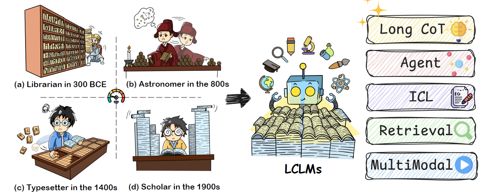

# A Comprehensive Survey on Long Context Language Modeling 💡

<div align="center">
 <p align="center">

   <a href="https://arxiv.org/abs/2503.17407">📝 Paper</a> | <a href="#updates">📄 Updates</a> | <a href="#paper-list">📚 Paper List</a>

 </p>
</div>
<div align="center">

<!--  -->
[](https://github.com/LCLM-Horizon/A-Comprehensive-Survey-For-Long-Context-Language-Modeling/blob/main/LICENSE)

[](https://github.com/LCLM-Horizon/A-Comprehensive-Survey-For-Long-Context-Language-Modeling/commits/main)
[](https://github.com/LCLM-Horizon/A-Comprehensive-Survey-For-Long-Context-Language-Modeling/pulls)
[](https://github.com/LCLM-Horizon/A-Comprehensive-Survey-For-Long-Context-Language-Modeling)
<!--  -->

</div>

> This repository provides a collection of papers and resources focused on Long Context Language Modeling. For a clear taxonomy and more insights about the methodology, you can refer to our survey: [A Comprehensive Survey on Long Context Language Modeling](https://arxiv.org/abs/2503.17407) with an overview shown below.
>
> We appreciate any useful suggestions for improvement of this paper list or survey from peers and commit to regularly updating the repository.
>
> If you would like to include your paper or any modifications in this survey and repository, please feel free to raise issues or send an email to [dwzhu@pku.edu.cn](mailto:dwzhu@pku.edu.cn), [liujiaheng@nju.edu.cn](mailto:liujiaheng@nju.edu.cn), or [liaohuanxuan2023@ia.ac.cn](mailto:liaohuanxuan2023@ia.ac.cn). We sincerely appreciate your collaboration!
>
> We would like to extend our sincere gratitude to [Awesome-LLM-Long-Context-Modeling](https://github.com/Xnhyacinth/Awesome-LLM-Long-Context-Modeling) for providing valuable reference to support the expansion of this project and the development of the comprehensive scholarly survey.
>
> We would also like to mention [Thus Spake Long-Context Large Language Model](https://arxiv.org/abs/2502.17129) ([GitHub](https://github.com/OpenMOSS/Thus-Spake-Long-Context-LLM)), a concurrent survey that details the development history of long-context LLMs. They've created a [video](https://www.bilibili.com/video/BV11h9AYoEYj/) with Thus Spake Zarathustra symphony to introduce LCLM-related work.
>
> If you find our survey useful for your research, please consider citing the following paper:

```bibtex
@article{liu2025comprehensive,
  title={A Comprehensive Survey on Long Context Language Modeling},
  author={Liu, Jiaheng and Zhu, Dawei and Bai, Zhiqi and He, Yancheng and Liao, Huanxuan and Que, Haoran and Wang, Zekun and Zhang, Chenchen and Zhang, Ge and Zhang, Jiebin and others},
  journal={arXiv preprint arXiv:2503.17407},
  year={2025}
}
```



## Updates

- [2026.05.19] Expand the paper list with remaining 2026 works and selected 2025 Q4 papers from Awesome-LLM-Long-Context-Modeling while preserving the existing taxonomy.
- [2026.05.19] Standardize README formatting and incorporate recent long-context modeling papers from Awesome-LLM-Long-Context-Modeling into the existing taxonomy.
- [2025.03.25] Our [paper](https://arxiv.org/abs/2503.17407) is finally out on arXiv.
- [2025.03.13] We have a good communication with the authors of [concurrent work](https://github.com/OpenMOSS/Thus-Spake-Long-Context-LLM), and will promote work of both parties in the future.
- [2025.03.11] We release the first version of the survey on Long Context Language Modeling [[lclm-survey.pdf](assets/lclm-survey.pdf)] and open-source our repo.

## Table of Contents

- [A Comprehensive Survey on Long Context Language Modeling 💡](#a-comprehensive-survey-on-long-context-language-modeling-)
  - [📢 Updates](#updates)
  - [🧭 Table of Contents](#table-of-contents)
  - [📚 Paper List](#paper-list)
    - [🗂️ Data](#data)
      - [Pretraining](#pretraining)
      - [Posttraining](#posttraining)
    - [🧠 Model](#model)
      - [Position Embeddings](#position-embeddings)
      - [Architecture](#architecture)
      - [Hybrid Architecture](#hybrid-architecture)
    - [🔁 Workflow Design](#workflow-design)
      - [Prompt Compression](#prompt-compression)
        - [Hard Prompt Compression](#hard-prompt-compression)
        - [Soft Prompt Compression](#soft-prompt-compression)
      - [Memory-Based](#memory-based)
      - [RAG-Based](#rag-based)
      - [Agent-Based](#agent-based)
    - [📏 Evaluation](#evaluation)
      - [Long-Context Comprehension](#long-context-comprehension)
      - [Long-Form Generation](#long-form-generation)
    - [⚙️ AI Infrastructure](#ai-infrastructure)
      - [Training](#training)
      - [Inference](#inference)
    - [🔍 Interpretability](#interpretability)
      - [Performance Analysis](#performance-analysis)
      - [Model Structure Analysis](#model-structure-analysis)
    - [🚀 Application](#application)
      - [Agent](#agent)
      - [RAG](#rag)
      - [Chatbot](#chatbot)
      - [Code](#code)
      - [NLP Tasks](#nlp-tasks)
      - [Multimodal Tasks](#multimodal-tasks)
      - [Specific Domains](#specific-domains)
    - [🧭 Future Directions](#future-directions)
      - [Long CoT](#long-cot)
  - [🙏 Acknowledgments](#acknowledgments)
  - [👥 Contributors](#contributors)
  - [⭐ Star History](#star-history)

## Paper List

### Data

#### Pretraining

1. [**Exploring the Limits of Transfer Learning with a Unified Text-to-Text
Transformer.**](http://jmlr.org/papers/v21/20-074.html) *Colin Raffel, Noam Shazeer, Adam Roberts, Katherine Lee, Sharan Narang, Michael Matena, Yanqi Zhou, Wei Li, Peter J. Liu*. J. Mach. Learn. Res. 2020

1. [**Scaling Language Models: Methods, Analysis {\&} Insights from
Training Gopher.**](https://arxiv.org/abs/2112.11446) *Jack W. Rae, Sebastian Borgeaud, Trevor Cai, Katie Millican, Jordan Hoffmann, H. Francis Song, John Aslanides, Sarah Henderson, Roman Ring, Susannah Young, Eliza Rutherford, Tom Hennigan, Jacob Menick, Albin Cassirer, Richard Powell, George van den Driessche, Lisa Anne Hendricks, Maribeth Rauh, Po{-}Sen Huang, Amelia Glaese, Johannes Welbl, Sumanth Dathathri, Saffron Huang, Jonathan Uesato, John Mellor, Irina Higgins, Antonia Creswell, Nat McAleese, Amy Wu, Erich Elsen, Siddhant M. Jayakumar, Elena Buchatskaya, David Budden, Esme Sutherland, Karen Simonyan, Michela Paganini, Laurent Sifre, Lena Martens, Xiang Lorraine Li, Adhiguna Kuncoro, Aida Nematzadeh, Elena Gribovskaya, Domenic Donato, Angeliki Lazaridou, Arthur Mensch, Jean{-}Baptiste Lespiau, Maria Tsimpoukelli, Nikolai Grigorev, Doug Fritz, Thibault Sottiaux, Mantas Pajarskas, Toby Pohlen, Zhitao Gong, Daniel Toyama, Cyprien de Masson d'Autume, Yujia Li, Tayfun Terzi, Vladimir Mikulik, Igor Babuschkin, Aidan Clark, Diego de Las Casas, Aurelia Guy, Chris Jones, James Bradbury, Matthew J. Johnson, Blake A. Hechtman, Laura Weidinger, Iason Gabriel, William Isaac, Edward Lockhart, Simon Osindero, Laura Rimell, Chris Dyer, Oriol Vinyals, Kareem Ayoub, Jeff Stanway, Lorrayne Bennett, Demis Hassabis, Koray Kavukcuoglu, Geoffrey Irving*. Arxiv 2021

1. [**Structured Packing in LLM Training Improves Long Context Utilization.**](https://arxiv.org/abs/2312.17296) *Konrad Staniszewski, Szymon Tworkowski, Sebastian Jaszczur, Henryk Michalewski, Łukasz Kuciński, Piotr Miłoś.* Arxiv 2024.

1. [**SemDeDup: Data-efficient learning at web-scale through semantic deduplication.**](https://doi.org/10.48550/arXiv.2303.09540) *Amro Abbas, Kushal Tirumala, Daniel Simig, Surya Ganguli, Ari S. Morcos*. Arxiv 2023

1. [**{SlimPajama: A 627B token cleaned and deduplicated version of RedPajama}.**](https://huggingface.co/datasets/cerebras/SlimPajama-627B) *Daria Soboleva, Faisal Al-Khateeb, Robert Myers, Jacob R Steeves, Joel Hestness, Nolan Dey*. Arxiv 2023

1. [**In-Context Pretraining: Language Modeling Beyond Document Boundaries.**](https://openreview.net/forum?id=LXVswInHOo) *Weijia Shi, Sewon Min, Maria Lomeli, Chunting Zhou, Margaret Li, Xi Victoria Lin, Noah A. Smith, Luke Zettlemoyer, Wen-tau Yih, Mike Lewis.* ICLR 2024 Spotlight.
&nbsp;&nbsp;&nbsp;&nbsp;&nbsp;&nbsp;&nbsp; [](https://github.com/swj0419/in-context-pretraining)

1. [**Data Mixing Laws: Optimizing Data Mixtures by Predicting Language Modeling Performance.**](https://arxiv.org/abs/2403.16952) *Jiasheng Ye, Peiju Liu, Tianxiang Sun, Yunhua Zhou, Jun Zhan, Xipeng Qiu*. Arxiv 2024

1. [**Long Context is Not Long at All: A Prospector of Long-Dependency Data for Large Language Models.**](https://arxiv.org/abs/2405.17915) *Longze Chen, Ziqiang Liu, Wanwei He, Yunshui Li, Run Luo, Min Yang.* Arxiv 2024.
&nbsp;&nbsp;&nbsp;&nbsp;&nbsp;&nbsp;&nbsp; [](https://github.com/October2001/ProLong)

1. [**{L}ong{W}anjuan: Towards Systematic Measurement for Long Text Quality.**](https://aclanthology.org/2024.findings-emnlp.327) *Xiaoran Liu, Kai Lv, Qipeng Guo, Hang Yan, Conghui He, Xipeng Qiu, Dahua Lin*. ACL 2024

1. [**Map-neo: Highly capable and transparent bilingual large language model series.**](https://arxiv.org/abs/2405.19327) *Ge Zhang, Scott Qu, Jiaheng Liu, Chenchen Zhang, Chenghua Lin, Chou Leuang Yu, Danny Pan, Esther Cheng, Jie Liu, Qunshu Lin, others*. Arxiv 2024

1. [**Quest: Query-centric Data Synthesis Approach for Long-context Scaling of Large Language Model.**](https://arxiv.org/abs/2405.19846) *Chaochen Gao, Xing Wu, Qi Fu, Songlin Hu.* Arxiv 2024.

1. [**Data Engineering for Scaling Language Models to 128K Context.**](https://arxiv.org/abs/2402.10171) *Yao Fu, Rameswar Panda, Xinyao Niu, Xiang Yue, Hannaneh Hajishirzi, Yoon Kim, Hao Peng.* Arxiv 2024.
&nbsp;&nbsp;&nbsp;&nbsp;&nbsp;&nbsp;&nbsp; [](https://github.com/FranxYao/Long-Context-Data-Engineering)

1. [**RegMix: Data Mixture as Regression for Language Model Pre-training.**](https://arxiv.org/abs/2407.01492) *Qian Liu, Xiaosen Zheng, Niklas Muennighoff, Guangtao Zeng, Longxu Dou, Tianyu Pang, Jing Jiang, Min Lin*. Arxiv 2024

1. [**How to Train Long-Context Language Models (Effectively).**](https://arxiv.org/abs/2410.02660) *Tianyu Gao, Alexander Wettig, Howard Yen, Danqi Chen.* Arxiv 2024.
&nbsp;&nbsp;&nbsp;&nbsp;&nbsp;&nbsp;&nbsp; [](https://github.com/princeton-nlp/ProLong)

1. [**LongAttn: Selecting Long-context Training Data via Token-level Attention.**](https://arxiv.org/abs/2502.16860) *Longyun Wu, Dawei Zhu, Guangxiang Zhao, Zhuocheng Yu, Junfeng Ran, Xiangyu Wong, Lin Sun, Sujian Li.* Arxiv 2025.
&nbsp;&nbsp;&nbsp;&nbsp;&nbsp;&nbsp;&nbsp; [](https://github.com/Lyun0912-wu/LongAttn)

1. [**Untie the Knots: An Efficient Data Augmentation Strategy for Long-Context Pre-Training in Language Models.**](https://arxiv.org/abs/2409.04774) *Junfeng Tian, Da Zheng, Yang Cheng, Rui Wang, Colin Zhang, Debing Zhang.* Arxiv 2024.
&nbsp;&nbsp;&nbsp;&nbsp;&nbsp;&nbsp;&nbsp; [](https://github.com/rgtjf/Untie-the-Knots)

#### Posttraining

1. [**The {N}arrative{QA} Reading Comprehension Challenge.**](https://aclanthology.org/Q18-1023/) *Tom{\'a}{\v{s}} Ko{\v{c}}isk{\'y}, Jonathan Schwarz, Phil Blunsom, Chris Dyer, Karl Moritz Hermann, G{\'a}bor Melis, Edward Grefenstette*. ACL 2018

1. [**Training language models to follow instructions with human feedback.**](https://api.semanticscholar.org/CorpusID:246426909) *Long Ouyang, Jeff Wu, Xu Jiang, Diogo Almeida, Carroll L. Wainwright, Pamela Mishkin, Chong Zhang, Sandhini Agarwal, Katarina Slama, Alex Ray, John Schulman, Jacob Hilton, Fraser Kelton, Luke E. Miller, Maddie Simens, Amanda Askell, Peter Welinder, Paul Francis Christiano, Jan Leike, Ryan J. Lowe*. Arxiv 2022

1. [**{SlimPajama: A 627B token cleaned and deduplicated version of RedPajama}.**](https://huggingface.co/datasets/cerebras/SlimPajama-627B) *Daria Soboleva, Faisal Al-Khateeb, Robert Myers, Jacob R Steeves, Joel Hestness, Nolan Dey*. Arxiv 2023

1. [**Direct Preference Optimization: Your Language Model is Secretly a Reward Model.**](https://api.semanticscholar.org/CorpusID:258959321) *Rafael Rafailov, Archit Sharma, Eric Mitchell, Stefano Ermon, Christopher D. Manning, Chelsea Finn*. Arxiv 2023

1. [**WanJuan: A Comprehensive Multimodal Dataset for Advancing English and Chinese Large Models.**](https://api.semanticscholar.org/CorpusID:261049100) *Conghui He, Zhenjiang Jin, Chaoxi Xu, Jiantao Qiu, Bin Wang, Wei Li, Hang Yan, Jiaqi Wang, Da Lin*. Arxiv 2023

1. [**{L}ong{W}anjuan: Towards Systematic Measurement for Long Text Quality.**](https://aclanthology.org/2024.findings-emnlp.327) *Xiaoran Liu, Kai Lv, Qipeng Guo, Hang Yan, Conghui He, Xipeng Qiu, Dahua Lin*. ACL 2024

1. [**LOGO--Long cOntext aliGnment via efficient preference Optimization.**](https://arxiv.org/abs/2410.18533) *Zecheng Tang, Zechen Sun, Juntao Li, Qiaoming Zhu, Min Zhang*. Arxiv 2024

1. [**{L}ong{A}lign: A Recipe for Long Context Alignment of Large Language Models.**](https://aclanthology.org/2024.findings-emnlp.74) *Yushi Bai, Xin Lv, Jiajie Zhang, Yuze He, Ji Qi, Lei Hou, Jie Tang, Yuxiao Dong, Juanzi Li*. ACL 2024

1. [**What are the Essential Factors in Crafting Effective Long Context Multi-Hop Instruction Datasets? Insights and Best Practices.**](https://arxiv.org/abs/2409.01893) *Zhi Chen, Qiguang Chen, Libo Qin, Qipeng Guo, Haijun Lv, Yicheng Zou, Wanxiang Che, Hang Yan, Kai Chen, Dahua Lin.* Arxiv 2024.
&nbsp;&nbsp;&nbsp;&nbsp;&nbsp;&nbsp;&nbsp; [](https://github.com/WowCZ/LongMIT)

1. [**Weaver: Foundation Models for Creative Writing.**](https://arxiv.org/abs/2401.17268) *Tiannan Wang, Jiamin Chen, Qingrui Jia, Shuai Wang, Ruoyu Fang, Huilin Wang, Zhaowei Gao, Chunzhao Xie, Chuou Xu, Jihong Dai, Yibin Liu, Jialong Wu, Shengwei Ding, Long Li, Zhiwei Huang, Xinle Deng, Teng Yu, Gangan Ma, Han Xiao, Zixin Chen, Danjun Xiang, Yunxia Wang, Yuanyuan Zhu, Yi Xiao, Jing Wang, Yiru Wang, Siran Ding, Jiayang Huang, Jiayi Xu, Yilihamu Tayier, Zhenyu Hu, Yuan Gao, Chengfeng Zheng, Yueshu Ye, Yihang Li, Lei Wan, Xinyue Jiang, Yujie Wang, Siyu Cheng, Zhule Song, Xiangru Tang, Xiaohua Xu, Ningyu Zhang, Huajun Chen, Yuchen Eleanor Jiang, Wangchunshu Zhou*. Arxiv 2024

1. [**LongWriter: Unleashing 10,000+ Word Generation from Long Context LLMs.**](https://arxiv.org/abs/2408.07055) *Yushi Bai, Jiajie Zhang, Xin Lv, Linzhi Zheng, Siqi Zhu, Lei Hou, Yuxiao Dong, Jie Tang, Juanzi Li.* Arxiv 2024.
&nbsp;&nbsp;&nbsp;&nbsp;&nbsp;&nbsp;&nbsp; [](https://github.com/THUDM/LongWriter)

1. [**LongReward: Improving Long-context Large Language Models
with AI Feedback.**](https://arxiv.org/abs/2410.21252) *Jiajie Zhang, Zhongni Hou, Xin Lv, Shulin Cao, Zhenyu Hou, Yilin Niu, Lei Hou, Yuxiao Dong, Ling Feng, Juanzi Li*. Arxiv 2024

1. [**ChatQA 2: Bridging the Gap to Proprietary LLMs in Long Context and RAG Capabilities.**](https://arxiv.org/abs/2407.14482) *Peng Xu, Wei Ping, Xianchao Wu, Zihan Liu, Mohammad Shoeybi, Bryan Catanzaro.* Arxiv 2024.

1. [**LongLoRA: Efficient Fine-tuning of Long-Context Large Language Models.**](https://arxiv.org/abs/2309.12307) *Yukang Chen, Shengju Qian, Haotian Tang, Xin Lai, Zhijian Liu, Song Han, Jiaya Jia.* ICLR 2024 Oral.
&nbsp;&nbsp;&nbsp;&nbsp;&nbsp;&nbsp;&nbsp; [](https://github.com/dvlab-research/LongLoRA)

1. [**{ORPO}: Monolithic Preference Optimization without Reference Model.**](https://aclanthology.org/2024.emnlp-main.626) *Jiwoo Hong, Noah Lee, James Thorne*. EMNLP 2024

1. [**Never Lost in the Middle: Mastering Long-Context Question Answering with Position-Agnostic Decompositional Training.**](https://aclanthology.org/2024.acl-long.736) *Junqing He, Kunhao Pan, Xiaoqun Dong, Zhuoyang Song, LiuYiBo LiuYiBo, Qianguosun Qianguosun, Yuxin Liang, Hao Wang, Enming Zhang, Jiaxing Zhang*. ACL 2024

1. [**Make Your {LLM} Fully Utilize the Context.**](https://openreview.net/forum?id=YGTVEmBXtV) *Shengnan An, Zexiong Ma, Zeqi Lin, Nanning Zheng, Jian-Guang Lou, Weizhu Chen*. NeurIPS 2024

1. [**LongDPO: Unlock Better Long-form Generation Abilities for LLMs via Critique-augmented Stepwise Information.**](https://arxiv.org/abs/2502.02095) *Bowen Ping, Jiali Zeng, Fandong Meng, Shuo Wang, Jie Zhou, Shanghang Zhang.* Arxiv 2025.

1. [**LongAttn: Selecting Long-context Training Data via Token-level Attention.**](https://arxiv.org/abs/2502.16860) *Longyun Wu, Dawei Zhu, Guangxiang Zhao, Zhuocheng Yu, Junfeng Ran, Xiangyu Wong, Lin Sun, Sujian Li.* Arxiv 2025.
&nbsp;&nbsp;&nbsp;&nbsp;&nbsp;&nbsp;&nbsp; [](https://github.com/Lyun0912-wu/LongAttn)

1. [**LongFaith: Enhancing Long-Context Reasoning in LLMs with Faithful Synthetic Data.**](https://arxiv.org/abs/2502.12583) *Cehao Yang, Xueyuan Lin, Chengjin Xu, Xuhui Jiang, Shengjie Ma, Aofan Liu, Hui Xiong, Jian Guo.* Arxiv 2025.

1. [**In-Place Test-Time Training.**](https://arxiv.org/abs/2604.06169) *Guhao Feng, Shengjie Luo, Kai Hua, Ge Zhang, Di He, Wenhao Huang, Tianle Cai.* ICLR 2026 Oral. [](https://github.com/ByteDance-Seed/In-Place-TTT)

1. [**Let's (not) just put things in Context: Test-Time Training for Long-Context LLMs.**](https://arxiv.org/abs/2512.13898) *Rachit Bansal, Aston Zhang, Rishabh Tiwari, Lovish Madaan, Sai Surya Duvvuri, Devvrit Khatri, David Brandfonbrener, David Alvarez-Melis, Prajjwal Bhargava, Mihir Sanjay Kale, Samy Jelassi.* Arxiv 2025.
1. [**End-to-End Test-Time Training for Long Context.**](https://arxiv.org/abs/2512.23675) *Arnuv Tandon, Karan Dalal, Xinhao Li, Daniel Koceja, Marcel Rød, Sam Buchanan, Xiaolong Wang, Jure Leskovec, Sanmi Koyejo, Tatsunori Hashimoto, Carlos Guestrin, Jed McCaleb, Yejin Choi, Yu Sun.* Arxiv 2025. [](https://github.com/test-time-training/e2e)
1. [**QwenLong-L1.5: Post-Training Recipe for Long-Context Reasoning and Memory Management.**](https://arxiv.org/abs/2512.12967) *Weizhou Shen, Ziyi Yang, Chenliang Li, Zhiyuan Lu, Miao Peng, Huashan Sun, Yingcheng Shi, Shengyi Liao, Shaopeng Lai, Bo Zhang, Dayiheng Liu, Fei Huang, Jingren Zhou, Ming Yan.* Arxiv 2025.

1. [**ACC: Compiling Agent Trajectories for Long-Context Training.**](https://arxiv.org/abs/2605.21850) *Qisheng Su, Zhen Fang, Shiting Huang, Yu Zeng, Yiming Zhao, Kou Shi, Ziao Zhang, Lin Chen, Zehui Chen, Lijun Wu, Feng Zhao.* Arxiv 2026.

### Model

#### Position Embeddings

1. [**An Efficient Recipe for Long Context Extension via Middle-Focused Positional Encoding.**](https://arxiv.org/abs/2406.07138) *Tong Wu, Yanpeng Zhao, Zilong Zheng.* NeurIPS 2024. [](https://github.com/bigai-nlco/cream)

2. [**PoSE: Efficient Context Window Extension of LLMs via Positional Skip-wise Training.**](https://arxiv.org/abs/2309.10400) *Dawei Zhu,Nan Yang,Liang Wang,Yifan Song,Wenhao Wu,Furu Wei,Sujian Li.* Arxiv 2023. [](https://github.com/dwzhu-pku/PoSE)

3. [**Contextual Position Encoding: Learning to Count What's Important.**](https://arxiv.org/abs/2405.18719) *Olga Golovneva, Tianlu Wang, Jason Weston, Sainbayar Sukhbaatar.* Arxiv 2024.

4. [**Why Does the Effective Context Length of LLMs Fall Short?.**](https://arxiv.org/abs/2410.18745) *Chenxin An, Jun Zhang, Ming Zhong, Lei Li, Shansan Gong, Yao Luo, Jingjing Xu, Lingpeng Kong.* Arxiv 2024.

5. [**HoPE: A Novel Positional Encoding Without Long-Term Decay for Enhanced Context Awareness and Extrapolation.**](https://arxiv.org/abs/2410.21216) *Yuhan Chen, Ang Lv, Jian Luan, Bin Wang, Wei Liu.* Arxiv 2024.

6. [**DAPE: Data-Adaptive Positional Encoding for Length Extrapolation.**](https://arxiv.org/abs/2405.14722) *Chuanyang Zheng, Yihang Gao, Han Shi, Minbin Huang, Jingyao Li, Jing Xiong, Xiaozhe Ren, Michael Ng, Xin Jiang, Zhenguo Li, Yu Li.* NeurIPS 2024. [](https://github.com/chuanyang-Zheng/DAPE)

7. [**Convolutional sequence to sequence learning.**](https://arxiv.org/abs/1705.03122)  *Jonas Gehring and Michael Auli and David Grangier and Denis Yarats and Yann N. Dauphin*. Arxiv 2017

8. [**Self-attention with relative position representations.**](https://arxiv.org/abs/1803.02155)  *Peter Shaw and Jakob Uszkoreit and Ashish Vaswani*. Arxiv 2018

9. [**Encoding word order in complex embeddings.**](https://arxiv.org/abs/1912.12333)  *Benyou Wang and Donghao Zhao and Christina Lioma and Qiuchi Li and Peng Zhang and Jakob Grue Simonsen*. Arxiv 2020

10. [**Train short, test long: Attention with linear biases enables input length extrapolation.**](https://arxiv.org/abs/2108.12409)  *Ofir Press and Noah A. Smith and Mike Lewis*. Arxiv 2022

11. [**Kerple: Kernelized relative positional embedding for length extrapolation.**](https://arxiv.org/abs/2205.09921)  *Ta-Chung Chi and Ting-Han Fan and Peter J. Ramadge and Alexander I. Rudnicky*. Arxiv 2022

12. [**Dissecting transformer length extrapolation via the lens of receptive field analysis.**](https://arxiv.org/abs/2212.10356)  *Ta-Chung Chi and Ting-Han Fan and Alexander I. Rudnicky and Peter J. Ramadge*. Arxiv 2023

13. [**A length-extrapolatable transformer.**](https://arxiv.org/abs/2212.10554)  *Yutao Sun and Li Dong and Barun Patra and Shuming Ma and Shaohan Huang and Alon Benhaim and Vishrav Chaudhary and Xia Song and Furu Wei*. Arxiv 2022

14. [**Functional interpolation for relative positions improves long context transformers.**](https://arxiv.org/abs/2310.04418)  *Shanda Li and Chong You and Guru Guruganesh and Joshua Ainslie and Santiago Ontanon and Manzil Zaheer and Sumit Sanghai and Yiming Yang and Sanjiv Kumar and Srinadh Bhojanapalli*. Arxiv 2024

15. [**Latent positional information is in the self-attention variance of transformer language models without positional embeddings.**](https://arxiv.org/abs/2305.13571)  *Latent Positional Information is in the Self-Attention Variance of Transformer Language Models Without Positional Embeddings*. Arxiv 2023

16. [**Extending context window of large language models via positional interpolation.**](https://arxiv.org/abs/2306.15595)  *Shouyuan Chen and Sherman Wong and Liangjian Chen and Yuandong Tian*. Arxiv 2023

17. [**Randomized positional encodings boost length generalization of transformers.**](https://arxiv.org/abs/2305.16843)  *Anian Ruoss and Grégoire Delétang and Tim Genewein and Jordi Grau-Moya and Róbert Csordás and Mehdi Bennani and Shane Legg and Joel Veness*. Arxiv 2023

18. [**Yarn: Efficient context window extension of large language models.**](https://arxiv.org/abs/2309.00071)  *Bowen Peng and Jeffrey Quesnelle and Honglu Fan and Enrico Shippole*. Arxiv 2023

19. [**Clex: Continuous length extrapolation for large language models.**](https://arxiv.org/abs/2310.16450)  *Guanzheng Chen and Xin Li and Zaiqiao Meng and Shangsong Liang and Lidong Bing*. Arxiv 2024

20. [**Effective long-context scaling of foundation models.**](https://arxiv.org/abs/2309.16039)  *Wenhan Xiong and Jingyu Liu and Igor Molybog and Hejia Zhang and Prajjwal Bhargava and Rui Hou and Louis Martin and Rashi Rungta and Karthik Abinav Sankararaman and Barlas Oguz and Madian Khabsa and Han Fang and Yashar Mehdad and Sharan Narang and Kshitiz Malik and Angela Fan and Shruti Bhosale and Sergey Edunov and Mike Lewis and Sinong Wang and Hao Ma*. Arxiv 2023

21. [**Giraffe: Adventures in expanding context lengths in llms.**](https://arxiv.org/abs/2308.10882)  *Arka Pal and Deep Karkhanis and Manley Roberts and Samuel Dooley and Arvind Sundararajan and Siddartha Naidu*. Arxiv 2023

22. [**Resonance rope: Improving context length generalization of large language models.**](https://arxiv.org/abs/2403.00071)  *Suyuchen Wang and Ivan Kobyzev and Peng Lu and Mehdi Rezagholizadeh and Bang Liu*. Arxiv 2024

23. [**Long context alignment with short instructions and synthesized positions.**](https://arxiv.org/abs/2405.03939)  *Wenhao Wu and Yizhong Wang and Yao Fu and Xiang Yue and Dawei Zhu and Sujian Li*. Arxiv 2024

24. [**Two stones hit one bird: Bilevel positional encoding for better length extrapolation.**](https://arxiv.org/abs/2401.16421)  *Zhenyu He and Guhao Feng and Shengjie Luo and Kai Yang and Liwei Wang and Jingjing Xu and Zhi Zhang and Hongxia Yang and Di He*. Arxiv 2024

25. [**Found in the middle: How language models use long contexts better via plug-and-play positional encoding.**](https://arxiv.org/abs/2403.04797)  *Zhenyu Zhang and Runjin Chen and Shiwei Liu and Zhewei Yao and Olatunji Ruwase and Beidi Chen and Xiaoxia Wu and Zhangyang Wang*. Arxiv 2024

26. [**Llm maybe longlm: Self-extend llm context window without tuning.**](https://arxiv.org/abs/2401.01325)  *Hongye Jin and Xiaotian Han and Jingfeng Yang and Zhimeng Jiang and Zirui Liu and Chia-Yuan Chang and Huiyuan Chen and Xia Hu*. Arxiv 2024

27. [**Longrope: Extending llm context window beyond 2 million tokens.**](https://arxiv.org/abs/2402.13753)  *Yiran Ding and Li Lyna Zhang and Chengruidong Zhang and Yuanyuan Xu and Ning Shang and Jiahang Xu and Fan Yang and Mao Yang*. Arxiv 2024

28. [**The impact of positional encoding on length generalization in transformers.**](https://arxiv.org/abs/2305.19466)  *Amirhossein Kazemnejad and Inkit Padhi and Karthikeyan Natesan Ramamurthy and Payel Das and Siva Reddy*. Arxiv 2024

29. [**Roformer: Enhanced transformer with rotary position embedding.**](https://arxiv.org/abs/2104.09864)  *Jianlin Su and Yu Lu and Shengfeng Pan and Ahmed Murtadha and Bo Wen and Yunfeng Liu*. Arxiv 2023

30. [**Training-free long-context scaling of large language models.**](https://arxiv.org/abs/2402.1746)  *Chenxin An and Fei Huang and Jun Zhang and Shansan Gong and Xipeng Qiu and Chang Zhou and Lingpeng Kong*. Arxiv 2024

31. [**PSC: Extending Context Window of Large Language Models via Phase Shift Calibration.**](https://aclanthology.org/2024.emnlp-main.341.pdf) *Wenqiao Zhu and Chao Xu and Lulu Wang and Jun Wu*. EMNLP 2024. [](https://github.com/WNQzhu/PSC)

32. [**Attention Entropy is a Key Factor: An Analysis of Parallel Context Encoding with Full-attention-based Pre-trained Language Models.**](https://arxiv.org/abs/2412.16545) _Zhisong Zhang, Yan Wang, Xinting Huang, Tianqing Fang, Hongming Zhang, Chenlong Deng, Shuaiyi Li, Dong Yu._ Arxiv 2024.

33. [**DCIS: Efficient Length Extrapolation of LLMs via Divide-and-Conquer Scaling Factor Search.**](https://arxiv.org/abs/2412.18811) _Lei Yang, Shaoyang Xu, Deyi Xiong._ Arxiv 2024.

34. [**Adjoint sharding for very long context training of state space models.**](https://arxiv.org/abs/2501.00692) _Xingzi Xu, Amir Tavanaei, Kavosh Asadi, Karim Bouyarmane._ Arxiv 2025.

35. [**Information Entropy Invariance: Enhancing Length Extrapolation in Attention Mechanisms.**](https://arxiv.org/abs/2501.08570) _Kewei Li, Yanwen Kong, Yiping Xu, Lan Huang, Ruochi Zhang, Fengfeng Zhou._ Arxiv 2025. [](https://github.com/HT-NEKO/InfoScale)

36. [**LeMo: Enabling LEss Token Involvement for MOre Context Fine-tuning.**](https://arxiv.org/abs/2501.09767) _Tuowei Wang, Xingyu Chen, Kun Li, Ting Cao, Ju Ren, Yaoxue Zhang._ Arxiv 2025.

37. [**NExtLong: Toward Effective Long-Context Training without Long Documents.**](https://arxiv.org/abs/2501.12766) _Chaochen Gao, Xing Wu, Zijia Lin, Debing Zhang, Songlin Hu._ Arxiv 2025. [](https://github.com/caskcsg/longcontext/tree/main/NExtLong)

38. [**SEAL: Scaling to Emphasize Attention for Long-Context Retrieval.**](https://arxiv.org/abs/2501.15225) _Changhun Lee, Jun-gyu Jin, Younghyun Cho, Eunhyeok Park._ Arxiv 2025.

39. [**DINT Transformer.**](https://arxiv.org/abs/2501.17486) _Yueyang Cang, Yuhang Liu, Xiaoteng Zhang, Erlu Zhao, Li Shi._ Arxiv 2025.

40. [**Scalable-Softmax Is Superior for Attention.**](https://arxiv.org/abs/2501.19399) _Ken M. Nakanishi._ Arxiv 2025.

41. [**Rope to Nope and Back Again: A New Hybrid Attention Strategy.**](https://arxiv.org/abs/2501.18795) _Bowen Yang, Bharat Venkitesh, Dwarak Talupuru, Hangyu Lin, David Cairuz, Phil Blunsom, Acyr Locatelli._ Arxiv 2025.

42. [**A Training-Free Length Extrapolation Approach for LLMs: Greedy Attention Logit Interpolation (GALI).**](https://arxiv.org/abs/2502.02659) _Yan Li, Tianyi Zhang, Zechuan Li, Soyeon Caren Han._ Arxiv 2025. [](https://github.com/AcademyCityL/GALI)

43. [**LongReD: Mitigating Short-Text Degradation of Long-Context Large Language Models via Restoration Distillation.**](https://arxiv.org/abs/2502.07365) _Zican Dong, Junyi Li, Jinhao Jiang, Mingyu Xu, Wayne Xin Zhao, Bingning Wang, Weipeng Chen._ Arxiv 2025.

44. [**Unveiling Simplicities of Attention: Adaptive Long-Context Head Identification.**](https://arxiv.org/abs/2502.09647) _Konstantin Donhauser, Charles Arnal, Mohammad Pezeshki, Vivien Cabannes, David Lopez-Paz, Kartik Ahuja._ Arxiv 2025.

45. [**The Rotary Position Embedding May Cause Dimension Inefficiency in Attention Heads for Long-Distance Retrieval.**](https://arxiv.org/abs/2502.11276) _Ting-Rui Chiang, Dani Yogatama._ Arxiv 2025.

46. [**LongFaith: Enhancing Long-Context Reasoning in LLMs with Faithful Synthetic Data.**](https://arxiv.org/abs/2502.12583) _Cehao Yang, Xueyuan Lin, Chengjin Xu, Xuhui Jiang, Shengjie Ma, Aofan Liu, Hui Xiong, Jian Guo._ Arxiv 2025. [](https://github.com/IDEA-FinAI/LongFaith)

47. [**LongPO: Long Context Self-Evolution of Large Language Models through Short-to-Long Preference Optimization.**](https://arxiv.org/abs/2502.13922) _Guanzheng Chen, Xin Li, Michael Qizhe Shieh, Lidong Bing._ Arxiv 2025. [](https://github.com/DAMO-NLP-SG/LongPO)

48. [**ParallelComp: Parallel Long-Context Compressor for Length Extrapolation.**](https://arxiv.org/abs/2502.14317) _Jing Xiong, Jianghan Shen, Chuanyang Zheng, Zhongwei Wan, Chenyang Zhao, Chiwun Yang, Fanghua Ye, Hongxia Yang, Lingpeng Kong, Ngai Wong._ Arxiv 2025.

49. [**Generalizing From Short to Long: Effective Data Synthesis for Long-Context Instruction Tuning.**](https://arxiv.org/abs/2502.15592) _Wenhao Zhu, Pinzhen Chen, Hanxu Hu, Shujian Huang, Fei Yuan, Jiajun Chen, Alexandra Birch._ Arxiv 2025. [](https://github.com/NJUNLP/context-synthesis)

50. [**LongAttn: Selecting Long-context Training Data via Token-level Attention.**](https://arxiv.org/abs/2502.16860) _Longyun Wu, Dawei Zhu, Guangxiang Zhao, Zhuocheng Yu, Junfeng Ran, Xiangyu Wong, Lin Sun, Sujian Li._ Arxiv 2025. [](https://github.com/Lyun0912-wu/LongAttn)

51. [**WildLong: Synthesizing Realistic Long-Context Instruction Data at Scale.**](https://arxiv.org/abs/2502.16684) _Jiaxi Li, Xingxing Zhang, Xun Wang, Xiaolong Huang, Li Dong, Liang Wang, Si-Qing Chen, Wei Lu, Furu Wei._ Arxiv 2025.

52. [**Sliding Window Attention Training for Efficient Large Language Models.**](https://arxiv.org/abs/2502.18845) _Zichuan Fu, Wentao Song, Yejing Wang, Xian Wu, Yefeng Zheng, Yingying Zhang, Derong Xu, Xuetao Wei, Tong Xu, Xiangyu Zhao._ Arxiv 2025. [](https://anonymous.4open.science/r/SWAT-attention/README.md)

53. [**LongRoPE2: Near-Lossless LLM Context Window Scaling.**](https://arxiv.org/abs/2502.20082) _Ning Shang, Li Lyna Zhang, Siyuan Wang, Gaokai Zhang, Gilsinia Lopez, Fan Yang, Weizhu Chen, Mao Yang._ Arxiv 2025. [](https://github.com/microsoft/LongRoPE)

54. [**ByteScale: Efficient Scaling of LLM Training with a 2048K Context Length on More Than 12,000 GPUs.**](https://arxiv.org/abs/2502.21231) _Hao Ge, Junda Feng, Qi Huang, Fangcheng Fu, Xiaonan Nie, Lei Zuo, Haibin Lin, Bin Cui, Xin Liu._ Arxiv 2025.

55. [**Pause-Tuning for Long-Context Comprehension: A Lightweight Approach to LLM Attention Recalibration.**](https://arxiv.org/abs/2502.20405) _James Begin, Namit Agrawal, Eshan Singh, Yicheng Fu, Sean O'Brien, Vasu Sharma, Kevin Zhu._ Arxiv 2025. [](https://anonymous.4open.science/r/LITM-PauseTokens-7357)

56. [**LADM: Long-context Training Data Selection with Attention-based Dependency Measurement for LLMs.**](https://arxiv.org/abs/2503.02502) _Jianghao Chen, Junhong Wu, Yangyifan Xu, Jiajun Zhang._ Arxiv 2025.

57. [**Forgetting Transformer: Softmax Attention with a Forget Gate.**](https://arxiv.org/abs/2503.02130) _Zhixuan Lin, Evgenii Nikishin, Xu Owen He, Aaron Courville._ ICLR 2025. [](https://github.com/zhixuan-lin/forgetting-transformer)

58. [**Layer-Specific Scaling of Positional Encodings for Superior Long-Context Modeling.**](https://arxiv.org/abs/2503.04355) _Zhenghua Wang, Yiran Ding, Changze Lv, Zhibo Xu, Tianlong Li, Tianyuan Shi, Xiaoqing Zheng, Xuanjing Huang._ Arxiv 2025.

59. [**Token Weighting for Long-Range Language Modeling.**](https://arxiv.org/abs/2503.09202) _Falko Helm, Nico Daheim, Iryna Gurevych._ NAACL 2025. [](https://github.com/UKPLab/naacl2025-token-weighting)

60. [**From 128K to 4M: Efficient Training of Ultra-Long Context Large Language Models.**](https://arxiv.org/abs/2504.06214) _Chejian Xu, Wei Ping, Peng Xu, Zihan Liu, Boxin Wang, Mohammad Shoeybi, Bo Li, Bryan Catanzaro._ Arxiv 2025. [](https://ultralong.github.io/)

61. [**SWAN-GPT: An Efficient and Scalable Approach for Long-Context Language Modeling.**](https://arxiv.org/abs/2504.08719) _Krishna C. Puvvada, Faisal Ladhak, Santiago Akle Serrano, Cheng-Ping Hsieh, Shantanu Acharya, Somshubra Majumdar, Fei Jia, Samuel Kriman, Simeng Sun, Dima Rekesh, Boris Ginsburg._ Arxiv 2025.

62. [**Scaling Instruction-Tuned LLMs to Million-Token Contexts via Hierarchical Synthetic Data Generation.**](https://arxiv.org/abs/2504.12637) _Linda He, Jue Wang, Maurice Weber, Shang Zhu, Ben Athiwaratkun, Ce Zhang._ Arxiv 2025.

63. [**Effective Length Extrapolation via Dimension-Wise Positional Embeddings Manipulation.**](https://arxiv.org/abs/2504.18857) _Yi Lu, Wanxu Zhao, Xin Zhou, Chenxin An, Chenglong Wang, Shuo Li, Yuming Yang, Jun Zhao, Tao Ji, Tao Gui, Qi Zhang, Xuanjing Huang._ Arxiv 2025. [](https://github.com/LuLuLuyi/DPE)

64. [**Bayesian Attention Mechanism: A Probabilistic Framework for Positional Encoding and Context Length Extrapolation.**](https://arxiv.org/abs/2505.22842) _Arthur S. Bianchessi, Rodrigo C. Barros, Lucas S. Kupssinskü._ Arxiv 2025. [](https://github.com/ArthurSBianchessi/BAM)

65. [**Extending the Context of Pretrained LLMs by Dropping Their Positional Embeddings.**](https://arxiv.org/abs/2512.12167) _Yoav Gelberg, Koshi Eguchi, Takuya Akiba, Edoardo Cetin._ Arxiv 2025. [](https://github.com/SakanaAI/DroPE)

66. [**Explain Before You Answer: A Survey on Compositional Visual Reasoning**](https://arxiv.org/abs/2508.17298) _Fucai Ke, Joy Hsu, Zhixi Cai, Zixian Ma, Xin Zheng, Xindi Wu, Sukai Huang, Weiqing Wang, Pari Delir Haghighi, Gholamreza Haffari, Ranjay Krishna, Jiajun Wu, Hamid Rezatofighi._ Arxiv 2025. [](https://github.com/pokerme7777/Compositional-Visual-Reasoning-Survey)

67. [**HoPE: Hyperbolic Rotary Positional Encoding for Stable Long-Range Dependency Modeling in Large Language Models**](https://arxiv.org/abs/2509.05218) _Chang Dai, Hongyu Shan, Mingyang Song, Di Liang._ Arxiv 2025.

68. [**Positional Encoding via Token-Aware Phase Attention**](https://arxiv.org/abs/2509.12635) _Yu, Wang, Sheng Shen, Rémi Munos, Hongyuan Zhan, Yuandong Tian._ Arxiv 2025.

69. [**RePo: Language Models with Context Re-Positioning**](https://arxiv.org/abs/2512.14391) _Huayang Li, Tianyu Zhao, Richard Sproat._ Arxiv 2025. [](https://github.com/SakanaAI/repo)

70. [**Variation-aware Vision Token Dropping for Faster Large Vision-Language Models**](https://arxiv.org/abs/2509.01552) _Junjie Chen, Xuyang Liu, Zichen Wen, Yiyu Wang, Siteng Huang, Honggang Chen._ Arxiv 2025. [](https://github.com/xuyang-liu16/V2Drop)

71. [**D-CoDe: Scaling Image-Pretrained VLMs to Video via Dynamic Compression and Question Decomposition**](https://arxiv.org/abs/2510.08818) _Yiyang Huang, Yizhou Wang, Yun Fu._ Arxiv 2025. [](https://github.com/hukcc/D-CoDe)

1. [**Periodic RoPE for Infinite Context LLMs.**](https://arxiv.org/abs/2605.27980) *Simin Huo.* Arxiv 2026.

#### Architecture

1. [**Compressive Transformers for Long-Range Sequence Modelling.**](https://arxiv.org/abs/1911.05507) *Jack W. Rae, Anna Potapenko, Siddhant M. Jayakumar, Timothy P. Lillicrap.* Arxiv 2019. [](https://github.com/lucidrains/compressive-transformer-pytorch)

2. [**Transformers are RNNs: Fast Autoregressive Transformers with Linear Attention.**](https://arxiv.org/abs/2006.16236) *Angelos Katharopoulos, Apoorv Vyas, Nikolaos Pappas, François Fleuret.* ICML 2020. [](https://github.com/idiap/fast-transformers)

3. [**Block-Recurrent Transformers.**](https://arxiv.org/abs/2203.07852) *DeLesley Hutchins, Imanol Schlag, Yuhuai Wu, Ethan Dyer, Behnam Neyshabur.* Arxiv 2023. [](https://github.com/lucidrains/block-recurrent-transformer-pytorch)

4. [**Memorizing Transformers.**](https://arxiv.org/abs/2203.08913) *Yuhuai Wu, Markus N. Rabe, DeLesley Hutchins, Christian Szegedy.* Arxiv 2022. [](https://github.com/lucidrains/memorizing-transformers-pytorch)

5. [**GQA: Training Generalized Multi-Query Transformer Models from Multi-Head Checkpoints.**](https://arxiv.org/abs/2305.13245) *Joshua Ainslie, James Lee-Thorp, Michiel de Jong, Yury Zemlyanskiy, Federico Lebrón, Sumit Sanghai.* Arxiv 2023.

6. [**Zebra: Extending Context Window with Layerwise Grouped Local-Global Attention.**](https://arxiv.org/abs/2312.08618) *Kaiqiang Song, Xiaoyang Wang, Sangwoo Cho, Xiaoman Pan, Dong Yu.* Arxiv 2023.

7. [**Leave No Context Behind: Efficient Infinite Context Transformers with Infini-attention.**](https://arxiv.org/abs/2404.07143) *Tsendsuren Munkhdalai, Manaal Faruqui, Siddharth Gopal.* Arxiv 2024.

8. [**Weighted Grouped Query Attention in Transformers.**](https://arxiv.org/abs/2407.10855) *Sai Sena Chinnakonduru, Astarag Mohapatra.* Arxiv 2024.

9. [**Associative Recurrent Memory Transformer.**](https://arxiv.org/abs/2407.04841) *Ivan Rodkin, Yuri Kuratov, Aydar Bulatov, Mikhail Burtsev.* ICML 2024 Workshop. [](https://github.com/RodkinIvan/associative-recurrent-memory-transformer)

10. [**Simple linear attention language models balance the recall-throughput tradeoff.**](https://arxiv.org/abs/2402.18668) *Simran Arora, Sabri Eyuboglu, Michael Zhang, Aman Timalsina, Silas Alberti, Dylan Zinsley, James Zou, Atri Rudra, Christopher Ré.* Arxiv 2024. [](https://github.com/HazyResearch/based)

11. [**DuoAttention: Efficient Long-Context LLM Inference with Retrieval and Streaming Heads.**](https://arxiv.org/abs/2410.10819) *Guangxuan Xiao, Jiaming Tang, Jingwei Zuo, Junxian Guo, Shang Yang, Haotian Tang, Yao Fu, Song Han.* Arxiv 2024. [](https://github.com/mit-han-lab/duo-attention)

12. [**TidalDecode: Fast and Accurate LLM Decoding with Position Persistent Sparse Attention.**](https://arxiv.org/abs/2410.05076) *Lijie Yang, Zhihao Zhang, Zhuofu Chen, Zikun Li, Zhihao Jia.* Arxiv 2024. [](https://github.com/DerrickYLJ/TidalDecode)

13. [**Selective Attention Improves Transformer.**](https://arxiv.org/abs/2410.02703) *Yaniv Leviathan, Matan Kalman, Yossi Matias.* Arxiv 2024.

14. [**SnapKV: LLM Knows What You are Looking for Before Generation.**](https://arxiv.org/abs/2404.14469) *Yuhong Li, Yingbing Huang, Bowen Yang, Bharat Venkitesh, Acyr Locatelli, Hanchen Ye, Tianle Cai, Patrick Lewis, Deming Chen.* Arxiv 2024. [](https://github.com/FasterDecoding/SnapKV)

15. [**Extra Global Attention Designation Using Keyword Detection in Sparse Transformer Architectures.**](https://arxiv.org/abs/2410.08971) *Evan Lucas, Dylan Kangas, Timothy C Havens.* Arxiv 2024.

16. [**An Empirical Study of Mamba-based Language Models.**](https://arxiv.org/abs/2406.07887) *Roger Waleffe, Wonmin Byeon, Duncan Riach, Brandon Norick, Vijay Korthikanti, Tri Dao, Albert Gu, Ali Hatamizadeh, Sudhakar Singh, Deepak Narayanan, Garvit Kulshreshtha, Vartika Singh, Jared Casper, Jan Kautz, Mohammad Shoeybi, Bryan Catanzaro.* Arxiv 2024. [](https://github.com/NVIDIA/Megatron-LM/tree/ssm/examples/mamba)

17. [**Lightning Attention-2: A Free Lunch for Handling Unlimited Sequence Lengths in Large Language Models.**](https://arxiv.org/abs/2401.04695) *Zhen Qin, Weigao Sun, Dong Li, Xuyang Shen, Weixuan Sun, Yiran Zhong.* Arxiv 2024. [](https://github.com/OpenNLPLab/lightning-attention)

18. [**Various Lengths, Constant Speed: Efficient Language Modeling with Lightning Attention.**](https://openreview.net/forum?id=Lwm6TiUP4X) *Zhen Qin, Weigao Sun, Dong Li, Xuyang Shen, Weixuan Sun, Yiran Zhong.* Arxiv 2024.

19. [**SeerAttention: Learning Intrinsic Sparse Attention in Your LLMs.**](https://arxiv.org/abs/2410.13276) *Yizhao Gao, Zhichen Zeng, Dayou Du, Shijie Cao, Hayden Kwok-Hay So, Ting Cao, Fan Yang, Mao Yang.* Arxiv 2024. [](https://github.com/microsoft/SeerAttention)

20. [**Stuffed Mamba: State Collapse and State Capacity of RNN-Based Long-Context Modeling.**](https://arxiv.org/abs/2410.07145) *Yingfa Chen, Xinrong Zhang, Shengding Hu, Xu Han, Zhiyuan Liu, Maosong Sun.* Arxiv 2024. [](https://github.com/thunlp/stuffed-mamba)

21. [**Taipan: Efficient and Expressive State Space Language Models with Selective Attention.**](https://arxiv.org/abs/2410.18572) *Chien Van Nguyen, Huy Huu Nguyen, Thang M. Pham, Ruiyi Zhang, Hanieh Deilamsalehy, Puneet Mathur, Ryan A. Rossi, Trung Bui, Viet Dac Lai, Franck Dernoncourt, Thien Huu Nguyen.* Arxiv 2024.

22. [**Megalodon: Efficient LLM Pretraining and Inference with Unlimited Context Length.**](https://arxiv.org/abs/2404.08801) *Xuezhe Ma, Xiaomeng Yang, Wenhan Xiong, Beidi Chen, Lili Yu, Hao Zhang, Jonathan May, Luke Zettlemoyer, Omer Levy, Chunting Zhou.* Arxiv 2024. [

23. [**Samba: Simple Hybrid State Space Models for Efficient Unlimited Context Language Modeling.**](https://arxiv.org/abs/2406.07522) *Liliang Ren, Yang Liu, Yadong Lu, Yelong Shen, Chen Liang, Weizhu Chen.* Arxiv 2024. [](https://github.com/microsoft/Samba)

24. [**ReMamba: Equip Mamba with Effective Long-Sequence Modeling.**](https://arxiv.org/abs/2408.15496) *Danlong Yuan, Jiahao Liu, Bei Li, Huishuai Zhang, Jingang Wang, Xunliang Cai, Dongyan Zhao.* Arxiv 2024.

25. [**Native Sparse Attention: Hardware-Aligned and Natively Trainable Sparse Attention.**](https://arxiv.org/abs/2502.11089) *Jingyang Yuan, Huazuo Gao, Damai Dai, Junyu Luo, Liang Zhao, Zhengyan Zhang, Zhenda Xie, Y. X. Wei, Lean Wang, Zhiping Xiao, Yuqing Wang, Chong Ruan, Ming Zhang, Wenfeng Liang, Wangding Zeng.* Arxiv 2025.

26. [**MoBA: Mixture of Block Attention for Long-Context LLMs.**](https://arxiv.org/abs/2502.13189) *Enzhe Lu, Zhejun Jiang, Jingyuan Liu, Yulun Du, Tao Jiang, Chao Hong, Shaowei Liu, Weiran He, Enming Yuan, Yuzhi Wang, Zhiqi Huang, Huan Yuan, Suting Xu, Xinran Xu, Guokun Lai, Yanru Chen, Huabin Zheng, Junjie Yan, Jianlin Su, Yuxin Wu, Neo Y. Zhang, Zhilin Yang, Xinyu Zhou, Mingxing Zhang, Jiezhong Qiu.* Arxiv 2025. [](https://github.com/MoonshotAI/MoBA)

27. [**MiniMax-01: Scaling Foundation Models with Lightning Attention.**](https://arxiv.org/abs/2501.08313) *MiniMax, Aonian Li, Bangwei Gong, Bo Yang, Boji Shan, Chang Liu, Cheng Zhu, Chunhao Zhang, Congchao Guo, Da Chen, Dong Li, Enwei Jiao, Gengxin Li, Guojun Zhang, Haohai Sun, Houze Dong, Jiadai Zhu, Jiaqi Zhuang, Jiayuan Song, Jin Zhu, Jingtao Han, Jingyang Li, Junbin Xie, Junhao Xu, Junjie Yan, Kaishun Zhang, Kecheng Xiao, Kexi Kang, Le Han, Leyang Wang, Lianfei Yu, Liheng Feng, Lin Zheng, Linbo Chai, Long Xing, Meizhi Ju, Mingyuan Chi, Mozhi Zhang, Peikai Huang, Pengcheng Niu, Pengfei Li, Pengyu Zhao, Qi Yang, Qidi Xu, Qiexiang Wang, Qin Wang, Qiuhui Li, Ruitao Leng, Shengmin Shi, Shuqi Yu, Sichen Li, Songquan Zhu, Tao Huang, Tianrun Liang, Weigao Sun, Weixuan Sun, Weiyu Cheng, Wenkai Li, Xiangjun Song, Xiao Su, Xiaodong Han, Xinjie Zhang, Xinzhu Hou, Xu Min, Xun Zou, Xuyang Shen, Yan Gong, Yingjie Zhu, Yipeng Zhou, Yiran Zhong, Yongyi Hu, Yuanxiang Fan, Yue Yu, Yufeng Yang, Yuhao Li, Yunan Huang, Yunji Li, Yunpeng Huang, Yunzhi Xu, Yuxin Mao, Zehan Li, Zekang Li, Zewei Tao, Zewen Ying, Zhaoyang Cong, Zhen Qin, Zhenhua Fan, Zhihang Yu, Zhuo Jiang, Zijia Wu.* Arxiv 2025. [](https://github.com/MiniMax-AI/MiniMax-01)

28. [**Can Mamba Learn How To Learn? A Comparative Study on In-Context Learning Tasks.**](https://arxiv.org/abs/2402.04248) *Jongho Park and Jaeseung Park and Zheyang Xiong and Nayoung Lee and Jaewoong Cho and Samet Oymak and Kangwook Lee and Dimitris Papailiopoulos*. Arxiv 2024

29. [**A new approach to linear filtering and prediction problems.**]( http://ieeexplore.ieee.org/document/5311910)  *Basar, Tamer*. IEEE 2001

30. [**Fast and Accurate Deep Network Learning by Exponential Linear Units (ELUs).**](https://arxiv.org/abs/1511.07289) *Djork-Arné Clevert, Thomas Unterthiner, Sepp Hochreiter*. Arxiv 2016

31. [**Neural Discrete Representation Learning.**](https://arxiv.org/abs/1711.00937) *Aaron van den Oord, Oriol Vinyals, Koray Kavukcuoglu*. Arxiv 2018

32. [**Improving spiking dynamical networks: Accurate delays, higher-order synapses, and time cells.**](https://ieeexplore.ieee.org/abstract/document/8294070)  *Voelker, Aaron R and Eliasmith, Chris*. IEEE 2018

33. [**Improving language understanding by generative pre-training.**](https://www.mikecaptain.com/resources/pdf/GPT-1.pdf)  *Radford, Alec and Narasimhan, Karthik and Salimans, Tim and Sutskever, Ilya and others*. mikecaptain 2018

34. [**Memformer: The Memory-Augmented Transformer.**](https://arxiv.org/abs/2010.06891) *Qingyang Wu, Zhenzhong Lan, Jing Gu, Zhou Yu*. Arxiv 2020

35. [**Linformer: Self-Attention with Linear Complexity.**](https://arxiv.org/abs/2006.04768) *Sinong Wang, Belinda Z. Li, Madian Khabsa, Han Fang, Hao Ma*. Arxiv 2020

36. [**Combining Recurrent, Convolutional, and Continuous-time Models with Linear State Space Layers.**](https://proceedings.neurips.cc/paper/2021/hash/05546b0e38ab9175cd905eebcc6ebb76-Abstract.html) *Albert Gu, Isys Johnson, Karan Goel, Khaled Saab, Tri Dao, Atri Rudra, Christopher R{\'{e}}*. Arxiv 2021

37. [**Nystr\"omformer: A Nystr\"om-Based Algorithm for Approximating Self-Attention.**](https://arxiv.org/abs/2102.03902) *Yunyang Xiong, Zhanpeng Zeng, Rudrasis Chakraborty, Mingxing Tan, Glenn Fung, Yin Li, Vikas Singh*. Arxiv 2021

38. [**Efficient attention: Attention with linear complexities.**](https://arxiv.org/abs/1812.01243)  *Zhuoran Shen and Mingyuan Zhang and Haiyu Zhao and Shuai Yi and Hongsheng Li*. Arxiv 2024

39. [**ERNIE-SPARSE: Learning Hierarchical Efficient Transformer Through Regularized Self-Attention.**](https://doi.org/10.48550/arXiv.2203.12276) *Yang Liu, Jiaxiang Liu, Li Chen, Yuxiang Lu, Shikun Feng, Zhida Feng, Yu Sun, Hao Tian, Hua Wu, Haifeng Wang*. Arxiv 2022

40. [**cosFormer: Rethinking Softmax in Attention.**](https://openreview.net/forum?id=Bl8CQrx2Up4) *Zhen Qin, Weixuan Sun, Hui Deng, Dongxu Li, Yunshen Wei, Baohong Lv, Junjie Yan, Lingpeng Kong, Yiran Zhong*. Arxiv 2022

41. [**Rethinking Attention with Performers.**](https://arxiv.org/abs/2009.14794) *Krzysztof Choromanski, Valerii Likhosherstov, David Dohan, Xingyou Song, Andreea Gane, Tamas Sarlos, Peter Hawkins, Jared Davis, Afroz Mohiuddin, Lukasz Kaiser, David Belanger, Lucy Colwell, Adrian Weller*. Arxiv 2022

42. [**Multi-head state space model for speech recognition.**](https://arxiv.org/abs/2305.12498)  *Yassir Fathullah and Chunyang Wu and Yuan Shangguan and Junteng Jia and Wenhan Xiong and Jay Mahadeokar and Chunxi Liu and Yangyang Shi and Ozlem Kalinli and Mike Seltzer and Mark J. F. Gales*. Arxiv 2023

43. [**Attention Is All You Need.**](https://proceedings.neurips.cc/paper/2017/hash/3f5ee243547dee91fbd053c1c4a845aa-Abstract.html) *Ashish Vaswani, Noam Shazeer, Niki Parmar, Jakob Uszkoreit, Llion Jones, Aidan N. Gomez, Lukasz Kaiser, Illia Polosukhin*. Arxiv 2023

44. [**Retentive Network: A Successor to Transformer for Large Language Models.**](https://arxiv.org/abs/2307.08621) *Yutao Sun, Li Dong, Shaohan Huang, Shuming Ma, Yuqing Xia, Jilong Xue, Jianyong Wang, Furu Wei*. Arxiv 2023

45. [**Scaling Transformer to 1M tokens and beyond with {RMT}.**](https://arxiv.org/abs/2304.11062)  *Aydar Bulatov and Yuri Kuratov and Yermek Kapushev and Mikhail S. Burtsev*. Arxiv 2024

46. [**FLatten Transformer: Vision Transformer using Focused Linear Attention.**](https://arxiv.org/abs/2308.00442) *Dongchen Han, Xuran Pan, Yizeng Han, Shiji Song, Gao Huang*. Arxiv 2023

47. [**TRAMS: Training-free Memory Selection for Long-range Language Modeling.**](https://arxiv.org/abs/2310.15494)  *Haofei Yu and Cunxiang Wang and Yue Zhang and Wei Bi*. Arxiv 2023

48. [**Segmented Recurrent Transformer: An Efficient Sequence-to-Sequence Model.**](https://doi.org/10.18653/v1/2023.findings-emnlp.558)  *Yinghan Long and Sayeed Shafayet Chowdhury and Kaushik Roy*. Arxiv 2023

49. [**Transformer-VQ: Linear-Time Transformers via Vector Quantization.**](https://arxiv.org/abs/2309.16354) *Lucas D. Lingle*. Arxiv 2024

50. [**Transformers are SSMs: Generalized models and efficient algorithms through structured state space duality.**](https://arxiv.org/abs/2405.21060)  *Tri Dao and Albert Gu*. Arxiv 2024

51. [**Block-state transformers.**](https://arxiv.org/abs/2306.09539)  *Mahan Fathi and Jonathan Pilault and Orhan Firat and Christopher Pal and Pierre-Luc Bacon and Ross Goroshin*. Arxiv 2023

52. [**Extensible Embedding: {A} Flexible Multipler For LLM's Context Length.**](https://arxiv.org/abs/2402.11577)  *Ninglu Shao and Shitao Xiao and Zheng Liu and Peitian Zhang*. Arxiv 2024

53. [**DeciMamba: Exploring the Length Extrapolation Potential of Mamba.**](https://arxiv.org/abs/2406.14528) *Assaf Ben-Kish, Itamar Zimerman, Shady Abu-Hussein, Nadav Cohen, Amir Globerson, Lior Wolf, Raja Giryes*. Arxiv 2024

54. [**CORM: Cache Optimization with Recent Message for Large Language Model Inference.**](https://arxiv.org/abs/2404.15949) *Jincheng Dai, Zhuowei Huang, Haiyun Jiang, Chen Chen, Deng Cai, Wei Bi, Shuming Shi*. Arxiv 2024

55. [**Longformer: The Long-Document Transformer.**](https://arxiv.org/abs/2004.05150) *Iz Beltagy, Matthew E. Peters, Arman Cohan.* Arxiv 2020. [](https://github.com/allenai/longformer)

56. [**Model Tells You What to Discard: Adaptive KV Cache Compression for LLMs.**](https://openreview.net/forum?id=uNrFpDPMyo) *Suyu Ge, Yunan Zhang, Liyuan Liu, Minjia Zhang, Jiawei Han, Jianfeng Gao.* ICLR 2024 Oral.

57. [**PyramidKV: Dynamic KV Cache Compression based on Pyramidal Information Funneling.**](https://arxiv.org/abs/2406.02069) *Zefan Cai., Yichi Zhang, Bofei Gao, Tianyu Liu, Keming Lu, Wayne Xiong, Yue Dong, Baobao Chang, Junjie Hu, Wen Xiao.* Arxiv 2024.

58. [**RazorAttention: Efficient KV Cache Compression Through Retrieval Heads.**](https://arxiv.org/abs/2407.15891) *Hanlin Tang, Yang Lin, Jing Lin, Qingsen Han, Shikuan Hong, Yiwu Yao, Gongyi Wang.* Arxiv 2024.

59. [**Not All Heads Matter: A Head-Level KV Cache Compression Method with Integrated Retrieval and Reasoning.**](https://arxiv.org/abs/2410.19258) *Yu Fu, Zefan Cai, Abedelkadir Asi, Wayne Xiong, Yue Dong, Wen Xiao.* Arxiv 2024.

60. [**Quest: Query-Aware Sparsity for Efficient Long-Context LLM Inference.**](https://arxiv.org/abs/2406.10774) *Jiaming Tang, Yilong Zhao, Kan Zhu, Guangxuan Xiao, Baris Kasikci, Song Han.* ICML 2024. [](https://github.com/mit-han-lab/Quest)

61. [**Efficient Streaming Language Models with Attention Sinks.**](https://arxiv.org/pdf/2309.17453.pdf) *Guangxuan Xiao, Yuandong Tian, Beidi Chen, Song Han, Mike Lewis.* Arxiv 2023. [](https://github.com/mit-han-lab/streaming-llm)

62. [**PyramidInfer: Pyramid KV Cache Compression for High-throughput LLM Inference.**](https://arxiv.org/abs/2405.12532) *William Brandon, Mayank Mishra, Aniruddha Nrusimha, Rameswar Panda, Jonathan Ragan Kelly.* Arxiv 2024. [](https://github.com/mutonix/pyramidinfer)

63. [**MInference 1.0: Accelerating Pre-filling for Long-Context LLMs via Dynamic Sparse Attention.**](https://arxiv.org/abs/2407.02490) *Huiqiang Jiang, Yucheng Li, Chengruidong Zhang, Qianhui Wu, Xufang Luo, Surin Ahn, Zhenhua Han, Amir H. Abdi, Dongsheng Li, Chin-Yew Lin, Yuqing Yang, Lili Qiu.* Arxiv 2024. [](https://github.com/microsoft/MInference) [](https://hqjiang.com/minference.html)

64. [**LazyLLM: Dynamic Token Pruning for Efficient Long Context LLM Inference.**](https://arxiv.org/abs/2407.14057) *Qichen Fu, Minsik Cho, Thomas Merth, Sachin Mehta, Mohammad Rastegari, Mahyar Najibi.* Arxiv 2024.

65. [**DynamicKV: Task-Aware Adaptive KV Cache Compression for Long Context LLMs.**](https://arxiv.org/abs/2412.14838) *Xiabin Zhou, Wenbin Wang, Minyan Zeng, Jiaxian Guo, Xuebo Liu, Li Shen, Min Zhang, Liang Ding.* Arxiv 2024.

66. [**H2O: Heavy-Hitter Oracle for Efficient Generative Inference of Large Language Models.**](https://proceedings.neurips.cc/paper_files/paper/2023/file/6ceefa7b15572587b78ecfcebb2827f8-Paper-Conference.pdf) *Zhenyu Zhang, Ying Sheng, Tianyi Zhou, Tianlong Chen, Lianmin Zheng, Ruisi Cai, Zhao Song, Yuandong Tian, Christopher R\'{e}, Clark Barrett, Zhangyang "Atlas" Wang, Beidi Chen*. Arxiv 2023

67. [**Scissorhands: Exploiting the Persistence of Importance Hypothesis for LLM KV Cache Compression at Test Time.**](https://arxiv.org/abs/2305.17118) *Zichang Liu, Aditya Desai, Fangshuo Liao, Weitao Wang, Victor Xie, Zhaozhuo Xu, Anastasios Kyrillidis, Anshumali Shrivastava*. Arxiv 2023

68. [**Loki: Low-rank Keys for Efficient Sparse Attention.**](https://arxiv.org/abs/2406.02542) *Prajwal Singhania, Siddharth Singh, Shwai He, Soheil Feizi, Abhinav Bhatele*. Arxiv 2024

69. [**LM-Infinite: Zero-Shot Extreme Length Generalization for Large Language Models.**](https://arxiv.org/abs/2308.16137) *Chi Han, Qifan Wang, Hao Peng, Wenhan Xiong, Yu Chen, Heng Ji, Sinong Wang*. Arxiv 2024

70. [**Ada-KV: Optimizing KV Cache Eviction by Adaptive Budget Allocation for Efficient LLM Inference.**](https://arxiv.org/abs/2407.11550) *Yuan Feng, Junlin Lv, Yukun Cao, Xike Xie, S. Kevin Zhou*. Arxiv 2025

71. [**LightTransfer: Your Long-Context LLM is Secretly a Hybrid Model with Effortless Adaptation.**](https://arxiv.org/abs/2410.13846) *Xuan Zhang, Fengzhuo Zhang, Cunxiao Du, Chao Du, Tianyu Pang, Wei Gao, Min Lin*. Arxiv 2025

72. [**Hierarchical Attention Networks for Document Classification.**](https://doi.org/10.18653/v1/n16-1174) *Zichao Yang, Diyi Yang, Chris Dyer, Xiaodong He, Alexander J. Smola, Eduard H. Hovy*. Arxiv 2016

73. [**Neural Tangent Kernel: Convergence and Generalization in Neural Networks.**](https://proceedings.neurips.cc/paper/2018/hash/5a4be1fa34e62bb8a6ec6b91d2462f5a-Abstract.html) *Arthur Jacot, Cl{\'{e}}ment Hongler, Franck Gabriel*. Arxiv 2018

74. [**Transformer-XL: Attentive Language Models beyond a Fixed-Length Context.**](https://doi.org/10.18653/v1/p19-1285) *Zihang Dai, Zhilin Yang, Yiming Yang, Jaime G. Carbonell, Quoc Viet Le, Ruslan Salakhutdinov*. Arxiv 2019

75. [**{BERT}: Pre-training of Deep Bidirectional Transformers for Language Understanding.**](https://aclanthology.org/N19-1423/) *Jacob Devlin, Ming-Wei Chang, Kenton Lee, Kristina Toutanova*. Arxiv 2019

76. [**HiPPO: Recurrent Memory with Optimal Polynomial Projections.**](https://proceedings.neurips.cc/paper/2020/hash/102f0bb6efb3a6128a3c750dd16729be-Abstract.html) *Albert Gu, Tri Dao, Stefano Ermon, Atri Rudra, Christopher R{\'{e}}*. Arxiv 2020

77. [**Language Models are Few-Shot Learners.**](https://proceedings.neurips.cc/paper/2020/hash/1457c0d6bfcb4967418bfb8ac142f64a-Abstract.html) *Tom B. Brown, Benjamin Mann, Nick Ryder, Melanie Subbiah, Jared Kaplan, Prafulla Dhariwal, Arvind Neelakantan, Pranav Shyam, Girish Sastry, Amanda Askell, Sandhini Agarwal, Ariel Herbert{-}Voss, Gretchen Krueger, Tom Henighan, Rewon Child, Aditya Ramesh, Daniel M. Ziegler, Jeffrey Wu, Clemens Winter, Christopher Hesse, Mark Chen, Eric Sigler, Mateusz Litwin, Scott Gray, Benjamin Chess, Jack Clark, Christopher Berner, Sam McCandlish, Alec Radford, Ilya Sutskever, Dario Amodei*. Arxiv 2020

78. [**Exploring the Limits of Transfer Learning with a Unified Text-to-Text Transformer.**](https://jmlr.org/papers/v21/20-074.html) *Colin Raffel, Noam Shazeer, Adam Roberts, Katherine Lee, Sharan Narang, Michael Matena, Yanqi Zhou, Wei Li, Peter J. Liu*. Arxiv 2020

79. [**Hi-Transformer: Hierarchical Interactive Transformer for Efficient and Effective Long Document Modeling.**](https://doi.org/10.18653/v1/2021.acl-short.107) *Chuhan Wu, Fangzhao Wu, Tao Qi, Yongfeng Huang*. Arxiv 2021

1. [**Nystr{\"{o}}mformer: {A} Nystr{\"{o}}m-based Algorithm for Approximating Self-Attention.**](https://doi.org/10.1609/aaai.v35i16.17664) *Yunyang Xiong, Zhanpeng Zeng, Rudrasis Chakraborty, Mingxing Tan, Glenn Fung, Yin Li, Vikas Singh*. Arxiv 2021

1. [**{GLM}: General Language Model Pretraining with Autoregressive Blank Infilling.**](https://aclanthology.org/2022.acl-long.26/) *Zhengxiao Du, Yujie Qian, Xiao Liu, Ming Ding, Jiezhong Qiu, Zhilin Yang, Jie Tang*. Arxiv 2022

2. [**{OPT:} Open Pre-trained Transformer Language Models.**](https://doi.org/10.48550/arXiv.2205.01068) *Susan Zhang, Stephen Roller, Naman Goyal, Mikel Artetxe, Moya Chen, Shuohui Chen, Christopher Dewan, Mona T. Diab, Xian Li, Xi Victoria Lin, Todor Mihaylov, Myle Ott, Sam Shleifer, Kurt Shuster, Daniel Simig, Punit Singh Koura, Anjali Sridhar, Tianlu Wang, Luke Zettlemoyer*. Arxiv 2022

3. [**{BLOOM:} {A} 176B-Parameter Open-Access Multilingual Language Model.**](https://doi.org/10.48550/arXiv.2211.05100) *Teven Le Scao, Angela Fan, Christopher Akiki, Ellie Pavlick, Suzana Ilic, Daniel Hesslow, Roman Castagn{\'{e}}, Alexandra Sasha Luccioni, Fran{\c{c}}ois Yvon, Matthias Gall{\'{e}}, Jonathan Tow, Alexander M. Rush, Stella Biderman, Albert Webson, Pawan Sasanka Ammanamanchi, Thomas Wang, Beno{\^{\i}}t Sagot, Niklas Muennighoff, Albert Villanova del Moral, Olatunji Ruwase, Rachel Bawden, Stas Bekman, Angelina McMillan{-}Major, Iz Beltagy, Huu Nguyen, Lucile Saulnier, Samson Tan, Pedro Ortiz Suarez, Victor Sanh, Hugo Lauren{\c{c}}on, Yacine Jernite, Julien Launay, Margaret Mitchell, Colin Raffel, Aaron Gokaslan, Adi Simhi, Aitor Soroa, Alham Fikri Aji, Amit Alfassy, Anna Rogers, Ariel Kreisberg Nitzav, Canwen Xu, Chenghao Mou, Chris Emezue, Christopher Klamm, Colin Leong, Daniel van Strien, David Ifeoluwa Adelani, et al.*. Arxiv 2022

4. [**Efficiently Modeling Long Sequences with Structured State Spaces.**](https://openreview.net/forum?id=uYLFoz1vlAC) *Albert Gu, Karan Goel, Christopher R{\'{e}}*. Arxiv 2022

5. [**NTK-ALiBi: Long Text Extrapolation of ALiBi Position Encoding through Interpolation.**](https://github.com/keezen/ntk_alibi) Arxiv 2023

6. [**LLaMA: Open and Efficient Foundation Language Models.**](https://doi.org/10.48550/arXiv.2302.13971) *Hugo Touvron, Thibaut Lavril, Gautier Izacard, Xavier Martinet, Marie{-}Anne Lachaux, Timoth{\'{e}}e Lacroix, Baptiste Rozi{\`{e}}re, Naman Goyal, Eric Hambro, Faisal Azhar, Aur{\'{e}}lien Rodriguez, Armand Joulin, Edouard Grave, Guillaume Lample*. Arxiv 2023

7. [**Position Interpolation Improves ALiBi Extrapolation.**](https://doi.org/10.48550/arXiv.2310.13017) *Faisal Al{-}Khateeb, Nolan Dey, Daria Soboleva, Joel Hestness*. Arxiv 2023

8. [**Efficient Prompting via Dynamic In-Context Learning.**](https://arxiv.org/abs/2305.11170) *Wangchunshu Zhou, Yuchen Eleanor Jiang, Ryan Cotterell, Mrinmaya Sachan*. Arxiv 2023

9. [**{RWKV:} Reinventing RNNs for the Transformer Era.**](https://doi.org/10.18653/v1/2023.findings-emnlp.936) *Bo Peng, Eric Alcaide, Quentin Anthony, Alon Albalak, Samuel Arcadinho, Stella Biderman, Huanqi Cao, Xin Cheng, Michael Chung, Leon Derczynski, Xingjian Du, Matteo Grella, Kranthi Kiran GV, Xuzheng He, Haowen Hou, Przemyslaw Kazienko, Jan Kocon, Jiaming Kong, Bartlomiej Koptyra, Hayden Lau, Jiaju Lin, Krishna Sri Ipsit Mantri, Ferdinand Mom, Atsushi Saito, Guangyu Song, Xiangru Tang, Johan S. Wind, Stanislaw Wozniak, Zhenyuan Zhang, Qinghua Zhou, Jian Zhu, Rui{-}Jie Zhu*. Arxiv 2023

10. [**{GQA:} Training Generalized Multi-Query Transformer Models from Multi-Head
Checkpoints.**](https://doi.org/10.18653/v1/2023.emnlp-main.298) *Joshua Ainslie, James Lee{-}Thorp, Michiel de Jong, Yury Zemlyanskiy, Federico Lebr{\'{o}}n, Sumit Sanghai*. Arxiv 2023

1. [**Baichuan 2: Open Large-scale Language Models.**](https://doi.org/10.48550/arXiv.2309.10305) *Aiyuan Yang, Bin Xiao, Bingning Wang, Borong Zhang, Ce Bian, Chao Yin, Chenxu Lv, Da Pan, Dian Wang, Dong Yan, Fan Yang, Fei Deng, Feng Wang, Feng Liu, Guangwei Ai, Guosheng Dong, Haizhou Zhao, Hang Xu, Haoze Sun, Hongda Zhang, Hui Liu, Jiaming Ji, Jian Xie, Juntao Dai, Kun Fang, Lei Su, Liang Song, Lifeng Liu, Liyun Ru, Luyao Ma, Mang Wang, Mickel Liu, MingAn Lin, Nuolan Nie, Peidong Guo, Ruiyang Sun, Tao Zhang, Tianpeng Li, Tianyu Li, Wei Cheng, Weipeng Chen, Xiangrong Zeng, Xiaochuan Wang, Xiaoxi Chen, Xin Men, Xin Yu, Xuehai Pan, Yanjun Shen, Yiding Wang, Yiyu Li, Youxin Jiang, Yuchen Gao, Yupeng Zhang, Zenan Zhou, Zhiying Wu*. Arxiv 2023

2. [**Eagle and Finch: RWKV with Matrix-Valued States and Dynamic Recurrence.**](https://arxiv.org/abs/2404.05892) *Bo Peng, Daniel Goldstein, Quentin Anthony, Alon Albalak, Eric Alcaide, Stella Biderman, Eugene Cheah, Xingjian Du, Teddy Ferdinan, Haowen Hou, Przemysław Kazienko, Kranthi Kiran GV, Jan Kocoń, Bartłomiej Koptyra, Satyapriya Krishna, Ronald McClelland Jr., Jiaju Lin, Niklas Muennighoff, Fares Obeid, Atsushi Saito, Guangyu Song, Haoqin Tu, Cahya Wirawan, Stanisław Woźniak, Ruichong Zhang, Bingchen Zhao, Qihang Zhao, Peng Zhou, Jian Zhu, Rui-Jie Zhu*. Arxiv 2024

3. [**Fortify the Shortest Stave in Attention: Enhancing Context Awareness of Large Language Models for Effective Tool Use.**](https://doi.org/10.18653/v1/2024.acl-long.601) *Yuhan Chen, Ang Lv, Ting{-}En Lin, Changyu Chen, Yuchuan Wu, Fei Huang, Yongbin Li, Rui Yan*. Arxiv 2024

1. [**QUEST: Query-Aware Sparsity for Efficient Long-Context {LLM} Inference.**](https://proceedings.mlr.press/v235/tang24l.html) *Jiaming Tang, Yilong Zhao, Kan Zhu, Guangxuan Xiao, Baris Kasikci, Song Han*. Arxiv 2024

2. [**RecurrentGemma: Moving Past Transformers for Efficient Open Language Models.**](https://doi.org/10.48550/arXiv.2404.07839) *Aleksandar Botev, Soham De, Samuel L. Smith, Anushan Fernando, George{-}Cristian Muraru, Ruba Haroun, Leonard Berrada, Razvan Pascanu, Pier Giuseppe Sessa, Robert Dadashi, L{\'{e}}onard Hussenot, Johan Ferret, Sertan Girgin, Olivier Bachem, Alek Andreev, Kathleen Kenealy, Thomas Mesnard, Cassidy Hardin, Surya Bhupatiraju, Shreya Pathak, Laurent Sifre, Morgane Rivi{\`{e}}re, Mihir Sanjay Kale, Juliette Love, Pouya Tafti, Armand Joulin, Noah Fiedel, Evan Senter, Yutian Chen, Srivatsan Srinivasan, Guillaume Desjardins, David Budden, Arnaud Doucet, Sharad Vikram, Adam Paszke, Trevor Gale, Sebastian Borgeaud, Charlie Chen, Andy Brock, Antonia Paterson, Jenny Brennan, Meg Risdal, Raj Gundluru, Nesh Devanathan, Paul Mooney, Nilay Chauhan, Phil Culliton, Luiz GUStavo Martins, Elisa Bandy, David Huntsperger, Glenn Cameron, Arthur Zucker, Tris Warkentin, Ludovic Peran, Minh Giang, Zoubin Ghahramani, Cl{\'{e}}ment Farabet, Koray Kavukcuoglu, Demis Hassabis, Raia Hadsell, Yee Whye Teh, Nando de Frietas*. Arxiv 2024

1. [**SnapKV: LLM Knows What You are Looking for Before Generation.**](http://papers.nips.cc/paper\_files/paper/2024/hash/28ab418242603e0f7323e54185d19bde-Abstract-Conference.html) *Yuhong Li, Yingbing Huang, Bowen Yang, Bharat Venkitesh, Acyr Locatelli, Hanchen Ye, Tianle Cai, Patrick Lewis, Deming Chen*. Arxiv 2024

2. [**PyramidInfer: Pyramid {KV} Cache Compression for High-throughput {LLM} Inference.**](https://aclanthology.org/2024.findings-acl.195/) *Dongjie Yang, Xiaodong Han, Yan Gao, Yao Hu, Shilin Zhang, Hai Zhao*. Arxiv 2024

3. [**HiRoPE: Length Extrapolation for Code Models Using Hierarchical Position.**](https://doi.org/10.18653/v1/2024.acl-long.735) *Kechi Zhang, Ge Li, Huangzhao Zhang, Zhi Jin*. Arxiv 2024

4. [**DAPE V2: Process Attention Score as Feature Map for Length Extrapolation.**](https://doi.org/10.48550/arXiv.2410.04798) *Chuanyang Zheng, Yihang Gao, Han Shi, Jing Xiong, Jiankai Sun, Jingyao Li, Minbin Huang, Xiaozhe Ren, Michael K. Ng, Xin Jiang, Zhenguo Li, Yu Li*. Arxiv 2024

5. [**LM-Infinite: Zero-Shot Extreme Length Generalization for Large Language Models.**](https://aclanthology.org/2024.naacl-long.222/) *Chi Han, Qifan Wang, Hao Peng, Wenhan Xiong, Yu Chen, Heng Ji, Sinong Wang*. Arxiv 2024

6. [**Model Tells You What to Discard: Adaptive {KV} Cache Compression for {LLM}s.**](https://openreview.net/forum?id=uNrFpDPMyo) *Suyu Ge, Yunan Zhang, Liyuan Liu, Minjia Zhang, Jiawei Han, Jianfeng Gao*. Arxiv 2024

7. [**LongRecipe: Recipe for Efficient Long Context Generalization in Large Language Models.**](https://doi.org/10.48550/arXiv.2409.00509) *Zhiyuan Hu, Yuliang Liu, Jinman Zhao, Suyuchen Wang, Yan Wang, Wei Shen, Qing Gu, Anh Tuan Luu, See{-}Kiong Ng, Zhiwei Jiang, Bryan Hooi*. Arxiv 2024

1. [**LongHeads: Multi-Head Attention is Secretly a Long Context Processor.**](https://aclanthology.org/2024.findings-emnlp.417) *Yi Lu, Xin Zhou, Wei He, Jun Zhao, Tao Ji, Tao Gui, Qi Zhang, Xuanjing Huang*. Arxiv 2024

2. [**Mamba: Linear-Time Sequence Modeling with Selective State Spaces.**](https://openreview.net/forum?id=tEYskw1VY2) *Albert Gu, Tri Dao*. Arxiv 2024

3. [**DeepSeek-V2: {A} Strong, Economical, and Efficient Mixture-of-Experts Language Model.**](https://doi.org/10.48550/arXiv.2405.04434) *DeepSeek{-}AI, Aixin Liu, Bei Feng, Bin Wang, Bingxuan Wang, Bo Liu, Chenggang Zhao, Chengqi Deng, Chong Ruan, Damai Dai, Daya Guo, Dejian Yang, Deli Chen, Dongjie Ji, Erhang Li, Fangyun Lin, Fuli Luo, Guangbo Hao, Guanting Chen, Guowei Li, Hao Zhang, Hanwei Xu, Hao Yang, Haowei Zhang, Honghui Ding, Huajian Xin, Huazuo Gao, Hui Li, Hui Qu, J. L. Cai, Jian Liang, Jianzhong Guo, Jiaqi Ni, Jiashi Li, Jin Chen, Jingyang Yuan, Junjie Qiu, Junxiao Song, Kai Dong, Kaige Gao, Kang Guan, Lean Wang, Lecong Zhang, Lei Xu, Leyi Xia, Liang Zhao, Liyue Zhang, Meng Li, Miaojun Wang, Mingchuan Zhang, Minghua Zhang, Minghui Tang, Mingming Li, Ning Tian, Panpan Huang, Peiyi Wang, Peng Zhang, Qihao Zhu, Qinyu Chen, Qiushi Du, R. J. Chen, R. L. Jin, Ruiqi Ge, Ruizhe Pan, Runxin Xu, Ruyi Chen, S. S. Li, Shanghao Lu, Shangyan Zhou, Shanhuang Chen, Shaoqing Wu, Shengfeng Ye, Shirong Ma, Shiyu Wang, Shuang Zhou, Shuiping Yu, Shunfeng Zhou, Size Zheng, Tao Wang, Tian Pei, Tian Yuan, Tianyu Sun, W. L. Xiao, Wangding Zeng, Wei An, Wen Liu, Wenfeng Liang, Wenjun Gao, Wentao Zhang, X. Q. Li, Xiangyue Jin, Xianzu Wang, Xiao Bi, Xiaodong Liu, Xiaohan Wang, Xiaojin Shen, Xiaokang Chen, Xiaosha Chen, Xiaotao Nie, Xiaowen Sun*. Arxiv 2024

4. [**Can Mamba Learn How To Learn? {A} Comparative Study on In-Context Learning Tasks.**](https://openreview.net/forum?id=GbFluKMmtE) *Jongho Park, Jaeseung Park, Zheyang Xiong, Nayoung Lee, Jaewoong Cho, Samet Oymak, Kangwook Lee, Dimitris Papailiopoulos*. Arxiv 2024

5. [**You Only Cache Once: Decoder-Decoder Architectures for Language Models.**](http://papers.nips.cc/paper\_files/paper/2024/hash/0df38cd13520747e1e64e5b123a78ef8-Abstract-Conference.html) *Yutao Sun, Li Dong, Yi Zhu, Shaohan Huang, Wenhui Wang, Shuming Ma, Quanlu Zhang, Jianyong Wang, Furu Wei*. Arxiv 2024

6. [**Zamba: A Compact 7B SSM Hybrid Model.**](https://arxiv.org/abs/2405.16712) *Paolo Glorioso, Quentin Anthony, Yury Tokpanov, James Whittington, Jonathan Pilault, Adam Ibrahim, Beren Millidge*. Arxiv 2024

7. [**Qwen2.5-1M Technical Report.**](https://doi.org/10.48550/arXiv.2501.15383) *An Yang, Bowen Yu, Chengyuan Li, Dayiheng Liu, Fei Huang, Haoyan Huang, Jiandong Jiang, Jianhong Tu, Jianwei Zhang, Jingren Zhou, Junyang Lin, Kai Dang, Kexin Yang, Le Yu, Mei Li, Minmin Sun, Qin Zhu, Rui Men, Tao He, Weijia Xu, Wenbiao Yin, Wenyuan Yu, Xiafei Qiu, Xingzhang Ren, Xinlong Yang, Yong Li, Zhiying Xu, Zipeng Zhang*. Arxiv 2025

8. [**RazorAttention: Efficient {KV} Cache Compression Through Retrieval Heads.**](https://openreview.net/forum?id=tkiZQlL04w) *Hanlin Tang, Yang Lin, Jing Lin, Qingsen Han, Danning Ke, Shikuan Hong, Yiwu Yao, Gongyi Wang*. Arxiv 2025

9. [**LightTransfer: Your Long-Context {LLM} is Secretly a Hybrid Model with Effortless Adaptation.**](https://openreview.net/forum?id=DfgfGTfObm) *Xuan Zhang, Fengzhuo Zhang, Cunxiao Du, Chao Du, Tianyu Pang, Wei Gao, Min Lin*. Arxiv 2025

10. [**Unshackling Context Length: An Efficient Selective Attention Approach through Query-Key Compression.**](https://arxiv.org/abs/2502.14477) *Haoyu Wang, Tong Teng, Tianyu Guo, An Xiao, Duyu Tang, Hanting Chen, Yunhe Wang.* Arxiv 2025.

11. [**Towards Economical Inference: Enabling DeepSeek's Multi-Head Latent Attention in Any Transformer-based LLMs.**](https://arxiv.org/abs/2502.14837) *Tao Ji, Bin Guo, Yuanbin Wu, Qipeng Guo, Lixing Shen, Zhan Chen, Xipeng Qiu, Qi Zhang, Tao Gui.* Arxiv 2025. &nbsp;&nbsp;&nbsp;&nbsp;&nbsp;&nbsp;&nbsp; [](https://github.com/JT-Ushio/MHA2MLA)

12. [**SVDq: 1.25-bit and 410x Key Cache Compression for LLM Attention.**](https://arxiv.org/abs/2502.15304) *Hong Yankun, Li Xing, Zhen Hui-Ling, Yu Xianzhi, Liu Wulong, Yuan Mingxuan.* Arxiv 2025.

13. [**Round Attention: A Novel Round-Level Attention Mechanism to Accelerate LLM Inference.**](https://arxiv.org/abs/2502.15294) *Yaohua Tang, Zhicheng Hu, Kun Cheng, Fan Mo, Qiheng Lv, Hua Wang, Zhi Chen.* Arxiv 2025.

14. [**DBudgetKV: Dynamic Budget in KV Cache Compression for Ensuring Optimal Performance.**](https://arxiv.org/abs/2502.16886) *Xuanfan Ni, Liyan Xu, Chenyang Lyu, Longyue Wang, Mo Yu, Lemao Liu, Fandong Meng, Jie Zhou, Piji Li.* Arxiv 2025.

15. [**KVLink: Accelerating Large Language Models via Efficient KV Cache Reuse.**](https://arxiv.org/abs/2502.16002) *Jingbo Yang, Bairu Hou, Wei Wei, Yujia Bao, Shiyu Changi.* Arxiv 2025. &nbsp;&nbsp;&nbsp;&nbsp;&nbsp;&nbsp;&nbsp; [](https://github.com/UCSB-NLP-Chang/KVLink)

16. [**FairKV: Balancing Per-Head KV Cache for Fast Multi-GPU Inference.**](https://arxiv.org/abs/2502.15804) *Bingzhe Zhao, Ke Cheng, Aomufei Yuan, Yuxuan Tian, Ruiguang Zhong, Chengchen Hu, Tong Yang, Lian Yu.* Arxiv 2025.

17. [**CoKV: Optimizing KV Cache Allocation via Cooperative Game.**](https://arxiv.org/abs/2502.17501) *Qiheng Sun, Hongwei Zhang, Haocheng Xia, Jiayao Zhang, Jinfei Liu, Kui Ren.* Arxiv 2025. &nbsp;&nbsp;&nbsp;&nbsp;&nbsp;&nbsp;&nbsp; [](https://github.com/nawei1010/CoKV)

18. [**MEDA: Dynamic KV Cache Allocation for Efficient Multimodal Long-Context Inference.**](https://arxiv.org/abs/2502.17599) *Zhongwei Wan, Hui Shen, Xin Wang, Che Liu, Zheda Mai, Mi Zhang.* NAACL 2025. &nbsp;&nbsp;&nbsp;&nbsp;&nbsp;&nbsp;&nbsp; [](https://github.com/AIoT-MLSys-Lab/MEDA)

19. [**FlexPrefill: A Context-Aware Sparse Attention Mechanism for Efficient Long-Sequence Inference.**](https://arxiv.org/abs/2502.20766) *Xunhao Lai, Jianqiao Lu, Yao Luo, Yiyuan Ma, Xun Zhou.* ICLR 2025 Oral.

20. [**WeightedKV: Attention Scores Weighted Key-Value Cache Merging for Large Language Models.**](https://arxiv.org/abs/2503.01330) *Jian Yuan, Ziwei He, Haoli Bai, Jingwen Leng, Bo Jiang.* ICASSP 2025.

21. [**Dialogue Without Limits: Constant-Sized KV Caches for Extended Responses in LLMs.**](https://arxiv.org/abs/2503.00979) *Ravi Ghadia, Avinash Kumar, Gaurav Jain, Prashant Nair, Poulami Das.* Arxiv 2025.

22. [**KVCrush: Key value cache size-reduction using similarity in head-behaviour.**](https://arxiv.org/abs/2503.00022) *Gopi Krishna Jha, Sameh Gobriel, Liubov Talamanova, Alexander Kozlov, Nilesh Jain.* Arxiv 2025.

23. [**EliteKV: Scalable KV Cache Compression via RoPE Frequency Selection and Joint Low-Rank Projection.**](https://arxiv.org/abs/2503.01586) *Yuhao Zhou, Sirui Song, Boyang Liu, Zhiheng Xi, Senjie Jin, Xiaoran Fan, Zhihao Zhang, Wei Li, Xuanjing Huang.* Arxiv 2025.

24. [**Progressive Sparse Attention: Algorithm and System Co-design for Efficient Attention in LLM Serving.**](https://arxiv.org/abs/2503.00392) *Qihui Zhou, Peiqi Yin, Pengfei Zuo, James Cheng.* Arxiv 2025.

25. [**Q-Filters: Leveraging QK Geometry for Efficient KV Cache Compression.**](https://arxiv.org/abs/2503.02812) *Nathan Godey, Alessio Devoto, Yu Zhao, Simone Scardapane, Pasquale Minervini, Éric de la Clergerie, Benoît Sagot.* Arxiv 2025. &nbsp;&nbsp;&nbsp;&nbsp;&nbsp;&nbsp;&nbsp; [](https://github.com/NathanGodey/qfilters)

26. [**TokenButler: Token Importance is Predictable.**](https://arxiv.org/abs/2503.07518) *Yash Akhauri, Ahmed F AbouElhamayed, Yifei Gao, Chi-Chih Chang, Nilesh Jain, Mohamed S. Abdelfattah.* Arxiv 2025. &nbsp;&nbsp;&nbsp;&nbsp;&nbsp;&nbsp;&nbsp; [](https://github.com/abdelfattah-lab/TokenButler)

27. [**Slim attention: cut your context memory in half without loss of accuracy -- K-cache is all you need for MHA.**](https://arxiv.org/abs/2503.05840) *Nils Graef, Andrew Wasielewski.* Arxiv 2025. &nbsp;&nbsp;&nbsp;&nbsp;&nbsp;&nbsp;&nbsp; [](https://github.com/OpenMachine-ai/transformer-tricks)

28. [**LLMs Know What to Drop: Self-Attention Guided KV Cache Eviction for Efficient Long-Context Inference.**](https://arxiv.org/abs/2503.08879) *Guangtao Wang, Shubhangi Upasani, Chen Wu, Darshan Gandhi, Jonathan Li, Changran Hu, Bo Li, Urmish Thakker.* ICLR 2025.

29. [**KV-Distill: Nearly Lossless Learnable Context Compression for LLMs.**](https://arxiv.org/abs/2503.10337) *Vivek Chari, Guanghui Qin, Benjamin Van Durme.* Arxiv 2025. &nbsp;&nbsp;&nbsp;&nbsp;&nbsp;&nbsp;&nbsp; [](https://github.com/vnchari/kv-distill)

30. [**Radar: Fast Long-Context Decoding for Any Transformer.**](https://arxiv.org/abs/2503.10571) *Yongchang Hao, Mengyao Zhai, Hossein Hajimirsadeghi, Sepidehsadat Hosseini, Frederick Tung.* ICLR 2025.

31. [**PowerAttention: Exponentially Scaling of Receptive Fields for Effective Sparse Attention.**](https://arxiv.org/abs/2503.03588) *Lida Chen, Dong Xu, Chenxin An, Xintao Wang, Yikai Zhang, Jiangjie Chen, Zujie Liang, Feng Wei, Jiaqing Liang, Yanghua Xiao, Wei Wang.* Arxiv 2025. &nbsp;&nbsp;&nbsp;&nbsp;&nbsp;&nbsp;&nbsp; [](https://github.com/w568w/PowerAttention)

32. [**Cost-Optimal Grouped-Query Attention for Long-Context LLMs.**](https://arxiv.org/abs/2503.09579) *Yingfa Chen, Yutong Wu, Xu Han, Zhiyuan Liu, Maosong Sun.* Arxiv 2025. &nbsp;&nbsp;&nbsp;&nbsp;&nbsp;&nbsp;&nbsp; [](https://github.com/THUNLP/cost-optimal-gqa)

33. [**ZeroMerge: Parameter-Free KV Cache Compression for Memory-Efficient Long-Context LLMs.**](https://arxiv.org/abs/2503.10714) _Xin Liu, Pei Liu, Guoming Tang._ Arxiv 2025. [](https://github.com/SusCom-Lab/ZeroMerge)

34. [**Exploring the Limits of KV Cache Compression in Visual Autoregressive Transformers.**](https://arxiv.org/abs/2503.14881) _Bo Chen, Xiaoyu Li, Yekun Ke, Yingyu Liang, Zhenmei Shi, Zhao Song._ Arxiv 2025.

35. [**SpeCache: Speculative Key-Value Caching for Efficient Generation of LLMs.**](https://arxiv.org/abs/2503.16163) _Shibo Jie, Yehui Tang, Kai Han, Zhi-Hong Deng, Jing Han._ Arxiv 2025.

36. [**KVShare: Semantic-Aware Key-Value Cache Sharing for Efficient Large Language Model Inference.**](https://arxiv.org/abs/2503.16525) _Huan Yang, Renji Zhang, Deyu Zhang._ Arxiv 2025.

37. [**xKV: Cross-Layer SVD for KV-Cache Compression.**](https://arxiv.org/abs/2503.18893) _Chi-Chih Chang, Chien-Yu Lin, Yash Akhauri, Wei-Cheng Lin, Kai-Chiang Wu, Luis Ceze, Mohamed S. Abdelfattah._ Arxiv 2025. [](https://github.com/abdelfattah-lab/xKV)

38. [**WindowKV: Task-Adaptive Group-Wise KV Cache Window Selection for Efficient LLM Inference.**](https://arxiv.org/abs/2503.17922) _Youhui Zuo, Sibo Wei, Chen Zhang, Zhuorui Liu, Wenpeng Lu, Dawei Song._ Arxiv 2025. [](https://github.com/optim996/WindowKV)

39. [**BitDecoding: Unlocking Tensor Cores for Long-Context LLMs Decoding with Low-Bit KV Cache.**](https://arxiv.org/abs/2503.18773) _Dayou Du, Shijie Cao, Jianyi Cheng, Ting Cao, Mao Yang._ Arxiv 2025. [](https://github.com/DD-DuDa/BitDecoding)

40. [**Oaken: Fast and Efficient LLM Serving with Online-Offline Hybrid KV Cache Quantization.**](https://arxiv.org/abs/2503.18599) _Minsu Kim, Seongmin Hong, RyeoWook Ko, Soongyu Choi, Hunjong Lee, Junsoo Kim, Joo-Young Kim, Jongse Park._ Arxiv 2025.

41. [**LogQuant: Log-Distributed 2-Bit Quantization of KV Cache with Superior Accuracy Preservation.**](https://arxiv.org/abs/2503.19950) _Han Chen, Zicong Jiang, Zining Zhang, Bingsheng He, Pingyi Luo, Mian Lu, Yuqiang Chen._ ICLR 2025. [](https://github.com/Concyclics/LogQuantKV)

42. [**Cocktail: Chunk-Adaptive Mixed-Precision Quantization for Long-Context LLM Inference.**](https://arxiv.org/abs/2503.23294) _Wei Tao, Bin Zhang, Xiaoyang Qu, Jiguang Wan, Jianzong Wang._ DATE 2025.

43. [**PromptDistill: Query-based Selective Token Retention in Intermediate Layers for Efficient Large Language Model Inference.**](https://arxiv.org/abs/2503.23274) _Weisheng Jin, Maojia Song, Tej Deep Pala, Yew Ken Chia, Amir Zadeh, Chuan Li, Soujanya Poria._ Arxiv 2025.

44. [**SQuat: Subspace-orthogonal KV Cache Quantization.**](https://arxiv.org/abs/2503.24358) _Hao Wang, Ligong Han, Kai Xu, Akash Srivastava._ Arxiv 2025.

45. [**Rethinking Key-Value Cache Compression Techniques for Large Language Model Serving.**](https://arxiv.org/abs/2503.24000) _Wei Gao, Xinyu Zhou, Peng Sun, Tianwei Zhang, Yonggang Wen._ MLSys 2025. [](https://github.com/LLMkvsys/rethink-kv-compression)

46. [**SentenceKV: Efficient LLM Inference via Sentence-Level Semantic KV Caching.**](https://arxiv.org/abs/2504.00970) _Yuxuan Zhu, Ali Falahati, David H. Yang, Mohammad Mohammadi Amiri._ Arxiv 2025.

47. [**LagKV: Lag-Relative Information of the KV Cache Tells Which Tokens Are Important.**](https://arxiv.org/abs/2504.04704) _Manlai Liang, JiaMing Zhang, Xiong Li, Jinlong Li._ Arxiv 2025. [](https://github.com/AI-Lab-China-Merchants-Bank/LagKV)

48. [**FlowKV: A Disaggregated Inference Framework with Low-Latency KV Cache Transfer and Load-Aware Scheduling.**](https://arxiv.org/abs/2504.03775) _Weiqing Li, Guochao Jiang, Xiangyong Ding, Zhangcheng Tao, Chuzhan Hao, Chenfeng Xu, Yuewei Zhang, Hao Wang._ Arxiv 2025.

49. [**Apt-Serve: Adaptive Request Scheduling on Hybrid Cache for Scalable LLM Inference Serving.**](https://arxiv.org/abs/2504.07494) _Shihong Gao, Xin Zhang, Yanyan Shen, Lei Chen._ Arxiv 2025.

50. [**KeepKV: Eliminating Output Perturbation in KV Cache Compression for Efficient LLMs Inference.**](https://arxiv.org/abs/2504.09936) _Yuxuan Tian, Zihan Wang, Yebo Peng, Aomufei Yuan, Zhiming Wang, Bairen Yi, Xin Liu, Yong Cui, Tong Yang._ Arxiv 2025.

51. [**MOM: Memory-Efficient Offloaded Mini-Sequence Inference for Long Context Language Models.**](https://arxiv.org/abs/2504.12526) _Junyang Zhang, Tianyi Zhu, Cheng Luo, Anima Anandkumar._ Arxiv 2025. [](https://github.com/TianyiZhu877/MOM)

52. [**CAOTE: KV Caching through Attention Output Error based Token Eviction.**](https://arxiv.org/abs/2504.14051) _Raghavv Goel, Junyoung Park, Mukul Gagrani, Dalton Jones, Matthew Morse, Harper Langston, Mingu Lee, Chris Lott._ Arxiv 2025.

53. [**SlimPipe: Memory-Thrifty and Efficient Pipeline Parallelism for Long-Context LLM Training.**](https://arxiv.org/abs/2504.14519) _Zhouyang Li, Yuliang Liu, Wei Zhang, Tailing Yuan, Bin Chen, Chengru Song, Di Zhang._ Arxiv 2025.

54. [**FreqKV: Frequency Domain Key-Value Compression for Efficient Context Window Extension.**](https://arxiv.org/abs/2505.00570) _Jushi Kai, Boyi Zeng, Yixuan Wang, Haoli Bai, Bo Jiang, Zhouhan Lin._ Arxiv 2025.

55. [**dKV-Cache: The Cache for Diffusion Language Models.**](https://arxiv.org/abs/2505.15781) _Xinyin Ma, Runpeng Yu, Gongfan Fang, Xinchao Wang._ Arxiv 2025. [](https://github.com/horseee/dKV-Cache)

56. [**PM-KVQ: Progressive Mixed-precision KV Cache Quantization for Long-CoT LLMs.**](https://arxiv.org/abs/2505.18610) _Tengxuan Liu, Shiyao Li, Jiayi Yang, Tianchen Zhao, Feng Zhou, Xiaohui Song, Guohao Dai, Shengen Yan, Huazhong Yang, Yu Wang._ Arxiv 2025. [](https://github.com/thu-nics/PM-KVQ)

57. [**TailorKV: A Hybrid Framework for Long-Context Inference via Tailored KV Cache Optimization.**](https://arxiv.org/abs/2505.19586) _Dingyu Yao, Bowen Shen, Zheng Lin, Wei Liu, Jian Luan, Bin Wang, Weiping Wang._ Arxiv 2025. [](https://github.com/ydyhello/TailorKV)

58. [**R-KV: Redundancy-aware KV Cache Compression for Training-Free Reasoning Models Acceleration.**](https://arxiv.org/abs/2505.24133) _Zefan Cai, Wen Xiao, Hanshi Sun, Cheng Luo, Yikai Zhang, Ke Wan, Yucheng Li, Yeyang Zhou, Li-Wen Chang, Jiuxiang Gu, Zhen Dong, Anima Anandkumar, Abedelkadir Asi, Junjie Hu._ Arxiv 2025. [](https://github.com/Zefan-Cai/R-KV)

59. [**ReCalKV: Low-Rank KV Cache Compression via Head Reordering and Offline Calibration.**](https://arxiv.org/abs/2505.24357) _Xianglong Yan, Zhiteng Li, Tianao Zhang, Linghe Kong, Yulun Zhang, Xiaokang Yang._ Arxiv 2025. [](https://github.com/XIANGLONGYAN/ReCalKV)

60. [**VScan: Rethinking Visual Token Reduction for Efficient Large Vision-Language Models.**](https://arxiv.org/abs/2505.22654) _Ce Zhang, Kaixin Ma, Tianqing Fang, Wenhao Yu, Hongming Zhang, Zhisong Zhang, Yaqi Xie, Katia Sycara, Haitao Mi, Dong Yu._ Arxiv 2025.

61. [**KVzip: Query-Agnostic KV Cache Compression with Context Reconstruction.**](https://arxiv.org/abs/2505.23416) _Jang-Hyun Kim, Jinuk Kim, Sangwoo Kwon, Jae W. Lee, Sangdoo Yun, Hyun Oh Song._ Arxiv 2025. [](https://github.com/snu-mllab/KVzip)

62. [**Mustafar: Promoting Unstructured Sparsity for KV Cache Pruning in LLM Inference.**](https://arxiv.org/abs/2505.22913) _Donghyeon Joo, Helya Hosseini, Ramyad Hadidi, Bahar Asgari._ Arxiv 2025. [](https://github.com/dhjoo98/mustafar)

63. [**Lookahead Q-Cache: Achieving More Consistent KV Cache Eviction via Pseudo Query.**](https://arxiv.org/abs/2505.20334) _Yixuan Wang, Shiyu Ji, Yijun Liu, Yuzhuang Xu, Yang Xu, Qingfu Zhu, Wanxiang Che._ Arxiv 2025.

64. [**Hardware-Efficient Attention for Fast Decoding.**](https://arxiv.org/abs/2505.21487) _Ted Zadouri, Hubert Strauss, Tri Dao._ Arxiv 2025. [](https://github.com/Dao-AILab/grouped-latent-attention)

65. [**Accelerating Diffusion Language Model Inference via Efficient KV Caching and Guided Diffusion.**](https://arxiv.org/abs/2505.21467) _Zhanqiu Hu, Jian Meng, Yash Akhauri, Mohamed S. Abdelfattah, Jae-sun Seo, Zhiru Zhang, Udit Gupta._ Arxiv 2025.

66. [**AhaKV: Adaptive Holistic Attention-Driven KV Cache Eviction for Efficient Inference of Large Language Models.**](https://arxiv.org/abs/2506.03762) _Yifeng Gu, Zicong Jiang, Jianxiu Jin, Kailing Guo, Ziyang Zhang, Xiangmin Xu._ Arxiv 2025.

67. [**Inference-Time Hyper-Scaling with KV Cache Compression.**](https://arxiv.org/abs/2506.05345) _Adrian Łańcucki, Konrad Staniszewski, Piotr Nawrot, Edoardo M. Ponti._ Arxiv 2025.

68. [**TaDA: Training-free recipe for Decoding with Adaptive KV Cache Compression and Mean-centering.**](https://arxiv.org/abs/2506.04642) _Vinay Joshi, Pratik Prabhanjan Brahma, Zicheng Liu, Emad Barsoum._ Arxiv 2025.

69. [**Homogeneous Keys, Heterogeneous Values: Exploiting Local KV Cache Asymmetry for Long-Context LLMs.**](https://arxiv.org/abs/2506.05410) _Wanyun Cui, Mingwei Xu._ Arxiv 2025.

70. [**Paged Attention Meets FlexAttention: Unlocking Long-Context Efficiency in Deployed Inference.**](https://arxiv.org/abs/2506.07311) _Thomas Joshi, Herman Saini, Neil Dhillon, Antoni Viros i Martin, Kaoutar El Maghraoui._ Arxiv 2025.

71. [**KVmix: Gradient-Based Layer Importance-Aware Mixed-Precision Quantization for KV Cache.**](https://arxiv.org/abs/2506.08018) _Fei Li, Song Liu, Weiguo Wu, Shiqiang Nie, Jinyu Wang._ Arxiv 2025.

72. [**Efficient Long-Context LLM Inference via KV Cache Clustering.**](https://arxiv.org/abs/2506.11418) _Jie Hu, Shengnan Wang, Yutong He, Ping Gong, Jiawei Yi, Juncheng Zhang, Youhui Bai, Renhai Chen, Gong Zhang, Cheng Li, Kun Yuan._ Arxiv 2025.

73. [**Beyond Homogeneous Attention: Memory-Efficient LLMs via Fourier-Approximated KV Cache.**](https://arxiv.org/abs/2506.11886) _Xiaoran Liu, Siyang He, Qiqi Wang, Ruixiao Li, Yuerong Song, Zhigeng Liu, Linlin Li, Qun Liu, Zengfeng Huang, Qipeng Guo, Ziwei He, Xipeng Qiu._ Arxiv 2025.

74. [**Latent Multi-Head Attention for Small Language Models.**](https://arxiv.org/abs/2506.09342) _Sushant Mehta, Raj Dandekar, Rajat Dandekar, Sreedath Panat._ Arxiv 2025.

75. [**Multipole Attention for Efficient Long Context Reasoning.**](https://arxiv.org/abs/2506.13059) _Coleman Hooper, Sebastian Zhao, Luca Manolache, Sehoon Kim, Michael W. Mahoney, Yakun Sophia Shao, Kurt Keutzer, Amir Gholami._ Arxiv 2025. [](https://github.com/SqueezeAILab/MultipoleAttention)

76. [**Mixture of Weight-shared Heterogeneous Group Attention Experts for Dynamic Token-wise KV Optimization.**](https://arxiv.org/abs/2506.13541v1) _Guanghui Song, Dongping Liao, Yiren Zhao, Kejiang Ye, Cheng-zhong Xu, Xitong Gao._ Arxiv 2025.

77. [**Cache Me If You Can: How Many KVs Do You Need for Effective Long-Context LMs?.**](https://arxiv.org/abs/2506.17121) _Adithya Bhaskar, Alexander Wettig, Tianyu Gao, Yihe Dong, Danqi Chen._ Arxiv 2025. [](https://github.com/princeton-pli/PruLong)

78. [**LazyEviction: Lagged KV Eviction with Attention Pattern Observation for Efficient Long Reasoning.**](https://arxiv.org/abs/2506.15969) _Haoyue Zhang, Hualei Zhang, Xiaosong Ma, Jie Zhang, Song Guo._ Arxiv 2025.

79. [**CommVQ: Commutative Vector Quantization for KV Cache Compression.**](https://arxiv.org/abs/2506.18879) _Junyan Li, Yang Zhang, Muhammad Yusuf Hassan, Talha Chafekar, Tianle Cai, Zhile Ren, Pengsheng Guo, Foroozan Karimzadeh, Colorado Reed, Chong Wang, Chuang Gan._ Arxiv 2025. [](https://github.com/UMass-Embodied-AGI/CommVQ)

80. [**X-EcoMLA: Upcycling Pre-Trained Attention into MLA for Efficient and Extreme KV Compression.**](https://arxiv.org/abs/2503.11132) _Guihong Li, Mehdi Rezagholizadeh, Mingyu Yang, Vikram Appia, Emad Barsoum._ Arxiv 2025.

81. [**OmniKV: Dynamic Context Selection for Efficient Long-Context LLMs**](https://openreview.net/forum?id=ulCAPXYXfa) _Jitai Hao, Yuke Zhu, Tian Wang, Jun Yu, Xin Xin, Bo Zheng, Zhaochun Ren, Sheng Guo._ ICLR 2025.

82. [**XAttention: Block Sparse Attention with Antidiagonal Scoring.**](https://arxiv.org/abs/2503.16428) _Ruyi Xu, Guangxuan Xiao, Haofeng Huang, Junxian Guo, Song Han._ Arxiv 2025. [](https://github.com/mit-han-lab/x-attention)

83. [**The Sparse Frontier: Sparse Attention Trade-offs in Transformer LLMs.**](https://arxiv.org/pdf/2504.17768) _Piotr Nawrot, Robert Li, Renjie Huang, Sebastian Ruder, Kelly Marchisio, Edoardo M. Ponti._ Arxiv 2025. [](https://github.com/PiotrNawrot/sparse-frontier)

84. [**Mixture of Sparse Attention: Content-Based Learnable Sparse Attention via Expert-Choice Routing.**](https://arxiv.org/abs/2505.00315) _Piotr Piękos, Róbert Csordás, Jürgen Schmidhuber._ Arxiv 2025. [](https://github.com/piotrpiekos/MoSA)

85. [**Hierarchical Context Merging: Better Long Context Understanding for Pre-trained LLMs.**](https://arxiv.org/abs/2404.10308) _Woomin Song, Seunghyuk Oh, Sangwoo Mo, Jaehyung Kim, Sukmin Yun, Jung-Woo Ha, Jinwoo Shin._ ICLR 2024. [](https://github.com/alinlab/HOMER)

86. [**Sparsified State-Space Models are Efficient Highway Networks.**](https://arxiv.org/abs/2505.20698) _Woomin Song, Jihoon Tack, Sangwoo Mo, Seunghyuk Oh, Jinwoo Shin._ TMLR 2025. [](https://github.com/woominsong/Simba)

87. [**Compress, Gather, and Recompute: REFORMing Long-Context Processing in Transformers.**](https://arxiv.org/abs/2506.01215) _Woomin Song, Sai Muralidhar Jayanthi, Srikanth Ronanki, Kanthashree Mysore Sathyendra, Jinwoo Shin, Aram Galstyan, Shubham Katiyar, Sravan Babu Bodapati._ Arxiv 2025.

88. [**Multi-head Temporal Latent Attention.**](https://arxiv.org/abs/2505.13544) _Keqi Deng, Philip C. Woodland._ Arxiv 2025. [](https://github.com/D-Keqi/mtla)

89. [**Scale-invariant Attention.**](https://arxiv.org/abs/2505.17083) _Ben Anson, Xi Wang, Laurence Aitchison._ Arxiv 2025.

90. [**SageAttention2++: A More Efficient Implementation of SageAttention2.**](https://arxiv.org/abs/2505.21136) _Jintao Zhang, Xiaoming Xu, Jia Wei, Haofeng Huang, Pengle Zhang, Chendong Xiang, Jun Zhu, Jianfei Chen._ Arxiv 2025. [](https://github.com/thu-ml/SageAttention)

91. [**HATA: Trainable and Hardware-Efficient Hash-Aware Top-k Attention for Scalable Large Model Inference.**](https://arxiv.org/abs/2506.02572) _Ping Gong, Jiawei Yi, Shengnan Wang, Juncheng Zhang, Zewen Jin, Ouxiang Zhou, Ruibo Liu, Guanbin Xu, Youhui Bai, Bowen Ye, Kun Yuan, Tong Yang, Gong Zhang, Renhai Chen, Feng Wu, Cheng Li._ Arxiv 2025. [](https://github.com/gpzlx1/HATA)

92. [**Rectified Sparse Attention.**](https://arxiv.org/abs/2506.04108) _Yutao Sun, Tianzhu Ye, Li Dong, Yuqing Xia, Jian Chen, Yizhao Gao, Shijie Cao, Jianyong Wang, Furu Wei._ Arxiv 2025. [](https://github.com/microsoft/unilm/tree/master/ReSA/)

93. [**SeerAttention-R: Sparse Attention Adaptation for Long Reasoning.**](https://arxiv.org/abs/2506.08889) _Yizhao Gao, Shuming Guo, Shijie Cao, Yuqing Xia, Yu Cheng, Lei Wang, Lingxiao Ma, Yutao Sun, Tianzhu Ye, Li Dong, Hayden Kwok-Hay So, Yu Hua, Ting Cao, Fan Yang, Mao Yang._ Arxiv 2025. [](https://github.com/microsoft/SeerAttention)

94. [**Lag-Relative Sparse Attention In Long Context Training.**](https://arxiv.org/abs/2506.11498) _Manlai Liang, Wanyi Huang, Mandi Liu, Huaijun Li, Jinlong Li._ Arxiv 2025.

95. [**DAM: Dynamic Attention Mask for Long-Context Large Language Model Inference Acceleration.**](https://arxiv.org/abs/2506.11104) _Hanzhi Zhang, Heng Fan, Kewei Sha, Yan Huang, Yunhe Feng._ Arxiv 2025. [](https://github.com/HanzhiZhang-Ulrica/DAM)

96. [**GTA: Grouped-head latenT Attention.**](https://arxiv.org/abs/2506.17286) _Luoyang Sun, Jiwen Jiang, Cheng Deng, Xinjian Wu, Haifeng Zhang, Lei Chen, Lionel Ni, Jun Wang._ Arxiv 2025.

97. [**Fast and Simplex: 2-Simplicial Attention in Triton.**](https://arxiv.org/abs/2507.02754) _Aurko Roy, Timothy Chou, Sai Surya Duvvuri, Sijia Chen, Jiecao Yu, Xiaodong Wang, Manzil Zaheer, Rohan Anil._ Arxiv 2025.

98. [**Mitigating Posterior Salience Attenuation in Long-Context LLMs with Positional Contrastive Decoding.**](https://arxiv.org/abs/2506.08371) _Zikai Xiao, Ziyang Wang, Wen Ma, Yan Zhang, Wei Shen, Yan Wang, Luqi Gong, Zuozhu Liu._ Arxiv 2025.

99. [**Long-Short Alignment for Effective Long-Context Modeling in LLMs.**](https://arxiv.org/abs/2506.11769) _Tianqi Du, Haotian Huang, Yifei Wang, Yisen Wang._ Arxiv 2025. [](https://github.com/PKU-ML/LongShortAlignment)

100. [**Arctic Long Sequence Training: Scalable And Efficient Training For Multi-Million Token Sequences.**](https://arxiv.org/abs/2506.13996) _Stas Bekman, Samyam Rajbhandari, Michael Wyatt, Jeff Rasley, Tunji Ruwase, Zhewei Yao, Aurick Qiao, Yuxiong He._ Arxiv 2025. [](https://github.com/snowflakedb/ArcticTraining/blob/main/projects/sequence-parallelism/README.md)

101. [**Long-Context Generalization with Sparse Attention.**](https://arxiv.org/abs/2506.16640) _Pavlo Vasylenko, Marcos Treviso, André F. T. Martins._ Arxiv 2025. [](https://github.com/deep-spin/bigfish)

102. [**Elastic Attention: Test-time Adaptive Sparsity Ratios for Efficient Transformers.**](https://arxiv.org/abs/2601.17367) _Zecheng Tang, Quantong Qiu, Yi Yang, Zhiyi Hong, Haiya Xiang, Kebin Liu, Qingqing Dang, Juntao Li, Min Zhang._ Arxiv 2025. [](https://github.com/LCM-Lab/Elastic-Attention)

103. [**TimeViper: A Hybrid Mamba-Transformer Vision-Language Model for Efficient Long Video Understanding.**](https://arxiv.org/abs/2511.16595) _Boshen Xu, Zihan Xiao, Jiaze Li, Jianzhong Ju, Zhenbo Luo, Jian Luan, Qin Jin._ Arxiv 2025. [](https://github.com/xiaomi-research/timeviper)

104. [**Speed Always Wins: A Survey on Efficient Architectures for Large Language Models**](https://arxiv.org/abs/2508.09834) _Weigao Sun, Jiaxi Hu, Yucheng Zhou, Jusen Du, Disen Lan, Kexin Wang, Tong Zhu, Xiaoye Qu, Yu Zhang, Xiaoyu Mo, Daizong Liu, Yuxuan Liang, Wenliang Chen, Guoqi Li, Yu Cheng._ Arxiv 2025. [](https://github.com/weigao266/Awesome-Efficient-Arch)

105. [**Speed Always Wins: A Survey on Efficient Architectures for Large Language Models**](https://arxiv.org/abs/2508.12265) _Xinda Jia, Jinpeng Li, Zezhong Wang, Jingjing Li, Xingshan Zeng, Yasheng Wang, Weinan Zhang, Yong Yu, Weiwen Liu._ Arxiv 2025.

106. [**Trainable Dynamic Mask Sparse Attention**](https://arxiv.org/abs/2508.02124) _Jingze Shi, Yifan Wu, Bingheng Wu, Yiran Peng, Liangdong Wang, Guang Liu, Yuyu Luo._ Arxiv 2025. [](https://github.com/SmallDoges/flash-dmattn)

107. [**Less Is More: Training-Free Sparse Attention with Global Locality for Efficient Reasoning**](https://arxiv.org/abs/2508.07101) _Lijie Yang, Zhihao Zhang, Arti Jain, Shijie Cao, Baihong Yuan, Yiwei Chen, Zhihao Jia, Ravi Netravali._ Arxiv 2025. [](https://github.com/DerrickYLJ/LessIsMore)

108. [**Every Attention Matters: An Efficient Hybrid Architecture for Long-Context Reasoning**](https://arxiv.org/abs/2510.19338) _Ling Team, Bin Han, Caizhi Tang, Chen Liang, Donghao Zhang, Fan Yuan, Feng Zhu, Jie Gao, Jingyu Hu, Longfei Li, Meng Li, Mingyang Zhang, Peijie Jiang, Peng Jiao, Qian Zhao, Qingyuan Yang, Wenbo Shen, Xinxing Yang, Yalin Zhang, Yankun Ren, Yao Zhao, Yibo Cao, Yixuan Sun, Yue Zhang, Yuchen Fang, Zibin Lin, Zixuan Cheng, Jun Zhou._ Arxiv 2025.

109. [**Alleviating Forgetfulness of Linear Attention by Hybrid Sparse Attention and Contextualized Learnable Token Eviction**](https://arxiv.org/abs/2510.20787) _Mutian He, Philip N. Garner._ Arxiv 2025.

110. [**Retrospective Sparse Attention for Efficient Long-Context Generation**](https://arxiv.org/abs/2508.09001) _Seonghwan Choi, Beomseok Kang, Dongwon Jo, Jae-Joon Kim._ Arxiv 2025.

111. [**ProxyAttn: Guided Sparse Attention via Representative Heads**](https://arxiv.org/abs/2509.24745) _Yixuan Wang, Huang He, Siqi Bao, Hua Wu, Haifeng Wang, Qingfu Zhu, Wanxiang Che._ Arxiv 2025.

112. [**Frequency-Aware Token Reduction for Efficient Vision Transformer**](https://arxiv.org/abs/2511.21477) _Dong-Jae Lee, Jiwan Hur, Jaehyun Choi, Jaemyung Yu, Junmo Kim._ Arxiv 2025. [](https://github.com/jhtwosun/frequency-aware-token-pruning)

114. [**Gated Associative Memory: A Parallel O(N) Architecture for Efficient Sequence Modeling**](https://arxiv.org/abs/2509.00605) _Rishiraj Acharya._ Arxiv 2025.

115. [**Mamba Modulation: On the Length Generalization of Mamba**](https://arxiv.org/abs/2509.19633) _Peng Lu, Jerry Huang, Qiuhao Zeng, Xinyu Wang, Boxing Wang, Philippe Langlais, Yufei Cui._ Arxiv 2025.

116. [**Causal Attention with Lookahead Keys**](https://arxiv.org/abs/2509.07301) _Zhuoqing Song, Peng Sun, Huizhuo Yuan, Quanquan Gu._ Arxiv 2025.

117. [**DTRNet: Dynamic Token Routing Network to Reduce Quadratic Costs in Transformers**](https://arxiv.org/abs/2509.00925) _Aman Sharma, Saeed Najafi, Parsa Farinneya, Benyamin Jamialahmadi, Marzieh S. Tahaei, Yuhe Fan, Mehdi Rezagholizadeh, Boxing Chen, Aref Jafari._ Arxiv 2025.

118. [**HiPrune: Training-Free Visual Token Pruning via Hierarchical Attention in Vision-Language Models**](https://arxiv.org/abs/2508.00553) _Jizhihui Liu, Feiyi Du, Guangdao Zhu, Niu Lian, Jun Li, Bin Chen._ Arxiv 2025. [](https://github.com/Danielement321/HiPrune)

119. [**VideoNSA: Native Sparse Attention Scales Video Understanding**](https://arxiv.org/abs/2510.02295) _Enxin Song, Wenhao Chai, Shusheng Yang, Ethan Armand, Xiaojun Shan, Haiyang Xu, Jianwen Xie, Zhuowen Tu._ Arxiv 2025. [](https://github.com/Espere-1119-Song/VideoNSA)

120. [**SparseVILA: Decoupling Visual Sparsity for Efficient VLM Inference**](https://arxiv.org/abs/2510.17777) _Samir Khaki, Junxian Guo, Jiaming Tang, Shang Yang, Yukang Chen, Konstantinos N. Plataniotis, Yao Lu, Song Han, Zhijian Liu._ Arxiv 2025.

121. [**Accelerating Vision Transformers with Adaptive Patch Sizes**](https://arxiv.org/abs/2510.18091) _Rohan Choudhury, JungEun Kim, Jinhyung Park, Eunho Yang, László A. Jeni, Kris M. Kitani._ Arxiv 2025. [](https://github.com/rccchoudhury/apt)

122. [**NVIDIA Nemotron Nano 2: An Accurate and Efficient Hybrid Mamba-Transformer Reasoning Model**](https://arxiv.org/abs/2508.14444) _NVIDIA: Aarti Basant, Abhijit Khairnar, Abhijit Paithankar, Abhinav Khattar, Adi Renduchintala, Adithya Renduchintala, Aditya Malte, Akhiad Bercovich, Akshay Hazare, Alejandra Rico, Aleksander Ficek, Alex Kondratenko, Alex Shaposhnikov, Ali Taghibakhshi, Amelia Barton, Ameya Sunil Mahabaleshwarkar, Amy Shen, Andrew Tao, Ann Guan, Anna Shors, Anubhav Mandarwal, Arham Mehta, Arun Venkatesan, Ashton Sharabiani, Ashwath Aithal, Ashwin Poojary, Ayush Dattagupta, Balaram Buddharaju, Banghua Zhu, Barnaby Simkin, Bilal Kartal, Bita Darvish Rouhani, Bobby Chen, Boris Ginsburg, Brandon Norick, Brian Yu, Bryan Catanzaro, Charles Wang, Charlie Truong, Chetan Mungekar, Chintan Patel, Chris Alexiuk, Christian Munley, Christopher Parisien, Dan Su, Daniel Afrimi, Daniel Korzekwa, Daniel Rohrer, Daria Gitman, David Mosallanezhad, Deepak Narayanan, Dima Rekesh, Dina Yared, Dmytro Pykhtar, Dong Ahn, Duncan Riach, Eileen Long, Elliott Ning, Eric Chung, Erick Galinkin, Evelina Bakhturina, Gargi Prasad, Gerald Shen, Haim Elisha, Harsh Sharma, Hayley Ross, Helen Ngo, Herman Sahota, Hexin Wang, Hoo Chang Shin, Hua Huang, Iain Cunningham, Igor Gitman, Ivan Moshkov, Jaehun Jung, Jan Kautz, Jane Polak Scowcroft, Jared Casper, Jimmy Zhang, Jinze Xue, Jocelyn Huang, Joey Conway, John Kamalu, Jonathan Cohen, Joseph Jennings, Julien Veron Vialard, Junkeun Yi, Jupinder Parmar, Kari Briski, Katherine Cheung, Katherine Luna, Keith Wyss, Keshav Santhanam, Kezhi Kong, Krzysztof Pawelec, Kumar Anik, Kunlun Li, Kushan Ahmadian, Lawrence McAfee et al._ Arxiv 2025.

1. [**HISA: Efficient Hierarchical Indexing for Fine-Grained Sparse Attention.**](https://arxiv.org/abs/2603.28458) *Yufei Xu, Fanxu Meng, Fan Jiang, Yuxuan Wang, Ruijie Zhou, Jiexi Wu, Zhixin Pan, Zhaohui Wang, Xiaojuan Tang, Wenjie Pei, Tongxuan Liu, Di yin, Xing Sun, Muhan Zhang.* Arxiv 2026.
1. [**Why Attend to Everything? Focus is the Key.**](https://arxiv.org/abs/2604.03260) *Hengshuai Yao, Xing Chen, Ahmed Murtadha, Jin Li, Shuai Shao, Yasin Abbasi Yadkori, Guan Wang, Mingli Yuan, William Chen, Sen Song.* Arxiv 2026.
1. [**MHLA: Restoring Expressivity of Linear Attention via Token-Level Multi-Head.**](https://arxiv.org/abs/2601.07832) *Kewei Zhang, Ye Huang, Yufan Deng, Jincheng Yu, Junsong Chen, Huan Ling, Enze Xie, Daquan Zhou.* Arxiv 2026. [](https://github.com/DAGroup-PKU/MHLA)
1. [**Olmo 3.**](https://arxiv.org/abs/2512.13961) *Team Olmo, Allyson Ettinger, Amanda Bertsch, Bailey Kuehl, David Graham, David Heineman, Dirk Groeneveld, Faeze Brahman, Finbarr Timbers, Hamish Ivison, Jacob Morrison, Jake Poznanski, Kyle Lo, Luca Soldaini, Matt Jordan, Mayee Chen, Michael Noukhovitch, Nathan Lambert, Pete Walsh, Pradeep Dasigi, Robert Berry, Saumya Malik, Saurabh Shah, Scott Geng, Shane Arora, Shashank Gupta, Taira Anderson, Teng Xiao, Tyler Murray, Tyler Romero, Victoria Graf, Akari Asai, Akshita Bhagia, Alexander Wettig, Alisa Liu, Aman Rangapur, Chloe Anastasiades, Costa Huang, Dustin Schwenk, Harsh Trivedi, Ian Magnusson, Jaron Lochner, Jiacheng Liu, Lester James V. Miranda, Maarten Sap, Malia Morgan, Michael Schmitz, Michal Guerquin, Michael Wilson, Regan Huff, Ronan Le Bras, Rui Xin, Rulin Shao, Sam Skjonsberg, Shannon Zejiang Shen, Shuyue Stella Li, Tucker Wilde, Valentina Pyatkin, Will Merrill, Yapei Chang, Yuling Gu, Zhiyuan Zeng, Ashish Sabharwal, Luke Zettlemoyer, Pang Wei Koh, Ali Farhadi, Noah A. Smith, Hannaneh Hajishirzi.* Arxiv 2025.

1. [**UNIQUE: Universal Top-k Sparse Attention for Training-free Inference and Sparsity-aware Training.**](https://arxiv.org/abs/2605.27740) *Keqi Deng, Shaoshi Ling, Ruchao Fan, Jinyu Li.* Arxiv 2026.

1. [**Tensor Memory: Fixed-Size Recurrent State for Long-Horizon Transformers.**](https://arxiv.org/abs/2605.27686) *Kabir Swain, Sijie Han, Daniel Karl I. Weidele, Mauro Martino, Antonio Torralba.* Arxiv 2026.
&nbsp;&nbsp;&nbsp;&nbsp;&nbsp;&nbsp;&nbsp; [](https://github.com/kswain98/tensor-memory)

1. [**Gated DeltaNet-2: Decoupling Erase and Write in Linear Attention.**](https://arxiv.org/abs/2605.22791) *Ali Hatamizadeh, Yejin Choi, Jan Kautz.* Arxiv 2026.
&nbsp;&nbsp;&nbsp;&nbsp;&nbsp;&nbsp;&nbsp; [](https://github.com/NVlabs/GatedDeltaNet-2)

#### Hybrid Architecture

1. [**C4AI Command R7B: A 7 Billion Parameter Multilingual Model.**](https://huggingface.co/CohereForAI/c4ai-command-r7b-12-2024) *Cohere, Cohere For AI*. Arxiv 2024

2. [**Jamba: A hybrid transformer-mamba language model.**](https://arxiv.org/abs/2403.19887)  *Opher Lieber and Barak Lenz and Hofit Bata and Gal Cohen and Jhonathan Osin and Itay Dalmedigos and Erez Safahi and Shaked Meirom and Yonatan Belinkov and Shai Shalev-Shwartz and Omri Abend and Raz Alon and Tomer Asida and Amir Bergman and Roman Glozman and Michael Gokhman and Avashalom Manevich and Nir Ratner and Noam Rozen and Erez Shwartz and Mor Zusman and Yoav Shoham*. Arxiv 2024

3. [**Hymba: A hybrid-head architecture for small language models.**](https://arxiv.org/abs/2411.13676)  *Xin Dong and Yonggan Fu and Shizhe Diao and Wonmin Byeon and Zijia Chen and Ameya Sunil Mahabaleshwarkar and Shih-Yang Liu and Matthijs Van Keirsbilck and Min-Hung Chen and Yoshi Suhara and Yingyan Lin and Jan Kautz and Pavlo Molchanov*. Arxiv 2024

4. [**Zamba: A compact 7b ssm hybrid model.**](https://arxiv.org/abs/2405.16712)  *Paolo Glorioso and Quentin Anthony and Yury Tokpanov and James Whittington and Jonathan Pilault and Adam Ibrahim and Beren Millidge*. Arxiv 2024

5. [**Goldfinch: High performance rwkv/transformer hybrid with linear pre-fill and extreme kv-cache compression.**](https://arxiv.org/abs/2407.12077) *Daniel Goldstein and Fares Obeid and Eric Alcaide and Guangyu Song and Eugene Cheah*. Arxiv 2024

6. [**Gemma 2: Improving open language models at a practical size.**](https://arxiv.org/abs/2408.00118)  *Gemma Team and Morgane Riviere and Shreya Pathak and Pier Giuseppe Sessa and Cassidy Hardin and Surya Bhupatiraju and Léonard Hussenot and Thomas Mesnard and Bobak Shahriari and Alexandre Ramé and Johan Ferret and Peter Liu and Pouya Tafti and Abe Friesen and Michelle Casbon and Sabela Ramos and Ravin Kumar and Charline Le Lan and Sammy Jerome and Anton Tsitsulin and Nino Vieillard and Piotr Stanczyk and Sertan Girgin and Nikola Momchev and Matt Hoffman and Shantanu Thakoor and Jean-Bastien Grill and Behnam Neyshabur and Olivier Bachem and Alanna Walton and Aliaksei Severyn and Alicia Parrish and Aliya Ahmad and Allen Hutchison and Alvin Abdagic and Amanda Carl and Amy Shen and Andy Brock and Andy Coenen and Anthony Laforge and Antonia Paterson and Ben Bastian and Bilal Piot and Bo Wu and Brandon Royal and Charlie Chen and Chintu Kumar and Chris Perry and Chris Welty and Christopher A. Choquette-Choo and Danila Sinopalnikov and David Weinberger and Dimple Vijaykumar and Dominika Rogozińska and Dustin Herbison and Elisa Bandy and Emma Wang and Eric Noland and Erica Moreira and Evan Senter and Evgenii Eltyshev and Francesco Visin and Gabriel Rasskin and Gary Wei and Glenn Cameron and Gus Martins and Hadi Hashemi and Hanna Klimczak-Plucińska and Harleen Batra and Harsh Dhand and Ivan Nardini and Jacinda Mein and Jack Zhou and James Svensson and Jeff Stanway and Jetha Chan and Jin Peng Zhou and Joana Carrasqueira and Joana Iljazi and Jocelyn Becker and Joe Fernandez and Joost van Amersfoort and Josh Gordon and Josh Lipschultz and Josh Newlan and Ju-yeong Ji and Kareem Mohamed and Kartikeya Badola and Kat Black and Katie Millican and Keelin McDonell and Kelvin Nguyen and Kiranbir Sodhia and Kish Greene and Lars Lowe Sjoesund and Lauren Usui and Laurent Sifre and Lena Heuermann and Leticia Lago and Lilly McNealus and Livio Baldini Soares and Logan Kilpatrick and Lucas Dixon and Luciano Martins and Machel Reid and Manvinder Singh and Mark Iverson and Martin Görner and Mat Velloso and Mateo Wirth and Matt Davidow and Matt Miller and Matthew Rahtz and Matthew Watson and Meg Risdal and Mehran Kazemi and Michael Moynihan and Ming Zhang and Minsuk Kahng and Minwoo Park and Mofi Rahman and Mohit Khatwani and Natalie Dao and Nenshad Bardoliwalla and Nesh Devanathan and Neta Dumai and Nilay Chauhan and Oscar Wahltinez and Pankil Botarda and Parker Barnes and Paul Barham and Paul Michel and Pengchong Jin and Petko Georgiev and Phil Culliton and Pradeep Kuppala and Ramona Comanescu and Ramona Merhej and Reena Jana and Reza Ardeshir Rokni and Rishabh Agarwal and Ryan Mullins and Samaneh Saadat and Sara Mc Carthy and Sarah Cogan and Sarah Perrin and Sébastien M. R. Arnold and Sebastian Krause and Shengyang Dai and Shruti Garg and Shruti Sheth and Sue Ronstrom and Susan Chan and Timothy Jordan and Ting Yu and Tom Eccles and Tom Hennigan and Tomas Kocisky and Tulsee Doshi and Vihan Jain and Vikas Yadav and Vilobh Meshram and Vishal Dharmadhikari and Warren Barkley and Wei Wei and Wenming Ye and Woohyun Han and Woosuk Kwon and Xiang Xu and Zhe Shen and Zhitao Gong and Zichuan Wei and Victor Cotruta and Phoebe Kirk and Anand Rao and Minh Giang and Ludovic Peran and Tris Warkentin and Eli Collins and Joelle Barral and Zoubin Ghahramani and Raia Hadsell and D. Sculley and Jeanine Banks and Anca Dragan and Slav Petrov and Oriol Vinyals and Jeff Dean and Demis Hassabis and Koray Kavukcuoglu and Clement Farabet and Elena Buchatskaya and Sebastian Borgeaud and Noah Fiedel and Armand Joulin and Kathleen Kenealy and Robert Dadashi and Alek Andreev*. Arxiv 2024

7. [**Jamba-1.5: Hybrid transformer-mamba models at scale.**](https://arxiv.org/abs/2408.12570)  *Jamba Team and Barak Lenz and Alan Arazi and Amir Bergman and Avshalom Manevich and Barak Peleg and Ben Aviram and Chen Almagor and Clara Fridman and Dan Padnos and Daniel Gissin and Daniel Jannai and Dor Muhlgay and Dor Zimberg and Edden M Gerber and Elad Dolev and Eran Krakovsky and Erez Safahi and Erez Schwartz and Gal Cohen and Gal Shachaf and Haim Rozenblum and Hofit Bata and Ido Blass and Inbal Magar and Itay Dalmedigos and Jhonathan Osin and Julie Fadlon and Maria Rozman and Matan Danos and Michael Gokhman and Mor Zusman and Naama Gidron and Nir Ratner and Noam Gat and Noam Rozen and Oded Fried and Ohad Leshno and Omer Antverg and Omri Abend and Opher Lieber and Or Dagan and Orit Cohavi and Raz Alon and Ro'i Belson and Roi Cohen and Rom Gilad and Roman Glozman and Shahar Lev and Shaked Meirom and Tal Delbari and Tal Ness and Tomer Asida and Tom Ben Gal and Tom Braude and Uriya Pumerantz and Yehoshua Cohen and Yonatan Belinkov and Yuval Globerson and Yuval Peleg Levy and Yoav Shoham*. Arxiv 2024

8. [**RecurrentGemma: Moving Past Transformers for Efficient Open Language Models.**](https://arxiv.org/abs/2404.07839)  *Aleksandar Botev and Soham De and Samuel L Smith and Anushan Fernando and George-Cristian Muraru and Ruba Haroun and Leonard Berrada and Razvan Pascanu and Pier Giuseppe Sessa and Robert Dadashi and Léonard Hussenot and Johan Ferret and Sertan Girgin and Olivier Bachem and Alek Andreev and Kathleen Kenealy and Thomas Mesnard and Cassidy Hardin and Surya Bhupatiraju and Shreya Pathak and Laurent Sifre and Morgane Rivière and Mihir Sanjay Kale and Juliette Love and Pouya Tafti and Armand Joulin and Noah Fiedel and Evan Senter and Yutian Chen and Srivatsan Srinivasan and Guillaume Desjardins and David Budden and Arnaud Doucet and Sharad Vikram and Adam Paszke and Trevor Gale and Sebastian Borgeaud and Charlie Chen and Andy Brock and Antonia Paterson and Jenny Brennan and Meg Risdal and Raj Gundluru and Nesh Devanathan and Paul Mooney and Nilay Chauhan and Phil Culliton and Luiz Gustavo Martins and Elisa Bandy and David Huntsperger and Glenn Cameron and Arthur Zucker and Tris Warkentin and Ludovic Peran and Minh Giang and Zoubin Ghahramani and Clément Farabet and Koray Kavukcuoglu and Demis Hassabis and Raia Hadsell and Yee Whye Teh and Nando de Frietas*. Arxiv 2024

9. [**The Zamba2 Suite: Technical Report.**](https://arxiv.org/abs/2411.15242)  *Paolo Glorioso and Quentin Anthony and Yury Tokpanov and Anna Golubeva and Vasudev Shyam and James Whittington and Jonathan Pilault and Beren Millidge*. Arxiv 2024

10. [**You only cache once: Decoder-decoder architectures for language models.**](https://arxiv.org/abs/2405.05254)  *Yutao Sun and Li Dong and Yi Zhu and Shaohan Huang and Wenhui Wang and Shuming Ma and Quanlu Zhang and Jianyong Wang and Furu Wei*. Arxiv 2024

11. [**Artificial Hippocampus Networks for Efficient Long-Context Modeling.**](https://arxiv.org/abs/2510.07318) *Yunhao Fang, Weihao Yu, Shu Zhong, Qinghao Ye, Xuehan Xiong, Lai Wei.* Arxiv 2025. [](https://github.com/ByteDance-Seed/AHN)

### Workflow Design

#### Prompt Compression

1. [**Prompt Compression for Large Language Models: A Survey.**](https://arxiv.org/abs/2410.12388) *Zongqian Li, Yinhong Liu, Yixuan Su, Nigel Collier.* Arxiv 2024.

##### Hard Prompt Compression

1. [**LLMLingua: Compressing Prompts for Accelerated Inference of Large Language Models.**](https://arxiv.org/abs/2310.05736) *Huiqiang Jiang, Qianhui Wu, Chin-Yew Lin, Yuqing Yang, Lili Qiu.* Arxiv 2023. [](https://github.com/microsoft/LLMLingua)

2. [**LongLLMLingua: Accelerating and Enhancing LLMs in Long Context Scenarios via Prompt Compression.**](https://arxiv.org/abs/2310.06839) *Huiqiang Jiang, Qianhui Wu, Xufang Luo, Dongsheng Li, Chin-Yew Lin, Yuqing Yang, Lili Qiu.* Arxiv 2023. [](https://github.com/microsoft/LLMLingua)

3. [**LLMLingua-2: Data Distillation for Efficient and Faithful Task-Agnostic Prompt Compression.**](https://arxiv.org/abs/2403.12968) *Zhuoshi Pan, Qianhui Wu, Huiqiang Jiang, Menglin Xia, Xufang Luo, Jue Zhang, Qingwei Lin, Victor Rühle, Yuqing Yang, Chin-Yew Lin, H. Vicky Zhao, Lili Qiu, Dongmei Zhang.* Arxiv 2024. [](https://github.com/microsoft/LLMLingua)

4. [**Compressing Context to Enhance Inference Efficiency of Large Language Models.**](https://arxiv.org/abs/2310.06201) *Yucheng Li, Bo Dong, Chenghua Lin, Frank Guerin.* Arxiv 2023. [](https://github.com/liyucheng09/Selective_Context)

5. [**TACO-RL: Task Aware Prompt Compression Optimization with Reinforcement Learning.**](https://arxiv.org/abs/2409.13035) *Shivam Shandilya, Menglin Xia, Supriyo Ghosh, Huiqiang Jiang, Jue Zhang, Qianhui Wu, Victor Rühle.* Arxiv 2024.

6. [**Prompt Compression with Context-Aware Sentence Encoding for Fast and Improved LLM Inference.**](https://arxiv.org/abs/2409.01227) *Barys Liskavets, Maxim Ushakov, Shuvendu Roy, Mark Klibanov, Ali Etemad, Shane Luke.* Arxiv 2024. [](https://github.com/Workday/cpc)

7. [**AdaComp: Extractive Context Compression with Adaptive Predictor for Retrieval-Augmented Large Language Models.**](https://arxiv.org/abs/2409.01579) *Qianchi Zhang, Hainan Zhang, Liang Pang, Hongwei Zheng, Zhiming Zheng.* Arxiv 2024.

8. [**Learning to Compress Prompt in Natural Language Formats.**](https://arxiv.org/abs/2402.18700) *Yu-Neng Chuang, Tianwei Xing, Chia-Yuan Chang, Zirui Liu, Xun Chen, Xia Hu.* Arxiv 2024.

9. [**{TCRA}-{LLM}: Token Compression Retrieval Augmented Large Language Model for Inference Cost Reduction.**](https://aclanthology.org/2023.findings-emnlp.655) *Junyi Liu, Liangzhi Li, Tong Xiang, Bowen Wang, Yiming Qian*. Arxiv 2023

10. [**Familiarity-Aware Evidence Compression for Retrieval-Augmented Generation.**](https://arxiv.org/abs/2409.12468) *Dongwon Jung, Qin Liu, Tenghao Huang, Ben Zhou, Muhao Chen*. Arxiv 2024

11. [**Discrete Prompt Compression With Reinforcement Learning.**](http://dx.doi.org/10.1109/ACCESS.2024.3403426) *Hoyoun Jung, Kyung-Joong Kim*. Arxiv 2024

12. [**CompAct: Compressing Retrieved Documents Actively for Question Answering.**](https://arxiv.org/abs/2407.09014) *Chanwoong Yoon, Taewhoo Lee, Hyeon Hwang, Minbyul Jeong, Jaewoo Kang*. Arxiv 2024

13. [**EXIT: Context-Aware Extractive Compression for Enhancing Retrieval-Augmented Generation.**](https://arxiv.org/abs/2412.12559) _Taeho Hwang, Sukmin Cho, Soyeong Jeong, Hoyun Song, SeungYoon Han, Jong C. Park._ Arxiv 2024. [](https://github.com/ThisIsHwang/EXIT)

14. [**Selection-p: Self-Supervised Task-Agnostic Prompt Compression for Faithfulness and Transferability.**](https://arxiv.org/abs/2410.11786) _Tsz Ting Chung, Leyang Cui, Lemao Liu, Xinting Huang, Shuming Shi, Dit-Yan Yeung._ EMNLP 2024.

15. [**Visual Text Compression as Measure Transport.**](https://arxiv.org/abs/2605.06708) _Lv Tang, Tianyi Zheng, Yang Liu, Bo Li, Xingyu Li._ Arxiv 2026.

1. [**AgentOCR: Reimagining Agent History via Optical Self-Compression.**](https://arxiv.org/abs/2601.04786) *Lang Feng, Fuchao Yang, Feng Chen, Xin Cheng, Haiyang Xu, Zhenglin Wan, Ming Yan, Bo An.* Arxiv 2026.

1. [**ZipRL: Adaptive Multi-Turn Context Compression with Hindsight Response Replay.**](https://arxiv.org/abs/2605.28069) *Zhexin Hu, Li Wang, Xiaohan Wang, Jiajun Chai, Xiaojun Guo, Wei Lin, Guojun Yin.* Arxiv 2026.
&nbsp;&nbsp;&nbsp;&nbsp;&nbsp;&nbsp;&nbsp; [](https://github.com/huzhexin/ZipRL)

##### Soft Prompt Compression

1. [**Adapting Language Models to Compress Contexts.**](https://arxiv.org/abs/2305.14788) *Alexis Chevalier, Alexander Wettig, Anirudh Ajith, Danqi Chen.* Arxiv 2023. [](https://github.com/princeton-nlp/AutoCompressors)

2. [**xRAG: Extreme Context Compression for Retrieval-augmented Generation with One Token.**](https://arxiv.org/abs/2405.13792) *Xin Cheng, Xun Wang, Xingxing Zhang, Tao Ge, Si-Qing Chen, Furu Wei, Huishuai Zhang, Dongyan Zhao.* Arxiv 2024. [](https://github.com/Hannibal046/xRAG)

3. [**In-context Autoencoder for Context Compression in a Large Language Model.**](https://openreview.net/forum?id=uREj4ZuGJE) *Tao Ge, Hu Jing, Lei Wang, Xun Wang, Si-Qing Chen, Furu Wei.* ICLR 2024. [](https://github.com/getao/icae)

4. [**The Power of Scale for Parameter-Efficient Prompt Tuning.**](https://aclanthology.org/2021.emnlp-main.243) *Brian Lester, Rami Al-Rfou, Noah Constant*. Arxiv 2021

5. [**Prompt Compression and Contrastive Conditioning for Controllability and Toxicity Reduction in Language Models.**](https://arxiv.org/abs/2210.03162) *David Wingate, Mohammad Shoeybi, Taylor Sorensen*. Arxiv 2022

6. [**Learning to Compress Prompts with Gist Tokens.**](https://arxiv.org/abs/2304.08467) *Jesse Mu, Xiang Lisa Li, Noah Goodman*. Arxiv 2024

7. [**Unifying Demonstration Selection and Compression for In-Context Learning.**](https://arxiv.org/abs/2405.17062) *Jun Gao, Ziqiang Cao, Wenjie Li*. Arxiv 2024

8. [**Long Context Compression with Activation Beacon.**](https://arxiv.org/abs/2401.03462) *Peitian Zhang, Zheng Liu, Shitao Xiao, Ninglu Shao, Qiwei Ye, Zhicheng Dou*. Arxiv 2024

9. [**500xCompressor: Generalized Prompt Compression for Large Language Models.**](https://arxiv.org/abs/2408.03094) *Zongqian Li, Yixuan Su, Nigel Collier*. Arxiv 2024

1. [**DivPrune: Diversity-based Visual Token Pruning for Large Multimodal Models.**](https://arxiv.org/abs/2503.02175) *Saeed Ranjbar Alvar, Gursimran Singh, Mohammad Akbari, Yong Zhang.* Arxiv 2025.

1. [**EFPC: Towards Efficient and Flexible Prompt Compression.**](https://arxiv.org/abs/2503.07956) *Yun-Hao Cao, Yangsong Wang, Shuzheng Hao, Zhenxing Li, Chengjun Zhan, Sichao Liu, Yi-Qi Hu.* Arxiv 2025.

1. [**AttentionRAG: Attention-Guided Context Pruning in Retrieval-Augmented Generation.**](https://arxiv.org/abs/2503.10720) _Yixiong Fang, Tianran Sun, Yuling Shi, Xiaodong Gu._ Arxiv 2025.

1. [**Limits of KV Cache Compression for Tensor Attention based Autoregressive Transformers.**](https://arxiv.org/abs/2503.11108) _Yifang Chen, Xiaoyu Li, Yingyu Liang, Zhenmei Shi, Zhao Song, Yu Tian._ Arxiv 2025.

1. [**Hybrid-Level Instruction Injection for Video Token Compression in Multi-modal Large Language Models.**](https://arxiv.org/abs/2503.16036) _Zhihang Liu, Chen-Wei Xie, Pandeng Li, Liming Zhao, Longxiang Tang, Yun Zheng, Chuanbin Liu, Hongtao Xie._ CVPR 2025. [](https://github.com/lntzm/HICom)

1. [**Token Dynamics: Towards Efficient and Dynamic Video Token Representation for Video Large Language Models.**](https://arxiv.org/abs/2503.16980) _Haichao Zhang, Zhuowei Li, Dimitris Metaxas, Yun Fu._ Arxiv 2025.

2. [**A Silver Bullet or a Compromise for Full Attention? A Comprehensive Study of Gist Token-based Context Compression.**](https://arxiv.org/abs/2412.17483) _Chenlong Deng, Zhisong Zhang, Kelong Mao, Shuaiyi Li, Xinting Huang, Dong Yu, Zhicheng Dou._ Arxiv 2024.

3. [**Layer- and Timestep-Adaptive Differentiable Token Compression Ratios for Efficient Diffusion Transformers.**](https://arxiv.org/abs/2412.16822) _Haoran You, Connelly Barnes, Yuqian Zhou, Yan Kang, Zhenbang Du, Wei Zhou, Lingzhi Zhang, Yotam Nitzan, Xiaoyang Liu, Zhe Lin, Eli Shechtman, Sohrab Amirghodsi, Yingyan Celine Lin._ Arxiv 2024. [](https://github.com/GATECH-EIC/DiffRatio-MoD)

4. [**Efficient Prompt Compression with Evaluator Heads for Long-Context Transformer Inference.**](https://arxiv.org/abs/2501.12959) _Weizhi Fei, Xueyan Niu, Guoqing Xie, Yingqing Liu, Bo Bai, Wei Han._ Arxiv 2025.

5. [**Understanding and Improving Information Preservation in Prompt Compression for LLMs.**](https://arxiv.org/abs/2503.19114) _Weronika Łajewska, Momchil Hardalov, Laura Aina, Neha Anna John, Hang Su, Lluís Màrquezu._ Arxiv 2025.

6. [**Fwd2Bot: LVLM Visual Token Compression with Double Forward Bottleneck.**](https://arxiv.org/abs/2503.21757) _Adrian Bulat, Yassine Ouali, Georgios Tzimiropoulos._ Arxiv 2025.

7. [**Efficient Dynamic Clustering-Based Document Compression for Retrieval-Augmented-Generation.**](https://arxiv.org/abs/2504.03165) _Weitao Li, Kaiming Liu, Xiangyu Zhang, Xuanyu Lei, Weizhi Ma, Yang Liu._ Arxiv 2025. [](https://github.com/Tsinghua-dhy/EDC-2-RAG)

8. [**Saliency-driven Dynamic Token Pruning for Large Language Models.**](https://arxiv.org/abs/2504.04514) _Yao Tao, Yehui Tang, Yun Wang, Mingjian Zhu, Hailin Hu, Yunhe Wang._ Arxiv 2025.

9. [**Dynamic Compressing Prompts for Efficient Inference of Large Language Models.**](https://arxiv.org/abs/2504.11004) _Jinwu Hu, Wei Zhang, Yufeng Wang, Yu Hu, Bin Xiao, Mingkui Tan, Qing Du._ Arxiv 2025. [](https://github.com/Fhujinwu/DCP)

10. [**ACoRN: Noise-Robust Abstractive Compression in Retrieval-Augmented Language Models.**](https://arxiv.org/abs/2504.12673) _Singon Kim, Gunho Jung, Seong-Whan Lee._ Arxiv 2025.

11. [**MOOSComp: Improving Lightweight Long-Context Compressor via Mitigating Over-Smoothing and Incorporating Outlier Scores.**](https://arxiv.org/abs/2504.16786) _Fengwei Zhou, Jiafei Song, Wenjin Jason Li, Gengjian Xue, Zhikang Zhao, Yichao Lu, Bailin Na._ Arxiv 2025.

12. [**Token Sequence Compression for Efficient Multimodal Computing.**](https://arxiv.org/abs/2504.17892) _Yasmine Omri, Parth Shroff, Thierry Tambe._ Arxiv 2025.

13. [**An Empirical Study on Prompt Compression for Large Language Models.**](https://arxiv.org/abs/2505.00019) _Zheng Zhang, Jinyi Li, Yihuai Lan, Xiang Wang, Hao Wang._ Arxiv 2025. [](https://github.com/3DAgentWorld/Toolkit-for-Prompt-Compression)

14. [**Video Compression Commander: Plug-and-Play Inference Acceleration for Video Large Language Models.**](https://arxiv.org/abs/2505.14454) _Xuyang Liu, Yiyu Wang, Junpeng Ma, Linfeng Zhang._ Arxiv 2025. [](https://github.com/xuyang-liu16/VidCom2)

15. [**Beyond Hard and Soft: Hybrid Context Compression for Balancing Local and Global Information Retention.**](https://arxiv.org/abs/2505.15774) _Huanxuan Liao, Wen Hu, Yao Xu, Shizhu He, Jun Zhao, Kang Liu._ Arxiv 2025. [](https://github.com/Xnhyacinth/HyCo2)

16. [**QwenLong-CPRS: Towards ∞-LLMs with Dynamic Context Optimization.**](https://arxiv.org/abs/2505.18092) _Weizhou Shen, Chenliang Li, Fanqi Wan, Shengyi Liao, Shaopeng Lai, Bo Zhang, Yingcheng Shi, Yuning Wu, Gang Fu, Zhansheng Li, Bin Yang, Ji Zhang, Fei Huang, Jingren Zhou, Ming Yan._ Arxiv 2025. [](https://github.com/Tongyi-Zhiwen/QwenLong-CPRS)

17. [**Lossless Token Sequence Compression via Meta-Tokens.**](https://arxiv.org/abs/2506.00307) _John Harvill, Ziwei Fan, Hao Wang, Yizhou Sun, Hao Ding, Luke Huan, Anoop Deoras._ Arxiv 2025.

18. [**Sentinel: Attention Probing of Proxy Models for LLM Context Compression with an Understanding Perspective.**](https://arxiv.org/abs/2505.23277) _Yong Zhang, Yanwen Huang, Ning Cheng, Yang Guo, Yun Zhu, Yanmeng Wang, Shaojun Wang, Jing Xiao._ Arxiv 2025. [](https://github.com/yzhangchuck/Sentinel)

19. [**METok: Multi-Stage Event-based Token Compression for Efficient Long Video Understanding.**](https://arxiv.org/abs/2506.02850) _Mengyue Wang, Shuo Chen, Kristian Kersting, Volker Tresp, Yunpu Ma._ Arxiv 2025.

20. [**SecurityLingua: Efficient Defense of LLM Jailbreak Attacks via Security-Aware Prompt Compression.**](https://arxiv.org/abs/2505.23277) _Yucheng Li, Surin Ahn, Huiqiang Jiang, Amir H. Abdi, Yuqing Yang, Lili Qiu._ Arxiv 2025. [](https://github.com/microsoft/LLMLingua)

21. [**Chain-of-Thought Compression Should Not Be Blind: V-Skip for Efficient Multimodal Reasoning via Dual-Path Anchoring.**](https://arxiv.org/abs/2601.13879) _Dongxu Zhang, Yiding Sun, Cheng Tan, Wenbiao Yan, Ning Yang, Jihua Zhu, Hiajun Zhang._ Arxiv 2025.

22. [**Context Cascade Compression: Exploring the Upper Limits of Text Compression.**](https://arxiv.org/abs/2511.15244) _Fanfan Liu, Haibo Qiu._ Arxiv 2025. [](https://github.com/liufanfanlff/C3-Context-Cascade-Compression)

24. [**CompressKV: Semantic Retrieval Heads Know What Tokens are Not Important Before Generation**](https://arxiv.org/abs/2508.02401) _Xiaolin Lin, Jingcun Wang, Olga Kondrateva, Yiyu Shi, Bing Li, Grace Li Zhang._ Arxiv 2025. [](https://github.com/TUDa-HWAI/CompressKV)

25. [**UniGist: Towards General and Hardware-aligned Sequence-level Long Context Compression**](https://arxiv.org/abs/2509.15763) _Chenlong Deng, Zhisong Zhang, Kelong Mao, Shuaiyi Li, Tianqing Fang, Hongming Zhang, Haitao Mi, Dong Yu, Zhicheng Dou._ Arxiv 2025.

26. [**ProCut: LLM Prompt Compression via Attribution Estimation**](https://arxiv.org/abs/2508.02053) _Zhentao Xu, Fengyi Li, Albert Chen, Xiaofeng Wang._ Arxiv 2025.

27. [**DSPC: Dual-Stage Progressive Compression Framework for Efficient Long-Context Reasoning**](https://arxiv.org/abs/2509.13723) _Yaxin Gao, Yao Lu, Zongfei Zhang, Jiaqi Nie, Shanqing Yu, Qi Xuan._ Arxiv 2025.

28. [**AttnComp: Attention-Guided Adaptive Context Compression for Retrieval-Augmented Generation**](https://arxiv.org/abs/2509.17486) _Lvzhou Luo, Yixuan Cao, Ping Luo._ Arxiv 2025.

29. [**LongCodeZip: Compress Long Context for Code Language Models**](https://arxiv.org/abs/2510.00446) _Yuling Shi, Yichun Qian, Hongyu Zhang, Beijun Shen, Xiaodong Gu._ Arxiv 2025.

30. [**ILRe: Intermediate Layer Retrieval for Context Compression in Causal Language Models**](https://arxiv.org/abs/2508.17892) _Manlai Liang, Mandi Liu, Jiangzhou Ji, Huaijun Li, Haobo Yang, Yaohan He, Jinlong Li._ Arxiv 2025.

31. [**DeepSeek-OCR: Contexts Optical Compression**](https://arxiv.org/abs/2510.18234) _Haoran Wei, Yaofeng Sun, Yukun Li._ Arxiv 2025. [](https://github.com/deepseek-ai/DeepSeek-OCR)

32. [**Simple Context Compression: Mean-Pooling and Multi-Ratio Training**](https://arxiv.org/abs/2510.20797) _Yair Feldman, Yoav Artzi._ Arxiv 2025. [](https://github.com/lil-lab/simple-context-compression)

33. [**LLM Compression: How Far Can We Go in Balancing Size and Performance?**](https://arxiv.org/abs/2508.11318) _Sahil Sk, Debasish Dhal, Sonal Khosla, Sk Shahid, Sambit Shekhar, Akash Dhaka, Shantipriya Parida, Dilip K. Prasad, Ondřej Bojar._ Arxiv 2025.

34. [**One Shot vs. Iterative: Rethinking Pruning Strategies for Model Compression**](https://arxiv.org/abs/2508.13836) _Mikołaj Janusz, Tomasz Wojnar, Yawei Li, Luca Benini, Kamil Adamczewski._ Arxiv 2025. [](https://github.com/janumiko/pruning-benchmark)

35. [**Reasoning Efficiently Through Adaptive Chain-of-Thought Compression: A Self-Optimizing Framework**](https://arxiv.org/abs/2509.14093) _Kerui Huang, Shuhan Liu, Xing Hu, Tongtong Xu, Lingfeng Bao, Xin Xia._ Arxiv 2025.

36. [**From Long to Lean: Performance-aware and Adaptive Chain-of-Thought Compression via Multi-round Refinement**](https://arxiv.org/abs/2509.22144) _Jianzhi Yan, Le Liu, Youcheng Pan, Shiwei Chen, Zike Yuan, Yang Xiang, Buzhou Tang._ Arxiv 2025.

37. [**R-Capsule: Compressing High-Level Plans for Efficient Large Language Model Reasoning**](https://arxiv.org/abs/2509.22131) _Hongyu Shan, Mingyang Song, Chang Dai, Di Liang, Han Chen._ Arxiv 2025.

38. [**Representation Shift: Unifying Token Compression with FlashAttention**](https://arxiv.org/abs/2508.00367) _Joonmyung Choi, Sanghyeok Lee, Byungoh Ko, Eunseo Kim, Jihyung Kil, Hyunwoo J. Kim._ Arxiv 2025. [](https://github.com/mlvlab/Representation-Shift)

39. [**A Glimpse to Compress: Dynamic Visual Token Pruning for Large Vision-Language Models**](https://arxiv.org/abs/2508.01548) _Quan-Sheng Zeng, Yunheng Li, Qilong Wang, Peng-Tao Jiang, Zuxuan Wu, Ming-Ming Cheng, Qibin Hou._ Arxiv 2025. [](https://github.com/HVision-NKU/GlimpsePrune)

40. [**Fourier-VLM: Compressing Vision Tokens in the Frequency Domain for Large Vision-Language Models**](https://arxiv.org/abs/2508.06038) _Huanyu Wang, Jushi Kai, Haoli Bai, Lu Hou, Bo Jiang, Ziwei He, Zhouhan Lin._ Arxiv 2025.

41. [**Seeing More, Saying More: Lightweight Language Experts are Dynamic Video Token Compressors**](https://arxiv.org/abs/2509.00969) Arxiv 2025.

42. [**MARC: Memory-Augmented RL Token Compression for Efficient Video Understanding**](https://arxiv.org/abs/2510.07915) _Peiran Wu, Zhuorui Yu, Yunze Liu, Chi-Hao Wu, Enmin Zhou, Junxiao Shen._ Arxiv 2025.

43. [**VisionSelector: End-to-End Learnable Visual Token Compression for Efficient Multimodal LLMs**](https://arxiv.org/abs/2510.16598) _Jiaying Zhu, Yurui Zhu, Xin Lu, Wenrui Yan, Dong Li, Kunlin Liu, Xueyang Fu, Zheng-Jun Zha._ Arxiv 2025. [](https://github.com/JulietChoo/VisionSelector)

44. [**StreamingTOM: Streaming Token Compression for Efficient Video Understanding**](https://arxiv.org/abs/2510.18269) _Xueyi Chen, Keda Tao, Kele Shao, Huan Wang._ Arxiv 2025.

45. [**FLoC: Facility Location-Based Efficient Visual Token Compression for Long Video Understanding**](https://arxiv.org/abs/2511.00141) _Janghoon Cho, Jungsoo Lee, Munawar Hayat, Kyuwoong Hwang, Fatih Porikli, Sungha Choi._ Arxiv 2025.

46. [**Can Visual Input Be Compressed? A Visual Token Compression Benchmark for Large Multimodal Models**](https://arxiv.org/abs/2511.02650) _Tianfan Peng, Yuntao Du, Pengzhou Ji, Shijie Dong, Kailin Jiang, Mingchuan Ma, Yijun Tian, Jinhe Bi, Qian Li, Wei Du, Feng Xiao, Lizhen Cui._ Arxiv 2025.

47. [**VideoCompressa: Data-Efficient Video Understanding via Joint Temporal Compression and Spatial Reconstruction**](https://arxiv.org/abs/2511.18831) _Shaobo Wang, Tianle Niu, Runkang Yang, Deshan Liu, Xu He, Zichen Wen, Conghui He, Xuming Hu, Linfeng Zhang._ Arxiv 2025.

48. [**LLaVA-UHD v3: Progressive Visual Compression for Efficient Native-Resolution Encoding in MLLMs**](https://arxiv.org/abs/2511.21150) _Shichu Sun, Yichen Zhang, Haolin Song, Zonghao Guo, Chi Chen, Yidan Zhang, Yuan Yao, Zhiyuan Liu, Maosong Sun._ Arxiv 2025.

49. [**Compressor-VLA: Instruction-Guided Visual Token Compression for Efficient Robotic Manipulation**](https://arxiv.org/abs/2511.18950) _Juntao Gao, Feiyang Ye, Jing Zhang, Wenjing Qian._ Arxiv 2025.

50. [**UniComp: Rethinking Video Compression Through Informational Uniqueness**](https://arxiv.org/abs/2512.03575) _Chao Yuan, Shimin Chen, Minliang Lin, Limeng Qiao, Guanglu Wan, Lin Ma._ Arxiv 2025.

51. [**SSPO: Self-traced Step-wise Preference Optimization for Process Supervision and Reasoning Compression**](https://arxiv.org/abs/2508.12604) _Yuyang Xu, Yi Cheng, Haochao Ying, Zhuoyun Du, Renjun Hu, Xing Shi, Wei Lin, Jian Wu._ Arxiv 2025.

52. [**LeanK: Learnable K Cache Channel Pruning for Efficient Decoding**](https://arxiv.org/abs/2508.02215) _Yike Zhang, Zhiyuan He, Huiqiang Jiang, Chengruidong Zhang, Yuqing Yang, Jianyong Wang, Lili Qiu._ Arxiv 2025.

53. [**SlimInfer: Accelerating Long-Context LLM Inference via Dynamic Token Pruning**](https://arxiv.org/abs/2508.06447) _Lingkun Long, Rubing Yang, Yushi Huang, Desheng Hui, Ao Zhou, Jianlei Yang._ Arxiv 2025.

54. [**E3-Pruner: Towards Efficient, Economical, and Effective Layer Pruning for Large Language Models**](https://arxiv.org/abs/2511.17205) _Tao Yuan, Haoli Bai, Yinfei Pan, Xuyang Cao, Tianyu Zhang, Lu Hou, Ting Hu, Xianzhi Yu._ Arxiv 2025.

55. [**SCOPE: Saliency-Coverage Oriented Token Pruning for Efficient Multimodel LLMs**](https://arxiv.org/abs/2510.24214) _Jinhong Deng, Wen Li, Joey Tianyi Zhou, Yang He._ Arxiv 2025. [](https://github.com/kinredon/SCOPE)

56. [**Pruning the Unsurprising: Efficient Code Reasoning via First-Token Surprisal**](https://arxiv.org/abs/2508.05988) _Wenhao Zeng, Yaoning Wang, Chao Hu, Yuling Shi, Chengcheng Wan, Hongyu Zhang, Xiaodong Gu._ Arxiv 2025. [](https://github.com/Zengwh02/ASAP)

1. [**Large Language Model as Token Compressor and Decompressor.**](https://arxiv.org/abs/2603.25340) *Wenbing Li, Zikai Song, Jielei Zhang, Tianhao Zhao, Junkai Lin, Yiran Wang, Wei Yang.* Arxiv 2026.
1. [**Density-aware Soft Context Compression with Semi-Dynamic Compression Ratio.**](https://arxiv.org/abs/2603.25926) *Yijiong Yu, Shuai Yuan, Jie Zheng, Huazheng Wang, Ji Pei.* Arxiv 2026. [](https://github.com/yuyijiong/semi-dynamic-context-compress)
1. [**Latent Context Compilation: Distilling Long Context into Compact Portable Memory.**](https://arxiv.org/abs/2602.21221) *Zeju Li, Yizhou Zhou, Qiang Xu.* Arxiv 2026.

#### Memory-Based

1. [**Towards Teachable Reasoning Systems: Using a Dynamic Memory of User Feedback for Continual System Improvement.**](https://aclanthology.org/2022.emnlp-main.644) *Bhavana Dalvi Mishra, Oyvind Tafjord, Peter Clark*. EMNLP 2022

1. [**Augmenting Language Models with Long-Term Memory.**](http://papers.nips.cc/paper\_files/paper/2023/hash/ebd82705f44793b6f9ade5a669d0f0bf-Abstract-Conference.html) *Weizhi Wang, Li Dong, Hao Cheng, Xiaodong Liu, Xifeng Yan, Jianfeng Gao, Furu Wei*. NeurIPS 2023

1. [**{MEMORYLLM:} Towards Self-Updatable Large Language Models.**](https://openreview.net/forum?id=p0lKWzdikQ) *Yu Wang, Yifan Gao, Xiusi Chen, Haoming Jiang, Shiyang Li, Jingfeng Yang, Qingyu Yin, Zheng Li, Xian Li, Bing Yin, Jingbo Shang, Julian J. McAuley*. ICML 2024

1. [**MemoryBank: Enhancing Large Language Models with Long-Term Memory.**](https://arxiv.org/abs/2305.10250) *Wanjun Zhong, Lianghong Guo, Qiqi Gao, He Ye, Yanlin Wang.* Arxiv 2023.
&nbsp;&nbsp;&nbsp;&nbsp;&nbsp;&nbsp;&nbsp; [](https://github.com/zhongwanjun/MemoryBank-SiliconFriend)

1. [**You Only Read Once (YORO): Learning to Internalize Database Knowledge for Text-to-SQL.**](https://aclanthology.org/2025.naacl-long.94/) Hideo Kobayashi, Wuwei Lan, Peng Shi, Shuaichen Chang, Jiang Guo, Henghui Zhu, Zhiguo Wang, Patrick Ng. NAACL 2025
2. [**KVSink: Understanding and Enhancing the Preservation of Attention Sinks in KV Cache Quantization for LLMs**](https://arxiv.org/abs/2508.04257) _Zunhai Su, Kehong Yuan._ Arxiv 2025.

3. [**XQuant: Breaking the Memory Wall for LLM Inference with KV Cache Rematerialization**](https://arxiv.org/abs/2508.10395) _Aditya Tomar, Coleman Hooper, Minjae Lee, Haocheng Xi, Rishabh Tiwari, Wonjun Kang, Luca Manolache, Michael W. Mahoney, Kurt Keutzer, Amir Gholami._ Arxiv 2025.

4. [**Sparse Attention across Multiple-context KV Cache**](https://arxiv.org/abs/2508.11661) _Ziyi Cao, Qingyi Si, Jingbin Zhang, Bingquan Liu._ Arxiv 2025.

5. [**SparK: Query-Aware Unstructured Sparsity with Recoverable KV Cache Channel Pruning**](https://arxiv.org/abs/2508.15212) _Huanxuan Liao, Yixing Xu, Shizhu He, Guanchen Li, Xuanwu Yin, Dong Li, Emad Barsoum, Jun Zhao, Kang Liu._ Arxiv 2025. [](https://github.com/Xnhyacinth/SparK)

6. [**Spotlight Attention: Towards Efficient LLM Generation via Non-linear Hashing-based KV Cache Retrieval**](https://arxiv.org/abs/2508.19740) _Wenhao Li, Yuxin Zhang, Gen Luo, Haiyuan Wan, Ziyang Gong, Fei Chao, Rongrong Ji._ Arxiv 2025.

7. [**GraphKV: Breaking the Static Selection Paradigm with Graph-Based KV Cache Eviction**](https://arxiv.org/abs/2509.00388) _Xuelin Li, Xiangqi Jin, Linfeng Zhang._ Arxiv 2025.

8. [**KVCompose: Efficient Structured KV Cache Compression with Composite Tokens**](https://arxiv.org/abs/2509.05165) _Dmitry Akulov, Mohamed Sana, Antonio De Domenico, Tareq Si Salem, Nicola Piovesan, Fadhel Ayed._ Arxiv 2025.

9. [**EvolKV: Evolutionary KV Cache Compression for LLM Inference**](https://arxiv.org/abs/2509.08315) _Bohan Yu, Yekun Chai._ Arxiv 2025.

10. [**LAVa: Layer-wise KV Cache Eviction with Dynamic Budget Allocation**](https://arxiv.org/abs/2509.09754) _Yiqun Shen, Song Yuan, Zhengze Zhang, Xiaoliang Wang, Daxin Jiang, Nguyen Cam-Tu._ Arxiv 2025.

11. [**EpiCache: Episodic KV Cache Management for Long Conversational Question Answering**](https://arxiv.org/abs/2509.17396) Arxiv 2025.

12. [**OjaKV: Context-Aware Online Low-Rank KV Cache Compression with Oja's Rule**](https://arxiv.org/abs/2509.21623) _Yuxuan Zhu, David H. Yang, Mohammad Mohammadi Amiri, Keerthiram Murugesan, Tejaswini Pedapati, Pin-Yu Chen._ Arxiv 2025.

13. [**StreamKV: Streaming Video Question-Answering with Segment-based KV Cache Retrieval and Compression**](https://arxiv.org/abs/2511.07278) _Yilong Chen, Xiang Bai, Zhibin Wang, Chengyu Bai, Yuhan Dai, Ming Lu, Shanghang Zhang._ Arxiv 2025. [](https://github.com/sou1p0wer/StreamKV)

14. [**Revisiting Multimodal KV Cache Compression: A Frequency-Domain-Guided Outlier-KV-Aware Approach**](https://arxiv.org/abs/2511.16786) _Yaoxin Yang, Peng Ye, Xudong Tan, Chongjun Tu, Maosen Zhao, Jia Hao, Tao Chen._ Arxiv 2025.

15. [**LightVLM: Acceleraing Large Multimodal Models with Pyramid Token Merging and KV Cache Compression**](https://arxiv.org/abs/2509.00419) Arxiv 2025.

16. [**δ-mem: Efficient Online Memory for Large Language Models.**](https://arxiv.org/abs/2605.12357) _Jingdi Lei, Di Zhang, Junxian Li, Weida Wang, Kaixuan Fan, Xiang Liu, Qihan Liu, Xiaoteng Ma, Baian Chen, Soujanya Poria._ Arxiv 2026.

17. [**Omni-SimpleMem: Autoresearch-Guided Discovery of Lifelong Multimodal Agent Memory.**](https://arxiv.org/abs/2604.01007) _Jiaqi Liu, Zipeng Ling, Shi Qiu, Yanqing Liu, Siwei Han, Peng Xia, Haoqin Tu, Zeyu Zheng, Cihang Xie, Charles Fleming, Mingyu Ding, Huaxiu Yao._ Arxiv 2026. [](https://github.com/aiming-lab/SimpleMem)

18. [**Thinking Ahead: Prospection-Guided Retrieval of Memory with Language Models.**](https://arxiv.org/abs/2605.14177) _Harshita Chopra et al._ Arxiv 2026. [](https://github.com/harshita-chopra/PGR-mem)

19. [**Cognifold: Always-On Proactive Memory via Cognitive Folding.**](https://arxiv.org/abs/2605.13438) _Suli Wang, Yiqun Duan, Yu Deng, Rundong Zhao, Dai Shi, Xinliang Zhou._ Arxiv 2026.

1. [**A Heterogeneous Temporal Memory Governance Framework for Long-Term LLM Persona Consistency.**](https://arxiv.org/abs/2605.14802) *Zhao Yang, Wang Huan, Li Yingshuo, Tu Haomiao, Lin Hujite.* Arxiv 2026.
1. [**Improving Multi-turn Dialogue Consistency with Self-Recall Thinking.**](https://arxiv.org/abs/2605.15102) *Renning Pang, Tian Lan, Leyuan Liu, Xiaoming Huang, Piao Tong, Xiaosong Zhang.* Arxiv 2026.
1. [**Fast-weight Product Key Memory.**](https://arxiv.org/abs/2601.00671) *Tianyu Zhao, Llion Jones.* Arxiv 2026.
1. [**Human-Like Lifelong Memory: A Neuroscience-Grounded Architecture for Infinite Interaction.**](https://arxiv.org/abs/2603.29023) *Diego C. Lerma-Torres.* Arxiv 2026.
1. [**Explore with Long-term Memory: A Benchmark and Multimodal LLM-based Reinforcement Learning Framework for Embodied Exploration.**](https://arxiv.org/abs/2601.10744) *Sen Wang, Bangwei Liu, Zhenkun Gao, Lizhuang Ma, Xuhong Wang, Yuan Xie, Xin Tan.* Arxiv 2026.

1. [**Can Coding Agents Externalize Long-Context Processing?**](https://arxiv.org/abs/2603.20432) *Weili Cao, Xunjian Yin, Bhuwan Dhingra, Shuyan Zhou.* Arxiv 2026.

#### RAG-Based

1. [**{BERT}: Pre-training of Deep Bidirectional Transformers for Language Understanding.**](https://aclanthology.org/N19-1423/) *Jacob Devlin, Ming-Wei Chang, Kenton Lee, Kristina Toutanova*. ACL 2019

1. [**Leveraging Passage Retrieval with Generative Models for Open Domain Question Answering.**](https://aclanthology.org/2021.eacl-main.74/) *Gautier Izacard, Edouard Grave*. ACL 2021

1. [**RepoCoder: Repository-Level Code Completion Through Iterative Retrieval
and Generation.**](https://doi.org/10.18653/v1/2023.emnlp-main.151) *Fengji Zhang, Bei Chen, Yue Zhang, Jacky Keung, Jin Liu, Daoguang Zan, Yi Mao, Jian{-}Guang Lou, Weizhu Chen*. EMNLP 2023

1. [**Query Rewriting in Retrieval-Augmented Large Language Models.**](https://openreview.net/forum?id=gXq1cwkUZc) *Xinbei Ma, Yeyun Gong, Pengcheng He, hai zhao, Nan Duan*. EMNLP 2023

1. [**{REPLUG}: Retrieval-Augmented Black-Box Language Models.**](https://aclanthology.org/2024.naacl-long.463/) *Weijia Shi, Sewon Min, Michihiro Yasunaga, Minjoon Seo, Richard James, Mike Lewis, Luke Zettlemoyer, Wen-tau Yih*. ACL 2024

1. [**{BGE} M3-Embedding: Multi-Lingual, Multi-Functionality, Multi-Granularity
Text Embeddings Through Self-Knowledge Distillation.**](https://doi.org/10.48550/arXiv.2402.03216) *Jianlv Chen, Shitao Xiao, Peitian Zhang, Kun Luo, Defu Lian, Zheng Liu*. Arxiv 2024

1. [**Smarter, Better, Faster, Longer: A Modern Bidirectional Encoder for Fast, Memory Efficient, and Long Context Finetuning and Inference.**](https://arxiv.org/abs/2412.13663) *Benjamin Warner, Antoine Chaffin, Benjamin Clavié, Orion Weller, Oskar Hallström, Said Taghadouini, Alexis Gallagher, Raja Biswas, Faisal Ladhak, Tom Aarsen, Nathan Cooper, Griffin Adams, Jeremy Howard, Iacopo Poli*. Arxiv 2024

2. [**Beyond RAG: Task-Aware KV Cache Compression for Comprehensive Knowledge Reasoning.**](https://arxiv.org/abs/2503.04973) *Giulio Corallo, Orion Weller, Fabio Petroni, Paolo Papotti.* Arxiv 2025.

3. [**Efficient Many-Shot In-Context Learning with Dynamic Block-Sparse Attention.**](https://arxiv.org/abs/2503.08640) *Emily Xiao, Chin-Jou Li, Yilin Zhang, Graham Neubig, Amanda Bertsch.* Arxiv 2025. &nbsp;&nbsp;&nbsp;&nbsp;&nbsp;&nbsp;&nbsp; [](https://github.com/millix19/dbsa)
4. [**Conflict-Aware Soft Prompting for Retrieval-Augmented Generation**](https://arxiv.org/abs/2508.15253) Arxiv 2025.

5. [**Why Neighborhoods Matter: Traversal Context and Provenance in Agentic GraphRAG.**](https://arxiv.org/abs/2605.15109) _Riccardo Terrenzi, Maximilian von Zastrow, Serkan Ayvaz._ Arxiv 2026.

6. [**Why Retrieval-Augmented Generation Fails: A Graph Perspective.**](https://arxiv.org/abs/2605.14192) _Kai Guo, Xinnan Dai, Zhibo Zhang, Nuohan Lin, Shenglai Zeng, Jie Ren, Haoyu Han, Jiliang Tang._ Arxiv 2026.

1. [**Is Grep All You Need? How Agent Harnesses Reshape Agentic Search.**](https://arxiv.org/abs/2605.15184) *Sahil Sen, Akhil Kasturi, Elias Lumer, Anmol Gulati, Vamse Kumar Subbiah.* Arxiv 2026.
1. [**Stop Overthinking: Unlocking Efficient Listwise Reranking with Minimal Reasoning.**](https://arxiv.org/abs/2605.14450) *Danyang Liu, Kan Li.* Arxiv 2026.

#### Agent-Based

1. [**Re3: Generating Longer Stories With Recursive Reprompting and Revision.**](https://doi.org/10.18653/v1/2022.emnlp-main.296) *Kevin Yang, Yuandong Tian, Nanyun Peng, Dan Klein*. EMNLP 2022

1. [**Walking Down the Memory Maze: Beyond Context Limit through Interactive Reading.**](https://arxiv.org/abs/2310.05029) *Howard Chen, Ramakanth Pasunuru, Jason Weston, Asli Celikyilmaz.* Arxiv 2023.

1. [**PEARL: Prompting Large Language Models to Plan and Execute Actions Over Long Documents.**](https://aclanthology.org/2024.eacl-long.29/) *Simeng Sun, Yang Liu, Shuohang Wang, Dan Iter, Chenguang Zhu, Mohit Iyyer.* EACL 2024.
&nbsp;&nbsp;&nbsp;&nbsp;&nbsp;&nbsp;&nbsp; [](https://github.com/SimengSun/pearl)

1. [**Learning to Reason and Memorize with Self-Notes.**](https://proceedings.neurips.cc/paper_files/paper/2023/file/274d0146144643ee2459a602123c60ff-Paper-Conference.pdf) *Jack Lanchantin, Shubham Toshniwal, Jason Weston, arthur szlam, Sainbayar Sukhbaatar*. NeurIPS 2023

1. [**GraphReader: Building Graph-based Agent to Enhance Long-Context Abilities of Large Language Models.**](https://arxiv.org/abs/2406.14550) *Shilong Li, Yancheng He, Hangyu Guo, Xingyuan Bu, Ge Bai, Jie Liu, Jiaheng Liu, Xingwei Qu, Yangguang Li, Wanli Ouyang, Wenbo Su, Bo Zheng.* Arxiv 2024.

1. [**A Human-Inspired Reading Agent with Gist Memory of Very Long Contexts.**](https://arxiv.org/abs/2402.09727v1) *Kuang-Huei Lee, Xinyun Chen, Hiroki Furuta, John Canny, Ian Fischer.* Arxiv 2024.

1. [**RoleAgent: Building, Interacting, and Benchmarking High-quality Role-Playing Agents from Scripts.**](https://openreview.net/forum?id=hORTHzt2cE) *Jiaheng Liu, Zehao Ni, Haoran Que, Tao Sun, Noah Wang, Jian Yang, JiakaiWang, Hongcheng Guo, Z.Y. Peng, Ge Zhang, Jiayi Tian, Xingyuan Bu, Ke Xu, Wenge Rong, Junran Peng, Zhaoxiang Zhang*. NeurIPS 2024

1. [**Chain of Agents: Large Language Models Collaborating on Long-Context Tasks.**](https://arxiv.org/abs/2406.02818) *Yusen Zhang, Ruoxi Sun, Yanfei Chen, Tomas Pfister, Rui Zhang, Sercan Ö. Arik.* Arxiv 2024.

1. [**LongAgent: Scaling Language Models to 128k Context through Multi-Agent Collaboration.**](https://arxiv.org/abs/2402.11550) *Jun Zhao, Can Zu, Hao Xu, Yi Lu, Wei He, Yiwen Ding, Tao Gui, Qi Zhang, Xuanjing Huang.* Arxiv 2024.

2. [**MEMENTO: Teaching LLMs to Manage Their Own Context.**](https://arxiv.org/abs/2604.09852) _Vasilis Kontonis, Yuchen Zeng, Shivam Garg, Lingjiao Chen, Hao Tang, Ziyan Wang, Ahmed Awadallah, Eric Horvitz, John Langford, Dimitris Papailiopoulos._ Arxiv 2026. [](https://github.com/microsoft/memento)

3. [**Escaping the Context Bottleneck: Active Context Curation for LLM Agents via Reinforcement Learning.**](https://arxiv.org/abs/2604.11462) _Xiaozhe Li, Tianyi Lyu, Yizhao Yang, Liang Shan, Siyi Yang, Ligao Zhang, Zhuoyi Huang, Qingwen Liu, Yang Li._ Arxiv 2026.

4. [**GenericAgent: A Token-Efficient Self-Evolving LLM Agent via Contextual Information Density Maximization.**](https://arxiv.org/abs/2604.17091) _Jiaqing Liang et al._ Arxiv 2026. [](https://github.com/lsdefine/GenericAgent)

1. [**Brief Is Better: Non-Monotonic Chain-of-Thought Budget Effects in Function-Calling Language Agents.**](https://arxiv.org/abs/2604.02155) *Xuan Qi.* Arxiv 2026.

### Evaluation

#### Long-Context Comprehension

1. [**Ada-LEval: Evaluating long-context LLMs with length-adaptable benchmarks.**](https://arxiv.org/abs/2404.06480) *Chonghua Wang, Haodong Duan, Songyang Zhang, Dahua Lin, Kai Chen.* Arxiv 2024. [](https://github.com/open-compass/Ada-LEval)

2. [**BABILong: Testing the Limits of LLMs with Long Context Reasoning-in-a-Haystack.**](https://arxiv.org/abs/2406.10149) *Yuri Kuratov, Aydar Bulatov, Petr Anokhin, Ivan Rodkin, Dmitry Sorokin, Artyom Sorokin, Mikhail Burtsev.* Arxiv 2024. [](https://github.com/booydar/babilong)

3. [**DENIAHL: In-Context Features Influence LLM Needle-In-A-Haystack Abilities.**](https://arxiv.org/abs/2411.19360) *Hui Dai, Dan Pechi, Xinyi Yang, Garvit Banga, Raghav Mantri.* Arxiv 2024. [](https://github.com/ameliadai/DENIAHL)

4. [**Holistic Reasoning with Long-Context LMs: A Benchmark for Database Operations on Massive Textual Data.**](https://arxiv.org/abs/2410.11996) *Seiji Maekawa, Hayate Iso, Nikita Bhutani.* Arxiv 2024. [](https://github.com/megagonlabs/holobench)

5. [**LongIns: A Challenging Long-context Instruction-based Exam for LLMs.**](https://arxiv.org/abs/2406.17588) *Shawn Gavin, Tuney Zheng, Jiaheng Liu, Quehry Que, Noah Wang, Jian Yang, Chenchen Zhang, Wenhao Huang, Wenhu Chen, Ge Zhang.* Arxiv 2024.

6. [**Distance between Relevant Information Pieces Causes Bias in Long-Context LLMs.**](https://arxiv.org/abs/2410.14641) *Runchu Tian, Yanghao Li, Yuepeng Fu, Siyang Deng, Qinyu Luo, Cheng Qian, Shuo Wang, Xin Cong, Zhong Zhang, Yesai Wu, Yankai Lin, Huadong Wang, Xiaojiang Liu.* Arxiv 2024. [](https://github.com/Rachum-thu/LongPiBench)

7. [**LIFBench: Evaluating the Instruction Following Performance and Stability of Large Language Models in Long-Context Scenarios.**](https://arxiv.org/abs/2411.07037) *Xiaodong Wu, Minhao Wang, Yichen Liu, Xiaoming Shi, He Yan, Xiangju Lu, Junmin Zhu, Wei Zhang.* Arxiv 2024.

8. [**Long Range Arena: A Benchmark for Efficient Transformers.**](https://arxiv.org/abs/2011.04006) *Yi Tay, Mostafa Dehghani, Samira Abnar, Yikang Shen, Dara Bahri, Philip Pham, Jinfeng Rao, Liu Yang, Sebastian Ruder, Donald Metzler*. Arxiv 2020

9. [**LongReason: A Synthetic Long-Context Reasoning Benchmark via Context Expansion.**](https://arxiv.org/abs/2501.15089) *Zhan Ling, Kang Liu, Kai Yan, Yifan Yang, Weijian Lin, Ting-Han Fan, Lingfeng Shen, Zhengyin Du, Jiecao Chen.* Arxiv 2025.

10. [**Evaluating Multilingual Long-Context Models for Retrieval and Reasoning.**](https://arxiv.org/abs/2409.18006) *Agrawal, Ameeta and Dang, Andy and Nezhad, Sina Bagheri and Pokharel, Rhitabrat and Scheinberg, Russell.* ACL 2024.

11. [**M4le: A multi-ability multi-range multi-task multi-domain long-context evaluation benchmark for large language models.**](https://arxiv.org/abs/2310.19240) *Kwan, Wai-Chung and Zeng, Xingshan and Wang, Yufei and Sun, Yusen and Li, Liangyou and Shang, Lifeng and Liu, Qun and Wong, Kam-Fai.* ACL 2024.

12. [**Michelangelo: Long context evaluations beyond haystacks via latent structure queries.**](https://arxiv.org/abs/2409.12640) *Vodrahalli, Kiran and Ontanon, Santiago and Tripuraneni, Nilesh and Xu, Kelvin and Jain, Sanil and Shivanna, Rakesh and Hui, Jeffrey and Dikkala, Nishanth and Kazemi, Mehran and Fatemi, Bahare and others.* Arxiv 2024.

13. [**Multilingual Needle in a Haystack: Investigating Long-Context Behavior of Multilingual Large Language Models.**](https://arxiv.org/abs/2408.10151) *Amey Hengle, Prasoon Bajpai, Soham Dan, Tanmoy Chakraborty.* Arxiv 2024. [](https://github.com/AmeyHengle/multilingual-needle-in-a-haystack)

14. [**Needle Threading: Can LLMs Follow Threads through Near-Million-Scale Haystacks?.**](https://arxiv.org/abs/2411.05000) *Jonathan Roberts, Kai Han, Samuel Albanie.* Arxiv 2024. [](https://github.com/jonathan-roberts1/needle-threading)

15. [**NoLiMa: Long-Context Evaluation Beyond Literal Matching.**](https://arxiv.org/abs/2502.05167) *Ali Modarressi, Hanieh Deilamsalehy, Franck Dernoncourt, Trung Bui, Ryan A. Rossi, Seunghyun Yoon, Hinrich Schütze.* Arxiv 2025.

16. [**RULER: What’s the Real Context Size of Your Long-Context Language Models?.**](https://arxiv.org/abs/2404.06654) *Hsieh, Cheng-Ping and Sun, Simeng and Kriman, Samuel and Acharya, Shantanu and Rekesh, Dima and Jia, Fei and Ginsburg, Boris.* COLM 2024.

17. [**S3Eval: A Synthetic, Scalable, Systematic Evaluation Suite for Large Language Model.**](https://arxiv.org/abs/2310.15147) *Lei, Fangyu and Liu, Qian and Huang, Yiming and He, Shizhu and Zhao, Jun and Liu, Kang.* NAACL 2024.

18. [**Summary of a Haystack: A Challenge to Long-Context LLMs and RAG Systems.**](https://arxiv.org/abs/2407.01370) *Philippe Laban, Alexander R. Fabbri, Caiming Xiong, Chien-Sheng Wu.* Arxiv 2024. [](https://github.com/salesforce/summary-of-a-haystack)

19. [**LongHealth: A Question Answering Benchmark with Long Clinical Documents.**](https://arxiv.org/abs/2401.14490) *Lisa Adams, Felix Busch, Tianyu Han, Jean-Baptiste Excoffier, Matthieu Ortala, Alexander Löser, Hugo JWL. Aerts, Jakob Nikolas Kather, Daniel Truhn, Keno Bressem.* Arxiv 2024.

20. [**Mathhay: An automated benchmark for long-context mathematical reasoning in llms.**](https://arxiv.org/abs/2410.04698) *Wang, Lei and Dong, Shan and Xu, Yuhui and Dong, Hanze and Wang, Yalu and Saha, Amrita and Lim, Ee-Peng and Xiong, Caiming and Sahoo, Doyen.* Arxiv 2024.

21. [**RepoQA: Evaluating Long Context Code Understanding.**](https://arxiv.org/abs/2406.06025) *Jiawei Liu, Jia Le Tian, Vijay Daita, Yuxiang Wei, Yifeng Ding, Yuhan Katherine Wang, Jun Yang, Lingming Zhang.* Arxiv 2024. [](https://github.com/evalplus/repoqa) &nbsp;&nbsp;&nbsp;&nbsp;&nbsp;&nbsp;&nbsp; [](https://evalplus.github.io/repoqa.html)

22. [**Bamboo: A comprehensive benchmark for evaluating long text modeling capacities of large language models.**](https://arxiv.org/abs/2309.13345) *Dong, Zican and Tang, Tianyi and Li, Junyi and Zhao, Wayne Xin and Wen, Ji-Rong.* ACL 2024.

23. [**Clongeval: A chinese benchmark for evaluating long-context large language models.**](https://arxiv.org/abs/2403.03514) *Qiu, Zexuan and Li, Jingjing and Huang, Shijue and Jiao, Xiaoqi and Zhong, Wanjun and King, Irwin.* EMNLP 2024.

24. [**Detectiveqa: Evaluating long-context reasoning on detective novels.**](https://arxiv.org/abs/2409.02465) *Xu, Zhe and Ye, Jiasheng and Liu, Xiangyang and Sun, Tianxiang and Liu, Xiaoran and Guo, Qipeng and Li, Linlin and Liu, Qun and Huang, Xuanjing and Qiu, Xipeng.* Arxiv 2024.

25. [**ETHIC: Evaluating Large Language Models on Long-Context Tasks with High Information Coverage.**](https://arxiv.org/abs/2410.16848) *Taewhoo Lee, Chanwoong Yoon, Kyochul Jang, Donghyeon Lee, Minju Song, Hyunjae Kim, Jaewoo Kang.* Arxiv 2024. [](https://github.com/dmis-lab/ETHIC)

26. [**Extending long context evaluation beyond 100k tokens.**](https://arxiv.org/abs/2402.13718) *Zhang, Xinrong and Chen, Yingfa and Hu, Shengding and Xu, Zihang and Chen, Junhao and Hao, Moo and Han, Xu and Thai, Zhen and Wang, Shuo and Liu, Zhiyuan and others.* ACL 2024.

27. [**Helmet: How to evaluate long-context language models effectively and thoroughly.**](https://arxiv.org/abs/2410.02694) *Yen, Howard and Gao, Tianyu and Hou, Minmin and Ding, Ke and Fleischer, Daniel and Izsak, Peter and Wasserblat, Moshe and Chen, Danqi.* ICLR 2025.

28. [**L-CiteEval: Do Long-Context Models Truly Leverage Context for Responding?.**](https://arxiv.org/abs/2410.02115) *Zecheng Tang and Keyan Zhou and Juntao Li and Baibei Ji and Jianye Hou and Min Zhang.* Arxiv 2024.

29. [**L-eval: Instituting standardized evaluation for long context language models.**](https://arxiv.org/abs/2307.11088) *An, Chenxin and Gong, Shansan and Zhong, Ming and Zhao, Xingjian and Li, Mukai and Zhang, Jun and Kong, Lingpeng and Qiu, Xipeng.* ACL 2024.

30. [**Long Input Benchmark for Russian Analysis.**](https://arxiv.org/abs/2408.02439) *Igor Churin, Murat Apishev, Maria Tikhonova, Denis Shevelev, Aydar Bulatov, Yuri Kuratov, Sergej Averkiev, Alena Fenogenova.* Arxiv 2024.

31. [**Can Long-Context Language Models Subsume Retrieval, RAG, SQL, and More?.**](https://arxiv.org/abs/2406.13121) *Jinhyuk Lee, Anthony Chen, Zhuyun Dai, Dheeru Dua, Devendra Singh Sachan, Michael Boratko, Yi Luan, Sébastien M. R. Arnold, Vincent Perot, Siddharth Dalmia, Hexiang Hu, Xudong Lin, Panupong Pasupat, Aida Amini, Jeremy R. Cole, Sebastian Riedel, Iftekhar Naim, Ming-Wei Chang, Kelvin Guu.* Arxiv 2024. [](https://github.com/google-deepmind/loft)

32. [**LONG2RAG: Evaluating Long-Context \& Long-Form Retrieval-Augmented Generation with Key Point Recall.**](https://arxiv.org/abs/2410.23000) *Qi, Zehan and Xu, Rongwu and Guo, Zhijiang and Wang, Cunxiang and Zhang, Hao and Xu, Wei.* ACL 2024.

33. [**Longbench: A bilingual, multitask benchmark for long context understanding.**](https://arxiv.org/abs/2308.14508) *Bai, Yushi and Lv, Xin and Zhang, Jiajie and Lyu, Hongchang and Tang, Jiankai and Huang, Zhidian and Du, Zhengxiao and Liu, Xiao and Zeng, Aohan and Hou, Lei and others.* ACL 2024.

34. [**LongBench v2: Towards Deeper Understanding and Reasoning on Realistic Long-context Multitasks.**](https://arxiv.org/abs/2412.15204) *Yushi Bai, Shangqing Tu, Jiajie Zhang, Hao Peng, Xiaozhi Wang, Xin Lv, Shulin Cao, Jiazheng Xu, Lei Hou, Yuxiao Dong, Jie Tang, Juanzi Li.* Arxiv 2024. [](https://github.com/THUDM/LongBench)

35. [**Longcite: Enabling llms to generate fine-grained citations in long-context qa.**](https://arxiv.org/abs/2409.02897) *Zhang, Jiajie and Bai, Yushi and Lv, Xin and Gu, Wanjun and Liu, Danqing and Zou, Minhao and Cao, Shulin and Hou, Lei and Dong, Yuxiao and Feng, Ling and others.*  Arxiv 2024.

36. [**Long-context llms struggle with long in-context learning.**](https://arxiv.org/abs/2404.02060) *Li, Tianle and Zhang, Ge and Do, Quy Duc and Yue, Xiang and Chen, Wenhu.* TMLR.

37. [**LongMemEval: Benchmarking Chat Assistants on Long-Term Interactive Memory.**](https://arxiv.org/abs/2410.10813) *Di Wu, Hongwei Wang, Wenhao Yu, Yuwei Zhang, Kai-Wei Chang, Dong Yu.* Arxiv 2024. [](https://github.com/xiaowu0162/LongMemEval)

38. [**Leave no document behind: Benchmarking long-context llms with extended multi-doc qa.**](https://arxiv.org/abs/2406.17419) *Wang, Minzheng and Chen, Longze and Cheng, Fu and Liao, Shengyi and Zhang, Xinghua and Wu, Bingli and Yu, Haiyang and Xu, Nan and Zhang, Lei and Luo, Run and others.* EMNLP 2024.

39. [**LooGLE: Can Long-Context Language Models Understand Long Contexts?.**](https://arxiv.org/abs/2311.04939) *Li, Jiaqi and Wang, Mengmeng and Zheng, Zilong and Zhang, Muhan.* ACL 2024.

40. [**LV-Eval: A Balanced Long-Context Benchmark with 5 Length Levels Up to 256K.**](https://arxiv.org/abs/2402.05136) *Tao Yuan, Xuefei Ning, Dong Zhou, Zhijie Yang, Shiyao Li, Minghui Zhuang, Zheyue Tan, Zhuyu Yao, Dahua Lin, Boxun Li, Guohao Dai, Shengen Yan, Yu Wang.* Arxiv 2024. [](https://github.com/infinigence/LVEval)

41. [**Retrieval or Global Context Understanding? On Many-Shot In-Context Learning for Long-Context Evaluation.**](https://arxiv.org/abs/2411.07130) *Kaijian Zou, Muhammad Khalifa, Lu Wang.* Arxiv 2024. [](https://github.com/launchnlp/ManyICLBench)

42. [**Marathon: A race through the realm of long context with large language models.**](https://arxiv.org/abs/2312.09542) *Zhang, Lei and Li, Yunshui and Liu, Ziqiang and Liu, Junhao and Chen, Longze and Luo, Run and Yang, Min and others.* ACL 2024.

43. [**One Thousand and One Pairs: A "novel" challenge for long-context language models.**](https://arxiv.org/abs/2406.16264) *Marzena Karpinska, Katherine Thai, Kyle Lo, Tanya Goyal, Mohit Iyyer.* Arxiv 2024. [](https://github.com/marzenakrp/nocha/) &nbsp;&nbsp;&nbsp;&nbsp;&nbsp;&nbsp;&nbsp; [](https://novelchallenge.github.io/)

44. [**Analyzing Temporal Complex Events with Large Language Models? A Benchmark towards Temporal, Long Context Understanding.**](https://arxiv.org/abs/2406.02472) *Zhihan Zhang, Yixin Cao, Chenchen Ye, Yunshan Ma, Lizi Liao, Tat-Seng Chua.* Arxiv 2024.

45. [**Zeroscrolls: A zero-shot benchmark for long text understanding.**](https://arxiv.org/abs/2305.14196) *Shaham, Uri and Ivgi, Maor and Efrat, Avia and Berant, Jonathan and Levy, Omer.* EMNLP 2023.

46. [**DocFinQA: {A} Long-Context Financial Reasoning Dataset.**](https://aclanthology.org/2024.acl-short.42) *Varshini Reddy, Rik Koncel{-}Kedziorski, Viet Dac Lai, Michael Krumdick, Charles Lovering, Chris Tanner*. ACL 2024

47. [**FinTextQA: A Dataset for Long-form Financial Question Answering.**](https://arxiv.org/abs/2405.09980) *Jian Chen, Peilin Zhou, Yining Hua, Yingxin Loh, Kehui Chen, Ziyuan Li, Bing Zhu, Junwei Liang.* Arxiv 2024.

48. [**Long Code Arena: a Set of Benchmarks for Long-Context Code Models.**](https://arxiv.org/abs/2406.11612) *Bogomolov, Egor and Eliseeva, Aleksandra and Galimzyanov, Timur and Glukhov, Evgeniy and Shapkin, Anton and Tigina, Maria and Golubev, Yaroslav and Kovrigin, Alexander and van Deursen, Arie and Izadi, Maliheh and others.* Arxiv 2024.

49. [**MedOdyssey: A Medical Domain Benchmark for Long Context Evaluation Up to 200K Tokens.**](https://arxiv.org/abs/2406.15019) *Yongqi Fan, Hongli Sun, Kui Xue, Xiaofan Zhang, Shaoting Zhang, Tong Ruan.* Arxiv 2024. [](https://github.com/JOHNNY-fans/MedOdyssey)

50. [**Examining Long-Context Large Language Models for Environmental Review Document Comprehension.**](https://arxiv.org/abs/2407.07321) *Phan, Hung and Acharya, Anurag and Meyur, Rounak and Chaturvedi, Sarthak and Sharma, Shivam and Parker, Mike and Nally, Dan and Jannesari, Ali and Pazdernik, Karl and Halappanavar, Mahantesh and others.* Arxiv 2024.

51. [**Train short, test long: Attention with linear biases enables input length extrapolation.**](https://arxiv.org/abs/2108.12409)  *Ofir Press and Noah A. Smith and Mike Lewis*. Arxiv 2022

52. [**PoSE: Efficient Context Window Extension of LLMs via Positional Skip-wise Training.**](https://arxiv.org/abs/2309.10400) *Dawei Zhu,Nan Yang,Liang Wang,Yifan Song,Wenhao Wu,Furu Wei,Sujian Li.* Arxiv 2023. [](https://github.com/dwzhu-pku/PoSE)

53. [**Landmark Attention: Random-Access Infinite Context Length for Transformers.**](https://arxiv.org/abs/2305.16300) *Amirkeivan Mohtashami, Martin Jaggi* Arxiv 2023. [](https://github.com/epfml/landmark-attention)

54. [**NeedleBench: Can LLMs Do Retrieval and Reasoning in 1 Million Context Window?.**](https://arxiv.org/abs/2407.11963) *Mo Li, Songyang Zhang, Yunxin Liu, Kai Chen.* Arxiv 2024. [](https://github.com/open-compass/opencompass)

55. [**Multi-News: A Large-Scale Multi-Document Summarization Dataset and Abstractive Hierarchical Model.**](https://arxiv.org/abs/1906.01749) *Fabbri, Alexander Richard and Li, Irene and She, Tianwei and Li, Suyi and Radev, Dragomir.* ACL 2019.

56. [**Ms marco: A human-generated machine reading comprehension dataset.**](https://arxiv.org/abs/1611.09268) *Nguyen, Tri and Rosenberg, Mir and Song, Xia and Gao, Jianfeng and Tiwary, Saurabh and Majumder, Rangan and Deng, Li.* Arxiv 2016.

57. [**U-NIAH: Unified RAG and LLM Evaluation for Long Context Needle-In-A-Haystack.**](https://arxiv.org/abs/2503.00353) *Yunfan Gao, Yun Xiong, Wenlong Wu, Zijing Huang, Bohan Li, Haofen WangYunfan Gao, Yun Xiong, Wenlong Wu, Zijing Huang, Bohan Li, Haofen Wang.* Arxiv 2025. &nbsp;&nbsp;&nbsp;&nbsp;&nbsp;&nbsp;&nbsp; [](https://github.com/Tongji-KGLLM/U-NIAH)

58. [**L2M: Mutual Information Scaling Law for Long-Context Language Modeling.**](https://arxiv.org/abs/2503.04725) *Zhuo Chen, Oriol Mayné i Comas, Zhuotao Jin, Di Luo, Marin Soljačić.* Arxiv 2025.

59. [**MMLongBench: Benchmarking Long-Context Vision-Language Models Effectively and Thoroughly.**](https://arxiv.org/abs/2505.10610) *Zhaowei Wang, Wenhao Yu, Xiyu Ren, Jipeng Zhang, Yu Zhao, Rohit Saxena, Liang Cheng, Ginny Wong, Simon See, Pasquale Minervini, Yangqiu Song, Mark Steedman.* Arxiv 2025. [](https://github.com/EdinburghNLP/MMLongBench)

60. [**VideoZeroBench: Probing the Limits of Video MLLMs with Spatio-Temporal Evidence Verification.**](https://arxiv.org/abs/2604.01569) _Jiahao Meng, Tan Yue, Qi Xu, Haochen Wang, Zhongwei Ren, Weisong Liu, Yuhao Wang, Renrui Zhang, Yunhai Tong, Haodong Duan._ Arxiv 2026.

61. [**MemLens: Benchmarking Multimodal Long-Term Memory in Large Vision-Language Models.**](https://arxiv.org/abs/2605.14906) _Xiyu Ren, Zhaowei Wang, Yiming Du, Zhongwei Xie, Chi Liu, Xinlin Yang, Haoyue Feng, Wenjun Pan, Tianshi Zheng, Baixuan Xu, Zhengnan Li, Yangqiu Song, Ginny Wong, Simon See._ Arxiv 2026. [](https://github.com/xrenaf/MEMLENS)

62. [**GroupMemBench: Benchmarking LLM Agent Memory in Multi-Party Conversations.**](https://arxiv.org/abs/2605.14498) _Jingbo Yang, Kwei-Herng Lai, Xiaowen Wang, Shiyu Chang, Yaar Harari, Evgeniy Gabrilovich._ Arxiv 2026.

63. [**MemEye: A Visual-Centric Evaluation Framework for Multimodal Agent Memory.**](https://arxiv.org/abs/2605.15128) _Minghao Guo, Qingyue Jiao, Zeru Shi, Yihao Quan, Boxuan Zhang, Danrui Li, Liwei Che, Wujiang Xu, Shilong Liu, Zirui Liu, Mubbasir Kapadia, Vladimir Pavlovic, Jiang Liu, Mengdi Wang, Yiyu Shi, Dimitris N. Metaxas, Ruixiang Tang._ Arxiv 2026. [](https://github.com/MinghoKwok/MemEye) [](https://minghokwok.github.io/MemEye/)

1. [**Beyond Accuracy: Evaluating Grounded Visual Evidence in Thinking with Images (ViEBench).**](https://arxiv.org/abs/2601.11633) *Xuchen Li, Xuzhao Li, Renjie Pi, Shiyu Hu, Jian Zhao, Jiahui Gao.* Arxiv 2026. [](https://github.com/Xuchen-Li/ViEBench)
1. [**StreamingEval: A Unified Evaluation Framework for Streaming Video Understanding.**](https://arxiv.org/abs/2603.21493) *Guowei Tang, Tianwen Qian, Huanran Zheng, Yifei Wang, Xiaoling Wang.* Arxiv 2026. [](https://github.com/wwgTang-111/StreamingEval1)

#### Long-Form Generation

1. [**ELI5: Long form question answering.**](https://arxiv.org/abs/1907.09190) *Fan, Angela and Jernite, Yacine and Perez, Ethan and Grangier, David and Weston, Jason and Auli, Michael.* Arxiv 2019.

2. [**Ms marco: A human-generated machine reading comprehension dataset.**](https://arxiv.org/abs/1611.09268) *Nguyen, Tri and Rosenberg, Mir and Song, Xia and Gao, Jianfeng and Tiwary, Saurabh and Majumder, Rangan and Deng, Li.* Arxiv 2016.

3. [**Expertqa: Expert-curated questions and attributed answers.**](https://arxiv.org/abs/2309.07852) *Malaviya, Chaitanya and Lee, Subin and Chen, Sihao and Sieber, Elizabeth and Yatskar, Mark and Roth, Dan.* NAACL 2024.

4. [**Proxyqa: An alternative framework for evaluating long-form text generation with large language models.**](https://arxiv.org/abs/2401.15042) *Tan, Haochen and Guo, Zhijiang and Shi, Zhan and Xu, Lu and Liu, Zhili and Feng, Yunlong and Li, Xiaoguang and Wang, Yasheng and Shang, Lifeng and Liu, Qun and others.* ACL 2024

5. [**LongGenBench: Long-context Generation Benchmark.**](https://arxiv.org/abs/2410.04199) *Xiang Liu, Peijie Dong, Xuming Hu, Xiaowen Chu.* EMNLP 2024.

6. [**ASQA: Factoid questions meet long-form answers.**](https://arxiv.org/abs/2204.06092) *Stelmakh, Ivan and Luan, Yi and Dhingra, Bhuwan and Chang, Ming-Wei.* EMNLP 2022.

7. [**Qasa: advanced question answering on scientific articles.**](https://proceedings.mlr.press/v202/lee23n.html) *Lee, Yoonjoo and Lee, Kyungjae and Park, Sunghyun and Hwang, Dasol and Kim, Jaehyeon and Lee, Hong-in and Lee, Moontae.* PMLR 2023.

8. [**CLAPNQ: Cohesive Long-form Answers from Passages in Natural Questions for RAG systems.**](https://arxiv.org/abs/2404.02103) *Sara Rosenthal, Avirup Sil, Radu Florian, Salim Roukos.* Arxiv 2024. [](https://github.com/primeqa/clapnq)

9. [**LONG2RAG: Evaluating Long-Context \& Long-Form Retrieval-Augmented Generation with Key Point Recall.**](https://arxiv.org/abs/2410.23000) *Qi, Zehan and Xu, Rongwu and Guo, Zhijiang and Wang, Cunxiang and Zhang, Hao and Xu, Wei.* ACL 2024.

10. [**A Benchmark for Long-Form Medical Question Answering.**](https://arxiv.org/abs/2411.09834) *Pedram Hosseini, Jessica M. Sin, Bing Ren, Bryceton G. Thomas, Elnaz Nouri, Ali Farahanchi, Saeed Hassanpour.* NeurIPS 2024. [](https://github.com/lavita-ai/medical-eval-sphere)

11. [**OLAPH: Improving Factuality in Biomedical Long-form Question Answering.**](https://arxiv.org/abs/2405.12701) *Minbyul Jeong, Hyeon Hwang, Chanwoong Yoon, Taewhoo Lee, Jaewoo Kang.* Arxiv 2024. [](https://github.com/dmis-lab/OLAPH)

12. [**Factscore: Fine-grained atomic evaluation of factual precision in long form text generation.**](https://arxiv.org/abs/2305.14251) *Min, Sewon and Krishna, Kalpesh and Lyu, Xinxi and Lewis, Mike and Yih, Wen-tau and Koh, Pang Wei and Iyyer, Mohit and Zettlemoyer, Luke and Hajishirzi, Hannaneh.* EMNLP 2023.

13. [**Long-form factuality in large language models.**](https://arxiv.org/abs/2403.18802) *Jerry Wei, Chengrun Yang, Xinying Song, Yifeng Lu, Nathan Hu, Dustin Tran, Daiyi Peng, Ruibo Liu, Da Huang, Cosmo Du, Quoc V. Le.* Arxiv 2024. [](https://github.com/google-deepmind/long-form-factuality)

14. [**Large Language Models Still Exhibit Bias in Long Text.**](https://arxiv.org/abs/2410.17519) *Wonje Jeung, Dongjae Jeon, Ashkan Yousefpour, Jonghyun Choi.* Arxiv 2024.

15. [**Aquamuse: Automatically generating datasets for query-based multi-document summarization.**](https://arxiv.org/abs/2010.12694) *Kulkarni, Sayali and Chammas, Sheide and Zhu, Wan and Sha, Fei and Ie, Eugene.* Arxiv 2020.

16. [**Multi-News: A Large-Scale Multi-Document Summarization Dataset and Abstractive Hierarchical Model.**](https://arxiv.org/abs/1906.01749) *Fabbri, Alexander Richard and Li, Irene and She, Tianwei and Li, Suyi and Radev, Dragomir.* ACL 2019.

17. [**LCFO: Long Context and Long Form Output Dataset and Benchmarking.**](https://arxiv.org/abs/2412.08268) *Marta R. Costa-jussà, Pierre Andrews, Mariano Coria Meglioli, Joy Chen, Joe Chuang, David Dale, Christophe Ropers, Alexandre Mourachko, Eduardo Sánchez, Holger Schwenk, Tuan Tran, Arina Turkatenko, Carleigh Wood.* Arxiv 2024.

18. [**LongForm: Effective Instruction Tuning with Reverse Instructions.**](https://arxiv.org/abs/2304.08460) *Koksal, Abdullatif and Schick, Timo and Korhonen, Anna and Schutze, Hinrich.* EMNLP 2024.

19. [**Suri: Multi-constraint Instruction Following for Long-form Text Generation.**](https://arxiv.org/abs/2406.19371) *Chau Minh Pham, Simeng Sun, Mohit Iyyer.* EMNLP 2024. &nbsp;&nbsp;&nbsp;&nbsp;&nbsp;&nbsp;&nbsp; [](https://github.com/chtmp223/suri)

20. [**LongWriter: Unleashing 10,000+ Word Generation from Long Context LLMs.**](https://arxiv.org/abs/2408.07055) *Yushi Bai, Jiajie Zhang, Xin Lv, Linzhi Zheng, Siqi Zhu, Lei Hou, Yuxiao Dong, Jie Tang, Juanzi Li.* Arxiv 2024. [](https://github.com/THUDM/LongWriter)

21. [**Language Models can Self-Lengthen to Generate Long Texts.**](https://arxiv.org/abs/2410.23933) *Shanghaoran Quan, Tianyi Tang, Bowen Yu, An Yang, Dayiheng Liu, Bofei Gao, Jianhong Tu, Yichang Zhang, Jingren Zhou, Junyang Lin.* Arxiv 2024. [](https://github.com/QwenLM/Self-Lengthen)

22. [**LOT: A story-centric benchmark for evaluating Chinese long text understanding and generation.**](https://arxiv.org/abs/2108.12960) *Guan, Jian and Feng, Zhuoer and Chen, Yamei and He, Ruilin and Mao, Xiaoxi and Fan, Changjie and Huang, Minlie.* TACL 2022.

23. [**Longlamp: A benchmark for personalized long-form text generation.**](https://arxiv.org/abs/2407.11016) *Kumar, Ishita and Viswanathan, Snigdha and Yerra, Sushrita and Salemi, Alireza and Rossi, Ryan A and Dernoncourt, Franck and Deilamsalehy, Hanieh and Chen, Xiang and Zhang, Ruiyi and Agarwal, Shubham and others.* Arxiv 2o24.

24. [**DOLOMITES: Domain-Specific Long-Form Methodical Tasks.**](https://arxiv.org/abs/2405.05938) *Chaitanya Malaviya, Priyanka Agrawal, Kuzman Ganchev, Pranesh Srinivasan, Fantine Huot, Jonathan Berant, Mark Yatskar, Dipanjan Das, Mirella Lapata, Chris Alberti.* Arxiv 2024.

25. [**LongGenBench: Benchmarking Long-Form Generation in Long Context LLMs.**](https://arxiv.org/abs/2409.02076) *Yuhao Wu, Ming Shan Hee, Zhiqing Hu, Roy Ka-Wei Lee.* Arxiv 2024. [](https://github.com/mozhu621/LongGenBench/)

26. [**LongProc: Benchmarking Long-Context Language Models on Long Procedural Generation.**](https://arxiv.org/abs/2501.05414) *Xi Ye, Fangcong Yin, Yinghui He, Joie Zhang, Howard Yen, Tianyu Gao, Greg Durrett, Danqi Chen.* Arxiv 2025. [](https://github.com/princeton-pli/LongProc) &nbsp;&nbsp;&nbsp;&nbsp;&nbsp;&nbsp;&nbsp; [](https://princeton-pli.github.io/LongProc/)

27. [**Hellobench: Evaluating long text generation capabilities of large language models.**](https://arxiv.org/abs/2409.16191) *Que, Haoran and Duan, Feiyu and He, Liqun and Mou, Yutao and Zhou, Wangchunshu and Liu, Jiaheng and Rong, Wenge and Wang, Zekun Moore and Yang, Jian and Zhang, Ge and others.* Arxiv 2024.
&nbsp;&nbsp;&nbsp;&nbsp;&nbsp;&nbsp;&nbsp; [](https://github.com/Quehry/HelloBench/)

28. [**The FACTS Grounding Leaderboard: Benchmarking LLMs' Ability to Ground Responses to Long-Form Input.**](https://arxiv.org/abs/2501.03200) *Alon Jacovi, Andrew Wang, Chris Alberti, Connie Tao, Jon Lipovetz, Kate Olszewska, Lukas Haas, Michelle Liu, Nate Keating, Adam Bloniarz, Carl Saroufim, Corey Fry, Dror Marcus, Doron Kukliansky, Gaurav Singh Tomar, James Swirhun, Jinwei Xing, Lily Wang, Madhu Gurumurthy, Michael Aaron, Moran Ambar, Rachana Fellinger, Rui Wang, Zizhao Zhang, Sasha Goldshtein, Dipanjan Das.* Arxiv 2025. [](https://www.kaggle.com/facts-leaderboard)

29. [**RAPID: Efficient Retrieval-Augmented Long Text Generation with Writing Planning and Information Discovery.**](https://arxiv.org/abs/2503.00751) *Hongchao Gu, Dexun Li, Kuicai Dong, Hao Zhang, Hang Lv, Hao Wang, Defu Lian, Yong Liu, Enhong Chen.* Arxiv 2025.

30. [**DeFine: A Decomposed and Fine-Grained Annotated Dataset for Long-form Article Generation.**](https://arxiv.org/abs/2503.07170) *Ming Wang, Fang Wang, Minghao Hu, Li He, Haiyang Wang, Jun Zhang, Tianwei Yan, Li Li, Zhunchen Luo, Wei Luo, Xiaoying Bai, Guotong Geng.* Arxiv 2025. &nbsp;&nbsp;&nbsp;&nbsp;&nbsp;&nbsp;&nbsp; [](https://github.com/DeFine-LFAG/DeFine_Dataset)

31. [**Lost-in-the-Middle in Long-Text Generation: Synthetic Dataset, Evaluation Framework, and Mitigation.**](https://arxiv.org/abs/2503.06868) *Junhao Zhang, Richong Zhang, Fanshuang Kong, Ziyang Miao, Yanhan Ye, Yaowei Zheng.* Arxiv 2025. &nbsp;&nbsp;&nbsp;&nbsp;&nbsp;&nbsp;&nbsp; [](https://github.com/OnlyAR/RAL-Writer)

32. [**Beyond Outlining: Heterogeneous Recursive Planning for Adaptive Long-form Writing with Language Models.**](https://arxiv.org/abs/2503.08275) *Ruibin Xiong, Yimeng Chen, Dmitrii Khizbullin, Jürgen Schmidhuber.* Arxiv 2025. &nbsp;&nbsp;&nbsp;&nbsp;&nbsp;&nbsp;&nbsp; [](https://github.com/principia-ai/heterogeneous-recursive-planning)

### AI Infrastructure

#### Training

1. [**Mixed precision training.**](https://arxiv.org/abs/1710.03740) *Paulius Micikevicius, Sharan Narang, Jonah Alben, Gregory Diamos, Erich Elsen, David Garcia, Boris Ginsburg, Michael Houston, Oleksii Kuchaiev, Ganesh Venkatesh, others*. Arxiv 2017

1. [**Megatron-lm: Training multi-billion parameter language models using model parallelism.**](https://arxiv.org/abs/1909.08053) *Mohammad Shoeybi, Mostofa Patwary, Raul Puri, Patrick LeGresley, Jared Casper, Bryan Catanzaro*. Arxiv 2019

1. [**Efficient sequence packing without cross-contamination: Accelerating large language models without impacting performance.**](https://arxiv.org/abs/2107.02027) *Mario Michael Krell, Matej Kosec, Sergio P Perez, Andrew Fitzgibbon*. Arxiv 2021

1. [**Fptq: Fine-grained post-training quantization for large language models.**](https://arxiv.org/abs/2308.15987) *Qingyuan Li, Yifan Zhang, Liang Li, Peng Yao, Bo Zhang, Xiangxiang Chu, Yerui Sun, Li Du, Yuchen Xie*. Arxiv 2023

1. [**Striped attention: Faster ring attention for causal transformers.**](https://arxiv.org/abs/2311.09431) *William Brandon, Aniruddha Nrusimha, Kevin Qian, Zachary Ankner, Tian Jin, Zhiye Song, Jonathan Ragan-Kelley*. Arxiv 2023

1. [**Pytorch fsdp: experiences on scaling fully sharded data parallel.**](https://arxiv.org/abs/2304.11277) *Yanli Zhao, Andrew Gu, Rohan Varma, Liang Luo, Chien-Chin Huang, Min Xu, Less Wright, Hamid Shojanazeri, Myle Ott, Sam Shleifer, others*. Arxiv 2023

1. [**Deepspeed ulysses: System optimizations for enabling training of extreme long sequence transformer models.**](https://arxiv.org/abs/2309.14509) *Sam Ade Jacobs, Masahiro Tanaka, Chengming Zhang, Minjia Zhang, Shuaiwen Leon Song, Samyam Rajbhandari, Yuxiong He*. Arxiv 2023

1. [**Ring attention with blockwise transformers for near-infinite context.**](https://arxiv.org/abs/2310.01889) *Hao Liu, Matei Zaharia, Pieter Abbeel*. Arxiv 2023

1. [**Fp8-lm: Training fp8 large language models.**](https://arxiv.org/abs/2310.18313) *Houwen Peng, Kan Wu, Yixuan Wei, Guoshuai Zhao, Yuxiang Yang, Ze Liu, Yifan Xiong, Ziyue Yang, Bolin Ni, Jingcheng Hu, others*. Arxiv 2023

1. [**Structured packing in llm training improves long context utilization.**](https://arxiv.org/abs/2312.17296) *Konrad Staniszewski, Szymon Tworkowski, Sebastian Jaszczur, Yu Zhao, Henryk Michalewski, {\L}ukasz Kuci{\'n}ski, Piotr Mi{\l}o{\'s}*. Arxiv 2023

1. [**Understanding llms: A comprehensive overview from training to inference.**](https://arxiv.org/abs/2401.02038) *Yiheng Liu, Hao He, Tianle Han, Xu Zhang, Mengyuan Liu, Jiaming Tian, Yutong Zhang, Jiaqi Wang, Xiaohui Gao, Tianyang Zhong, others*. Arxiv 2024

1. [**DeepSeek-V3 Technical Report.**](https://arxiv.org/abs/2412.19437) *DeepSeek-AI, Aixin Liu, Bei Feng, Bing Xue, Bingxuan Wang, Bochao Wu, Chengda Lu, Chenggang Zhao, Chengqi Deng, Chenyu Zhang, Chong Ruan, Damai Dai, Daya Guo, Dejian Yang, Deli Chen, Dongjie Ji, Erhang Li, Fangyun Lin, Fucong Dai, Fuli Luo, Guangbo Hao, Guanting Chen, Guowei Li, H. Zhang, Han Bao, Hanwei Xu, Haocheng Wang, Haowei Zhang, Honghui Ding, Huajian Xin, Huazuo Gao, Hui Li, Hui Qu, J.L. Cai, Jian Liang, Jianzhong Guo, Jiaqi Ni, Jiashi Li, Jiawei Wang, Jin Chen, Jingchang Chen, Jingyang Yuan, Junjie Qiu, Junlong Li, Junxiao Song, Kai Dong, Kai Hu, Kaige Gao, Kang Guan, Kexin Huang, Kuai Yu, Lean Wang, Lecong Zhang, Lei Xu, Leyi Xia, Liang Zhao, Litong Wang, Liyue Zhang, Meng Li, Miaojun Wang, Mingchuan Zhang, Minghua Zhang, Minghui Tang, Mingming Li, Ning Tian, Panpan Huang, Peiyi Wang, Peng Zhang, Qiancheng Wang, Qihao Zhu, Qinyu Chen, Qiushi Du, R.J. Chen, R.L. Jin, Ruiqi Ge, Ruisong Zhang, Ruizhe Pan, Runji Wang, Runxin Xu, Ruoyu Zhang, Ruyi Chen, S.S. Li, Shanghao Lu, Shangyan Zhou, Shanhuang Chen, Shaoqing Wu, Shengfeng Ye, Shengfeng Ye, Shirong Ma, Shiyu Wang, Shuang Zhou, Shuiping Yu, Shunfeng Zhou, Shuting Pan, T. Wang, Tao Yun, Tian Pei, Tianyu Sun, W.L. Xiao, Wangding Zeng et al. (100 additional authors not shown).* Arxiv 2025.
&nbsp;&nbsp;&nbsp;&nbsp;&nbsp;&nbsp;&nbsp; [](https://github.com/deepseek-ai/DeepSeek-V3)

1. [**Longalign: A recipe for long context alignment of large language models.**](https://arxiv.org/abs/2401.18058) *Yushi Bai, Xin Lv, Jiajie Zhang, Yuze He, Ji Qi, Lei Hou, Jie Tang, Yuxiao Dong, Juanzi Li*. Arxiv 2024

1. [**Long Context is Not Long at All: A Prospector of Long-Dependency Data for Large Language Models.**](https://arxiv.org/abs/2405.17915) *Longze Chen, Ziqiang Liu, Wanwei He, Yunshui Li, Run Luo, Min Yang.* Arxiv 2024.
&nbsp;&nbsp;&nbsp;&nbsp;&nbsp;&nbsp;&nbsp; [](https://github.com/October2001/ProLong)

1. [**FlashAttention-2: Faster Attention with Better Parallelism and Work Partitioning.**](https://arxiv.org/abs/2307.08691) *Tri Dao.* Arxiv 2023.
&nbsp;&nbsp;&nbsp;&nbsp;&nbsp;&nbsp;&nbsp; [](https://github.com/Dao-AILab/flash-attention)

1. [**Longskywork: A training recipe for efficiently extending context length in large language models.**](https://arxiv.org/abs/2406.00605) *Liang Zhao, Tianwen Wei, Liang Zeng, Cheng Cheng, Liu Yang, Peng Cheng, Lijie Wang, Chenxia Li, Xuejie Wu, Bo Zhu, others*. Arxiv 2024

1. [**DataSculpt: Crafting Data Landscapes for Long-Context LLMs through Multi-Objective Partitioning.**](https://arxiv.org/abs/2409.00997) *Keer Lu, Xiaonan Nie, Zheng Liang, Da Pan, Shusen Zhang, Keshi Zhao, Weipeng Chen, Zenan Zhou, Guosheng Dong, Bin Cui, others*. Arxiv 2024

1. [**How to Train Long-Context Language Models (Effectively).**](https://arxiv.org/abs/2410.02660) *Tianyu Gao, Alexander Wettig, Howard Yen, Danqi Chen.* Arxiv 2024.
&nbsp;&nbsp;&nbsp;&nbsp;&nbsp;&nbsp;&nbsp; [](https://github.com/princeton-nlp/ProLong)

1. [**SliM-LLM: Salience-Driven Mixed-Precision Quantization for Large Language Models.**](https://arxiv.org/abs/2405.14917) *Wei Huang, Haotong Qin, Yangdong Liu, Yawei Li, Xianglong Liu, Luca Benini, Michele Magno, Xiaojuan Qi*. Arxiv 2024

1. [**Dataset Decomposition: Faster LLM Training with Variable Sequence Length Curriculum.**](https://arxiv.org/abs/2405.13226) *Hadi Pouransari, Chun-Liang Li, Jen-Hao Rick Chang, Pavan Kumar Anasosalu Vasu, Cem Koc, Vaishaal Shankar, Oncel Tuzel*. Arxiv 2024

1. [**Enhancing training efficiency using packing with flash attention.**](https://arxiv.org/abs/2407.09105) *Achintya Kundu, Rhui Dih Lee, Laura Wynter, Raghu Kiran Ganti, Mayank Mishra*. Arxiv 2024

1. [**FLUX: fast software-based communication overlap on gpus through kernel fusion.**](https://arxiv.org/abs/2406.06858) *Li-Wen Chang, Wenlei Bao, Qi Hou, Chengquan Jiang, Ningxin Zheng, Yinmin Zhong, Xuanrun Zhang, Zuquan Song, Chengji Yao, Ziheng Jiang, others*. Arxiv 2024

1. [**Model Parallelism on Distributed Infrastructure: A Literature Review from Theory to LLM Case-Studies.**](https://arxiv.org/abs/2403.03699) *Felix Brakel, Uraz Odyurt, Ana-Lucia Varbanescu*. Arxiv 2024

1. [**Demystifying Workload Imbalances in Large Transformer Model Training over Variable-length Sequences.**](https://arxiv.org/abs/2412.07894) *Haoyang Li, Fangcheng Fu, Sheng Lin, Hao Ge, Xuanyu Wang, Jiawen Niu, Jie Jiang, Bin Cui*. Arxiv 2024

1. [**Collage: Light-Weight Low-Precision Strategy for LLM Training.**](https://arxiv.org/abs/2405.03637) *Tao Yu, Gaurav Gupta, Karthick Gopalswamy, Amith Mamidala, Hao Zhou, Jeffrey Huynh, Youngsuk Park, Ron Diamant, Anoop Deoras, Luke Huan*. Arxiv 2024

1. [**COAT: Compressing Optimizer states and Activation for Memory-Efficient FP8 Training.**](https://arxiv.org/abs/2410.19313) *Haocheng Xi, Han Cai, Ligeng Zhu, Yao Lu, Kurt Keutzer, Jianfei Chen, Song Han*. Arxiv 2024

1. [**When Precision Meets Position: BFloat16 Breaks Down RoPE in Long-Context Training.**](https://arxiv.org/abs/2411.13476) *Haonan Wang, Qian Liu, Chao Du, Tongyao Zhu, Cunxiao Du, Kenji Kawaguchi, Tianyu Pang.* Arxiv 2024.
&nbsp;&nbsp;&nbsp;&nbsp;&nbsp;&nbsp;&nbsp; [](https://github.com/haonan3/AnchorContext)

1. [**Efficient training of large language models on distributed infrastructures: a survey.**](https://arxiv.org/abs/2407.20018) *Jiangfei Duan, Shuo Zhang, Zerui Wang, Lijuan Jiang, Wenwen Qu, Qinghao Hu, Guoteng Wang, Qizhen Weng, Hang Yan, Xingcheng Zhang, others*. Arxiv 2024

1. [**Native Sparse Attention: Hardware-Aligned and Natively Trainable Sparse Attention.**](https://arxiv.org/abs/2502.11089) *Jingyang Yuan, Huazuo Gao, Damai Dai, Junyu Luo, Liang Zhao, Zhengyan Zhang, Zhenda Xie, Y. X. Wei, Lean Wang, Zhiping Xiao, Yuqing Wang, Chong Ruan, Ming Zhang, Wenfeng Liang, Wangding Zeng.* Arxiv 2025.

1. [**Qwen2. 5-1M Technical Report.**](https://arxiv.org/abs/2501.15383) *An Yang, Bowen Yu, Chengyuan Li, Dayiheng Liu, Fei Huang, Haoyan Huang, Jiandong Jiang, Jianhong Tu, Jianwei Zhang, Jingren Zhou, others*. Arxiv 2025

1. [**MoBA: Mixture of Block Attention for Long-Context LLMs.**](https://arxiv.org/abs/2502.13189) *Enzhe Lu, Zhejun Jiang, Jingyuan Liu, Yulun Du, Tao Jiang, Chao Hong, Shaowei Liu, Weiran He, Enming Yuan, Yuzhi Wang, Zhiqi Huang, Huan Yuan, Suting Xu, Xinran Xu, Guokun Lai, Yanru Chen, Huabin Zheng, Junjie Yan, Jianlin Su, Yuxin Wu, Neo Y. Zhang, Zhilin Yang, Xinyu Zhou, Mingxing Zhang, Jiezhong Qiu.* Arxiv 2025.
&nbsp;&nbsp;&nbsp;&nbsp;&nbsp;&nbsp;&nbsp; [](https://github.com/MoonshotAI/MoBA)

<!-- ##### I/O Optimization

##### Memory Optimization

##### Communication Optimization -->

1. [**Heterogeneous Parallelism for Multimodal Large Language Model Training.**](https://arxiv.org/abs/2605.27678) *Yashaswi Karnati, Kamran Jafari, Akash Mehra, Li Ding, Pranav Prashant Thombre, Ali Roshan Ghias, Shifang Xu, Parth Mannan, Yu Yao, Hao Wu, Eric Harper, Ashwath Aithal, Nima Tajbakhsh.* Arxiv 2026.

#### Inference

1. [**Speed: Speculative pipelined execution for efficient decoding.**](https://arxiv.org/abs/2310.12072) *Coleman Hooper, Sehoon Kim, Hiva Mohammadzadeh, Hasan Genc, Kurt Keutzer, Amir Gholami, Sophia Shao*. Arxiv 2023

1. [**vtensor: Flexible virtual tensor management for efficient llm serving.**](https://arxiv.org/abs/2407.15309) *Jiale Xu, Rui Zhang, Cong Guo, Weiming Hu, Zihan Liu, Feiyang Wu, Yu Feng, Shixuan Sun, Changxu Shao, Yuhong Guo, others*. Arxiv 2024

1. [**Fastdecode: High-throughput gpu-efficient llm serving using heterogeneous pipelines.**](https://arxiv.org/abs/2403.11421) *Jiaao He, Jidong Zhai*. Arxiv 2024

1. [**KV-Compress: Paged KV-Cache Compression with Variable Compression Rates per Attention Head.**](https://arxiv.org/abs/2410.00161) *Isaac Rehg.* Arxiv 2024.
&nbsp;&nbsp;&nbsp;&nbsp;&nbsp;&nbsp;&nbsp; [](https://github.com/IsaacRe/vllm-kvcompress)

1. [**Magicdec: Breaking the latency-throughput tradeoff for long context generation with speculative decoding.**](https://arxiv.org/abs/2408.11049) *Jian Chen, Vashisth Tiwari, Ranajoy Sadhukhan, Zhuoming Chen, Jinyuan Shi, Ian En-Hsu Yen, Beidi Chen*. Arxiv 2024

1. [**QAQ: Quality Adaptive Quantization for LLM KV Cache.**](https://arxiv.org/abs/2403.04643) *Shichen Dong, Wen Cheng, Jiayu Qin, Wei Wang*. Arxiv 2024

1. [**Wkvquant: Quantizing weight and key/value cache for large language models gains more.**](https://arxiv.org/abs/2402.12065) *Yuxuan Yue, Zhihang Yuan, Haojie Duanmu, Sifan Zhou, Jianlong Wu, Liqiang Nie*. Arxiv 2024

1. [**Unlocking Data-free Low-bit Quantization with Matrix Decomposition for KV Cache Compression.**](https://arxiv.org/abs/2405.12591) *Peiyu Liu, Ze-Feng Gao, Wayne Xin Zhao, Yipeng Ma, Tao Wang, Ji-Rong Wen.* Arxiv 2024.

1. [**ChunkAttention: Efficient Self-Attention with Prefix-Aware KV Cache and Two-Phase Partition.**](https://arxiv.org/abs/2402.15220) *Lu Ye, Ze Tao, Yong Huang, Yang Li.* Arxiv 2024.

1. [**Memserve: Context caching for disaggregated llm serving with elastic memory pool.**](https://arxiv.org/abs/2406.17565) *Cunchen Hu, Heyang Huang, Junhao Hu, Jiang Xu, Xusheng Chen, Tao Xie, Chenxi Wang, Sa Wang, Yungang Bao, Ninghui Sun, others*. Arxiv 2024

1. [**Efficient llm inference with i/o-aware partial kv cache recomputation.**](https://arxiv.org/abs/2411.17089) *Chaoyi Jiang, Lei Gao, Hossein Entezari Zarch, Murali Annavaram*. Arxiv 2024

1. [**GEAR: An Efficient KV Cache Compression Recipe for Near-Lossless Generative Inference of LLM.**](https://arxiv.org/abs/2403.05527) *Hao Kang, Qingru Zhang, Souvik Kundu, Geonhwa Jeong, Zaoxing Liu, Tushar Krishna, Tuo Zhao*. Arxiv 2024

1. [**Scbench: A kv cache-centric analysis of long-context methods.**](https://arxiv.org/abs/2412.10319) *Yucheng Li, Huiqiang Jiang, Qianhui Wu, Xufang Luo, Surin Ahn, Chengruidong Zhang, Amir H Abdi, Dongsheng Li, Jianfeng Gao, Yuqing Yang, others*. Arxiv 2024

1. [**Mooncake: A kvcache-centric disaggregated architecture for llm serving.**](https://arxiv.org/abs/2407.00079) *Ruoyu Qin, Zheming Li, Weiran He, Mingxing Zhang, Yongwei Wu, Weimin Zheng, Xinran Xu*. Arxiv 2024

1. [**LongSpec: Long-Context Speculative Decoding with Efficient Drafting and Verification.**](https://arxiv.org/abs/2502.17421) *Penghui Yang, Cunxiao Du, Fengzhuo Zhang, Haonan Wang, Tianyu Pang, Chao Du, Bo An.* Arxiv 2025. &nbsp;&nbsp;&nbsp;&nbsp;&nbsp;&nbsp;&nbsp; [](https://github.com/sail-sg/LongSpec)

1. [**Long-Context Inference with Retrieval-Augmented Speculative Decoding.**](https://arxiv.org/abs/2502.20330) *Guanzheng Chen, Qilong Feng, Jinjie Ni, Xin Li, Michael Qizhe Shieh.* Arxiv 2025. &nbsp;&nbsp;&nbsp;&nbsp;&nbsp;&nbsp;&nbsp; [](https://github.com/John-AI-Lab/RAPID)

1. [**Mamba Drafters for Speculative Decoding.**](https://arxiv.org/abs/2506.01206) *Daewon Choi, Seunghyuk Oh, Saket Dingliwal, Jihoon Tack, Kyuyoung Kim, Woomin Song, Seojin Kim, Insu Han, Jinwoo Shin, Aram Galstyan, Shubham Katiyar, Sravan Babu Bodapati*. Arxiv 2025

1. [**EchoKV: Efficient KV Cache Compression via Similarity-Based Reconstruction.**](https://arxiv.org/abs/2603.22910) _Yixuan Wang, Shiyu Ji, Yijun Liu, Qingfu Zhu, Wanxiang Che._ Arxiv 2026.

1. [**LKV: End-to-End Learning of Head-wise Budgets and Token Selection for LLM KV Cache Eviction.**](https://arxiv.org/abs/2605.06676) _Enshuai Zhou, Yifan Hao, Chao Wang, Rui Zhang, Di Huang, Jiaming Guo, Xing Hu, Zidong Du, Qi Guo, Yunji Chen._ Arxiv 2026.

1. [**IceCache: Memory-efficient KV-cache Management for Long-Sequence LLMs.**](https://arxiv.org/abs/2604.10539) _Yuzhen Mao, Qitong Wang, Martin Ester, Ke Li._ Arxiv 2026. [](https://yuzhenmao.github.io/IceCache/)

1. [**Make Each Token Count: Towards Improving Long-Context Performance with KV Cache Eviction.**](https://arxiv.org/abs/2605.09649) _Ngoc Bui, Hieu Trung Nguyen, Arman Cohan, Rex Ying._ Arxiv 2026.

1. [**UniPrefill: Universal Long-Context Prefill Acceleration via Block-wise Dynamic Sparsification.**](https://arxiv.org/abs/2605.06221) _Qihang Fan, Huaibo Huang, Zhiying Wu, Bingning Wang, Ran He._ Arxiv 2026. [](https://github.com/qhfan/UniPrefill)

1. [**TokenDance: Scaling Multi-Agent LLM Serving via Collective KV Cache Sharing.**](https://arxiv.org/abs/2604.03143) _Zhuohang Bian, Feiyang Wu, Chengrui Zhang, Hangcheng Dong, Yun Liang, Youwei Zhuo._ Arxiv 2026.

1. [**KVServe: Service-Aware KV Cache Compression for Communication-Efficient Disaggregated LLM Serving.**](https://arxiv.org/abs/2605.13734) _Zedong Liu, Xinyang Ma, Dejun Luo, Hairui Zhao, Bing Lu, Wenjing Huang, Yida Gu, Xingchen Liu, Zheng Wei, Jinyang Liu, Dingwen Tao, Guangming Tan._ SIGCOMM 2026. [](https://github.com/hpdps-group/KVServe)

1. [**Tutti: Making SSD-Backed KV Cache Practical for Long-Context LLM Serving.**](https://arxiv.org/abs/2605.03375) _Shi Qiu, Yifan Hu, Xintao Wang, Wenhao Zhu, Jianqin Yan, Hao Chen, Kaiqiang Xu, Kai Chen, Yiming Zhang._ Arxiv 2026.

1. [**Comparative Characterization of KV Cache Management Strategies for LLM Inference.**](https://arxiv.org/abs/2604.05012) *Oteo Mamo.* Arxiv 2026.
1. [**Reformulating KV Cache Eviction Problem for Long-Context LLM Inference.**](https://arxiv.org/abs/2605.07234) *Tho Mai, Joo-Young Kim.* Arxiv 2026.
1. [**Minimal-Intervention KV Retention: A Design-Space Study and a Diversity-Penalty Survivor.**](https://arxiv.org/abs/2605.14292) *Libo Sun, Po-wei Harn, Peixiong He, Xiao Qin.* Arxiv 2026.
1. [**ARKV: Adaptive and Resource-Efficient KV Cache Management under Limited Memory Budget for Long-Context Inference in LLMs.**](https://arxiv.org/abs/2603.08727) *Jianlong Lei, Shashikant Ilager.* Arxiv 2026. [](https://github.com/Large-scale-Sustainable-Computing-LSC/ARKV)
1. [**DASH-KV: Accelerating Long-Context LLM Inference via Asymmetric KV Cache Hashing.**](https://arxiv.org/abs/2604.19351) *Jinyu Guo, Zhihan Zhang, Jiehui Xie, Md. Tamim Iqbal, Dongshen Han, Lik-Hang Lee, Sung-Ho Bae, Jie Zou, Yang Yang, Chaoning Zhang.* Arxiv 2026.
1. [**TTKV: Temporal-Tiered KV Cache for Long-Context LLM Inference.**](https://arxiv.org/abs/2604.19769) *Gradwell Dzikanyanga, Weihao Yang, Hao Huang, Donglei Wu, Shihao Wang, Wen Xia, Sanjeeb K C.* Arxiv 2026.
1. [**KV Cache Offloading for Context-Intensive Tasks.**](https://arxiv.org/abs/2604.08426) *Andrey Bocharnikov, Ivan Ermakov, Denis Kuznedelev, Vyacheslav Zhdanovskiy, Yegor Yershov.* Arxiv 2026.
1. [**ParallelVLM: Lossless Video-LLM Acceleration with Visual Alignment Aware Parallel Speculative Decoding.**](https://arxiv.org/abs/2603.19610) *Quan Kong, Yuhao Shen, Yicheng Ji, Huan Li, Cong Wang.* Arxiv 2026.
1. [**Self-Distillation for Multi-Token Prediction.**](https://arxiv.org/abs/2603.23911) *Guoliang Zhao, Ruobing Xie, An Wang, Shuaipeng Li, Huaibing Xie, Xingwu Sun.* Arxiv 2026.
1. [**CALVO: Cache-Aware LLM Serving for Network-Intensive Inference.**](https://arxiv.org/abs/2603.21257) *Weiye Wang, Chen Chen, Junxue Zhang, Zhusheng Wang, Hui Yuan, Zixuan Guan, Xiaolong Zheng, Qizhen Weng, Yin Chen, Minyi Guo.* Arxiv 2026.

1. [**Hurwitz Quaternion Multiplicative Quantization for KV Cache Compression.**](https://arxiv.org/abs/2605.27646) *Kabir Swain, Sijie Han, Daniel Karl I. Weidele, Mauro Martino, David Cox, Antonio Torralba.* Arxiv 2026.

1. [**Inference Time Context Sparsity: Illusion or Opportunity?**](https://arxiv.org/abs/2605.24168) *Sahil Joshi, Prithvi Dixit, Agniva Chowdhury, Anshumali Shrivastava, Joseph E. Gonzalez, Ion Stoica, Kumar Krishna Agrawal, Aditya Desai.* Arxiv 2026.

1. [**Parallel Context Compaction for Long-Horizon LLM Agent Serving.**](https://arxiv.org/abs/2605.23296) *Musa Cim, Burak Topcu, Chita Das, Mahmut Taylan Kandemir.* Arxiv 2026.

### Interpretability

#### Performance Analysis

1. [**Longrope: Extending llm context window beyond 2 million tokens**](https://icml.cc/media/icml-2024/Slides/34166.pdf) *Ding, Yiran and Zhang, Li Lyna and Zhang, Chengruidong and Xu, Yuanyuan and Shang, Ning and Xu, Jiahang and Yang, Fan and Yang, Mao*. ICML 2024. [](https://github.com/microsoft/LongRoPE)
2. [**Gemini 1.5: Unlocking multimodal understanding across millions of tokens of context**](https://arxiv.org/pdf/2403.05530) *Team, Gemini and Georgiev, Petko and Lei, Ving Ian and Burnell, Ryan and Bai, Libin and Gulati, Anmol and Tanzer, Garrett and Vincent, Damien and Pan, Zhufeng and Wang, Shibo and others*. Arxiv 2024.
3. [**RULER: What’s the Real Context Size of Your Long-Context Language Models?**](https://arxiv.org/pdf/2404.06654) *Hsieh, Cheng-Ping and Sun, Simeng and Kriman, Samuel and Acharya, Shantanu and Rekesh, Dima and Jia, Fei and Ginsburg, Boris*. Arxiv 2024. [](https://github.com/NVIDIA/RULER)
4. [**Lost in the middle: How language models use long contexts**](https://aclanthology.org/2024.tacl-1.9.pdf) *Liu, Nelson F and Lin, Kevin and Hewitt, John and Paranjape, Ashwin and Bevilacqua, Michele and Petroni, Fabio and Liang, Percy*. ACL 2024.
5. [**Make Your LLM Fully Utilize the Context**](https://neurips.cc/media/neurips-2024/Slides/94709.pdf) *Shengnan An and Zexiong Ma and Zeqi Lin and Nanning Zheng and Jian-Guang Lou and Weizhu Chen*. NeurIPS 2024. [](https://github.com/microsoft/FILM)
6. [**Never Lost in the Middle: Mastering Long-Context Question Answering with Position-Agnostic Decompositional Training**](https://aclanthology.org/2024.acl-long.736/) *He, Junqing and Pan, Kunhao and Dong, Xiaoqun and Song, Zhuoyang and Liu, Yibo and Sun, Qianguo and Liang, Yuxin and Wang, Hao and Zhang, Enming and Zhang, Jiaxing*. ACL 2024.
7. [**Compression Represents Intelligence Linearly**](https://arxiv.org/pdf/2404.09937) *Huang, Yuzhen and Zhang, Jinghan and Shan, Zifei and He, Junxian*. COLM 2024. [](https://github.com/hkust-nlp/llm-compression-intelligence)
8. [**Can Perplexity Reflect Large Language Model's Ability in Long Text Understanding?**](https://iclr.cc/virtual/2024/20967) *Hu, Yutong and Huang, Quzhe and Tao, Mingxu and Zhang, Chen and Feng, Yansong*. ICLR 2024.
9. [**Do Long-Range Language Models Actually Use Long-Range Context?**](\https://aclanthology.org/2021.emnlp-main.62.pdf) *Sun, Simeng and Krishna, Kalpesh and Mattarella-Micke, Andrew and Iyyer, Mohit*. ACL 2021.
10. [**Extending context window of large language models via positional interpolation**](https://arxiv.org/pdf/2306.15595) *Chen, Shouyuan and Wong, Sherman and Chen, Liangjian and Tian, Yuandong*. Arxiv 2023.
11. [**What is Wrong with Perplexity for Long-context Language Modeling?**](https://arxiv.org/pdf/2410.23771) *Fang, Lizhe and Wang, Yifei and Liu, Zhaoyang and Zhang, Chenheng and Jegelka, Stefanie and Gao, Jinyang and Ding, Bolin and Wang, Yisen*. ICLR 2025.
12. [**Retrieval Augmented Generation or Long-Context LLMs? A Comprehensive Study and Hybrid Approach**](https://aclanthology.org/2024.emnlp-industry.66.pdf) *Li, Zhuowan and Li, Cheng and Zhang, Mingyang and Mei, Qiaozhu and Bendersky, Michael*. ACL 2024.
13. [**Long-Context LLMs Meet RAG: Overcoming Challenges for Long Inputs in RAG**](https://arxiv.org/pdf/2410.05983) *Jin, Bowen and Yoon, Jinsung and Han, Jiawei and Arik, Sercan O*. Arxiv 2024.
14. [**Longrag: Enhancing retrieval-augmented generation with long-context llms**](https://arxiv.org/pdf/2406.15319) *Jiang, Ziyan and Ma, Xueguang and Chen, Wenhu*. Arxiv 2024. [](https://github.com/TIGER-AI-Lab/LongRAG)

#### Model Structure Analysis

1. [**Fourier Features Let Networks Learn High Frequency Functions in Low Dimensional Domains.**](https://proceedings.neurips.cc/paper_files/paper/2020/file/55053683268957697aa39fba6f231c68-Paper.pdf) *Matthew Tancik, Pratul Srinivasan, Ben Mildenhall, Sara Fridovich-Keil, Nithin Raghavan, Utkarsh Singhal, Ravi Ramamoorthi, Jonathan Barron, Ren Ng*. NeurIPS 2020. [](https://github.com/tancik/fourier-feature-networks)

2. [**In-context Learning and Induction Heads.**](https://transformer-circuits.pub/2022/in-context-learning-and-induction-heads/index.html) *Catherine Olsson, Nelson Elhage, Neel Nanda, Nicholas Joseph, Nova DasSarma, Tom Henighan, Ben Mann, Amanda Askell, Yuntao Bai, Anna Chen, Tom Conerly, Dawn Drain, Deep Ganguli, Zac Hatfield-Dodds, Danny Hernandez, Scott Johnston, Andy Jones, Jackson Kernion, Liane Lovitt, Kamal Ndousse, Dario Amodei, Tom Brown, Jack Clark, Jared Kaplan, Sam McCandlish, Chris Olah*. Arxiv 2022

3. [**YaRN: Efficient Context Window Extension of Large Language Models.**](https://arxiv.org/abs/2309.00071) *Bowen Peng, Jeffrey Quesnelle, Honglu Fan, Enrico Shippole*. ICLR 2024. [](https://github.com/jquesnelle/yarn)

4. [**Interpretability in the Wild: a Circuit for Indirect Object Identification in GPT-2 Small.**](https://openreview.net/forum?id=NpsVSN6o4ul) *Kevin Ro Wang, Alexandre Variengien, Arthur Conmy, Buck Shlegeris, Jacob Steinhardt*. ICLR 2023. [](https://github.com/redwoodresearch/Easy-Transformer)

5. [**Scaling laws of rope-based extrapolation.**](https://openreview.net/forum?id=JO7k0SJ5V6) *Xiaoran Liu, Hang Yan, Shuo Zhang, Chenxin An, Xipeng Qiu, Dahua Lin*. ICLR 2024. [](https://github.com/OpenLMLab/scaling-rope)

6. [**Base of RoPE Bounds Context Length.**](https://arxiv.org/abs/2405.14591) *Xin Men, Mingyu Xu, Bingning Wang, Qingyu Zhang, Hongyu Lin, Xianpei Han, Weipeng Chen*. NeurIPS 2024

7. [**LM-Infinite: Zero-Shot Extreme Length Generalization for Large Language Models.**](https://aclanthology.org/2024.naacl-long.222/) *Chi Han, Qifan Wang, Hao Peng, Wenhan Xiong, Yu Chen, Heng Ji, Sinong Wang*. NAACL 2024. [](https://github.com/Glaciohound/LM-Infinite)

8. [**Neurons in Large Language Models: Dead, N-gram, Positional.**](https://aclanthology.org/2024.findings-acl.75/) *Elena Voita, Javier Ferrando, Christoforos Nalmpantis*. ACL Findings 2024

9. [**Interpreting and Improving Large Language Models in Arithmetic Calculation.**](https://proceedings.mlr.press/v235/zhang24bk.html) *Wei Zhang, Chaoqun Wan, Yonggang Zhang, Yiu-Ming Cheung, Xinmei Tian, Xu Shen, Jieping Ye*. ICML 2024

10. [**Not All Heads Matter: A Head-Level KV Cache Compression Method with Integrated Retrieval and Reasoning.**](https://openreview.net/forum?id=FJFVmeXusW) *Yu Fu, Zefan Cai, Abedelkadir Asi, Wayne Xiong, Yue Dong, Wen Xiao*. ICLR 2025. [](https://github.com/FYYFU/HeadKV)

11. [**Rope to Nope and Back Again: A New Hybrid Attention Strategy.**](https://arxiv.org/abs/2501.18795) *Bowen Yang, Bharat Venkitesh, Dwarak Talupuru, Hangyu Lin, David Cairuz, Phil Blunsom, Acyr Locatelli*. Arxiv 2025

12. [**Retrieval Head Mechanistically Explains Long-Context Factuality.**](https://openreview.net/forum?id=EytBpUGB1Z) *Wenhao Wu, Yizhong Wang, Guangxuan Xiao, Hao Peng, Yao Fu*. ICLR 2025. [](https://github.com/nightdessert/Retrieval_Head)

### Application

#### Agent

1. [**Agents: An Open-source Framework for Autonomous Language Agents.**](https://doi.org/10.48550/arXiv.2309.07870) *Wangchunshu Zhou, Yuchen Eleanor Jiang, Long Li, Jialong Wu, Tiannan Wang, Shi Qiu, Jintian Zhang, Jing Chen, Ruipu Wu, Shuai Wang, Shiding Zhu, Jiyu Chen, Wentao Zhang, Ningyu Zhang, Huajun Chen, Peng Cui, Mrinmaya Sachan*. Arxiv 2023

1. [**ReAct: Synergizing Reasoning and Acting in Language Models.**](https://openreview.net/forum?id=WE\_vluYUL-X) *Shunyu Yao, Jeffrey Zhao, Dian Yu, Nan Du, Izhak Shafran, Karthik R. Narasimhan, Yuan Cao*. ICLR 2023

1. [**The Rise and Potential of Large Language Model Based Agents: {A} Survey.**](https://doi.org/10.48550/arXiv.2309.07864) *Zhiheng Xi, Wenxiang Chen, Xin Guo, Wei He, Yiwen Ding, Boyang Hong, Ming Zhang, Junzhe Wang, Senjie Jin, Enyu Zhou, Rui Zheng, Xiaoran Fan, Xiao Wang, Limao Xiong, Yuhao Zhou, Weiran Wang, Changhao Jiang, Yicheng Zou, Xiangyang Liu, Zhangyue Yin, Shihan Dou, Rongxiang Weng, Wensen Cheng, Qi Zhang, Wenjuan Qin, Yongyan Zheng, Xipeng Qiu, Xuanjing Huang, Tao Gui*. Arxiv 2023

1. [**Benchmarking Large Language Models As {AI} Research Agents.**](https://doi.org/10.48550/arXiv.2310.03302) *Qian Huang, Jian Vora, Percy Liang, Jure Leskovec*. Arxiv 2023

1. [**VisualWebBench: How Far Have Multimodal LLMs Evolved in Web Page Understanding
and Grounding?.**](https://doi.org/10.48550/arXiv.2404.05955) *Junpeng Liu, Yifan Song, Bill Yuchen Lin, Wai Lam, Graham Neubig, Yuanzhi Li, Xiang Yue*. Arxiv 2024

1. [**Towards General Computer Control: {A} Multimodal Agent for Red Dead
Redemption {II} as a Case Study.**](https://doi.org/10.48550/arXiv.2403.03186) *Weihao Tan, Ziluo Ding, Wentao Zhang, Boyu Li, Bohan Zhou, Junpeng Yue, Haochong Xia, Jiechuan Jiang, Longtao Zheng, Xinrun Xu, Yifei Bi, Pengjie Gu, Xinrun Wang, B{\"{o}}rje F. Karlsson, Bo An, Zongqing Lu*. Arxiv 2024

1. [**TravelAgent: An {AI} Assistant for Personalized Travel Planning.**](https://doi.org/10.48550/arXiv.2409.08069) *Aili Chen, Xuyang Ge, Ziquan Fu, Yanghua Xiao, Jiangjie Chen*. Arxiv 2024

1. [**SWE-agent: Agent-Computer Interfaces Enable Automated Software Engineering.**](http://papers.nips.cc/paper\_files/paper/2024/hash/5a7c947568c1b1328ccc5230172e1e7c-Abstract-Conference.html) *John Yang, Carlos E. Jimenez, Alexander Wettig, Kilian Lieret, Shunyu Yao, Karthik Narasimhan, Ofir Press*. NeurIPS 2024

1. [**GPTSwarm: Language Agents as Optimizable Graphs.**](https://openreview.net/forum?id=uTC9AFXIhg) *Mingchen Zhuge, Wenyi Wang, Louis Kirsch, Francesco Faccio, Dmitrii Khizbullin, J{\"{u}}rgen Schmidhuber*. ICML 2024

1. [**SWE-bench: Can Language Models Resolve Real-world GitHub Issues?.**](https://openreview.net/forum?id=VTF8yNQM66) *Carlos E. Jimenez, John Yang, Alexander Wettig, Shunyu Yao, Kexin Pei, Ofir Press, Karthik R. Narasimhan*. ICLR 2024

1. [**AutoCodeRover: Autonomous Program Improvement.**](https://doi.org/10.1145/3650212.3680384) *Yuntong Zhang, Haifeng Ruan, Zhiyu Fan, Abhik Roychoudhury*. Proceedings of the 33rd {ACM} {SIGSOFT} International Symposium on
Software Testing and Analysis, {ISSTA} 2024, Vienna, Austria, September
16-20, 2024 2024

1. [**OSWorld: Benchmarking Multimodal Agents for Open-Ended Tasks in Real
Computer Environments.**](http://papers.nips.cc/paper\_files/paper/2024/hash/5d413e48f84dc61244b6be550f1cd8f5-Abstract-Datasets\_and\_Benchmarks\_Track.html) *Tianbao Xie, Danyang Zhang, Jixuan Chen, Xiaochuan Li, Siheng Zhao, Ruisheng Cao, Toh Jing Hua, Zhoujun Cheng, Dongchan Shin, Fangyu Lei, Yitao Liu, Yiheng Xu, Shuyan Zhou, Silvio Savarese, Caiming Xiong, Victor Zhong, Tao Yu*. NeurIPS 2024

1. [**WebArena: {A} Realistic Web Environment for Building Autonomous Agents.**](https://openreview.net/forum?id=oKn9c6ytLx) *Shuyan Zhou, Frank F. Xu, Hao Zhu, Xuhui Zhou, Robert Lo, Abishek Sridhar, Xianyi Cheng, Tianyue Ou, Yonatan Bisk, Daniel Fried, Uri Alon, Graham Neubig*. ICLR 2024

1. [**Agentless: Demystifying LLM-based Software Engineering Agents.**](https://doi.org/10.48550/arXiv.2407.01489) *Chunqiu Steven Xia, Yinlin Deng, Soren Dunn, Lingming Zhang*. Arxiv 2024

1. [**Symbolic Learning Enables Self-Evolving Agents.**](https://doi.org/10.48550/arXiv.2406.18532) *Wangchunshu Zhou, Yixin Ou, Shengwei Ding, Long Li, Jialong Wu, Tiannan Wang, Jiamin Chen, Shuai Wang, Xiaohua Xu, Ningyu Zhang, Huajun Chen, Yuchen Eleanor Jiang*. Arxiv 2024

1. [**MLE-bench: Evaluating Machine Learning Agents on Machine Learning
Engineering.**](https://doi.org/10.48550/arXiv.2410.07095) *Jun Shern Chan, Neil Chowdhury, Oliver Jaffe, James Aung, Dane Sherburn, Evan Mays, Giulio Starace, Kevin Liu, Leon Maksin, Tejal Patwardhan, Lilian Weng, Aleksander Madry*. Arxiv 2024

#### RAG

1. [**How Can Recommender Systems Benefit from Large Language Models: A Survey.**](https://doi.org/10.48550/arXiv.2306.05817) *Jianghao Lin, Xinyi Dai, Yunjia Xi, Weiwen Liu, Bo Chen, Xiangyang Li, Chenxu Zhu, Huifeng Guo, Yong Yu, Ruiming Tang, Weinan Zhang*. 2023
2. [**A Comprehensive Survey of Retrieval-Augmented Generation RAG: Evolution, Current Landscape and Future Directions.**](https://doi.org/10.48550/arXiv.2410.12837) *Shailja Gupta, Rajesh Ranjan, Surya Narayan Singh*. 2024
3. [**Long-Context LLMs Meet RAG: Overcoming Challenges for Long Inputs in RAG.**](https://doi.org/10.48550/arXiv.2410.05983) *Bowen Jin, Jinsung Yoon, Jiawei Han, Sercan {\"{O}}. Arik*. 2024
4. [**LitLLM: A Toolkit for Scientific Literature Review.**](https://doi.org/10.48550/arXiv.2402.01788) *Shubham Agarwal, Issam H. Laradji, Laurent Charlin, Christopher Pal*. 2024
5. [**SPAR: Personalized Content-Based Recommendation via Long Engagement Attention.**](https://doi.org/10.48550/arXiv.2402.10555) *Chiyu Zhang, Yifei Sun, Jun Chen, Jie Lei, Muhammad Abdul{-}Mageed, Sinong Wang, Rong Jin, Sem Park, Ning Yao, Bo Long*. 2024
6. [**ReLLa: Retrieval-enhanced Large Language Models for Lifelong Sequential Behavior Comprehension in Recommendation.**](https://doi.org/10.1145/3589334.3645467) *Jianghao Lin, Rong Shan, Chenxu Zhu, Kounianhua Du, Bo Chen, Shigang Quan, Ruiming Tang, Yong Yu, Weinan Zhang*. 2024
7. [**HyPA-RAG: A Hybrid Parameter Adaptive Retrieval-Augmented Generation System for AI Legal and Policy Applications.**](https://doi.org/10.48550/arXiv.2409.09046) *Rishi Kalra, Zekun Wu, Ayesha Gulley, Airlie Hilliard, Xin Guan, Adriano S. Koshiyama, Philip C. Treleaven*. 2024
8. [**In Defense of RAG in the Era of Long-Context Language Models.**](https://doi.org/10.48550/arXiv.2409.01666) *Tan Yu, Anbang Xu, Rama Akkiraju*. 2024
9. [**Let long-term interests talk: An disentangled learning model for recommendation based on short-term interests generation.**](https://doi.org/10.1016/j.ipm.2024.103997) *Sirui Duan, Mengya Ouyang, Rong Wang, Qian Li, Yunpeng Xiao*. 2025

#### Chatbot

1. [**MemoryBank: Enhancing Large Language Models with Long-Term Memory.**](https://arxiv.org/abs/2305.10250) *Wanjun Zhong, Lianghong Guo, Qiqi Gao, He Ye, Yanlin Wang.* Arxiv 2023.

&nbsp;&nbsp;&nbsp;&nbsp;&nbsp;&nbsp;&nbsp; [](https://github.com/zhongwanjun/MemoryBank-SiliconFriend)

2. [**Augmenting Language Models with Long-Term Memory.**](http://papers.nips.cc/paper\_files/paper/2023/hash/ebd82705f44793b6f9ade5a669d0f0bf-Abstract-Conference.html) *Weizhi Wang, Li Dong, Hao Cheng, Xiaodong Liu, Xifeng Yan, Jianfeng Gao, Furu Wei*. 2023
3. [**Kimi Chat.**](https://kimi.moonshot.cn/) *Moonshot AI*. 2023
4. [**Character AI.**](https://character.ai/) *{Character AI}*. 2023
5. [**I’m Pi, Your personal AI.**](https://inflection.ai/) *Inflection*. 2023
6. [**Prompted LLMs as Chatbot Modules for Long Open-domain Conversation.**](https://doi.org/10.18653/v1/2023.findings-acl.277) *Gibbeum Lee, Volker Hartmann, Jongho Park, Dimitris Papailiopoulos, Kangwook Lee*. 2023
7. [**Understanding the Impact of Long-Term Memory on Self-Disclosure with Large Language Model-Driven Chatbots for Public Health Intervention.**](https://doi.org/10.1145/3613904.3642420) *Eunkyung Jo, Yuin Jeong, SoHyun Park, Daniel A. Epstein, Young{-}Ho Kim*. 2024
8. [**Beyond the Limits: A Survey of Techniques to Extend the Context Length in Large Language Models.**](https://www.ijcai.org/proceedings/2024/917) *Xindi Wang, Mahsa Salmani, Parsa Omidi, Xiangyu Ren, Mehdi Rezagholizadeh, Armaghan Eshaghi*. 2024
9. [**Memory and New Controls for ChatGPT.**](https://openai.com/index/memory-and-new-controls-for-chatgpt) *OpenAI*. 2024

#### Code

1. [**GitHub Copilot.**](https://github.com/copilot) *GitHub*. 2022
2. [**RepoFusion: Training Code Models to Understand Your Repository.**](https://doi.org/10.48550/arXiv.2306.10998) *Disha Shrivastava, Denis Kocetkov, Harm de Vries, Dzmitry Bahdanau, Torsten Scholak*. 2023
3. [**Repository-Level Prompt Generation for Large Language Models of Code.**](https://proceedings.mlr.press/v202/shrivastava23a.html) *Disha Shrivastava, Hugo Larochelle, Daniel Tarlow*. 2023
4. [**RepoCoder: Repository-Level Code Completion Through Iterative Retrieval and Generation.**](https://doi.org/10.18653/v1/2023.emnlp-main.151) *Fengji Zhang, Bei Chen, Yue Zhang, Jacky Keung, Jin Liu, Daoguang Zan, Yi Mao, Jian{-}Guang Lou, Weizhu Chen*. 2023
5. [**Granite Code Models: A Family of Open Foundation Models for Code Intelligence.**](https://doi.org/10.48550/arXiv.2405.04324) *Mayank Mishra, Matt Stallone, Gaoyuan Zhang, Yikang Shen, Aditya Prasad, Adriana Meza Soria, Michele Merler, Parameswaran Selvam, Saptha Surendran, Shivdeep Singh, Manish Sethi, Xuan{-}Hong Dang, Pengyuan Li, Kun{-}Lung Wu, Syed Zawad, Andrew Coleman, Matthew White, Mark Lewis, Raju Pavuluri, Yan Koyfman, Boris Lublinsky, Maximilien de Bayser, Ibrahim Abdelaziz, Kinjal Basu, Mayank Agarwal, Yi Zhou, Chris Johnson, Aanchal Goyal, Hima Patel, S. Yousaf Shah, Petros Zerfos, Heiko Ludwig, Asim Munawar, Maxwell Crouse, Pavan Kapanipathi, Shweta Salaria, Bob Calio, Sophia Wen, Seetharami Seelam, Brian Belgodere, Carlos A. Fonseca, Amith Singhee, Nirmit Desai, David D. Cox, Ruchir Puri, Rameswar Panda*. 2024
6. [**RepoHyper: Better Context Retrieval Is All You Need for Repository-Level Code Completion.**](https://doi.org/10.48550/arXiv.2403.06095) *Huy Nhat Phan, Hoang Nhat Phan, Tien N. Nguyen, Nghi D. Q. Bui*. 2024
7. [**Qwen2.5-Coder Technical Report.**](https://doi.org/10.48550/arXiv.2409.12186) *Binyuan Hui, Jian Yang, Zeyu Cui, Jiaxi Yang, Dayiheng Liu, Lei Zhang, Tianyu Liu, Jiajun Zhang, Bowen Yu, Kai Dang, An Yang, Rui Men, Fei Huang, Xingzhang Ren, Xuancheng Ren, Jingren Zhou, Junyang Lin*. 2024
8. [**A Survey on Large Language Models for Code Generation.**](https://doi.org/10.48550/arXiv.2406.00515) *Juyong Jiang, Fan Wang, Jiasi Shen, Sungju Kim, Sunghun Kim*. 2024
9. [**StarCoder 2 and The Stack v2: The Next Generation.**](https://doi.org/10.48550/arXiv.2402.19173) *Anton Lozhkov, Raymond Li, Loubna Ben Allal, Federico Cassano, Joel Lamy{-}Poirier, Nouamane Tazi, Ao Tang, Dmytro Pykhtar, Jiawei Liu, Yuxiang Wei, Tianyang Liu, Max Tian, Denis Kocetkov, Arthur Zucker, Younes Belkada, Zijian Wang, Qian Liu, Dmitry Abulkhanov, Indraneil Paul, Zhuang Li, Wen{-}Ding Li, Megan Risdal, Jia Li, Jian Zhu, Terry Yue Zhuo, Evgenii Zheltonozhskii, Nii Osae Osae Dade, Wenhao Yu, Lucas Krau{\ss}, Naman Jain, Yixuan Su, Xuanli He, Manan Dey, Edoardo Abati, Yekun Chai, Niklas Muennighoff, Xiangru Tang, Muhtasham Oblokulov, Christopher Akiki, Marc Marone, Chenghao Mou, Mayank Mishra, Alex Gu, Binyuan Hui, Tri Dao, Armel Zebaze, Olivier Dehaene, Nicolas Patry, Canwen Xu, Julian J. McAuley, Han Hu, Torsten Scholak, S{\'{e}}bastien Paquet, Jennifer Robinson, Carolyn Jane Anderson, Nicolas Chapados, et al.*. 2024
10. [**Cursor - The AI Code Editor.**](https://www.cursor.com) *Anysphere*. 2025

#### NLP Tasks

1. [**Longformer: The Long-Document Transformer.**](https://arxiv.org/abs/2004.05150) *Iz Beltagy, Matthew E. Peters, Arman Cohan.* Arxiv 2020.

&nbsp;&nbsp;&nbsp;&nbsp;&nbsp;&nbsp;&nbsp; [](https://github.com/allenai/longformer)

2. [**Big Bird: Transformers for Longer Sequences.**](https://papers.nips.cc/paper/2020/hash/c8512d142a2d849725f31a9a7a361ab9-Abstract.html) *Manzil Zaheer, Guru Guruganesh, Kumar Avinava Dubey, Joshua Ainslie, Chris Alberti, Santiago Ontanon, Philip Pham, Anirudh Ravula, Qifan Wang, Li Yang, Amr Ahmed.* NeurIPS 2020.

&nbsp;&nbsp;&nbsp;&nbsp;&nbsp;&nbsp;&nbsp; [](https://github.com/google-research/bigbird)

3. [**LongEmbed: Extending Embedding Models for Long Context Retrieval.**](https://arxiv.org/abs/2404.12096) *Dawei Zhu, Liang Wang, Nan Yang, Yifan Song, Wenhao Wu, Furu Wei, Sujian Li.* Arxiv 2024.

&nbsp;&nbsp;&nbsp;&nbsp;&nbsp;&nbsp;&nbsp; [](https://github.com/dwzhu-pku/LongEmbed)

4. [**Document-Level Neural Machine Translation with Hierarchical Attention Networks.**](https://doi.org/10.18653/v1/d18-1325) *Lesly Miculicich, Dhananjay Ram, Nikolaos Pappas, James Henderson*. 2018
5. [**Improving the Transformer Translation Model with Document-Level Context.**](https://doi.org/10.18653/v1/d18-1049) *Jiacheng Zhang, Huanbo Luan, Maosong Sun, Feifei Zhai, Jingfang Xu, Min Zhang, Yang Liu*. 2018
6. [**HIBERT: Document Level Pre-training of Hierarchical Bidirectional Transformers for Document Summarization.**](https://doi.org/10.18653/v1/p19-1499) *Xingxing Zhang, Furu Wei, Ming Zhou*. 2019
7. [**PEGASUS: Pre-training with Extracted Gap-sentences for Abstractive Summarization.**](http://proceedings.mlr.press/v119/zhang20ae.html) *Jingqing Zhang, Yao Zhao, Mohammad Saleh, Peter J. Liu*. 2020
8. [**G-Transformer for Document-Level Machine Translation.**](https://doi.org/10.18653/v1/2021.acl-long.267) *Guangsheng Bao, Yue Zhang, Zhiyang Teng, Boxing Chen, Weihua Luo*. 2021
9. [**LongT5: Efficient Text-To-Text Transformer for Long Sequences.**](https://doi.org/10.18653/v1/2022.findings-naacl.55) *Mandy Guo, Joshua Ainslie, David C. Uthus, Santiago Onta{\~{n}}{\'{o}}n, Jianmo Ni, Yun{-}Hsuan Sung, Yinfei Yang*. 2022
10. [**Large Language Models for Information Retrieval: A Survey.**](https://doi.org/10.48550/arXiv.2308.07107) *Yutao Zhu, Huaying Yuan, Shuting Wang, Jiongnan Liu, Wenhan Liu, Chenlong Deng, Zhicheng Dou, Ji{-}Rong Wen*. 2023
11. [**Improving Long Context Document-Level Machine Translation.**](https://doi.org/10.48550/arXiv.2306.05183) *Christian Herold, Hermann Ney*. 2023
12. [**Jina Embeddings 2: 8192-Token General-Purpose Text Embeddings for Long Documents.**](https://doi.org/10.48550/arXiv.2310.19923) *Michael G{\"{u}}nther, Jackmin Ong, Isabelle Mohr, Alaeddine Abdessalem, Tanguy Abel, Mohammad Kalim Akram, Susana Guzman, Georgios Mastrapas, Saba Sturua, Bo Wang, Maximilian Werk, Nan Wang, Han Xiao*. 2023
13. [**Document-Level Machine Translation with Large Language Models.**](https://doi.org/10.18653/v1/2023.emnlp-main.1036) *Longyue Wang, Chenyang Lyu, Tianbo Ji, Zhirui Zhang, Dian Yu, Shuming Shi, Zhaopeng Tu*. 2023
14. [**Benchmarking and Improving Long-Text Translation with Large Language Models.**](https://doi.org/10.18653/v1/2024.findings-acl.428) *Longyue Wang, Zefeng Du, Wenxiang Jiao, Chenyang Lyu, Jianhui Pang, Leyang Cui, Kaiqiang Song, Derek F. Wong, Shuming Shi, Zhaopeng Tu*. 2024
15. [**A Paradigm Shift: The Future of Machine Translation Lies with Large Language Models.**](https://aclanthology.org/2024.lrec-main.120) *Chenyang Lyu, Zefeng Du, Jitao Xu, Yitao Duan, Minghao Wu, Teresa Lynn, Alham Fikri Aji, Derek F. Wong, Longyue Wang*. 2024
16. [**Benchmarking and Building Long-Context Retrieval Models with LoCo and M2-BERT.**](https://openreview.net/forum?id=HkCRgoGtt6) *Jon Saad{-}Falcon, Daniel Y. Fu, Simran Arora, Neel Guha, Christopher R{\'{e}}*. 2024
17. [**Improving Text Embeddings with Large Language Models.**](https://doi.org/10.18653/v1/2024.acl-long.642) *Liang Wang, Nan Yang, Xiaolong Huang, Linjun Yang, Rangan Majumder, Furu Wei*. 2024
18. [**A Comprehensive Survey on Process-Oriented Automatic Text Summarization with Exploration of LLM-Based Methods.**](https://doi.org/10.48550/arXiv.2403.02901) *Hanlei Jin, Yang Zhang, Dan Meng, Jun Wang, Jinghua Tan*. 2024
19. [**BGE M3-Embedding: Multi-Lingual, Multi-Functionality, Multi-Granularity Text Embeddings Through Self-Knowledge Distillation.**](https://doi.org/10.48550/arXiv.2402.03216) *Jianlv Chen, Shitao Xiao, Peitian Zhang, Kun Luo, Defu Lian, Zheng Liu*. 2024
20. [**New Embedding Models and API Updates.**](https://openai.com/index/new-embedding-models-and-api-updates/) *OpenAI*. 2024
21. **A study of extractive summarization of long documents incorporating local topic and hierarchical information.** *Ting Wang, Chuan Yang, Maoyang Zou, Jiaying Liang, Dong Xiang, Wenjie Yang, Hongyang Wang, Jia Li*. 2024
22. [**Leveraging Long-Context Large Language Models for Multi-Document Understanding and Summarization in Enterprise Applications.**](https://doi.org/10.48550/arXiv.2409.18454) *Aditi S. Godbole, Jabin Geevarghese George, Smita Shandilya*. 2024

#### Multimodal Tasks

1. [**Losing Visual Needles in Image Haystacks: Vision Language Models are Easily Distracted in Short and Long Contexts.**](https://arxiv.org/abs/2406.16851) *Aditya Sharma, Michael Saxon, William Yang Wang.* Arxiv 2024.

&nbsp;&nbsp;&nbsp;&nbsp;&nbsp;&nbsp;&nbsp; [](https://locovqa.github.io/)

2. [**Many-Shot In-Context Learning in Multimodal Foundation Models.**](https://arxiv.org/abs/2405.09798) *Yixing Jiang, Jeremy Irvin, Ji Hun Wang, Muhammad Ahmed Chaudhry, Jonathan H. Chen, Andrew Y. Ng.* Arxiv 2024.

&nbsp;&nbsp;&nbsp;&nbsp;&nbsp;&nbsp;&nbsp; [](https://github.com/stanfordmlgroup/ManyICL)

3. [**LongWriter-V: Enabling Ultra-Long and High-Fidelity Generation in Vision-Language Models.**](https://arxiv.org/abs/2502.14834) *Shangqing Tu, Yucheng Wang, Daniel Zhang-Li, Yushi Bai, Jifan Yu, Yuhao Wu, Lei Hou, Huiqin Liu, Zhiyuan Liu, Bin Xu, Juanzi Li.* Arxiv 2025.

&nbsp;&nbsp;&nbsp;&nbsp;&nbsp;&nbsp;&nbsp; [](https://github.com/THU-KEG/LongWriter-V)

4. [**MMLongBench: Benchmarking Long-Context Vision-Language Models Effectively and Thoroughly.**](https://arxiv.org/abs/2505.10610) *Zhaowei Wang, Wenhao Yu, Xiyu Ren, Jipeng Zhang, Yu Zhao, Rohit Saxena, Liang Cheng, Ginny Wong, Simon See, Pasquale Minervini, Yangqiu Song, Mark Steedman.* Arxiv 2025.

&nbsp;&nbsp;&nbsp;&nbsp;&nbsp;&nbsp;&nbsp; [](https://github.com/EdinburghNLP/MMLongBench)

1. [**EasyAnimate: A High-Performance Long Video Generation Method based on Transformer Architecture.**](https://arxiv.org/abs/2405.18991) _Jiaqi Xu, Xinyi Zou, Kunzhe Huang, Yunkuo Chen, Bo Liu, MengLi Cheng, Xing Shi, Jun Huang._ Arxiv 2024. [](https://github.com/aigc-apps/EasyAnimate)

2. [**VideoTree: Adaptive Tree-based Video Representation for LLM Reasoning on Long Videos.**](https://arxiv.org/abs/2405.19209) _Ziyang Wang, Shoubin Yu, Elias Stengel-Eskin, Jaehong Yoon, Feng Cheng, Gedas Bertasius, Mohit Bansal._ Arxiv 2024.

3. [**PostDoc: Generating Poster from a Long Multimodal Document Using Deep Submodular Optimization.**](https://arxiv.org/abs/2405.20213) _Vijay Jaisankar, Sambaran Bandyopadhyay, Kalp Vyas, Varre Chaitanya, Shwetha Somasundaram._ Arxiv 2024.

4. [**Investigating Video Reasoning Capability of Large Language Models with Tropes in Movies.**](https://arxiv.org/abs/2406.10923) _Hung-Ting Su, Chun-Tong Chao, Ya-Ching Hsu, Xudong Lin, Yulei Niu, Hung-Yi Lee, Winston H. Hsu._ Arxiv 2024. [](https://github.com/ander1119/TiM)
   &nbsp;&nbsp;&nbsp;&nbsp;&nbsp;&nbsp;&nbsp; [](https://ander1119.github.io/TiM/)

5. [**Towards Event-oriented Long Video Understanding.**](https://arxiv.org/abs/2406.14129) _Yifan Du, Kun Zhou, Yuqi Huo, Yifan Li, Wayne Xin Zhao, Haoyu Lu, Zijia Zhao, Bingning Wang, Weipeng Chen, Ji-Rong Wen._ Arxiv 2024. [](https://github.com/RUCAIBox/Event-Bench)

6. [**An End-to-End Speech Summarization Using Large Language Model.**](https://arxiv.org/abs/2407.02005) _Hengchao Shang, Zongyao Li, Jiaxin Guo, Shaojun Li, Zhiqiang Rao, Yuanchang Luo, Daimeng Wei, Hao Yang._ Arxiv 2024.

7. [**KeyVideoLLM: Towards Large-scale Video Keyframe Selection.**](https://arxiv.org/abs/2407.03104) _Hao Liang, Jiapeng Li, Tianyi Bai, Chong Chen, Conghui He, Bin Cui, Wentao Zhang._ Arxiv 2024.

8. [**OmChat: A Recipe to Train Multimodal Language Models with Strong Long Context and Video Understanding.**](https://arxiv.org/abs/2407.04923) _Tiancheng Zhao, Qianqian Zhang, Kyusong Lee, Peng Liu, Lu Zhang, Chunxin Fang, Jiajia Liao, Kelei Jiang, Yibo Ma, Ruochen Xu._ Arxiv 2024.

9. [**MATE: Meet At The Embedding -- Connecting Images with Long Texts.**](https://arxiv.org/abs/2407.09541) _Young Kyun Jang, Junmo Kang, Yong Jae Lee, Donghyun Kim._ Arxiv 2024.

10. [**mPLUG-Owl3: Towards Long Image-Sequence Understanding in Multi-Modal Large Language Models.**](https://arxiv.org/abs/2408.04840) _Jiabo Ye, Haiyang Xu, Haowei Liu, Anwen Hu, Ming Yan, Qi Qian, Ji Zhang, Fei Huang, Jingren Zhou._ Arxiv 2024. [](https://github.com/X-PLUG/mPLUG-Owl)

11. [**LongVILA: Scaling Long-Context Visual Language Models for Long Videos.**](https://arxiv.org/abs/2408.10188) _Fuzhao Xue, Yukang Chen, Dacheng Li, Qinghao Hu, Ligeng Zhu, Xiuyu Li, Yunhao Fang, Haotian Tang, Shang Yang, Zhijian Liu, Ethan He, Hongxu Yin, Pavlo Molchanov, Jan Kautz, Linxi Fan, Yuke Zhu, Yao Lu, Song Han._ Arxiv 2024. [](https://github.com/NVlabs/VILA/blob/main/LongVILA.md)

12. [**DreamFactory: Pioneering Multi-Scene Long Video Generation with a Multi-Agent Framework.**](https://arxiv.org/abs/2408.11788) _Zhifei Xie, Daniel Tang, Dingwei Tan, Jacques Klein, Tegawend F. Bissyand, Saad Ezzini._ Arxiv 2024.

13. [**Bridging Episodes and Semantics: A Novel Framework for Long-Form Video Understanding.**](https://arxiv.org/abs/2408.17443) _Gueter Josmy Faure, Jia-Fong Yeh, Min-Hung Chen, Hung-Ting Su, Winston H. Hsu, Shang-Hong Lai._ ECCV 2024 Workshop. [](https://github.com/joslefaure/HERMES)
    &nbsp;&nbsp;&nbsp;&nbsp;&nbsp;&nbsp;&nbsp; [](https://joslefaure.github.io/assets/html/hermes.html)

14. [**VideoLLaMB: Long-context Video Understanding with Recurrent Memory Bridges.**](https://arxiv.org/abs/2409.01071) _Yuxuan Wang, Cihang Xie, Yang Liu, Zilong Zheng._ Arxiv 2024. [](https://github.com/bigai-nlco/VideoLLaMB)
    &nbsp;&nbsp;&nbsp;&nbsp;&nbsp;&nbsp;&nbsp; [](https://videollamb.github.io/)

15. [**Longer is (Not Necessarily) Stronger: Punctuated Long-Sequence Training for Enhanced Speech Recognition and Translation.**](https://arxiv.org/abs/2409.05601) _Nithin Rao Koluguri, Travis Bartley, Hainan Xu, Oleksii Hrinchuk, Jagadeesh Balam, Boris Ginsburg, Georg Kucsko._ Arxiv 2024.

16. [**LongLLaVA: Scaling Multi-modal LLMs to 1000 Images Efficiently via Hybrid Architecture.**](https://arxiv.org/abs/2409.02889) _Xidong Wang, Dingjie Song, Shunian Chen, Chen Zhang, Benyou Wang._ Arxiv 2024. [](https://github.com/FreedomIntelligence/LongLLaVA)

17. [**VideoCLIP-XL: Advancing Long Description Understanding for Video CLIP Models.**](https://arxiv.org/abs/2410.00741) _Jiapeng Wang, Chengyu Wang, Kunzhe Huang, Jun Huang, Lianwen Jin._ Arxiv 2024.

18. [**Rethinking Visual Dependency in Long-Context Reasoning for Large Vision-Language Models.**](https://arxiv.org/abs/2410.19732) _Yucheng Zhou, Zhi Rao, Jun Wan, Jianbing Shen._ Arxiv 2024.

19. [**SlowFast-VGen: Slow-Fast Learning for Action-Driven Long Video Generation.**](https://arxiv.org/abs/2410.23277) _Yining Hong, Beide Liu, Maxine Wu, Yuanhao Zhai, Kai-Wei Chang, Lingjie Li, Kevin Lin, Chung-Ching Lin, Jianfeng Wang, Zhengyuan Yang, Yingnian Wu, Lijuan Wang._ Arxiv 2024. [](https://github.com/slowfast-vgen/slowfast-vgen)
    &nbsp;&nbsp;&nbsp;&nbsp;&nbsp;&nbsp;&nbsp; [](https://slowfast-vgen.github.io/)

20. [**LLM2CLIP: Powerful Language Model Unlock Richer Visual Representation.**](https://arxiv.org/abs/2411.04997) _Weiquan Huang, Aoqi Wu, Yifan Yang, Xufang Luo, Yuqing Yang, Liang Hu, Qi Dai, Xiyang Dai, Dongdong Chen, Chong Luo, Lili Qiu._ NeurIPS 2024. [](https://github.com/microsoft/LLM2CLIP/)

21. [**ReVisionLLM: Recursive Vision-Language Model for Temporal Grounding in Hour-Long Videos.**](https://arxiv.org/abs/2411.14901) _Tanveer Hannan, Md Mohaiminul Islam, Jindong Gu, Thomas Seidl, Gedas Bertasius._ Arxiv 2024. [](https://github.com/Tanveer81/ReVisionLLM)

22. [**T2Vid: Translating Long Text into Multi-Image is the Catalyst for Video-LLMs.**](https://arxiv.org/abs/2411.19951) _Shukang Yin, Chaoyou Fu, Sirui Zhao, Yunhang Shen, Chunjiang Ge, Yan Yang, Zuwei Long, Yuhan Dai, Tong Xu, Xing Sun, Ran He, Caifeng Shan, Enhong Chen._ Arxiv 2024. [](https://github.com/xjtupanda/T2Vid)

23. [**Owl-1: Omni World Model for Consistent Long Video Generation.**](https://arxiv.org/abs/2412.09600) _Yuanhui Huang, Wenzhao Zheng, Yuan Gao, Xin Tao, Pengfei Wan, Di Zhang, Jie Zhou, Jiwen Lu._ Arxiv 2024. [](https://github.com/huang-yh/Owl)

24. [**VCA: Video Curious Agent for Long Video Understanding.**](https://arxiv.org/abs/2412.10471) _Zeyuan Yang, Delin Chen, Xueyang Yu, Maohao Shen, Chuang Gan._ Arxiv 2024.

25. [**Enhancing Multi-Text Long Video Generation Consistency without Tuning: Time-Frequency Analysis, Prompt Alignment, and Theory.**](https://arxiv.org/abs/2412.17254) _Xingyao Li, Fengzhuo Zhang, Jiachun Pan, Yunlong Hou, Vincent Y. F. Tan, Zhuoran Yang._ Arxiv 2024.

26. [**ReTaKe: Reducing Temporal and Knowledge Redundancy for Long Video Understanding.**](https://arxiv.org/abs/2412.20504) _Xiao Wang, Qingyi Si, Jianlong Wu, Shiyu Zhu, Li Cao, Liqiang Nie._ Arxiv 2024. [](https://github.com/SCZwangxiao/video-ReTaKe)

27. [**LLaVA-Mini: Efficient Image and Video Large Multimodal Models with One Vision Token.**](https://arxiv.org/abs/2501.03895) _Shaolei Zhang, Qingkai Fang, Zhe Yang, Yang Feng._ Arxiv 2024. [](https://github.com/SCZwangxiao/video-ReTaKe)

28. [**Temporal Preference Optimization for Long-Form Video Understanding.**](https://arxiv.org/abs/2501.13919) _Rui Li, Xiaohan Wang, Yuhui Zhang, Zeyu Wang, Serena Yeung-Levy._ Arxiv 2025. [](https://github.com/ruili33/TPO)
    &nbsp;&nbsp;&nbsp;&nbsp;&nbsp;&nbsp;&nbsp; [](https://ruili33.github.io/tpo_website/)

29. [**Latent Swap Joint Diffusion for Long-Form Audio Generation.**](https://arxiv.org/abs/2502.05130) _Yusheng Dai, Chenxi Wang, Chang Li, Chen Wang, Jun Du, Kewei Li, Ruoyu Wang, Jiefeng Ma, Lei Sun, Jianqing Gao._ Arxiv 2025. [](https://swapforward.github.io/)

30. [**MALT Diffusion: Memory-Augmented Latent Transformers for Any-Length Video Generation.**](https://arxiv.org/abs/2502.12632) _Sihyun Yu, Meera Hahn, Dan Kondratyuk, Jinwoo Shin, Agrim Gupta, José Lezama, Irfan Essa, David Ross, Jonathan Huang._ Arxiv 2025.

31. [**VideoRoPE: What Makes for Good Video Rotary Position Embedding?.**](https://arxiv.org/abs/2502.05173) _Xilin Wei, Xiaoran Liu, Yuhang Zang, Xiaoyi Dong, Pan Zhang, Yuhang Cao, Jian Tong, Haodong Duan, Qipeng Guo, Jiaqi Wang, Xipeng Qiu, Dahua Lin._ Arxiv 2025. [](https://github.com/Wiselnn570/VideoRoPE)

32. [**Adaptive Keyframe Sampling for Long Video Understanding.**](https://arxiv.org/abs/2502.21271) _Xi Tang, Jihao Qiu, Lingxi Xie, Yunjie Tian, Jianbin Jiao, Qixiang Ye._ CVPR 2025. [](https://github.com/ncTimTang/AKS)

33. [**Keyframe-oriented Vision Token Pruning: Enhancing Efficiency of Large Vision Language Models on Long-Form Video Processing.**](https://arxiv.org/abs/2503.10742) _Yudong Liu, Jingwei Sun, Yueqian Lin, Jingyang Zhang, Ming Yin, Qinsi Wang, Jianyi Zhang, Hai Li, Yiran Chen._ Arxiv 2025.

34. [**Logic-in-Frames: Dynamic Keyframe Search via Visual Semantic-Logical Verification for Long Video Understanding.**](https://arxiv.org/abs/2503.13139) _Weiyu Guo, Ziyang Chen, Shaoguang Wang, Jianxiang He, Yijie Xu, Jinhui Ye, Ying Sun, Hui Xiong._ Arxiv 2025.

35. [**AdaReTaKe: Adaptive Redundancy Reduction to Perceive Longer for Video-language Understanding.**](https://arxiv.org/abs/2503.12559) _Xiao Wang, Qingyi Si, Jianlong Wu, Shiyu Zhu, Li Cao, Liqiang Nie._ Arxiv 2025. [](https://github.com/SCZwangxiao/video-FlexReduc)

36. [**Atlas: Multi-Scale Attention Improves Long Context Image Modeling.**](https://arxiv.org/abs/2503.12355) _Kumar Krishna Agrawal, Long Lian, Longchao Liu, Natalia Harguindeguy, Boyi Li, Alexander Bick, Maggie Chung, Trevor Darrell, Adam Yala._ Arxiv 2025. [](https://github.com/yalalab/atlas)

37. [**Multimodal Long Video Modeling Based on Temporal Dynamic Context.**](https://arxiv.org/abs/2504.10443) _Haoran Hao, Jiaming Han, Yiyuan Zhang, Xiangyu Yue._ Arxiv 2025. [](https://github.com/Hoar012/TDC-Video)

38. [**Deep Video Discovery: Agentic Search with Tool Use for Long-form Video Understanding.**](https://arxiv.org/abs/2505.18079) _Xiaoyi Zhang, Zhaoyang Jia, Zongyu Guo, Jiahao Li, Bin Li, Houqiang Li, Yan Lu._ Arxiv 2025.

39. [**DynTok: Dynamic Compression of Visual Tokens for Efficient and Effective Video Understanding.**](https://arxiv.org/abs/2506.03990) _Hongzhi Zhang, Jingyuan Zhang, Xingguang Ji, Qi Wang, Fuzheng Zhang._ Arxiv 2025.

40. [**EfficientVLA: Training-Free Acceleration and Compression for Vision-Language-Action Models.**](https://arxiv.org/abs/2506.10100) _Yantai Yang, Yuhao Wang, Zichen Wen, Luo Zhongwei, Chang Zou, Zhipeng Zhang, Chuan Wen, Linfeng Zhang._ Arxiv 2025.

41. [**InfiniPot-V: Memory-Constrained KV Cache Compression for Streaming Video Understanding.**](https://arxiv.org/abs/2506.15745) _Minsoo Kim, Kyuhong Shim, Jungwook Choi, Simyung Chang._ Arxiv 2025.

42. [**MadaKV: Adaptive Modality-Perception KV Cache Eviction for Efficient Multimodal Long-Context Inference.**](https://arxiv.org/abs/2506.15724) _Kunxi Li, Zhonghua Jiang, Zhouzhou Shen, Zhaode Wang, Chengfei Lv, Shengyu Zhang, Fan Wu, Fei Wu._ Arxiv 2025.

43. [**Machine Mental Imagery: Empower Multimodal Reasoning with Latent Visual Tokens.**](https://arxiv.org/abs/2506.17218) _Zeyuan Yang, Xueyang Yu, Delin Chen, Maohao Shen, Chuang Gan._ Arxiv 2025. [](https://github.com/UMass-Embodied-AGI/Mirage)

44. [**HIPPO: Accelerating Video Large Language Models Inference via Holistic-aware Parallel Speculative Decoding.**](https://arxiv.org/abs/2601.08273) _Qitan Lv, Tianyu Liu, Wen Wu, Xuenan Xu, Bowen Zhou, Feng Wu, Chao Zhang._ Arxiv 2025.

45. [**Think-Clip-Sample: Slow-Fast Frame Selection for Video Understanding.**](https://arxiv.org/abs/2601.11359) Arxiv 2025.

46. [**Molmo2: Open Weights and Data for Vision-Language Models with Video Understanding and Grounding.**](https://arxiv.org/abs/2601.10611) _Christopher Clark, Jieyu Zhang, Zixian Ma, Jae Sung Park, Mohammadreza Salehi, Rohun Tripathi, Sangho Lee, Zhongzheng Ren, Chris Dongjoo Kim, Yinuo Yang, Vincent Shao, Yue Yang, Weikai Huang, Ziqi Gao, Taira Anderson, Jianrui Zhang, Jitesh Jain, George Stoica, Winson Han, Ali Farhadi, Ranjay Krishna._ Arxiv 2025.

47. [**See More, Store Less: Memory-Efficient Resolution for Video Moment Retrieval.**](https://arxiv.org/abs/2601.09350) _Mingyu Jeon, Sungjin Han, Jinkwon Hwang, Minchol Kwon, Jonghee Kim, Junyeong Kim._ Arxiv 2025.

48. [**Watching, Reasoning, and Searching: A Video Deep Research Benchmark on Open Web for Agentic Video Reasoning.**](https://arxiv.org/abs/2601.06943) _Chengwen Liu, Xiaomin Yu, Zhuoyue Chang, Zhe Huang, Shuo Zhang, Heng Lian, Kunyi Wang, Rui Xu, Sen Hu, Jianheng Hou, Hao Peng, Chengwei Qin, Xiaobin Hu, Hong Peng, Ronghao Chen, Huacan Wang._ Arxiv 2025. [](https://github.com/QuantaAlpha/VideoDR-Benchmark)

49. [**MMViR: A Multi-Modal and Multi-Granularity Representation for Long-range Video Understanding.**](https://arxiv.org/abs/2601.05495) _Zizhong Li, Haopeng Zhang, Jiawei Zhang._ Arxiv 2025.

50. [**Zoom-Zero: Reinforced Coarse-to-Fine Video Understanding via Temporal Zoom-in.**](https://arxiv.org/abs/2512.14273) _Xiaoqian Shen, Min-Hung Chen, Yu-Chiang Frank Wang, Mohamed Elhoseiny, Ryo Hachiuma._ Arxiv 2025.

51. [**AdaptVision: Efficient Vision-Language Models via Adaptive Visual Acquisition.**](https://arxiv.org/abs/2512.03794) _Zichuan Lin, Yicheng Liu, Yang Yang, Lvfang Tao, Deheng Ye._ Arxiv 2025. [](https://github.com/AdaptVision/AdaptVision)

52. [**WorldMM: Dynamic Multimodal Memory Agent for Long Video Reasoning.**](https://arxiv.org/abs/2512.02425) _Woongyeong Yeo, Kangsan Kim, Jaehong Yoon, Sung Ju Hwang._ Arxiv 2025. [](https://github.com/wgcyeo/WorldMM)

55. [**Video-LMM Post-Training: A Deep Dive into Video Reasoning with Large Multimodal Models**](https://arxiv.org/abs/2510.05034) _Yolo Yunlong Tang, Jing Bi, Pinxin Liu, Zhenyu Pan, Zhangyun Tan, Qianxiang Shen, Jiani Liu, Hang Hua, Junjia Guo, Yunzhong Xiao, Chao Huang, Zhiyuan Wang, Susan Liang, Xinyi Liu, Yizhi Song, Yuhe Nie, Jia-Xing Zhong, Bozheng Li, Daiqing Qi, Ziyun Zeng, Ali Vosoughi, Luchuan Song, Zeliang Zhang, Daiki Shimada, Han Liu, Jiebo Luo, Chenliang Xu._ Arxiv 2025.

56. [**VLA-Pruner: Temporal-Aware Dual-Level Visual Token Pruning for Efficient Vision-Language-Action Inference**](https://arxiv.org/abs/2511.16449) _Ziyan Liu, Yeqiu Chen, Hongyi Cai, Tao Lin, Shuo Yang, Zheng Liu, Bo Zhao._ Arxiv 2025.

57. [**See the Text: From Tokenization to Visual Reading**](https://arxiv.org/abs/2510.18840) _Ling Xing, Alex Jinpeng Wang, Rui Yan, Hongyu Qu, Zechao Li, Jinhui Tang._ Arxiv 2025.

58. [**Free-MoRef: Instantly Multiplexing Context Perception Capabilities of Video-MLLMs within Single Inference**](https://arxiv.org/abs/2508.02134) _Kuo Wang, Quanlong Zheng, Junlin Xie, Yanhao Zhang, Jinguo Luo, Haonan Lu, Liang Lin, Fan Zhou, Guanbin Li._ Arxiv 2025. [](https://github.com/wkfdb/Free-MoRef)

59. [**E-VRAG: Enhancing Long Video Understanding with Resource-Efficient Retrieval Augmented Generation**](https://arxiv.org/abs/2508.01546) _Zeyu Xu, Junkang Zhang, Qiang Wang, Yi Liu._ Arxiv 2025.

60. [**TSPO: Temporal Sampling Policy Optimization for Long-form Video Language Understanding**](https://arxiv.org/abs/2508.04369) _Canhui Tang, Zifan Han, Hongbo Sun, Sanping Zhou, Xuchong Zhang, Xin Wei, Ye Yuan, Huayu Zhang, Jinglin Xu, Hao Sun._ Arxiv 2025. [](https://github.com/Hui-design/TSPO)

61. [**Thinking With Videos: Multimodal Tool-Augmented Reinforcement Learning for Long Video Reasoning**](https://arxiv.org/abs/2508.04416) _Haoji Zhang, Xin Gu, Jiawen Li, Chixiang Ma, Sule Bai, Chubin Zhang, Bowen Zhang, Zhichao Zhou, Dongliang He, Yansong Tang._ Arxiv 2025.

62. [**VFlowOpt: A Token Pruning Framework for LMMs with Visual Information Flow-Guided Optimization**](https://arxiv.org/abs/2508.05211) _Sihan Yang, Runsen Xu, Chenhang Cui, Tai Wang, Dahua Lin, Jiangmiao Pang._ Arxiv 2025. [](https://github.com/sihany077/VFlowOpt)

63. [**AdaptInfer: Adaptive Token Pruning for Vision-Language Model Inference with Dynamical Text Guidance**](https://arxiv.org/abs/2508.06084) _Weichen Zhang, Zhui Zhu, Ningbo Li, Kebin Liu, Yunhao Liu._ Arxiv 2025.

64. [**Episodic Memory Representation for Long-form Video Understanding**](https://arxiv.org/abs/2508.09486) _Yun Wang, Long Zhang, Jingren Liu, Jiaqi Yan, Zhanjie Zhang, Jiahao Zheng, Xun Yang, Dapeng Wu, Xiangyu Chen, Xuelong Li._ Arxiv 2025.

65. [**MMTok: Multimodal Coverage Maximization for Efficient Inference of VLMs**](https://arxiv.org/abs/2508.18264) _Sixun Dong, Juhua Hu, Mian Zhang, Ming Yin, Yanjie Fu, Qi Qian._ Arxiv 2025. [](https://github.com/Ironieser/MMTok)

66. [**Video-MTR: Reinforced Multi-Turn Reasoning for Long Video Understanding**](https://arxiv.org/abs/2508.20478) _Yuan Xie, Tianshui Chen, Zheng Ge, Lionel Ni._ Arxiv 2025.

67. [**MMG-Vid: Maximizing Marginal Gains at Segment-level and Token-level for Efficient Video LLMs**](https://arxiv.org/abs/2508.21044) _Junpeng Ma, Qizhe Zhang, Ming Lu, Zhibin Wang, Qiang Zhou, Jun Song, Shanghang Zhang._ Arxiv 2025.

68. [**Video-LLMs with Temporal Visual Screening**](https://arxiv.org/abs/2508.21094) _Zheyu Fan, Jiateng Liu, Yuji Zhang, Zihan Wang, Yi R. (May) Fung, Manling Li, Heng Ji._ Arxiv 2025.

69. [**Dense Video Understanding with Gated Residual Tokenization**](https://arxiv.org/abs/2509.14199) _Haichao Zhang, Wenhao Chai, Shwai He, Ang Li, Yun Fu._ Arxiv 2025.

70. [**Eye Gaze Tells You Where to Compute: Gaze-Driven Efficient VLMs**](https://arxiv.org/abs/2509.16476) _Qinyu Chen, Jiawen Qi._ Arxiv 2025.

71. [**LongLive: Real-time Interactive Long Video Generation**](https://arxiv.org/abs/2509.22622) _Shuai Yang, Wei Huang, Ruihang Chu, Yicheng Xiao, Yuyang Zhao, Xianbang Wang, Muyang Li, Enze Xie, Yingcong Chen, Yao Lu, Song Han, Yukang Chen._ Arxiv 2025. [](https://github.com/NVlabs/LongLive)

72. [**Training-Free Token Pruning via Zeroth-Order Gradient Estimation in Vision-Language Models**](https://arxiv.org/abs/2509.24837) _Youngeun Kim, Youjia Zhang, Huiling Liu, Aecheon Jung, Sunwoo Lee, Sungeun Hong._ Arxiv 2025.

73. [**StreamForest: Efficient Online Video Understanding with Persistent Event Memory**](https://arxiv.org/abs/2509.24871) Arxiv 2025.

74. [**FameMind: Frame-Interleaved Video Reasoning via Reinforcement Learning**](https://arxiv.org/abs/2509.24008) _Haonan Ge, Yiwei Wang, Kai-Wei Chang, Hang Wu, Yujun Cai._ Arxiv 2025.

75. [**SPIKE-RL: Video-LLMs meet Bayesian Surprise**](https://arxiv.org/abs/2509.23433) _Sahithya Ravi, Aditya Chinchure, Raymond T. Ng, Leonid Sigal, Vered Shwartz._ Arxiv 2025. [](https://github.com/sahithyaravi/SPIKE-RL)

76. [**VTPerception-R1: Enhancing Multimodal Reasoning via Explicit Visual and Textual Perceptual Grounding**](https://arxiv.org/abs/2509.24776) _Yizhuo Ding, Mingkang Chen, Zhibang Feng, Tong Xiao, Wanying Qu, Wenqi Shao, Yanwei Fu._ Arxiv 2025. [](https://github.com/yizhuoDi/VTPerceprion-R1)

77. [**LOVE-R1: Advancing Long Video Understanding with an Adaptive Zoom-in Mechanism via Multi-Step Reasoning**](https://arxiv.org/abs/2509.24786) _Shenghao Fu, Qize Yang, Yuan-Ming Li, Xihan Wei, Xiaohua Xie, Wei-Shi Zheng._ Arxiv 2025.

78. [**Video Panels for Long Video Understanding**](https://arxiv.org/abs/2509.23724) _Lars Doorenbos, Federico Spurio, Juergen Gall._ Arxiv 2025.

79. [**Video-in-the-Loop: Span-Grounded Long Video QA with Interleaved Reasoning**](https://arxiv.org/abs/2510.04022) _Chendong Wang, Donglin Bai, Yifan Yang, Xiao Jin, Anlan Zhang, Rui Wang, Shiqi Jiang, Yuqing Yang, Hao Wu, Qi Dai, Chong Luo, Ting Cao, Lili Qiu, Suman Banerjee._ Arxiv 2025.

80. [**Flow4Agent: Long-form Video Understanding via Motion Prior from Optical Flow**](https://arxiv.org/abs/2510.05836) Arxiv 2025.

81. [**When Thinking Drifts: Evidential Grounding for Robust Video Reasoning**](https://arxiv.org/abs/2510.06077) _Mi Luo, Zihui Xue, Alex Dimakis, Kristen Grauman._ Arxiv 2025.

82. [**StreamingVLM: Real-Time Understanding for Infinite Video Streams**](https://arxiv.org/abs/2510.09608) _Ruyi Xu, Guangxuan Xiao, Yukang Chen, Liuning He, Kelly Peng, Yao Lu, Song Han._ Arxiv 2025. [](https://github.com/mit-han-lab/streaming-vlm)

83. [**Vgent: Graph-based Retrieval-Reasoning-Augmented Generation For Long Video Understanding**](https://arxiv.org/abs/2510.14032) _Xiaoqian Shen, Wenxuan Zhang, Jun Chen, Mohamed Elhoseiny._ Arxiv 2025. [](https://github.com/xiaoqian-shen/Vgent)

84. [**ZSPAPrune: Zero-Shot Prompt-Aware Token Pruning for Vision-Language Models**](https://arxiv.org/abs/2510.17197) _Pu Zhang, Yuwei Li, Xingyuan Xian, Guoming Tang._ Arxiv 2025.

85. [**LongInsightBench: A Comprehensive Benchmark for Evaluating Omni-Modal Models on Human-Centric Long-Video Understanding**](https://arxiv.org/abs/2510.17305) _ZhaoYang Han, Qihan Lin, Hao Liang, Bowen Chen, Zhou Liu, Wentao Zhang._ Arxiv 2025.

86. [**VisiPruner: Decoding Discontinuous Cross-Modal Dynamics for Efficient Multimodal LLMs**](https://arxiv.org/abs/2510.17205) _Yingqi Fan, Anhao Zhao, Jinlan Fu, Junlong Tong, Hui Su, Yijie Pan, Wei Zhang, Xiaoyu Shen._ Arxiv 2025. [](https://github.com/EIT-NLP/VisiPruner)

87. [**SeViCES: Unifying Semantic-Visual Evidence Consensus for Long Video Understanding**](https://arxiv.org/abs/2510.20622) _Yuan Sheng, Yanbin Hao, Chenxu Li, Shuo Wang, Xiangnan He._ Arxiv 2025.

88. [**LiveStar: Live Streaming Assistant for Real-World Online Video Understanding**](https://arxiv.org/abs/2511.05299) _Zhenyu Yang, Kairui Zhang, Yuhang Hu, Bing Wang, Shengsheng Qian, Bin Wen, Fan Yang, Tingting Gao, Weiming Dong, Changsheng Xu._ Arxiv 2025. [](https://github.com/yzy-bupt/LiveStar)

89. [**TimeSearch-R: Adaptive Temporal Search for Long-Form Video Understanding via Self-Verification Reinforcement Learning**](https://arxiv.org/abs/2511.05489) _Junwen Pan, Qizhe Zhang, Rui Zhang, Ming Lu, Xin Wan, Yuan Zhang, Chang Liu, Qi She._ Arxiv 2025. [](https://github.com/Time-Search/TimeSearch-R)

90. [**Test-Time Temporal Sampling for Efficient MLLM Video Understanding**](https://arxiv.org/abs/2511.17945) _Kaibin Wang, Mingbao Lin._ Arxiv 2025. [](https://github.com/kaibinwang3/T3S)

91. [**FastMMoE: Accelerating Multimodal Large Language Models through Dynamic Expert Activation and Routing-Aware Token Pruning**](https://arxiv.org/abs/2511.17885) _Guoyang Xia, Yifeng Ding, Fengfa Li, Lei Ren, Wei Chen, Fangxiang Feng, Xiaojie Wang._ Arxiv 2025.

92. [**LongVT: Incentivizing "Thinking with Long Videos" via Native Tool Calling**](https://arxiv.org/abs/2511.20785) _Zuhao Yang, Sudong Wang, Kaichen Zhang, Keming Wu, Sicong Leng, Yifan Zhang, Chengwei Qin, Shijian Lu, Xingxuan Li, Lidong Bing._ Arxiv 2025. [](https://github.com/EvolvingLMMs-Lab/LongVT)

93. [**VLM-Pruner: Buffering for Spatial Sparsity in an Efficient VLM Centrifugal Token Pruning Paradigm**](https://arxiv.org/abs/2512.02700) _Zhenkai Wu, Xiaowen Ma, Zhenliang Ni, Dengming Zhang, Han Shu, Xin Jiang, Xinghao Chen._ Arxiv 2025.

94. [**EEA: Exploration-Exploitation Agent for Long Video Understanding**](https://arxiv.org/abs/2512.03500) _Te Yang, Xiangyu Zhu, Bo Wang, Quan Chen, Peng Jiang, Zhen Lei._ Arxiv 2025.

95. [**TimeLens: Rethinking Video Temporal Grounding with Multimodal LLMs**](https://arxiv.org/abs/2512.14698) _Jun Zhang, Teng Wang, Yuying Ge, Yixiao Ge, Xinhao Li, Ying Shan, Limin Wang._ Arxiv 2025. [](https://github.com/TencentARC/TimeLens)

96. [**SAGE: Training Smart Any-Horizon Agents for Long Video Reasoning with Reinforcement Learning**](https://arxiv.org/abs/2512.13874) _Jitesh Jain, Jialuo Li, Zixian Ma, Jieyu Zhang, Chris Dongjoo Kim, Sangho Lee, Rohun Tripathi, Tanmay Gupta, Christopher Clark, Humphrey Shi._ Arxiv 2025. [](https://github.com/allenai/SAGE)

97. [**FrameThinker: Learning to Think with Long Videos via Multi-Turn Frame Spotlighting**](https://arxiv.org/abs/2509.24304) _Zefeng He, Xiaoye Qu, Yafu Li, Siyuan Huang, Daizong Liu, Yu Cheng._ Arxiv 2025.

98. [**From Frames to Clips: Efficient Key Clip Selection for Long-Form Video Understanding**](https://arxiv.org/abs/2510.02262) _Guangyu Sun, Archit Singhal, Burak Uzkent, Mubarak Shah, Chen Chen, Garin Kessler._ Arxiv 2025.

99. [**A.I.R.: Enabling Adaptive, Iterative, and Reasoning-based Frame Selection For Video Question Answering**](https://arxiv.org/abs/2510.04428) _Yuanhao Zou, Shengji Jin, Andong Deng, Youpeng Zhao, Jun Wang, Chen Chen._ Arxiv 2025.

100. [**FOCUS: Efficient Keyframe Selection for Long Video Understanding**](https://arxiv.org/abs/2510.27280) _Zirui Zhu, Hailun Xu, Yang Luo, Yong Liu, Kanchan Sarkar, Zhenheng Yang, Yang You._ Arxiv 2025. [](https://github.com/NUS-HPC-AI-Lab/FOCUS)

101. [**Divide, then Ground: Adapting Frame Selection to Query Types for Long-Form Video Understanding**](https://arxiv.org/abs/2512.04000) _Jialuo Li, Bin Li, Jiahao Li, Yan Lu._ Arxiv 2025. [](https://github.com/Jialuo-Li/DIG)

102. [**MMLongCite: A Benchmark for Evaluating Fidelity of Long-Context Vision-Language Models**](https://arxiv.org/abs/2510.13276) _Keyan Zhou, Zecheng Tang, Lingfeng Ming, Guanghao Zhou, Qiguang Chen, Dan Qiao, Zheming Yang, Libo Qin, Minghui Qiu, Juntao Li, Min Zhang._ Arxiv 2025. [](https://github.com/jiqimaoke/MMLongCite)

103. [**InternVL3.5: Advancing Open-Source Multimodal Models in Versatility, Reasoning, and Efficiency**](https://arxiv.org/abs/2508.18265) _Weiyun Wang, Zhangwei Gao, Lixin Gu, Hengjun Pu, Long Cui, Xingguang Wei, Zhaoyang Liu, Linglin Jing, Shenglong Ye, Jie Shao, Zhaokai Wang, Zhe Chen, Hongjie Zhang, Ganlin Yang, Haomin Wang, Qi Wei, Jinhui Yin, Wenhao Li, Erfei Cui, Guanzhou Chen, Zichen Ding, Changyao Tian, Zhenyu Wu, Jingjing Xie, Zehao Li, Bowen Yang, Yuchen Duan, Xuehui Wang, Songze Li, Xiangyu Zhao, Haodong Duan, Nianchen Deng, Bin Fu, Yinan He, Yi Wang, Conghui He, Botian Shi, Junjun He, Yingtong Xiong, Han Lv, Lijun Wu, Wenqi Shao, Kaipeng Zhang, Huipeng Deng, Biqing Qi, Jiaye Ge, Qipeng Guo, Wenwei Zhang, Wanli Ouyang, Limin Wang, Min Dou, Xizhou Zhu, Tong Lu, Dahua Lin, Jifeng Dai, Bowen Zhou, Weijie Su, Kai Chen, Yu Qiao, Wenhai Wang, Gen Luo._ Arxiv 2025.

104. [**LLaVA-OneVision-1.5: Fully Open Framework for Democratized Multimodal Training**](https://arxiv.org/abs/2509.23661) _Xiang An, Yin Xie, Kaicheng Yang, Wenkang Zhang, Xiuwei Zhao, Zheng Cheng, Yirui Wang, Songcen Xu, Changrui Chen, Chunsheng Wu, Huajie Tan, Chunyuan Li, Jing Yang, Jie Yu, Xiyao Wang, Bin Qin, Yumeng Wang, Zizhen Yan, Ziyong Feng, Ziwei Liu, Bo Li, Jiankang Deng._ Arxiv 2025.

5. [**KiToke: Kernel-based Interval-aware Token Compression for Video Large Language Models.**](https://arxiv.org/abs/2604.03414) _Haifeng Huang, Yang Li._ Arxiv 2026.

6. [**SimpleStream: A Simple Baseline for Streaming Video Understanding.**](https://arxiv.org/abs/2604.02317) _Yujiao Shen, Shulin Tian, Jingkang Yang, Ziwei Liu._ Arxiv 2026. [](https://github.com/EvolvingLMMs-Lab/SimpleStream) [](https://simple-stream.github.io/)

7. [**Bridging Modalities, Spanning Time: Structured Memory for Ultra-Long Agentic Video Reasoning.**](https://arxiv.org/abs/2605.08271) _Jiazheng Li, Chi-Hao Wu, Yunze Liu, Kaize Ding, Jundong Li, Chuxu Zhang._ Arxiv 2026. [](https://github.com/lijiazheng0917/MAGIC-video)

8. [**SANA-WM: Efficient Minute-Scale World Modeling with Hybrid Linear Diffusion Transformer.**](https://arxiv.org/abs/2605.15178) _Haoyi Zhu, Haozhe Liu, Yuyang Zhao, Tian Ye, Junsong Chen, Jincheng Yu, Tong He, Song Han, Enze Xie._ Arxiv 2026. [](https://nvlabs.github.io/Sana/WM/)

9. [**Aligning What Vision-Language Models See and Perceive with Adaptive Information Flow.**](https://arxiv.org/abs/2604.15809) _Chengxin Liu, Wonseok Choi, Chenshuang Zhang, Tae-Hyun Oh._ CVPR 2026. [](https://cxliu0.github.io/AIF/)

1. [**VideoAuto-R1: Video Auto Reasoning via Thinking Once, Answering Twice.**](https://arxiv.org/abs/2601.05175) *Shuming Liu, Mingchen Zhuge, Changsheng Zhao, Jun Chen, Lemeng Wu, Zechun Liu, Chenchen Zhu, Zhipeng Cai, Chong Zhou, Haozhe Liu, Ernie Chang, Saksham Suri, Hongyu Xu, Qi Qian, Wei Wen, Balakrishnan Varadarajan, Zhuang Liu, Hu Xu, Florian Bordes, Raghuraman Krishnamoorthi, Bernard Ghanem, Vikas Chandra, Yunyang Xiong.* Arxiv 2026. [](https://github.com/IVUL-KAUST/VideoAuto-R1)
1. [**VideoARM: Agentic Reasoning over Hierarchical Memory for Long-Form Video Understanding.**](https://arxiv.org/abs/2512.12360) *Yufei Yin, Qianke Meng, Minghao Chen, Jiajun Ding, Zhenwei Shao, Zhou Yu.* CVPR 2026. [](https://github.com/MILVLG/videoarm)
1. [**LongVideo-R1: Smart Navigation for Low-cost Long Video Understanding.**](https://arxiv.org/abs/2602.20913) *Jihao Qiu, Lingxi Xie, Xinyue Huo, Qi Tian, Qixiang Ye.* Arxiv 2026.
1. [**See It, Say It, Sorted: An Iterative Training-Free Framework for Visually-Grounded Multimodal Reasoning in LVLMs.**](https://arxiv.org/abs/2602.21497) *Yongchang Zhang, Xianzheng Ma, Tianyi Liu, Guangquan Zhou, Yang Chen.* Arxiv 2026. [](https://github.com/uuuuZYC/See-It-Say-It-Sorted)
1. [**VideoAtlas: Navigating Long-Form Video in Logarithmic Compute.**](https://arxiv.org/abs/2603.17948) *Mohamed Eltahir, Ali Habibullah, Yazan Alshoibi, Lama Ayash, Tanveer Hussain, Naeemullah Khan.* Arxiv 2026.
1. [**CoPE-VideoLM: Leveraging Codec Primitives For Efficient Video Language Modeling.**](https://arxiv.org/abs/2602.13191) *Sayan Deb Sarkar, Rémi Pautrat, Ondrej Miksik, Marc Pollefeys, Iro Armeni, Mahdi Rad, Mihai Dusmanu.* Arxiv 2026. [](https://microsoft.github.io/CoPE)
1. [**Scaling the Long Video Understanding of Multimodal Large Language Models via Visual Memory Mechanism.**](https://arxiv.org/abs/2603.29252) *Zhuo Chen, Ziyi Lin, Xiaohan Ding, Jing Zhang, Yike Li, Jiawei Chen, Bo Zheng, Jieping Ye.* CVPR 2026. [](https://github.com/AIDC-AI/FlexMem)
1. [**HERMES: KV Cache as Hierarchical Memory for Efficient Streaming Video Understanding.**](https://arxiv.org/abs/2601.14724) *Haowei Zhang, Shudong Yang, Jinlan Fu, See-Kiong Ng, Xipeng Qiu.* Arxiv 2026.
1. [**Speak While Watching: Unleashing TRUE Real-Time Video Understanding Capability of Multimodal Large Language Models.**](https://arxiv.org/abs/2601.06843) *Junyan Lin, Junlong Tong, Hao Wu, Jialiang Zhang, Jinming Liu, Xin Jin, Xiaoyu Shen.* Arxiv 2026. [](https://github.com/EIT-NLP/Speak-While-Watching)
1. [**XStreamVGGT: Extremely Memory-Efficient Streaming Vision Geometry Grounded Transformer with KV Cache Compression.**](https://arxiv.org/abs/2602.21780) *Zunhai Su, Weihao Ye, Hansen Feng, Keyu Fan, Jing Zhang, Dahai Yu, Zhengwu Liu, Ngai Wong.* Arxiv 2026. [](https://github.com/ywh187/XStreamVGGT)
1. [**CurveStream: Boosting Streaming Video Understanding in MLLMs via Curvature-Aware Hierarchical Visual Memory Management.**](https://arxiv.org/abs/2603.19571) *Chao Wang, Xudong Tan, Jianjian Cao, Kangcong Li, Tao Chen.* Arxiv 2026. [](https://github.com/streamingvideos/CurveStream)
1. [**PEARL: Personalized Streaming Video Understanding Model.**](https://arxiv.org/abs/2603.20422) *Yuanhong Zheng, Ruichuan An, Xiaopeng Lin, Yuxing Liu, Sihan Yang, Huanyu Zhang, Haodong Li, Qintong Zhang, Renrui Zhang, Guopeng Li, Yifan Zhang, Yuheng Li, Wentao Zhang.* Arxiv 2026. [](https://github.com/Yuanhong-Zheng/PEARL)
1. [**Soft Tail-dropping for Adaptive Visual Tokenization.**](https://arxiv.org/abs/2601.14246) *Zeyuan Chen, Kai Zhang, Zhuowen Tu, Yuanjun Xiong.* Arxiv 2026.
1. [**OneVision-Encoder: Codec-Aligned Sparsity as a Foundational Principle for Multimodal Intelligence.**](https://arxiv.org/abs/2602.08683) *Feilong Tang, Xiang An, Yunyao Yan, Yin Xie, Bin Qin, Kaicheng Yang, Yifei Shen, Yuanhan Zhang, Chunyuan Li, Shikun Feng, Changrui Chen, Huajie Tan, Ming Hu, Manyuan Zhang, Bo Li, Ziyong Feng, Ziwei Liu, Zongyuan Ge, Jiankang Deng.* Arxiv 2026. [](https://github.com/EvolvingLMMs-Lab/OneVision-Encoder)
1. [**Temporal Gains, Spatial Costs: Revisiting Video Fine-Tuning in Multimodal Large Language Models.**](https://arxiv.org/abs/2603.17541) *Linghao Zhang, Jungang Li, Yonghua Hei, Sicheng Tao, Song Dai, Yibo Yan, Zihao Dongfang, Weiting Liu, Chenxi Qin, Hanqian Li, Xin Zou, Jiahao Zhang, Shuhang Xun, Haiyun Jiang, Xuming Hu.* Arxiv 2026.
1. [**Unified Spatio-Temporal Token Scoring for Efficient Video VLMs.**](https://arxiv.org/abs/2603.18004) *Jianrui Zhang, Yue Yang, Rohun Tripathi, Winson Han, Ranjay Krishna, Christopher Clark, Yong Jae Lee, Sangho Lee.* Arxiv 2026. [](https://github.com/allenai/STTS)
1. [**Shot-Aware Frame Sampling for Video Understanding.**](https://arxiv.org/abs/2603.17374) *Mengyu Zhao, Di Fu, Yongyu Xie, Jiaxing Zhang, Zhigang Yuan, Shirin Jalali, Yong Cao.* Arxiv 2026.
1. [**HiMu: Hierarchical Multimodal Frame Selection for Long Video Question Answering.**](https://arxiv.org/abs/2603.18558) *Dan Ben-Ami, Gabriele Serussi, Kobi Cohen, Chaim Baskin.* Arxiv 2026.
1. [**HORNet: Task-Guided Frame Selection for Video Question Answering with Vision-Language Models.**](https://arxiv.org/abs/2603.18850) *Xiangyu Bai, Bishoy Galoaa, Sarah Ostadabbas.* Arxiv 2026. [](https://github.com/ostadabbas/HORNet)
1. [**Adaptive Greedy Frame Selection for Long Video Understanding.**](https://arxiv.org/abs/2603.20180) *Yuning Huang, Fengqing Zhu.* Arxiv 2026.
1. [**ResAdapt: Adaptive Resolution for Efficient Multimodal Reasoning.**](https://arxiv.org/abs/2603.28610) *Huanxuan Liao, Zhongtao Jiang, Yupu Hao, Yuqiao Tan, Shizhu He, Ben Wang, Jun Zhao, Kun Xu, Kang Liu.* Arxiv 2026. [](https://github.com/Xnhyacinth/ResAdapt)
1. [**Unified Spatiotemporal Token Compression for Video-LLMs.**](https://arxiv.org/abs/2603.21957) *Junhao Du, Jialong Xue, Anqi Li, Jincheng Dai, Guo Lu.* CVPR 2026.
1. [**HieraVid: Hierarchical Token Pruning for Fast Video Large Language Models.**](https://arxiv.org/abs/2604.01881) *Yansong Guo, Chaoyang Zhu, Jiayi Ji, Jianghang Lin, Liujuan Cao.* Arxiv 2026.
1. [**GroundVTS: Visual Token Sampling in Multimodal Large Language Models for Video Temporal Grounding.**](https://arxiv.org/abs/2604.02093) *Rong Fan, Kaiyan Xiao, Minghao Zhu, Liuyi Wang, Kai Dai, Zhao Yang.* Arxiv 2026. [](https://github.com/Florence365/GroundVTS)
1. [**Recurrent Reasoning with Vision-Language Models for Estimating Long-Horizon Embodied Task Progress.**](https://arxiv.org/abs/2603.17312) *Yuelin Zhang, Sijie Cheng, Chen Li, Zongzhao Li, Yuxin Huang, Yang Liu, Wenbing Huang.* CVPR 2026. [](https://huggingface.co/collections/zhangyuelin/r2vlm)
1. [**Fast-ThinkAct: Efficient Vision-Language-Action Reasoning via Verbalizable Latent Planning.**](https://arxiv.org/abs/2601.09708) *Chi-Pin Huang, Yunze Man, Zhiding Yu, Min-Hung Chen, Jan Kautz, Yu-Chiang Frank Wang, Fu-En Yang.* Arxiv 2026. [](https://jasper0314-huang.github.io/fast-thinkact/)
1. [**BFA++: Hierarchical Best-Feature-Aware Token Prune for Multi-View Vision Language Action Model.**](https://arxiv.org/abs/2602.20566) *Haosheng Li, Weixin Mao, Zihan Lan, Hongwei Xiong, Hongan Wang, Chenyang Si, Ziwei Liu, Xiaoming Deng, Hua Chen.* Arxiv 2026.
1. [**Hierarchical Long Video Understanding with Audiovisual Entity Cohesion and Agentic Search.**](https://arxiv.org/abs/2601.13719) *Xinlei Yin, Xiulian Peng, Xiao Li, Zhiwei Xiong, Yan Lu.* Arxiv 2026.
1. [**Symphony: A Cognitively-Inspired Multi-Agent System for Long-Video Understanding.**](https://arxiv.org/abs/2603.17307) *Haiyang Yan, Hongyun Zhou, Peng Xu, Xiaoxue Feng, Mengyi Liu.* Arxiv 2026.
1. [**VideoSeek: Long-Horizon Video Agent with Tool-Guided Seeking.**](https://arxiv.org/abs/2603.20185) *Jingyang Lin, Jialian Wu, Jiang Liu, Ximeng Sun, Ze Wang, Xiaodong Yu, Jiebo Luo, Zicheng Liu, Emad Barsoum.* CVPR 2026. [](https://github.com/jylins/videoseek)
1. [**EVA: Efficient Reinforcement Learning for End-to-End Video Agent.**](https://arxiv.org/abs/2603.22918) *Yaolun Zhang, Ruohui Wang, Jiahao Wang, Yepeng Tang, Xuanyu Zheng, Haonan Duan, Hao Lu, Hanming Deng, Lewei Lu.* CVPR 2026. [](https://github.com/wangruohui/EfficientVideoAgent)
1. [**STEP3-VL-10B Technical Report.**](https://arxiv.org/abs/2601.09668) *Ailin Huang, Chengyuan Yao, Chunrui Han, Fanqi Wan, Hangyu Guo, Haoran Lv, Hongyu Zhou, Jia Wang, Jian Zhou, Jianjian Sun, Jingcheng Hu, Kangheng Lin, Liang Zhao, Mitt Huang, Song Yuan, Wenwen Qu, Xiangfeng Wang, Yanlin Lai, Yingxiu Zhao, Yinmin Zhang, Yukang Shi, Yuyang Chen, Zejia Weng, Ziyang Meng, Ang Li, Aobo Kong, Bo Dong, Changyi Wan, David Wang, Di Qi, Dingming Li, En Yu, Guopeng Li, Haiquan Yin, Han Zhou, Hanshan Zhang, Haolong Yan, Hebin Zhou, Hongbo Peng, Jiaran Zhang, Jiashu Lv, Jiayi Fu, Jie Cheng, Jie Zhou, Jisheng Yin, Jingjing Xie, Jingwei Wu, Jun Zhang, Junfeng Liu, Kaijun Tan, Kaiwen Yan, Liangyu Chen, Lina Chen, Mingliang Li, Qian Zhao, Quan Sun, Shaoliang Pang, Shengjie Fan, Shijie Shang, Siyuan Zhang, Tianhao You, Wei Ji, Wuxun Xie, Xiaobo Yang, Xiaojie Hou, Xiaoran Jiao, Xiaoxiao Ren, Xiangwen Kong, Xin Huang, Xin Wu, Xing Chen, Xinran Wang, Xuelin Zhang, Yana Wei, Yang Li, Yanming Xu, Yeqing Shen, Yuang Peng, Yue Peng, Yu Zhou, Yusheng Li, Yuxiang Yang, Yuyang Zhang, Zhe Xie, Zhewei Huang, Zhenyi Lu, Zhimin Fan, Zihui Cheng, Daxin Jiang, Qi Han, Xiangyu Zhang, Yibo Zhu, Zheng Ge.* Arxiv 2026.
1. [**Qwen3-VL Technical Report.**](https://arxiv.org/abs/2511.21631) *Shuai Bai, Yuxuan Cai, Ruizhe Chen, Keqin Chen, Xionghui Chen, Zesen Cheng, Lianghao Deng, Wei Ding, Chang Gao, Chunjiang Ge, Wenbin Ge, Zhifang Guo, Qidong Huang, Jie Huang, Fei Huang, Binyuan Hui, Shutong Jiang, Zhaohai Li, Mingsheng Li, Mei Li, Kaixin Li, Zicheng Lin, Junyang Lin, Xuejing Liu, Jiawei Liu, Chenglong Liu, Yang Liu, Dayiheng Liu, Shixuan Liu, Dunjie Lu, Ruilin Luo, Chenxu Lv, Rui Men, Lingchen Meng, Xuancheng Ren, Xingzhang Ren, Sibo Song, Yuchong Sun, Jun Tang, Jianhong Tu, Jianqiang Wan, Peng Wang, Pengfei Wang, Qiuyue Wang, Yuxuan Wang, Tianbao Xie, Yiheng Xu, Haiyang Xu, Jin Xu, Zhibo Yang, Mingkun Yang, Jianxin Yang, An Yang, Bowen Yu, Fei Zhang, Hang Zhang, Xi Zhang, Bo Zheng, Humen Zhong, Jingren Zhou, Fan Zhou, Jing Zhou, Yuanzhi Zhu, Ke Zhu.* Arxiv 2025.
1. [**StreamingClaw Technical Report.**](https://arxiv.org/abs/2603.22120) *Jiawei Chen, Zhe Chen, Chaoqun Du, Maokui He, Wei He, Hengtao Li, Qizhen Li, Zide Liu, Hao Ma, Xuhao Pan, Chang Ren, Xudong Rao, Xintian Shen, Chenfeng Wang, Tao Wei, Chengjun Yu, Pengfei Yu, Shengyu Yao, Chunpeng Zhou, Kun Zhan, Lihao Zheng, Pan Zhou, Xuhan Zhu, Yufei Zheng.* Arxiv 2026.
1. [**T5Gemma 2: Seeing, Reading, and Understanding Longer.**](https://arxiv.org/abs/2512.14856) *Biao Zhang, Paul Suganthan, Gaël Liu, Ilya Philippov, Sahil Dua, Ben Hora, Kat Black, Gus Martins, Omar Sanseviero, Shreya Pathak, Cassidy Hardin, Francesco Visin, Jiageng Zhang, Kathleen Kenealy, Qin Yin, Xiaodan Song, Olivier Lacombe, Armand Joulin, Tris Warkentin, Adam Roberts.* Arxiv 2025.
1. [**ToolMerge: Decomposing Queries into Tool Calls for Long-Video Keyframe Retrieval.**](https://arxiv.org/abs/2605.23826) *Michal Shlapentokh-Rothman, Prachi Garg, Yu-Xiong Wang, Derek Hoiem.* Arxiv 2026. [](https://github.com/michalsr/ToolMerge)

1. [**CIVIC: End-to-End Sequence Compactness for Efficient Vision-Language Models.**](https://arxiv.org/abs/2605.28115) *Fengze Yang, Bo Yu, Xuewen Luo, Cathy Liu, Chenxi Liu.* Arxiv 2026.

1. [**Self-Prophetic Decoding to Unlock Visual Search in LVLMs.**](https://arxiv.org/abs/2605.28741) *Zhendong He, Qiyuan Dai, Guanbin Li, Liang Lin, Sibei Yang.* ICML 2026.

#### Specific Domains

1. [**Abstractive Text Summarization by Incorporating Reader Comments.**](https://doi.org/10.1609/aaai.v33i01.33016399) *Shen Gao, Xiuying Chen, Piji Li, Zhaochun Ren, Lidong Bing, Dongyan Zhao, Rui Yan*. 2019
2. [**A Survey of Large Language Models for Financial Applications: Progress, Prospects and Challenges.**](https://doi.org/10.48550/arXiv.2406.11903) *Yuqi Nie, Yaxuan Kong, Xiaowen Dong, John M. Mulvey, H. Vincent Poor, Qingsong Wen, Stefan Zohren*. 2024
3. [**MedOdyssey: A Medical Domain Benchmark for Long Context Evaluation Up to 200K Tokens.**](https://doi.org/10.48550/arXiv.2406.15019) *Yongqi Fan, Hongli Sun, Kui Xue, Xiaofan Zhang, Shaoting Zhang, Tong Ruan*. 2024
4. [**Promises and pitfalls of artificial intelligence for legal applications.**](https://doi.org/10.48550/arXiv.2402.01656) *Sayash Kapoor, Peter Henderson, Arvind Narayanan*. 2024
5. [**Leveraging Long-Context Large Language Models for Multi-Document Understanding and Summarization in Enterprise Applications.**](https://doi.org/10.48550/arXiv.2409.18454) *Aditi S. Godbole, Jabin Geevarghese George, Smita Shandilya*. 2024
6. [**DocFinQA: A Long-Context Financial Reasoning Dataset.**](https://aclanthology.org/2024.acl-short.42) *Varshini Reddy, Rik Koncel{-}Kedziorski, Viet Dac Lai, Michael Krumdick, Charles Lovering, Chris Tanner*. 2024
7. [**Evaluating and Training Long-Context Large Language Models for Question Answering on Scientific Papers.**](https://aclanthology.org/2024.customnlp4u-1.17/) *Lukas Hilgert, Danni Liu, Jan Niehues*. 2024
8. [**LongFin: A Multimodal Document Understanding Model for Long Financial Domain Documents.**](https://doi.org/10.48550/arXiv.2401.15050) *Ahmed Masry, Amir Hajian*. 2024

### Future Directions

#### Long CoT

1. [**When More is Less: Understanding Chain-of-Thought Length in LLMs.**](https://arxiv.org/abs/2502.07266) *Yuyang Wu, Yifei Wang, Tianqi Du, Stefanie Jegelka, Yisen Wang.* Arxiv 2025.

2. [**LLMs Can Easily Learn to Reason from Demonstrations Structure, not content, is what matters!.**](https://arxiv.org/abs/2502.07374) *Dacheng Li, Shiyi Cao, Tyler Griggs, Shu Liu, Xiangxi Mo, Shishir G. Patil, Matei Zaharia, Joseph E. Gonzalez, Ion Stoica.* Arxiv 2025. &nbsp;&nbsp;&nbsp;&nbsp;&nbsp;&nbsp;&nbsp; [](https://github.com/NovaSky-AI/SkyThought)

3. [**Monte Carlo Tree Diffusion for System 2 Planning.**](https://arxiv.org/abs/2502.07202) *Jaesik Yoon, Hyeonseo Cho, Doojin Baek, Yoshua Bengio, Sungjin Ahn.* Arxiv 2025.

4. [**Enhancing Auto-regressive Chain-of-Thought through Loop-Aligned Reasoning.**](https://arxiv.org/abs/2502.08482) *Qifan Yu, Zhenyu He, Sijie Li, Xun Zhou, Jun Zhang, Jingjing Xu, Di He.* Arxiv 2025. &nbsp;&nbsp;&nbsp;&nbsp;&nbsp;&nbsp;&nbsp; [](https://github.com/qifanyu/RELAY)

5. [**CoT-Valve: Length-Compressible Chain-of-Thought Tuning.**](https://arxiv.org/abs/2502.09601) *Xinyin Ma, Guangnian Wan, Runpeng Yu, Gongfan Fang, Xinchao Wang.* Arxiv 2025. &nbsp;&nbsp;&nbsp;&nbsp;&nbsp;&nbsp;&nbsp; [](https://github.com/horseee/CoT-Valve)

6. [**Efficient Long-Decoding Inference with Reasoning-Aware Attention Sparsity.**](https://arxiv.org/abs/2502.11147) *Junhao Hu, Wenrui Huang, Weidong Wang, Zhenwen Li, Tiancheng Hu, Zhixia Liu, Xusheng Chen, Tao Xie, Yizhou Shan.* Arxiv 2025.

7. [**DRT: Deep Reasoning Translation via Long Chain-of-Thought.**](https://arxiv.org/abs/2412.17498) *Jiaan Wang, Fandong Meng, Yunlong Liang, Jie Zhou.* Arxiv 2024. &nbsp;&nbsp;&nbsp;&nbsp;&nbsp;&nbsp;&nbsp; [](https://github.com/krystalan/DRT-o1)

8. [**Do NOT Think That Much for 2+3=? On the Overthinking of o1-Like LLMs.**](https://arxiv.org/abs/2412.21187) *Xingyu Chen, Jiahao Xu, Tian Liang, Zhiwei He, Jianhui Pang, Dian Yu, Linfeng Song, Qiuzhi Liu, Mengfei Zhou, Zhuosheng Zhang, Rui Wang, Zhaopeng Tu, Haitao Mi, Dong Yu.* Arxiv 2024.

9. [**O1 Replication Journey -- Part 2: Surpassing O1-preview through Simple Distillation, Big Progress or Bitter Lesson?.**](https://arxiv.org/abs/2411.16489) *Zhen Huang, Haoyang Zou, Xuefeng Li, Yixiu Liu, Yuxiang Zheng, Ethan Chern, Shijie Xia, Yiwei Qin, Weizhe Yuan, Pengfei Liu.* Arxiv 2024. &nbsp;&nbsp;&nbsp;&nbsp;&nbsp;&nbsp;&nbsp; [](https://github.com/GAIR-NLP/O1-Journey)

10. [**OpenRFT: Adapting Reasoning Foundation Model for Domain-specific Tasks with Reinforcement Fine-Tuning.**](https://arxiv.org/abs/2412.16849) *Yuxiang Zhang, Yuqi Yang, Jiangming Shu, Yuhang Wang, Jinlin Xiao, Jitao Sang.* Arxiv 2024. &nbsp;&nbsp;&nbsp;&nbsp;&nbsp;&nbsp;&nbsp; [](https://github.com/ADaM-BJTU/OpenRFT)

11. [**Dynamic Chain-of-Thought: Towards Adaptive Deep Reasoning.**](https://arxiv.org/abs/2502.10428) *Libo Wang.* Arxiv 2025. &nbsp;&nbsp;&nbsp;&nbsp;&nbsp;&nbsp;&nbsp; [](https://github.com/brucewang123456789/GeniusTrail/tree/main/Dynamic%20CoT)

12. [**SafeChain: Safety of Language Models with Long Chain-of-Thought Reasoning Capabilities.**](https://arxiv.org/abs/2502.12025) *Fengqing Jiang, Zhangchen Xu, Yuetai Li, Luyao Niu, Zhen Xiang, Bo Li, Bill Yuchen Lin, Radha Poovendran.* Arxiv 2025. &nbsp;&nbsp;&nbsp;&nbsp;&nbsp;&nbsp;&nbsp; [](https://safe-chain.github.io/)

13. [**Leveraging Constrained Monte Carlo Tree Search to Generate Reliable Long Chain-of-Thought for Mathematical Reasoning.**](https://arxiv.org/abs/2502.11169) *Qingwen Lin, Boyan Xu, Zijian Li, Zhifeng Hao, Keli Zhang, Ruichu Cai.* Arxiv 2025.

14. [**Revisiting the Test-Time Scaling of o1-like Models: Do they Truly Possess Test-Time Scaling Capabilities?.**](https://arxiv.org/abs/2502.12215) *Zhiyuan Zeng, Qinyuan Cheng, Zhangyue Yin, Yunhua Zhou, Xipeng Qiu.* Arxiv 2025.

15. [**TokenSkip: Controllable Chain-of-Thought Compression in LLMs.**](https://arxiv.org/abs/2502.12067) *Heming Xia, Yongqi Li, Chak Tou Leong, Wenjie Wang, Wenjie Li.* Arxiv 2025. &nbsp;&nbsp;&nbsp;&nbsp;&nbsp;&nbsp;&nbsp; [](https://github.com/hemingkx/TokenSkip)

16. [**LightThinker: Thinking Step-by-Step Compression.**](https://arxiv.org/abs/2502.15589) *Jintian Zhang, Yuqi Zhu, Mengshu Sun, Yujie Luo, Shuofei Qiao, Lun Du, Da Zheng, Huajun Chen, Ningyu Zhang.* Arxiv 2025. &nbsp;&nbsp;&nbsp;&nbsp;&nbsp;&nbsp;&nbsp; [](https://github.com/zjunlp/LightThinker)

17. [**Towards Thinking-Optimal Scaling of Test-Time Compute for LLM Reasoning.**](https://arxiv.org/abs/2502.18080) *Wenkai Yang, Shuming Ma, Yankai Lin, Furu Wei.* Arxiv 2025.

18. [**Can Large Language Models Detect Errors in Long Chain-of-Thought Reasoning?.**](https://arxiv.org/abs/2502.19361) *Yancheng He, Shilong Li, Jiaheng Liu, Weixun Wang, Xingyuan Bu, Ge Zhang, Zhongyuan Peng, Zhaoxiang Zhang, Zhicheng Zheng, Wenbo Su, Bo Zheng.* Arxiv 2025. &nbsp;&nbsp;&nbsp;&nbsp;&nbsp;&nbsp;&nbsp; [](https://github.com/OpenStellarTeam/DeltaBench)

19. [**Towards Widening The Distillation Bottleneck for Reasoning Models.**](https://arxiv.org/abs/2503.01461) *Huifeng Yin, Yu Zhao, Minghao Wu, Xuanfan Ni, Bo Zeng, Hao Wang, Tianqi Shi, Liangying Shao, Chenyang Lyu, Longyue Wang, Weihua Luo, Kaifu Zhang.* Arxiv 2025.

20. [**What's Behind PPO's Collapse in Long-CoT? Value Optimization Holds the Secret.**](https://arxiv.org/abs/2503.01491) *Yufeng Yuan, Yu Yue, Ruofei Zhu, Tiantian Fan, Lin Yan.* Arxiv 2025.

21. [**MA-LoT: Multi-Agent Lean-based Long Chain-of-Thought Reasoning enhances Formal Theorem Proving.**](https://arxiv.org/abs/2503.03205) *Ruida Wang, Rui Pan, Yuxin Li, Jipeng Zhang, Yizhen Jia, Shizhe Diao, Renjie Pi, Junjie Hu, Tong Zhang.* Arxiv 2025.

22. [**START: Self-taught Reasoner with Tools.**](https://arxiv.org/abs/2503.04625) *Chengpeng Li, Mingfeng Xue, Zhenru Zhang, Jiaxi Yang, Beichen Zhang, Xiang Wang, Bowen Yu, Binyuan Hui, Junyang Lin, Dayiheng Liu.* Arxiv 2025.

23. [**L1: Controlling How Long A Reasoning Model Thinks With Reinforcement Learning.**](https://arxiv.org/abs/2503.04697) *Pranjal Aggarwal, Sean Welleck.* Arxiv 2025.

24. [**InftyThink: Breaking the Length Limits of Long-Context Reasoning in Large Language Models.**](https://arxiv.org/abs/2503.06692) *Yuchen Yan, Yongliang Shen, Yang Liu, Jin Jiang, Mengdi Zhang, Jian Shao, Yueting Zhuang.* Arxiv 2025.

25. [**Attention Reveals More Than Tokens: Training-Free Long-Context Reasoning with Attention-guided Retrieval.**](https://arxiv.org/abs/2503.09819) *Yuwei Zhang, Jayanth Srinivasa, Gaowen Liu, Jingbo Shang.* Arxiv 2025.

26. [**"Well, Keep Thinking": Enhancing LLM Reasoning with Adaptive Injection Decoding.**](https://arxiv.org/abs/2503.10167) *Hyunbin Jin, Je Won Yeom, Seunghyun Bae, Taesup Kim.* Arxiv 2025.

27. [**Light-R1: Curriculum SFT, DPO and RL for Long COT from Scratch and Beyond.**](https://arxiv.org/abs/2503.10460) *Liang Wen, Yunke Cai, Fenrui Xiao, Xin He, Qi An, Zhenyu Duan, Yimin Du, Junchen Liu, Lifu Tang, Xiaowei Lv, Haosheng Zou, Yongchao Deng, Shousheng Jia, Xiangzheng Zhang.* Arxiv 2025.

&nbsp;&nbsp;&nbsp;&nbsp;&nbsp;&nbsp;&nbsp; [](https://github.com/Qihoo360/Light-R1)

28. [**Unlocking General Long Chain-of-Thought Reasoning Capabilities of Large Language Models via Representation Engineering.**](https://arxiv.org/abs/2503.11314) _Xinyu Tang, Xiaolei Wang, Zhihao Lv, Yingqian Min, Wayne Xin Zhao, Binbin Hu, Ziqi Liu, Zhiqiang Zhang._ Arxiv 2025. [](https://github.com/txy77/GLoRE)

29. [**Large Reasoning Models in Agent Scenarios: Exploring the Necessity of Reasoning Capabilities.**](https://arxiv.org/abs/2503.11074) _Xueyang Zhou, Guiyao Tie, Guowen Zhang, Weidong Wang, Zhigang Zuo, Di Wu, Duanfeng Chu, Pan Zhou, Lichao Sun, Neil Zhenqiang Gong._ Arxiv 2025.

30. [**PENCIL: Long Thoughts with Short Memory.**](https://arxiv.org/abs/2503.14337) _Chenxiao Yang, Nathan Srebro, David McAllester, Zhiyuan Li._ Arxiv 2025.

31. [**Long Is More Important Than Difficult for Training Reasoning Models.**](https://arxiv.org/abs/2503.17407) _Si Shen, Fei Huang, Zhixiao Zhao, Chang Liu, Tiansheng Zheng, Danhao Zhu._ Arxiv 2025.

32. [**SimpleRL-Zoo: Investigating and Taming Zero Reinforcement Learning for Open Base Models in the Wild.**](https://arxiv.org/abs/2503.18892) _Weihao Zeng, Yuzhen Huang, Qian Liu, Wei Liu, Keqing He, Zejun Ma, Junxian He._ Arxiv 2025. [](https://github.com/hkust-nlp/simpleRL-reason)

33. [**TwT: Thinking without Tokens by Habitual Reasoning Distillation with Multi-Teachers' Guidance.**](https://arxiv.org/abs/2503.24198) _Jingxian Xu, Mengyu Zhou, Weichang Liu, Hanbing Liu, Shi Han, Dongmei Zhang._ Arxiv 2025.

34. [**SKIntern: Internalizing Symbolic Knowledge for Distilling Better CoT Capabilities into Small Language Models.**](https://aclanthology.org/2025.coling-main.215/) _Huanxuan Liao, Shizhu He, Yupu Hao, Xiang Li, Yuanzhe Zhang, Jun Zhao, Kang Liu._ COLING 2025. [](https://github.com/Xnhyacinth/SKIntern)

35. [**ReTool: Reinforcement Learning for Strategic Tool Use in LLMs.**](https://arxiv.org/abs/2504.11536) _Jiazhan Feng, Shijue Huang, Xingwei Qu, Ge Zhang, Yujia Qin, Baoquan Zhong, Chengquan Jiang, Jinxin Chi, Wanjun Zhong._ Arxiv 2025. [](https://github.com/ReTool-RL/ReTool)

36. [**Thought Manipulation: External Thought Can Be Efficient for Large Reasoning Models.**](https://arxiv.org/abs/2504.13626) _Yule Liu, Jingyi Zheng, Zhen Sun, Zifan Peng, Wenhan Dong, Zeyang Sha, Shiwen Cui, Weiqiang Wang, Xinlei He._ Arxiv 2025.

37. [**THOUGHTTERMINATOR: Benchmarking, Calibrating, and Mitigating Overthinking in Reasoning Models.**](https://arxiv.org/abs/2504.13367) _Xiao Pu, Michael Saxon, Wenyue Hua, William Yang Wang._ Arxiv 2025.

38. [**Dynamic Early Exit in Reasoning Models.**](https://arxiv.org/abs/2504.13367) _Chenxu Yang, Qingyi Si, Yongjie Duan, Zheliang Zhu, Chenyu Zhu, Zheng Lin, Li Cao, Weiping Wang._ Arxiv 2025.

39. [**Process Reward Models That Think.**](https://arxiv.org/abs/2504.16828) _Muhammad Khalifa, Rishabh Agarwal, Lajanugen Logeswaran, Jaekyeom Kim, Hao Peng, Moontae Lee, Honglak Lee, Lu Wang._ Arxiv 2025. [](https://github.com/mukhal/thinkprm)

40. [**AdaR1: From Long-CoT to Hybrid-CoT via Bi-Level Adaptive Reasoning Optimization.**](https://arxiv.org/abs/2504.21659) _Haotian Luo, Haiying He, Yibo Wang, Jinluan Yang, Rui Liu, Naiqiang Tan, Xiaochun Cao, Dacheng Tao, Li Shen._ Arxiv 2025. [](https://github.com/StarDewXXX/AdaR1)

41. [**Between Underthinking and Overthinking: An Empirical Study of Reasoning Length and correctness in LLMs.**](https://arxiv.org/abs/2505.00127) _Jinyan Su, Jennifer Healey, Preslav Nakov, Claire Cardie._ Arxiv 2025.

42. [**Llama-Nemotron: Efficient Reasoning Models.**](https://arxiv.org/abs/2505.00949) _Jinyan Su, Jennifer Healey, Preslav Nakov, Claire Cardie._ Arxiv 2025.

43. [**RM-R1: Reward Modeling as Reasoning.**](https://arxiv.org/abs/2505.02387) _Xiusi Chen, Gaotang Li, Ziqi Wang, Bowen Jin, Cheng Qian, Yu Wang, Hongru Wang, Yu Zhang, Denghui Zhang, Tong Zhang, Hanghang Tong, Heng Ji._ Arxiv 2025. [](https://github.com/RM-R1-UIUC/RM-R1)

44. [**Think on your Feet: Adaptive Thinking via Reinforcement Learning for Social Agents.**](https://arxiv.org/abs/2505.02156) _Minzheng Wang, Yongbin Li, Haobo Wang, Xinghua Zhang, Nan Xu, Bingli Wu, Fei Huang, Haiyang Yu, Wenji Mao._ Arxiv 2025. [](https://github.com/MozerWang/AMPO)

45. [**DRP: Distilled Reasoning Pruning with Skill-aware Step Decomposition for Efficient Large Reasoning Models.**](https://arxiv.org/abs/2505.13975) _Yuxuan Jiang, Dawei Li, Frank Ferraro._ Arxiv 2025.

46. [**Reinforcement Learning vs. Distillation: Understanding Accuracy and Capability in LLM Reasoning.**](https://arxiv.org/abs/2505.14216) _Minwu Kim, Anubhav Shrestha, Safal Shrestha, Aadim Nepal, Keith Ross._ Arxiv 2025. [](https://github.com/minwukim/RLvsDistillation)

47. [**ThinkSwitcher: When to Think Hard, When to Think Fast.**](https://arxiv.org/abs/2505.14183) _Guosheng Liang, Longguang Zhong, Ziyi Yang, Xiaojun Quan._ Arxiv 2025.

48. [**Prolonged Reasoning Is Not All You Need: Certainty-Based Adaptive Routing for Efficient LLM/MLLM Reasoning.**](https://arxiv.org/abs/2505.15154) _Jinghui Lu, Haiyang Yu, Siliang Xu, Shiwei Ran, Guozhi Tang, Siqi Wang, Bin Shan, Teng Fu, Hao Feng, Jingqun Tang, Han Wang, Can Huang._ Arxiv 2025.

49. [**Soft Thinking: Unlocking the Reasoning Potential of LLMs in Continuous Concept Space.**](https://arxiv.org/abs/2505.15778) _Zhen Zhang, Xuehai He, Weixiang Yan, Ao Shen, Chenyang Zhao, Shuohang Wang, Yelong Shen, Xin Eric Wang._ Arxiv 2025. [](https://github.com/eric-ai-lab/Soft-Thinking)

50. [**ThinkLess: A Training-Free Inference-Efficient Method for Reducing Reasoning Redundancy.**](https://arxiv.org/abs/2505.15684) _Gengyang Li, Yifeng Gao, Yuming Li, Yunfang Wu._ Arxiv 2025.

51. [**Learn to Reason Efficiently with Adaptive Length-based Reward Shaping.**](https://arxiv.org/abs/2505.15612) _Wei Liu, Ruochen Zhou, Yiyun Deng, Yuzhen Huang, Junteng Liu, Yuntian Deng, Yizhe Zhang, Junxian He._ Arxiv 2025. [](https://github.com/hkust-nlp/Laser)

52. [**When to Continue Thinking: Adaptive Thinking Mode Switching for Efficient Reasoning.**](https://arxiv.org/abs/2505.15400) _Xiaoyun Zhang, Jingqing Ruan, Xing Ma, Yawen Zhu, Haodong Zhao, Hao Li, Jiansong Chen, Ke Zeng, Xunliang Cai._ Arxiv 2025.

53. [**QwenLong-L1: Towards Long-Context Large Reasoning Models with Reinforcement Learning.**](https://arxiv.org/abs/2505.17667) _Fanqi Wan, Weizhou Shen, Shengyi Liao, Yingcheng Shi, Chenliang Li, Ziyi Yang, Ji Zhang, Fei Huang, Jingren Zhou, Ming Yan._ Arxiv 2025. [](https://github.com/Tongyi-Zhiwen/QwenLong-L1)

54. [**Amplify Adjacent Token Differences: Enhancing Long Chain-of-Thought Reasoning with Shift-FFN.**](https://arxiv.org/abs/2505.17153) _Yao Xu, Mingyu Xu, Fangyu Lei, Wangtao Sun, Xiangrong Zeng, Bingning Wang, Guang Liu, Shizhu He, Jun Zhao, Kang Liu._ Arxiv 2025. [](https://anonymous.4open.science/r/Shift-FFN)

55. [**Don't Overthink it. Preferring Shorter Thinking Chains for Improved LLM Reasoning.**](https://arxiv.org/abs/2505.17813) _Michael Hassid, Gabriel Synnaeve, Yossi Adi, Roy Schwartz._ Arxiv 2025.

56. [**ARM: Adaptive Reasoning Model.**](https://arxiv.org/abs/2505.20258) _Siye Wu, Jian Xie, Yikai Zhang, Aili Chen, Kai Zhang, Yu Su, Yanghua Xiao._ Arxiv 2025. [](https://github.com/TEAM-ARM/ARM)

57. [**Think or Not? Exploring Thinking Efficiency in Large Reasoning Models via an Information-Theoretic Lens.**](https://arxiv.org/abs/2505.18237) _Xixian Yong, Xiao Zhou, Yingying Zhang, Jinlin Li, Yefeng Zheng, Xian Wu._ Arxiv 2025. [](https://github.com/chicosirius/think-or-not)

58. [**AlphaOne: Reasoning Models Thinking Slow and Fast at Test Time.**](https://arxiv.org/abs/2505.24863) _Junyu Zhang, Runpei Dong, Han Wang, Xuying Ning, Haoran Geng, Peihao Li, Xialin He, Yutong Bai, Jitendra Malik, Saurabh Gupta, Huan Zhang._ Arxiv 2025. [](https://github.com/ASTRAL-Group/AlphaOne)

59. [**A\*-Thought: Efficient Reasoning via Bidirectional Compression for Low-Resource Settings.**](https://arxiv.org/abs/2505.24550) _Xiaoang Xu, Shuo Wang, Xu Han, Zhenghao Liu, Huijia Wu, Peipei Li, Zhiyuan Liu, Maosong Sun, Zhaofeng He._ Arxiv 2025. [](https://github.com/AI9Stars/AStar-Thought)

60. [**AutoL2S: Auto Long-Short Reasoning for Efficient Large Language Models.**](https://arxiv.org/abs/2505.22662) _Feng Luo, Yu-Neng Chuang, Guanchu Wang, Hoang Anh Duy Le, Shaochen Zhong, Hongyi Liu, Jiayi Yuan, Yang Sui, Vladimir Braverman, Vipin Chaudhary, Xia Hu._ Arxiv 2025.

61. [**Walk Before You Run! Concise LLM Reasoning via Reinforcement Learning.**](https://arxiv.org/abs/2505.21178) _Mingyang Song, Mao Zheng._ Arxiv 2025. [](https://github.com/nick7nlp/ConciseR)

62. [**Self-Route: Automatic Mode Switching via Capability Estimation for Efficient Reasoning.**](https://arxiv.org/abs/2505.20664) _Yang He, Xiao Ding, Bibo Cai, Yufei Zhang, Kai Xiong, Zhouhao Sun, Bing Qin, Ting Liu._ Arxiv 2025.

63. [**Adaptive Deep Reasoning: Triggering Deep Thinking When Needed.**](https://arxiv.org/abs/2505.20101) _Yunhao Wang, Yuhao Zhang, Tinghao Yu, Can Xu, Feng Zhang, Fengzong Lian._ Arxiv 2025.

64. [**Thinking Fast and Right: Balancing Accuracy and Reasoning Length with Adaptive Rewards.**](https://arxiv.org/abs/2505.18298) _Jinyan Su, Claire Cardie._ Arxiv 2025.

65. [**Route to Reason: Adaptive Routing for LLM and Reasoning Strategy Selection.**](https://arxiv.org/abs/2505.19435) _Zhihong Pan, Kai Zhang, Yuze Zhao, Yupeng Han._ Arxiv 2025. [](https://github.com/goodmanpzh/Route-To-Reason)

66. [**TL;DR: Too Long, Do Re-weighting for Effcient LLM Reasoning Compression.**](https://arxiv.org/abs/2506.02678) _Zhong-Zhi Li, Xiao Liang, Zihao Tang, Lei Ji, Peijie Wang, Haotian Xu, Xing W, Haizhen Huang, Weiwei Deng, Ying Nian Wu, Yeyun Gong, Zhijiang Guo, Xiao Liu, Fei Yin, Cheng-Lin Liu._ Arxiv 2025. [](https://github.com/zzli2022/TLDR)

67. [**Demystifying Reasoning Dynamics with Mutual Information: Thinking Tokens are Information Peaks in LLM Reasoning.**](https://arxiv.org/abs/2506.02867) _Chen Qian, Dongrui Liu, Haochen Wen, Zhen Bai, Yong Liu, Jing Shao._ Arxiv 2025. [](https://github.com/ChnQ/MI-Peaks)

68. [**Long or short CoT? Investigating Instance-level Switch of Large Reasoning Models.**](https://arxiv.org/abs/2506.04182) _Ruiqi Zhang, Changyi Xiao, Yixin Cao._ Arxiv 2025.

69. [**Does Thinking More always Help? Understanding Test-Time Scaling in Reasoning Models.**](https://arxiv.org/abs/2506.04210) _Soumya Suvra Ghosal, Souradip Chakraborty, Avinash Reddy, Yifu Lu, Mengdi Wang, Dinesh Manocha, Furong Huang, Mohammad Ghavamzadeh, Amrit Singh Bedi._ Arxiv 2025.

70. [**Kinetics: Rethinking Test-Time Scaling Laws.**](https://arxiv.org/abs/2506.05333) _Ranajoy Sadhukhan, Zhuoming Chen, Haizhong Zheng, Yang Zhou, Emma Strubell, Beidi Chen._ Arxiv 2025. [](https://github.com/Infini-AI-Lab/Kinetics)

71. [**Just Enough Thinking: Efficient Reasoning with Adaptive Length Penalties Reinforcement Learning.**](https://arxiv.org/abs/2506.05256) _Violet Xiang, Chase Blagden, Rafael Rafailov, Nathan Lile, Sang Truong, Chelsea Finn, Nick Haber._ Arxiv 2025.

72. [**Through the Valley: Path to Effective Long CoT Training for Small Language Models.**](https://arxiv.org/abs/2506.07712) _Renjie Luo, Jiaxi Li, Chen Huang, Wei Lu._ Arxiv 2025.

73. [**Wait, We Don't Need to "Wait"! Removing Thinking Tokens Improves Reasoning Efficiency.**](https://arxiv.org/abs/2506.08343) _Chenlong Wang, Yuanning Feng, Dongping Chen, Zhaoyang Chu, Ranjay Krishna, Tianyi Zhou._ Arxiv 2025.

74. [**AdapThink: Adaptive Thinking Preferences for Reasoning Language Model.**](https://arxiv.org/abs/2506.18237) _Xu Wan, Wei Wang, Wenyue Xu, Wotao Yin, Jie Song, Mingyang Sun._ Arxiv 2025.

75. [**OctoThinker: Mid-training Incentivizes Reinforcement Learning Scaling.**](https://arxiv.org/abs/2506.20512) _Zengzhi Wang, Fan Zhou, Xuefeng Li, Pengfei Liu._ Arxiv 2025. [](https://github.com/GAIR-NLP/OctoThinker)

76. [**AALC: Large Language Model Efficient Reasoning via Adaptive Accuracy-Length Control.**](https://arxiv.org/abs/2506.20160) _Ruosen Li, Ziming Luo, Quan Zhang, Ruochen Li, Ben Zhou, Ali Payani, Xinya Du._ Arxiv 2025.

77. [**Do Thinking Tokens Help or Trap? Towards More Efficient Large Reasoning Model.**](https://arxiv.org/abs/2506.23840) _Bowen Ding, Yuhan Chen, Futing Wang, Lingfeng Ming, Tao Lin._ Arxiv 2025. [](https://github.com/Danield21/Dual-Policy-Preference-Optimization)

<!-- ## Other Awesome Lists

- **[Awesome-LLM-Long-Context-Modeling](https://github.com/Xnhyacinth/Awesome-LLM-Long-Context-Modeling)**  Collection of papers and resources on LLM-based Long Context Modeling.
78. [**The Thinking Spectrum: An Empirical Study of Tunable Reasoning in LLMs through Model Merging**](https://arxiv.org/abs/2509.22034) _Xiaochong Lan, Yu Zheng, Shiteng Cao, Yong Li._ Arxiv 2025.

79. [**From Long to Short: LLMs Excel at Trimming Own Reasoning Chains**](https://arxiv.org/abs/2509.06174) _Wei Han, Geng Zhan, Sicheng Yu, Chenyu Wang, Bryan Hooi._ Arxiv 2025.

80. [**PRELUDE: A Benchmark Designed to Require Global Comprehension and Reasoning over Long Contexts**](https://arxiv.org/abs/2508.09848) _Mo Yu, Tsz Ting Chung, Chulun Zhou, Tong Li, Rui Lu, Jiangnan Li, Liyan Xu, Haoshu Lu, Ning Zhang, Jing Li, Jie Zhou._ Arxiv 2025.

81. [**OptimalThinkingBench: Evaluating Over and Underthinking in LLMs**](https://arxiv.org/abs/2508.13141) _Pranjal Aggarwal, Seungone Kim, Jack Lanchantin, Sean Welleck, Jason Weston, Ilia Kulikov, Swarnadeep Saha._ Arxiv 2025.

82. [**LongReasonArena: A Long Reasoning Benchmark for Large Language Models**](https://arxiv.org/abs/2508.19363) _Jiayu Ding, Shuming Ma, Lei Cui, Nanning Zheng, Furu Wei._ Arxiv 2025. [](https://github.com/LongReasonArena/LongReasonArena)

83. [**Train Long, Think Short: Curriculum Learning for Efficient Reasoning**](https://arxiv.org/abs/2508.08940) _Hasan Abed Al Kader Hammoud, Kumail Alhamoud, Abed Hammoud, Elie Bou-Zeid, Marzyeh Ghassemi, Bernard Ghanem._ Arxiv 2025. [](https://github.com/hammoudhasan/curriculum_grpo)

84. [**Sample More to Think Less: Group Filtered Policy Optimization for Concise Reasoning**](https://arxiv.org/abs/2508.09726) _Vaishnavi Shrivastava, Ahmed Awadallah, Vidhisha Balachandran, Shivam Garg, Harkirat Behl, Dimitris Papailiopoulos._ Arxiv 2025.

85. [**SABER: Switchable and Balanced Training for Efficient LLM Reasoning**](https://arxiv.org/abs/2508.10026) _Kai Zhao, Yanjun Zhao, Jiaming Song, Shien He, Lusheng Zhang, Qiang Zhang, Tianjiao Li._ Arxiv 2025.

86. [**Aware First, Think Less: Dynamic Boundary Self-Awareness Drives Extreme Reasoning Efficiency in Large Language Models**](https://arxiv.org/abs/2508.11582) _Qiguang Chen, Dengyun Peng, Jinhao Liu, HuiKang Su, Jiannan Guan, Libo Qin, Wanxiang Che._ Arxiv 2025. [](https://github.com/sfasfaffa/DR_SAF)

87. [**Stop Spinning Wheels: Mitigating LLM Overthinking via Mining Patterns for Early Reasoning Exit**](https://arxiv.org/abs/2508.17627) _Zihao Wei, Liang Pang, Jiahao Liu, Jingcheng Deng, Shicheng Xu, Zenghao Duan, Jingang Wang, Fei Sun, Xunliang Cai, Huawei Shen, Xueqi Cheng._ Arxiv 2025.

88. [**DRQA: Dynamic Reasoning Quota Allocation for Controlling Overthinking in Reasoning Large Language Models**](https://arxiv.org/abs/2508.17803) _Kaiwen Yan, Xuanqing Shi, Hongcheng Guo, Wenxuan Wang, Zhuosheng Zhang, Chengwei Qin._ Arxiv 2025.

89. [**BudgetThinker: Empowering Budget-aware LLM Reasoning with Control Tokens**](https://arxiv.org/abs/2508.17196) _Hao Wen, Xinrui Wu, Yi Sun, Feifei Zhang, Liye Chen, Jie Wang, Yunxin Liu, Ya-Qin Zhang, Yuanchun Li._ Arxiv 2025. [](https://github.com/MobileLLM/BudgetThinker)

90. [**ThinkDial: An Open Recipe for Controlling Reasoning Effort in Large Language Models**](https://arxiv.org/abs/2508.18773) _Qianyu He, Siyu Yuan, Xuefeng Li, Mingxuan Wang, Jiangjie Chen._ Arxiv 2025.

91. [**ParaThinker: Native Parallel Thinking as a New Paradigm to Scale LLM Test-time Compute**](https://arxiv.org/abs/2509.04475) _Hao Wen, Yifan Su, Feifei Zhang, Yunxin Liu, Yunhao Liu, Ya-Qin Zhang, Yuanchun Li._ Arxiv 2025. [](https://github.com/MobileLLM/ParaThinker)

92. [**Early Stopping Chain-of-thoughts in Large Language Models**](https://arxiv.org/abs/2509.14004) _Minjia Mao, Bowen Yin, Yu Zhu, Xiao Fang._ Arxiv 2025.

93. [**Fast Thinking for Large Language Models**](https://arxiv.org/abs/2509.23633) _Haoyu Zheng, Zhuonan Wang, Yuqian Yuan, Tianwei Lin, Wenqiao Zhang, Zheqi Lv, Juncheng Li, Siliang Tang, Yueting Zhuang, Hongyang He._ Arxiv 2025.

94. [**SmartSwitch: Advancing LLM Reasoning by Overcoming Underthinking via Promoting Deeper Thought Exploration**](https://arxiv.org/abs/2510.19767) _Xichen Zhang, Sitong Wu, Haoru Tan, Shaozuo Yu, Yinghao Zhu, Ziyi He, Jiaya Jia._ Arxiv 2025. [](https://github.com/dvlab-research/SmartSwitch)

95. [**TriAttention: Efficient Long Reasoning with Trigonometric KV Compression.**](https://arxiv.org/abs/2604.04921) _Weian Mao, Xi Lin, Wei Huang, Yuxin Xie, Tianfu Fu, Bohan Zhuang, Song Han, Yukang Chen._ Arxiv 2026. [](https://github.com/WeianMao/triattention)

96. [**LightThinker++: From Reasoning Compression to Memory Management.**](https://arxiv.org/abs/2604.03679) _Yuqi Zhu, Jintian Zhang, Zhenjie Wan, Yujie Luo, Shuofei Qiao, Zhengke Gui, Da Zheng, Lei Liang, Huajun Chen, Ningyu Zhang._ Arxiv 2026.

97. [**Scaling Reasoning Tokens via RL and Parallel Thinking: Evidence From Competitive Programming.**](https://arxiv.org/abs/2604.01302) _Qianfan Zhang, Tianyu Guo, Xuandi Ren, Jiale Chen, Ming Ding, Ran Xin, Xia Xiao._ Arxiv 2026. [](https://github.com/THUDM/slime)

<!-- ## The Team -->

1. [**SmartThinker: Progressive Chain-of-Thought Length Calibration for Efficient Large Language Model Reasoning.**](https://arxiv.org/abs/2603.08000) *Chenzhi Hu, Qinzhe Hu, Yuhang Xu, Junyi Chen, Ruijie Wang, Shengzhong Liu, Jianxin Li, Fan Wu, Guihai Chen.* Arxiv 2026. [](https://github.com/SJTU-RTEAS/SmartThinker)
1. [**Draft-Thinking: Learning Efficient Reasoning in Long Chain-of-Thought LLMs.**](https://arxiv.org/abs/2603.00578) *Jie Cao, Tianwei Lin, Zhenxuan Fan, Bo Yuan, Ziyuan Zhao, Rolan Yan, Wenqiao Zhang, Siliang Tang.* Arxiv 2026.
1. [**Efficient Reasoning with Balanced Thinking.**](https://arxiv.org/abs/2603.12372) *Yulin Li, Tengyao Tu, Li Ding, Junjie Wang, Huiling Zhen, Yixin Chen, Yong Li, Zhuotao Tian.* Arxiv 2026.
1. [**Batched Contextual Reinforcement: A Task-Scaling Law for Efficient Reasoning.**](https://arxiv.org/abs/2604.02322) *Bangji Yang, Hongbo Ma, Jiajun Fan, Ge Liu.* Arxiv 2026.

## Acknowledgments

Please contact us if we miss your names in the list, and we will add you back ASAP!

## Contributors

<a href="https://github.com/LCLM-Horizon/A-Comprehensive-Survey-For-Long-Context-Language-Modeling/graphs/contributors">
  
</a>

## Star History

[](https://github.com/LCLM-Horizon/A-Comprehensive-Survey-For-Long-Context-Language-Modeling/stargazers)
