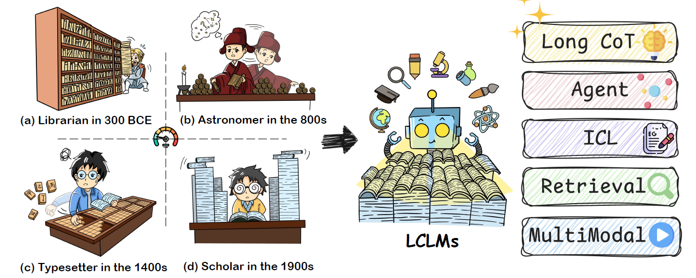

# A Comprehensive Survey on Long Context Language Modeling 💡

<div align="center">
 <p align="center">

   <a href="assets/lclm-survey.pdf">📝 Paper</a> | <a href="#Updates">📄 List</a>

 </p>
</div>
<div align="center">

<!--  -->
[](https://github.com/LCLM-Horizon/A-Comprehensive-Survey-For-Long-Context-Language-Modeling/blob/main/LICENSE)

[](https://github.com/LCLM-Horizon/A-Comprehensive-Survey-For-Long-Context-Language-Modeling/commits/main)
[](https://github.com/LCLM-Horizon/A-Comprehensive-Survey-For-Long-Context-Language-Modeling/pulls)
[](https://github.com/LCLM-Horizon/A-Comprehensive-Survey-For-Long-Context-Language-Modeling)
<!--  -->

</div>

> This repository provides a collection of papers and resources focused on Long Context Language Modeling. For a clear taxonomy and more insights about the methodology, you can refer to our survey: [A Comprehensive Survey on Long Context Language Modeling](assets/lclm-survey.pdf) with a overview shown below. 
>
> We appreciate any useful suggestions for improvement of this paper list or survey from peers and commit to regularly updating the repository.
> 
> If you would like to include your paper or any modifications in this survey and repository, please feel free to raise issues or send an email to dwzhu@pku.edu.cn or ljh411989@alibaba-inc.com or huanxuanliao@gmail.com. We sincerely appreciate your collaboration!
>
> Thanks [Awesome-LLM-Long-Context-Modeling](https://github.com/Xnhyacinth/Awesome-LLM-Long-Context-Modeling) for providing valuable reference to support the expansion of this project and the development of the comprehensive scholarly survey. 
>
> If you find our survey useful for your research, please consider citing the following paper:

```bibtex

```



## Updates

- [2025.03.11] We release the first version of the survey on Long Context Language Modeling [[**arXiv**](assets/lclm-survey.pdf)]


## Table of Contents

- [A Comprehensive Survey on Long Context Language Modeling 💡](#a-comprehensive-survey-on-long-context-language-modeling-)
  - [Updates](#updates)
  - [Table of Contents](#table-of-contents)
  - [Paper List](#paper-list)
    - [Data](#data)
      - [Pretraining](#pretraining)
      - [Posttraining](#posttraining)
    - [Model](#model)
      - [Position Embeddings](#position-embeddings)
      - [Architecture](#architecture)
      - [Hybrid Architecture](#hybrid-architecture)
    - [Workflow Design](#workflow-design)
      - [Prompt Compression](#prompt-compression)
        - [Hard Prompt Compression](#hard-prompt-compression)
        - [Soft Prompt Compression](#soft-prompt-compression)
      - [Memory-Based](#memory-based)
      - [RAG-Based](#rag-based)
      - [Agent-Based](#agent-based)
    - [Evaluation](#evaluation)
      - [Long-Context Comprehension](#long-context-comprehension)
      - [Long-Form Generation](#long-form-generation)
    - [AI Infrastructure](#ai-infrastructure)
      - [Training](#training)
      - [Inference](#inference)
    - [Interpretability](#interpretability)
      - [Performance Analysis](#performance-analysis)
      - [Model Structure Analysis](#model-structure-analysis)
    - [Application](#application)
      - [Agent](#agent)
      - [RAG](#rag)
      - [Chatbot](#chatbot)
      - [Code](#code)
      - [NLP Tasks](#nlp-tasks)
      - [Multimodal Tasks](#multimodal-tasks)
      - [Specific Domains](#specific-domains)
    - [Future Directions](#future-directions)
      - [Long CoT](#long-cot)
  - [Acknowledgments](#acknowledgments)
  - [Contributors](#contributors)
  - [Star History](#star-history)


## Paper List

### Data

#### Pretraining

1. [**Exploring the Limits of Transfer Learning with a Unified Text-to-Text
Transformer.**](http://jmlr.org/papers/v21/20-074.html) *Colin Raffel, Noam Shazeer, Adam Roberts, Katherine Lee, Sharan Narang, Michael Matena, Yanqi Zhou, Wei Li, Peter J. Liu*. J. Mach. Learn. Res. 2020

1. [**Scaling Language Models: Methods, Analysis {\&} Insights from
Training Gopher.**](https://arxiv.org/abs/2112.11446) *Jack W. Rae, Sebastian Borgeaud, Trevor Cai, Katie Millican, Jordan Hoffmann, H. Francis Song, John Aslanides, Sarah Henderson, Roman Ring, Susannah Young, Eliza Rutherford, Tom Hennigan, Jacob Menick, Albin Cassirer, Richard Powell, George van den Driessche, Lisa Anne Hendricks, Maribeth Rauh, Po{-}Sen Huang, Amelia Glaese, Johannes Welbl, Sumanth Dathathri, Saffron Huang, Jonathan Uesato, John Mellor, Irina Higgins, Antonia Creswell, Nat McAleese, Amy Wu, Erich Elsen, Siddhant M. Jayakumar, Elena Buchatskaya, David Budden, Esme Sutherland, Karen Simonyan, Michela Paganini, Laurent Sifre, Lena Martens, Xiang Lorraine Li, Adhiguna Kuncoro, Aida Nematzadeh, Elena Gribovskaya, Domenic Donato, Angeliki Lazaridou, Arthur Mensch, Jean{-}Baptiste Lespiau, Maria Tsimpoukelli, Nikolai Grigorev, Doug Fritz, Thibault Sottiaux, Mantas Pajarskas, Toby Pohlen, Zhitao Gong, Daniel Toyama, Cyprien de Masson d'Autume, Yujia Li, Tayfun Terzi, Vladimir Mikulik, Igor Babuschkin, Aidan Clark, Diego de Las Casas, Aurelia Guy, Chris Jones, James Bradbury, Matthew J. Johnson, Blake A. Hechtman, Laura Weidinger, Iason Gabriel, William Isaac, Edward Lockhart, Simon Osindero, Laura Rimell, Chris Dyer, Oriol Vinyals, Kareem Ayoub, Jeff Stanway, Lorrayne Bennett, Demis Hassabis, Koray Kavukcuoglu, Geoffrey Irving*. Arxiv 2021

1. [**Structured Packing in LLM Training Improves Long Context Utilization.**](https://arxiv.org/abs/2312.17296) *Konrad Staniszewski, Szymon Tworkowski, Sebastian Jaszczur, Henryk Michalewski, Łukasz Kuciński, Piotr Miłoś.* Arxiv 2024.

1. [**SemDeDup: Data-efficient learning at web-scale through semantic deduplication.**](https://doi.org/10.48550/arXiv.2303.09540) *Amro Abbas, Kushal Tirumala, Daniel Simig, Surya Ganguli, Ari S. Morcos*. Arxiv 2023

1. [**{SlimPajama: A 627B token cleaned and deduplicated version of RedPajama}.**](https://huggingface.co/datasets/cerebras/SlimPajama-627B) *Daria Soboleva, Faisal Al-Khateeb, Robert Myers, Jacob R Steeves, Joel Hestness, Nolan Dey*. Arxiv 2023

1. [**In-Context Pretraining: Language Modeling Beyond Document Boundaries.**](https://openreview.net/forum?id=LXVswInHOo) *Weijia Shi, Sewon Min, Maria Lomeli, Chunting Zhou, Margaret Li, Xi Victoria Lin, Noah A. Smith, Luke Zettlemoyer, Wen-tau Yih, Mike Lewis.* ICLR 2024 Spotlight. 
&nbsp;&nbsp;&nbsp;&nbsp;&nbsp;&nbsp;&nbsp; [](https://github.com/swj0419/in-context-pretraining)

1. [**Data Mixing Laws: Optimizing Data Mixtures by Predicting Language Modeling Performance.**](https://arxiv.org/abs/2403.16952) *Jiasheng Ye, Peiju Liu, Tianxiang Sun, Yunhua Zhou, Jun Zhan, Xipeng Qiu*. Arxiv 2024

1. [**Long Context is Not Long at All: A Prospector of Long-Dependency Data for Large Language Models.**](https://arxiv.org/abs/2405.17915) *Longze Chen, Ziqiang Liu, Wanwei He, Yunshui Li, Run Luo, Min Yang.* Arxiv 2024. 
&nbsp;&nbsp;&nbsp;&nbsp;&nbsp;&nbsp;&nbsp; [](https://github.com/October2001/ProLong)

1. [**{L}ong{W}anjuan: Towards Systematic Measurement for Long Text Quality.**](https://aclanthology.org/2024.findings-emnlp.327) *Xiaoran Liu, Kai Lv, Qipeng Guo, Hang Yan, Conghui He, Xipeng Qiu, Dahua Lin*. ACL 2024

1. [**Map-neo: Highly capable and transparent bilingual large language model series.**](https://arxiv.org/abs/2405.19327) *Ge Zhang, Scott Qu, Jiaheng Liu, Chenchen Zhang, Chenghua Lin, Chou Leuang Yu, Danny Pan, Esther Cheng, Jie Liu, Qunshu Lin, others*. Arxiv 2024

1. [**Quest: Query-centric Data Synthesis Approach for Long-context Scaling of Large Language Model.**](https://arxiv.org/abs/2405.19846) *Chaochen Gao, Xing Wu, Qi Fu, Songlin Hu.* Arxiv 2024.

1. [**Data Engineering for Scaling Language Models to 128K Context.**](https://arxiv.org/abs/2402.10171) *Yao Fu, Rameswar Panda, Xinyao Niu, Xiang Yue, Hannaneh Hajishirzi, Yoon Kim, Hao Peng.* Arxiv 2024. 
&nbsp;&nbsp;&nbsp;&nbsp;&nbsp;&nbsp;&nbsp; [](https://github.com/FranxYao/Long-Context-Data-Engineering)

1. [**RegMix: Data Mixture as Regression for Language Model Pre-training.**](https://arxiv.org/abs/2407.01492) *Qian Liu, Xiaosen Zheng, Niklas Muennighoff, Guangtao Zeng, Longxu Dou, Tianyu Pang, Jing Jiang, Min Lin*. Arxiv 2024

1. [**How to Train Long-Context Language Models (Effectively).**](https://arxiv.org/abs/2410.02660) *Tianyu Gao, Alexander Wettig, Howard Yen, Danqi Chen.* Arxiv 2024. 
&nbsp;&nbsp;&nbsp;&nbsp;&nbsp;&nbsp;&nbsp; [](https://github.com/princeton-nlp/ProLong)

1. [**LongAttn: Selecting Long-context Training Data via Token-level Attention.**](https://arxiv.org/abs/2502.16860) *Longyun Wu, Dawei Zhu, Guangxiang Zhao, Zhuocheng Yu, Junfeng Ran, Xiangyu Wong, Lin Sun, Sujian Li.* Arxiv 2025. 
&nbsp;&nbsp;&nbsp;&nbsp;&nbsp;&nbsp;&nbsp; [](https://github.com/Lyun0912-wu/LongAttn)

#### Posttraining

1. [**The {N}arrative{QA} Reading Comprehension Challenge.**](https://aclanthology.org/Q18-1023/) *Tom{\'a}{\v{s}} Ko{\v{c}}isk{\'y}, Jonathan Schwarz, Phil Blunsom, Chris Dyer, Karl Moritz Hermann, G{\'a}bor Melis, Edward Grefenstette*. ACL 2018

1. [**Training language models to follow instructions with human feedback.**](https://api.semanticscholar.org/CorpusID:246426909) *Long Ouyang, Jeff Wu, Xu Jiang, Diogo Almeida, Carroll L. Wainwright, Pamela Mishkin, Chong Zhang, Sandhini Agarwal, Katarina Slama, Alex Ray, John Schulman, Jacob Hilton, Fraser Kelton, Luke E. Miller, Maddie Simens, Amanda Askell, Peter Welinder, Paul Francis Christiano, Jan Leike, Ryan J. Lowe*. Arxiv 2022

1. [**{SlimPajama: A 627B token cleaned and deduplicated version of RedPajama}.**](https://huggingface.co/datasets/cerebras/SlimPajama-627B) *Daria Soboleva, Faisal Al-Khateeb, Robert Myers, Jacob R Steeves, Joel Hestness, Nolan Dey*. Arxiv 2023

1. [**Direct Preference Optimization: Your Language Model is Secretly a Reward Model.**](https://api.semanticscholar.org/CorpusID:258959321) *Rafael Rafailov, Archit Sharma, Eric Mitchell, Stefano Ermon, Christopher D. Manning, Chelsea Finn*. Arxiv 2023

1. [**WanJuan: A Comprehensive Multimodal Dataset for Advancing English and Chinese Large Models.**](https://api.semanticscholar.org/CorpusID:261049100) *Conghui He, Zhenjiang Jin, Chaoxi Xu, Jiantao Qiu, Bin Wang, Wei Li, Hang Yan, Jiaqi Wang, Da Lin*. Arxiv 2023

1. [**{L}ong{W}anjuan: Towards Systematic Measurement for Long Text Quality.**](https://aclanthology.org/2024.findings-emnlp.327) *Xiaoran Liu, Kai Lv, Qipeng Guo, Hang Yan, Conghui He, Xipeng Qiu, Dahua Lin*. ACL 2024

1. [**LOGO--Long cOntext aliGnment via efficient preference Optimization.**](https://arxiv.org/abs/2410.18533) *Zecheng Tang, Zechen Sun, Juntao Li, Qiaoming Zhu, Min Zhang*. Arxiv 2024

1. [**{L}ong{A}lign: A Recipe for Long Context Alignment of Large Language Models.**](https://aclanthology.org/2024.findings-emnlp.74) *Yushi Bai, Xin Lv, Jiajie Zhang, Yuze He, Ji Qi, Lei Hou, Jie Tang, Yuxiao Dong, Juanzi Li*. ACL 2024

1. [**What are the Essential Factors in Crafting Effective Long Context Multi-Hop Instruction Datasets? Insights and Best Practices.**](https://arxiv.org/abs/2409.01893) *Zhi Chen, Qiguang Chen, Libo Qin, Qipeng Guo, Haijun Lv, Yicheng Zou, Wanxiang Che, Hang Yan, Kai Chen, Dahua Lin.* Arxiv 2024. 
&nbsp;&nbsp;&nbsp;&nbsp;&nbsp;&nbsp;&nbsp; [](https://github.com/WowCZ/LongMIT)

1. [**Weaver: Foundation Models for Creative Writing.**](https://arxiv.org/abs/2401.17268) *Tiannan Wang, Jiamin Chen, Qingrui Jia, Shuai Wang, Ruoyu Fang, Huilin Wang, Zhaowei Gao, Chunzhao Xie, Chuou Xu, Jihong Dai, Yibin Liu, Jialong Wu, Shengwei Ding, Long Li, Zhiwei Huang, Xinle Deng, Teng Yu, Gangan Ma, Han Xiao, Zixin Chen, Danjun Xiang, Yunxia Wang, Yuanyuan Zhu, Yi Xiao, Jing Wang, Yiru Wang, Siran Ding, Jiayang Huang, Jiayi Xu, Yilihamu Tayier, Zhenyu Hu, Yuan Gao, Chengfeng Zheng, Yueshu Ye, Yihang Li, Lei Wan, Xinyue Jiang, Yujie Wang, Siyu Cheng, Zhule Song, Xiangru Tang, Xiaohua Xu, Ningyu Zhang, Huajun Chen, Yuchen Eleanor Jiang, Wangchunshu Zhou*. Arxiv 2024

1. [**LongWriter: Unleashing 10,000+ Word Generation from Long Context LLMs.**](https://arxiv.org/abs/2408.07055) *Yushi Bai, Jiajie Zhang, Xin Lv, Linzhi Zheng, Siqi Zhu, Lei Hou, Yuxiao Dong, Jie Tang, Juanzi Li.* Arxiv 2024. 
&nbsp;&nbsp;&nbsp;&nbsp;&nbsp;&nbsp;&nbsp; [](https://github.com/THUDM/LongWriter)

1. [**LongReward: Improving Long-context Large Language Models
with AI Feedback.**](https://arxiv.org/abs/2410.21252) *Jiajie Zhang, Zhongni Hou, Xin Lv, Shulin Cao, Zhenyu Hou, Yilin Niu, Lei Hou, Yuxiao Dong, Ling Feng, Juanzi Li*. Arxiv 2024

1. [**ChatQA 2: Bridging the Gap to Proprietary LLMs in Long Context and RAG Capabilities.**](https://arxiv.org/abs/2407.14482) *Peng Xu, Wei Ping, Xianchao Wu, Zihan Liu, Mohammad Shoeybi, Bryan Catanzaro.* Arxiv 2024.

1. [**LongLoRA: Efficient Fine-tuning of Long-Context Large Language Models.**](https://arxiv.org/abs/2309.12307) *Yukang Chen, Shengju Qian, Haotian Tang, Xin Lai, Zhijian Liu, Song Han, Jiaya Jia.* ICLR 2024 Oral. 
&nbsp;&nbsp;&nbsp;&nbsp;&nbsp;&nbsp;&nbsp; [](https://github.com/dvlab-research/LongLoRA)

1. [**{ORPO}: Monolithic Preference Optimization without Reference Model.**](https://aclanthology.org/2024.emnlp-main.626) *Jiwoo Hong, Noah Lee, James Thorne*. EMNLP 2024

1. [**Never Lost in the Middle: Mastering Long-Context Question Answering with Position-Agnostic Decompositional Training.**](https://aclanthology.org/2024.acl-long.736) *Junqing He, Kunhao Pan, Xiaoqun Dong, Zhuoyang Song, LiuYiBo LiuYiBo, Qianguosun Qianguosun, Yuxin Liang, Hao Wang, Enming Zhang, Jiaxing Zhang*. ACL 2024

1. [**Make Your {LLM} Fully Utilize the Context.**](https://openreview.net/forum?id=YGTVEmBXtV) *Shengnan An, Zexiong Ma, Zeqi Lin, Nanning Zheng, Jian-Guang Lou, Weizhu Chen*. NeurIPS 2024

1. [**LongDPO: Unlock Better Long-form Generation Abilities for LLMs via Critique-augmented Stepwise Information.**](https://arxiv.org/abs/2502.02095) *Bowen Ping, Jiali Zeng, Fandong Meng, Shuo Wang, Jie Zhou, Shanghang Zhang.* Arxiv 2025.

1. [**LongAttn: Selecting Long-context Training Data via Token-level Attention.**](https://arxiv.org/abs/2502.16860) *Longyun Wu, Dawei Zhu, Guangxiang Zhao, Zhuocheng Yu, Junfeng Ran, Xiangyu Wong, Lin Sun, Sujian Li.* Arxiv 2025. 
&nbsp;&nbsp;&nbsp;&nbsp;&nbsp;&nbsp;&nbsp; [](https://github.com/Lyun0912-wu/LongAttn)

### Model

#### Position Embeddings
1. [**An Efficient Recipe for Long Context Extension via Middle-Focused Positional Encoding.**](https://arxiv.org/abs/2406.07138) *Tong Wu, Yanpeng Zhao, Zilong Zheng.* NeurIPS 2024. [](https://github.com/bigai-nlco/cream)

2. [**PoSE: Efficient Context Window Extension of LLMs via Positional Skip-wise Training.**](https://arxiv.org/abs/2309.10400) *Dawei Zhu,Nan Yang,Liang Wang,Yifan Song,Wenhao Wu,Furu Wei,Sujian Li.* Arxiv 2023. [](https://github.com/dwzhu-pku/PoSE)

3. [**Contextual Position Encoding: Learning to Count What's Important.**](https://arxiv.org/abs/2405.18719) *Olga Golovneva, Tianlu Wang, Jason Weston, Sainbayar Sukhbaatar.* Arxiv 2024.

4. [**Why Does the Effective Context Length of LLMs Fall Short?.**](https://arxiv.org/abs/2410.18745) *Chenxin An, Jun Zhang, Ming Zhong, Lei Li, Shansan Gong, Yao Luo, Jingjing Xu, Lingpeng Kong.* Arxiv 2024.

5. [**HoPE: A Novel Positional Encoding Without Long-Term Decay for Enhanced Context Awareness and Extrapolation.**](https://arxiv.org/abs/2410.21216) *Yuhan Chen, Ang Lv, Jian Luan, Bin Wang, Wei Liu.* Arxiv 2024.

6. [**DAPE: Data-Adaptive Positional Encoding for Length Extrapolation.**](https://arxiv.org/abs/2405.14722) *Chuanyang Zheng, Yihang Gao, Han Shi, Minbin Huang, Jingyao Li, Jing Xiong, Xiaozhe Ren, Michael Ng, Xin Jiang, Zhenguo Li, Yu Li.* NeurIPS 2024. [](https://github.com/chuanyang-Zheng/DAPE)

7. [**Convolutional sequence to sequence learning.**](https://arxiv.org/abs/1705.03122)  *Jonas Gehring and Michael Auli and David Grangier and Denis Yarats and Yann N. Dauphin*. Arxiv 2017

8. [**Self-attention with relative position representations.**](https://arxiv.org/abs/1803.02155)  *Peter Shaw and Jakob Uszkoreit and Ashish Vaswani*. Arxiv 2018

9. [**Encoding word order in complex embeddings.**](https://arxiv.org/abs/1912.12333)  *Benyou Wang and Donghao Zhao and Christina Lioma and Qiuchi Li and Peng Zhang and Jakob Grue Simonsen*. Arxiv 2020

10. [**Exploring the limits of transfer learning with a unified text-to-text transformer.**](https://arxiv.org/abs/1910.10683)  *Colin Raffel and Noam Shazeer and Adam Roberts and Katherine Lee and Sharan Narang and Michael Matena and Yanqi Zhou and Wei Li and Peter J. Liu*. 2023

11. [**Train short, test long: Attention with linear biases enables input length extrapolation.**](https://arxiv.org/abs/2108.12409)  *Ofir Press and Noah A. Smith and Mike Lewis*. Arxiv 2022

12. [**Kerple: Kernelized relative positional embedding for length extrapolation.**](https://arxiv.org/abs/2205.09921)  *Ta-Chung Chi and Ting-Han Fan and Peter J. Ramadge and Alexander I. Rudnicky*. Arxiv 2022

13. [**Dissecting transformer length extrapolation via the lens of receptive field analysis.**](https://arxiv.org/abs/2212.10356)  *Ta-Chung Chi and Ting-Han Fan and Alexander I. Rudnicky and Peter J. Ramadge*. Arxiv 2023

14. [**A length-extrapolatable transformer.**](https://arxiv.org/abs/2212.10554)  *Yutao Sun and Li Dong and Barun Patra and Shuming Ma and Shaohan Huang and Alon Benhaim and Vishrav Chaudhary and Xia Song and Furu Wei*. Arxiv 2022

15. [**Functional interpolation for relative positions improves long context transformers.**](https://arxiv.org/abs/2310.04418)  *Shanda Li and Chong You and Guru Guruganesh and Joshua Ainslie and Santiago Ontanon and Manzil Zaheer and Sumit Sanghai and Yiming Yang and Sanjiv Kumar and Srinadh Bhojanapalli*. Arxiv 2024

16. [**Latent positional information is in the self-attention variance of transformer language models without positional embeddings.**](https://arxiv.org/abs/2305.13571)  *Latent Positional Information is in the Self-Attention Variance of Transformer Language Models Without Positional Embeddings*. Arxiv 2023

17. [**Extending context window of large language models via positional interpolation.**](https://arxiv.org/abs/2306.15595)  *Shouyuan Chen and Sherman Wong and Liangjian Chen and Yuandong Tian*. Arxiv 2023

18. [**Randomized positional encodings boost length generalization of transformers.**](https://arxiv.org/abs/2305.16843)  *Anian Ruoss and Grégoire Delétang and Tim Genewein and Jordi Grau-Moya and Róbert Csordás and Mehdi Bennani and Shane Legg and Joel Veness*. Arxiv 2023

19. [**Yarn: Efficient context window extension of large language models.**](https://arxiv.org/abs/2309.00071)  *Bowen Peng and Jeffrey Quesnelle and Honglu Fan and Enrico Shippole*. Arxiv 2023

20. [**Clex: Continuous length extrapolation for large language models.**](https://arxiv.org/abs/2310.16450)  *Guanzheng Chen and Xin Li and Zaiqiao Meng and Shangsong Liang and Lidong Bing*. Arxiv 2024

21. [**Effective long-context scaling of foundation models.**](https://arxiv.org/abs/2309.16039)  *Wenhan Xiong and Jingyu Liu and Igor Molybog and Hejia Zhang and Prajjwal Bhargava and Rui Hou and Louis Martin and Rashi Rungta and Karthik Abinav Sankararaman and Barlas Oguz and Madian Khabsa and Han Fang and Yashar Mehdad and Sharan Narang and Kshitiz Malik and Angela Fan and Shruti Bhosale and Sergey Edunov and Mike Lewis and Sinong Wang and Hao Ma*. Arxiv 2023

22. [**Giraffe: Adventures in expanding context lengths in llms.**](https://arxiv.org/abs/2308.10882)  *Arka Pal and Deep Karkhanis and Manley Roberts and Samuel Dooley and Arvind Sundararajan and Siddartha Naidu*. Arxiv 2023

23. [**Resonance rope: Improving context length generalization of large language models.**](https://arxiv.org/abs/2403.00071)  *Suyuchen Wang and Ivan Kobyzev and Peng Lu and Mehdi Rezagholizadeh and Bang Liu*. Arxiv 2024

24. [**Long context alignment with short instructions and synthesized positions.**](https://arxiv.org/abs/2405.03939)  *Wenhao Wu and Yizhong Wang and Yao Fu and Xiang Yue and Dawei Zhu and Sujian Li*. Arxiv 2024

25. [**Two stones hit one bird: Bilevel positional encoding for better length extrapolation.**](https://arxiv.org/abs/2401.16421)  *Zhenyu He and Guhao Feng and Shengjie Luo and Kai Yang and Liwei Wang and Jingjing Xu and Zhi Zhang and Hongxia Yang and Di He*. Arxiv 2024

26. [**Found in the middle: How language models use long contexts better via plug-and-play positional encoding.**](https://arxiv.org/abs/2403.04797)  *Zhenyu Zhang and Runjin Chen and Shiwei Liu and Zhewei Yao and Olatunji Ruwase and Beidi Chen and Xiaoxia Wu and Zhangyang Wang*. Arxiv 2024

27. [**Llm maybe longlm: Self-extend llm context window without tuning.**](https://arxiv.org/abs/2401.01325)  *Hongye Jin and Xiaotian Han and Jingfeng Yang and Zhimeng Jiang and Zirui Liu and Chia-Yuan Chang and Huiyuan Chen and Xia Hu*. Arxiv 2024

28. [**Longrope: Extending llm context window beyond 2 million tokens.**](https://arxiv.org/abs/2402.13753)  *Yiran Ding and Li Lyna Zhang and Chengruidong Zhang and Yuanyuan Xu and Ning Shang and Jiahang Xu and Fan Yang and Mao Yang*. Arxiv 2024

29. [**The impact of positional encoding on length generalization in transformers.**](https://arxiv.org/abs/2305.19466)  *Amirhossein Kazemnejad and Inkit Padhi and Karthikeyan Natesan Ramamurthy and Payel Das and Siva Reddy*. Arxiv 2024

30. [**Roformer: Enhanced transformer with rotary position embedding.**](https://arxiv.org/abs/2104.09864)  *Jianlin Su and Yu Lu and Shengfeng Pan and Ahmed Murtadha and Bo Wen and Yunfeng Liu*. Arxiv 2023

31. [**Training-free long-context scaling of large language models.**](https://arxiv.org/abs/2402.1746)  *Chenxin An and Fei Huang and Jun Zhang and Shansan Gong and Xipeng Qiu and Chang Zhou and Lingpeng Kong*. Arxiv 2024


#### Architecture

1. [**Compressive Transformers for Long-Range Sequence Modelling.**](https://arxiv.org/abs/1911.05507) *Jack W. Rae, Anna Potapenko, Siddhant M. Jayakumar, Timothy P. Lillicrap.* Arxiv 2019. [](https://github.com/lucidrains/compressive-transformer-pytorch)

2. [**Transformers are RNNs: Fast Autoregressive Transformers with Linear Attention.**](https://arxiv.org/abs/2006.16236) *Angelos Katharopoulos, Apoorv Vyas, Nikolaos Pappas, François Fleuret.* ICML 2020. [](https://github.com/idiap/fast-transformers)

3. [**Block-Recurrent Transformers.**](https://arxiv.org/abs/2203.07852) *DeLesley Hutchins, Imanol Schlag, Yuhuai Wu, Ethan Dyer, Behnam Neyshabur.* Arxiv 2023. [](https://github.com/lucidrains/block-recurrent-transformer-pytorch)

4. [**Memorizing Transformers.**](https://arxiv.org/abs/2203.08913) *Yuhuai Wu, Markus N. Rabe, DeLesley Hutchins, Christian Szegedy.* Arxiv 2022. [](https://github.com/lucidrains/memorizing-transformers-pytorch)

5. [**GQA: Training Generalized Multi-Query Transformer Models from Multi-Head Checkpoints.**](https://arxiv.org/abs/2305.13245) *Joshua Ainslie, James Lee-Thorp, Michiel de Jong, Yury Zemlyanskiy, Federico Lebrón, Sumit Sanghai.* Arxiv 2023.

6. [**Zebra: Extending Context Window with Layerwise Grouped Local-Global Attention.**](https://arxiv.org/abs/2312.08618) *Kaiqiang Song, Xiaoyang Wang, Sangwoo Cho, Xiaoman Pan, Dong Yu.* Arxiv 2023.

7. [**Leave No Context Behind: Efficient Infinite Context Transformers with Infini-attention.**](https://arxiv.org/abs/2404.07143) *Tsendsuren Munkhdalai, Manaal Faruqui, Siddharth Gopal.* Arxiv 2024.

8. [**Weighted Grouped Query Attention in Transformers.**](https://arxiv.org/abs/2407.10855) *Sai Sena Chinnakonduru, Astarag Mohapatra.* Arxiv 2024.

9. [**Associative Recurrent Memory Transformer.**](https://arxiv.org/abs/2407.04841) *Ivan Rodkin, Yuri Kuratov, Aydar Bulatov, Mikhail Burtsev.* ICML 2024 Workshop. [](https://github.com/RodkinIvan/associative-recurrent-memory-transformer)

10. [**Simple linear attention language models balance the recall-throughput tradeoff.**](https://arxiv.org/abs/2402.18668) *Simran Arora, Sabri Eyuboglu, Michael Zhang, Aman Timalsina, Silas Alberti, Dylan Zinsley, James Zou, Atri Rudra, Christopher Ré.* Arxiv 2024. [](https://github.com/HazyResearch/based)

11. [**DuoAttention: Efficient Long-Context LLM Inference with Retrieval and Streaming Heads.**](https://arxiv.org/abs/2410.10819) *Guangxuan Xiao, Jiaming Tang, Jingwei Zuo, Junxian Guo, Shang Yang, Haotian Tang, Yao Fu, Song Han.* Arxiv 2024. [](https://github.com/mit-han-lab/duo-attention)

12. [**TidalDecode: Fast and Accurate LLM Decoding with Position Persistent Sparse Attention.**](https://arxiv.org/abs/2410.05076) *Lijie Yang, Zhihao Zhang, Zhuofu Chen, Zikun Li, Zhihao Jia.* Arxiv 2024. [](https://github.com/DerrickYLJ/TidalDecode)

13. [**Selective Attention Improves Transformer.**](https://arxiv.org/abs/2410.02703) *Yaniv Leviathan, Matan Kalman, Yossi Matias.* Arxiv 2024.

16. [**SnapKV: LLM Knows What You are Looking for Before Generation.**](https://arxiv.org/abs/2404.14469) *Yuhong Li, Yingbing Huang, Bowen Yang, Bharat Venkitesh, Acyr Locatelli, Hanchen Ye, Tianle Cai, Patrick Lewis, Deming Chen.* Arxiv 2024. [](https://github.com/FasterDecoding/SnapKV)

17. [**Extra Global Attention Designation Using Keyword Detection in Sparse Transformer Architectures.**](https://arxiv.org/abs/2410.08971) *Evan Lucas, Dylan Kangas, Timothy C Havens.* Arxiv 2024.

18. [**An Empirical Study of Mamba-based Language Models.**](https://arxiv.org/abs/2406.07887) *Roger Waleffe, Wonmin Byeon, Duncan Riach, Brandon Norick, Vijay Korthikanti, Tri Dao, Albert Gu, Ali Hatamizadeh, Sudhakar Singh, Deepak Narayanan, Garvit Kulshreshtha, Vartika Singh, Jared Casper, Jan Kautz, Mohammad Shoeybi, Bryan Catanzaro.* Arxiv 2024. [](https://github.com/NVIDIA/Megatron-LM/tree/ssm/examples/mamba)

19. [**Lightning Attention-2: A Free Lunch for Handling Unlimited Sequence Lengths in Large Language Models.**](https://arxiv.org/abs/2401.04695) *Zhen Qin, Weigao Sun, Dong Li, Xuyang Shen, Weixuan Sun, Yiran Zhong.* Arxiv 2024. [](https://github.com/OpenNLPLab/lightning-attention)

20. [**Various Lengths, Constant Speed: Efficient Language Modeling with Lightning Attention.**](https://arxiv.org/abs/2405.17381) *Zhen Qin, Weigao Sun, Dong Li, Xuyang Shen, Weixuan Sun, Yiran Zhong.* Arxiv 2024.

21. [**SeerAttention: Learning Intrinsic Sparse Attention in Your LLMs.**](https://arxiv.org/abs/2410.13276) *Yizhao Gao, Zhichen Zeng, Dayou Du, Shijie Cao, Hayden Kwok-Hay So, Ting Cao, Fan Yang, Mao Yang.* Arxiv 2024. [](https://github.com/microsoft/SeerAttention)

22. [**Stuffed Mamba: State Collapse and State Capacity of RNN-Based Long-Context Modeling.**](https://arxiv.org/abs/2410.07145) *Yingfa Chen, Xinrong Zhang, Shengding Hu, Xu Han, Zhiyuan Liu, Maosong Sun.* Arxiv 2024. [](https://github.com/thunlp/stuffed-mamba)

23. [**Taipan: Efficient and Expressive State Space Language Models with Selective Attention.**](https://arxiv.org/abs/2410.18572) *Chien Van Nguyen, Huy Huu Nguyen, Thang M. Pham, Ruiyi Zhang, Hanieh Deilamsalehy, Puneet Mathur, Ryan A. Rossi, Trung Bui, Viet Dac Lai, Franck Dernoncourt, Thien Huu Nguyen.* Arxiv 2024.

24. [**Jamba: A Hybrid Transformer-Mamba Language Model.**](https://arxiv.org/abs/2403.19887) *Opher Lieber, Barak Lenz, Hofit Bata, Gal Cohen, Jhonathan Osin, Itay Dalmedigos, Erez Safahi, Shaked Meirom, Yonatan Belinkov, Shai Shalev-Shwartz, Omri Abend, Raz Alon, Tomer Asida, Amir Bergman, Roman Glozman, Michael Gokhman, Avashalom Manevich, Nir Ratner, Noam Rozen, Erez Shwartz, Mor Zusman, Yoav Shoham.* Arxiv 2024.

25. [**Megalodon: Efficient LLM Pretraining and Inference with Unlimited Context Length.**](https://arxiv.org/abs/2404.08801) *Xuezhe Ma, Xiaomeng Yang, Wenhan Xiong, Beidi Chen, Lili Yu, Hao Zhang, Jonathan May, Luke Zettlemoyer, Omer Levy, Chunting Zhou.* Arxiv 2024. [

26. [**An Empirical Study of Mamba-based Language Models.**](https://arxiv.org/abs/2406.07887) *Roger Waleffe, Wonmin Byeon, Duncan Riach, Brandon Norick, Vijay Korthikanti, Tri Dao, Albert Gu, Ali Hatamizadeh, Sudhakar Singh, Deepak Narayanan, Garvit Kulshreshtha, Vartika Singh, Jared Casper, Jan Kautz, Mohammad Shoeybi, Bryan Catanzaro.* Arxiv 2024. [](https://github.com/NVIDIA/Megatron-LM/tree/ssm/examples/mamba)

27. [**Samba: Simple Hybrid State Space Models for Efficient Unlimited Context Language Modeling.**](https://arxiv.org/abs/2406.07522) *Liliang Ren, Yang Liu, Yadong Lu, Yelong Shen, Chen Liang, Weizhu Chen.* Arxiv 2024. [](https://github.com/microsoft/Samba)

28. [**ReMamba: Equip Mamba with Effective Long-Sequence Modeling.**](https://arxiv.org/abs/2408.15496) *Danlong Yuan, Jiahao Liu, Bei Li, Huishuai Zhang, Jingang Wang, Xunliang Cai, Dongyan Zhao.* Arxiv 2024.

29. [**Native Sparse Attention: Hardware-Aligned and Natively Trainable Sparse Attention.**](https://arxiv.org/abs/2502.11089) *Jingyang Yuan, Huazuo Gao, Damai Dai, Junyu Luo, Liang Zhao, Zhengyan Zhang, Zhenda Xie, Y. X. Wei, Lean Wang, Zhiping Xiao, Yuqing Wang, Chong Ruan, Ming Zhang, Wenfeng Liang, Wangding Zeng.* Arxiv 2025.

30. [**MoBA: Mixture of Block Attention for Long-Context LLMs.**](https://arxiv.org/abs/2502.13189) *Enzhe Lu, Zhejun Jiang, Jingyuan Liu, Yulun Du, Tao Jiang, Chao Hong, Shaowei Liu, Weiran He, Enming Yuan, Yuzhi Wang, Zhiqi Huang, Huan Yuan, Suting Xu, Xinran Xu, Guokun Lai, Yanru Chen, Huabin Zheng, Junjie Yan, Jianlin Su, Yuxin Wu, Neo Y. Zhang, Zhilin Yang, Xinyu Zhou, Mingxing Zhang, Jiezhong Qiu.* Arxiv 2025. [](https://github.com/MoonshotAI/MoBA)

31. [**MiniMax-01: Scaling Foundation Models with Lightning Attention.**](https://arxiv.org/abs/2501.08313) *MiniMax, Aonian Li, Bangwei Gong, Bo Yang, Boji Shan, Chang Liu, Cheng Zhu, Chunhao Zhang, Congchao Guo, Da Chen, Dong Li, Enwei Jiao, Gengxin Li, Guojun Zhang, Haohai Sun, Houze Dong, Jiadai Zhu, Jiaqi Zhuang, Jiayuan Song, Jin Zhu, Jingtao Han, Jingyang Li, Junbin Xie, Junhao Xu, Junjie Yan, Kaishun Zhang, Kecheng Xiao, Kexi Kang, Le Han, Leyang Wang, Lianfei Yu, Liheng Feng, Lin Zheng, Linbo Chai, Long Xing, Meizhi Ju, Mingyuan Chi, Mozhi Zhang, Peikai Huang, Pengcheng Niu, Pengfei Li, Pengyu Zhao, Qi Yang, Qidi Xu, Qiexiang Wang, Qin Wang, Qiuhui Li, Ruitao Leng, Shengmin Shi, Shuqi Yu, Sichen Li, Songquan Zhu, Tao Huang, Tianrun Liang, Weigao Sun, Weixuan Sun, Weiyu Cheng, Wenkai Li, Xiangjun Song, Xiao Su, Xiaodong Han, Xinjie Zhang, Xinzhu Hou, Xu Min, Xun Zou, Xuyang Shen, Yan Gong, Yingjie Zhu, Yipeng Zhou, Yiran Zhong, Yongyi Hu, Yuanxiang Fan, Yue Yu, Yufeng Yang, Yuhao Li, Yunan Huang, Yunji Li, Yunpeng Huang, Yunzhi Xu, Yuxin Mao, Zehan Li, Zekang Li, Zewei Tao, Zewen Ying, Zhaoyang Cong, Zhen Qin, Zhenhua Fan, Zhihang Yu, Zhuo Jiang, Zijia Wu.* Arxiv 2025. [](https://github.com/MiniMax-AI/MiniMax-01)

32. [**Can Mamba Learn How To Learn? A Comparative Study on In-Context Learning Tasks.**](https://arxiv.org/abs/2402.04248) *Jongho Park and Jaeseung Park and Zheyang Xiong and Nayoung Lee and Jaewoong Cho and Samet Oymak and Kangwook Lee and Dimitris Papailiopoulos*. Arxiv 2024

33. [**A new approach to linear filtering and prediction problems.**]( http://ieeexplore.ieee.org/document/5311910)  *Basar, Tamer*. IEEE 2001

34. [**Fast and Accurate Deep Network Learning by Exponential Linear Units (ELUs).**](https://arxiv.org/abs/1511.07289) *Djork-Arné Clevert, Thomas Unterthiner, Sepp Hochreiter*. Arxiv 2016

35. [**Neural Discrete Representation Learning.**](https://arxiv.org/abs/1711.00937) *Aaron van den Oord, Oriol Vinyals, Koray Kavukcuoglu*. Arxiv 2018

36. [**Improving spiking dynamical networks: Accurate delays, higher-order synapses, and time cells.**](https://ieeexplore.ieee.org/abstract/document/8294070)  *Voelker, Aaron R and Eliasmith, Chris*. IEEE 2018

37. [**Improving language understanding by generative pre-training.**](https://www.mikecaptain.com/resources/pdf/GPT-1.pdf)  *Radford, Alec and Narasimhan, Karthik and Salimans, Tim and Sutskever, Ilya and others*. mikecaptain 2018

38. [**Transformer-XL: Attentive Language Models Beyond a Fixed-Length Context.**](https://arxiv.org/abs/1901.02860) *Zihang Dai, Zhilin Yang, Yiming Yang, Jaime Carbonell, Quoc V. Le, Ruslan Salakhutdinov*. Arxiv 2019

39. [**Memformer: The Memory-Augmented Transformer.**](https://arxiv.org/abs/2010.06891) *Qingyang Wu, Zhenzhong Lan, Jing Gu, Zhou Yu*. Arxiv 2020

40. [**Linformer: Self-Attention with Linear Complexity.**](https://arxiv.org/abs/2006.04768) *Sinong Wang, Belinda Z. Li, Madian Khabsa, Han Fang, Hao Ma*. Arxiv 2020

41. [**Combining recurrent, convolutional, and continuous-time models with linear state space layers.**](https://arxiv.org/abs/2110.13985)  *Albert Gu and Isys Johnson and Karan Goel and Khaled Saab and Tri Dao and Atri Rudra and Christopher Ré*. Arxiv 2021

42. [**Nystr\"omformer: A Nystr\"om-Based Algorithm for Approximating Self-Attention.**](https://arxiv.org/abs/2102.03902) *Yunyang Xiong, Zhanpeng Zeng, Rudrasis Chakraborty, Mingxing Tan, Glenn Fung, Yin Li, Vikas Singh*. Arxiv 2021

43. [**Efficient attention: Attention with linear complexities.**](https://arxiv.org/abs/1812.01243)  *Zhuoran Shen and Mingyuan Zhang and Haiyu Zhao and Shuai Yi and Hongsheng Li*. Arxiv 2024

44. [**{ERNIE-SPARSE:} Learning Hierarchical Efficient Transformer Through Regularized Self-Attention.**](https://arxiv.org/abs/2203.12276)  *Yang Liu and Jiaxiang Liu and Li Chen and Yuxiang Lu and Shikun Feng and Zhida Feng and Yu Sun and Hao Tian and Hua Wu and Haifeng Wang*. Arxiv 2022

45. [**cosFormer: Rethinking Softmax in Attention.**](https://arxiv.org/abs/2202.08791) *Zhen Qin, Weixuan Sun, Hui Deng, Dongxu Li, Yunshen Wei, Baohong Lv, Junjie Yan, Lingpeng Kong, Yiran Zhong*. Arxiv 2022

46. [**Rethinking Attention with Performers.**](https://arxiv.org/abs/2009.14794) *Krzysztof Choromanski, Valerii Likhosherstov, David Dohan, Xingyou Song, Andreea Gane, Tamas Sarlos, Peter Hawkins, Jared Davis, Afroz Mohiuddin, Lukasz Kaiser, David Belanger, Lucy Colwell, Adrian Weller*. Arxiv 2022

47. [**Multi-head state space model for speech recognition.**](https://arxiv.org/abs/2305.12498)  *Yassir Fathullah and Chunyang Wu and Yuan Shangguan and Junteng Jia and Wenhan Xiong and Jay Mahadeokar and Chunxi Liu and Yangyang Shi and Ozlem Kalinli and Mike Seltzer and Mark J. F. Gales*. Arxiv 2023

48. [**Attention Is All You Need.**](https://arxiv.org/abs/1706.03762) *Ashish Vaswani, Noam Shazeer, Niki Parmar, Jakob Uszkoreit, Llion Jones, Aidan N. Gomez, Lukasz Kaiser, Illia Polosukhin*. Arxiv 2023

49. [**Retentive Network: A Successor to Transformer for Large Language Models.**](https://arxiv.org/abs/2307.08621) *Yutao Sun, Li Dong, Shaohan Huang, Shuming Ma, Yuqing Xia, Jilong Xue, Jianyong Wang, Furu Wei*. Arxiv 2023

50. [**Mamba: Linear-time sequence modeling with selective state spaces.**](https://arxiv.org/abs/2312.00752)  *Albert Gu and Tri Dao*. Arxiv 2024

51. [**Scaling Transformer to 1M tokens and beyond with {RMT}.**](https://arxiv.org/abs/2304.11062)  *Aydar Bulatov and Yuri Kuratov and Yermek Kapushev and Mikhail S. Burtsev*. Arxiv 2024

52. [**FLatten Transformer: Vision Transformer using Focused Linear Attention.**](https://arxiv.org/abs/2308.00442) *Dongchen Han, Xuran Pan, Yizeng Han, Shiji Song, Gao Huang*. Arxiv 2023

53. [**{TRAMS:} Training-free Memory Selection for Long-range Language Modeling.**](https://arxiv.org/abs/2310.15494)  *Haofei Yu and Cunxiang Wang and Yue Zhang and Wei Bi*. Arxiv 2023

54. [**Segmented Recurrent Transformer: An Efficient Sequence-to-Sequence Model.**](https://arxiv.org/abs/2305.16340)  *Yinghan Long and Sayeed Shafayet Chowdhury and Kaushik Roy*. Arxiv 2023

55. [**Leave No Context Behind: Efficient Infinite Context Transformers with Infini-attention.**](https://arxiv.org/abs/2404.07143) *Tsendsuren Munkhdalai, Manaal Faruqui, Siddharth Gopal.* Arxiv 2024.

56. [**Transformer-VQ: Linear-Time Transformers via Vector Quantization.**](https://arxiv.org/abs/2309.16354) *Lucas D. Lingle*. Arxiv 2024

57. [**Stuffed mamba: State collapse and state capacity of rnn-based long-context modeling.**](https://arxiv.org/abs/2410.07145)  *Yingfa Chen and Xinrong Zhang and Shengding Hu and Xu Han and Zhiyuan Liu and Maosong Sun*. Arxiv 2024

58. [**Transformers are SSMs: Generalized models and efficient algorithms through structured state space duality.**](https://arxiv.org/abs/2405.21060)  *Tri Dao and Albert Gu*. Arxiv 2024

59. [**Block-state transformers.**](https://arxiv.org/abs/2306.09539)  *Mahan Fathi and Jonathan Pilault and Orhan Firat and Christopher Pal and Pierre-Luc Bacon and Ross Goroshin*. Arxiv 2023

60. [**Jamba: A hybrid transformer-mamba language model.**](https://arxiv.org/abs/2403.19887)  *Opher Lieber and Barak Lenz and Hofit Bata and Gal Cohen and Jhonathan Osin and Itay Dalmedigos and Erez Safahi and Shaked Meirom and Yonatan Belinkov and Shai Shalev-Shwartz and Omri Abend and Raz Alon and Tomer Asida and Amir Bergman and Roman Glozman and Michael Gokhman and Avashalom Manevich and Nir Ratner and Noam Rozen and Erez Shwartz and Mor Zusman and Yoav Shoham*. Arxiv 2024

61. [**Extensible Embedding: {A} Flexible Multipler For LLM's Context Length.**](https://arxiv.org/abs/2402.11577)  *Ninglu Shao and Shitao Xiao and Zheng Liu and Peitian Zhang*. Arxiv 2024

62. [**DeciMamba: Exploring the Length Extrapolation Potential of Mamba.**](https://arxiv.org/abs/2406.14528) *Assaf Ben-Kish, Itamar Zimerman, Shady Abu-Hussein, Nadav Cohen, Amir Globerson, Lior Wolf, Raja Giryes*. Arxiv 2024

63. [**CORM: Cache Optimization with Recent Message for Large Language Model Inference.**](https://arxiv.org/abs/2404.15949) *Jincheng Dai, Zhuowei Huang, Haiyun Jiang, Chen Chen, Deng Cai, Wei Bi, Shuming Shi*. Arxiv 2024

65. [**Longformer: The Long-Document Transformer.**](https://arxiv.org/abs/2004.05150) *Iz Beltagy, Matthew E. Peters, Arman Cohan.* Arxiv 2020. [](https://github.com/allenai/longformer)

66. [**Model Tells You What to Discard: Adaptive KV Cache Compression for LLMs.**](https://openreview.net/forum?id=uNrFpDPMyo) *Suyu Ge, Yunan Zhang, Liyuan Liu, Minjia Zhang, Jiawei Han, Jianfeng Gao.* ICLR 2024 Oral.

67. [**PyramidKV: Dynamic KV Cache Compression based on Pyramidal Information Funneling.**](https://arxiv.org/abs/2406.02069) *Zefan Cai., Yichi Zhang, Bofei Gao, Tianyu Liu, Keming Lu, Wayne Xiong, Yue Dong, Baobao Chang, Junjie Hu, Wen Xiao.* Arxiv 2024.

68. [**RazorAttention: Efficient KV Cache Compression Through Retrieval Heads.**](https://arxiv.org/abs/2407.15891) *Hanlin Tang, Yang Lin, Jing Lin, Qingsen Han, Shikuan Hong, Yiwu Yao, Gongyi Wang.* Arxiv 2024.

69. [**Not All Heads Matter: A Head-Level KV Cache Compression Method with Integrated Retrieval and Reasoning.**](https://arxiv.org/abs/2410.19258) *Yu Fu, Zefan Cai, Abedelkadir Asi, Wayne Xiong, Yue Dong, Wen Xiao.* Arxiv 2024.

70. [**Quest: Query-Aware Sparsity for Efficient Long-Context LLM Inference.**](https://arxiv.org/abs/2406.10774) *Jiaming Tang, Yilong Zhao, Kan Zhu, Guangxuan Xiao, Baris Kasikci, Song Han.* ICML 2024. [](https://github.com/mit-han-lab/Quest)

71. [**Efficient Streaming Language Models with Attention Sinks.**](https://arxiv.org/pdf/2309.17453.pdf) *Guangxuan Xiao, Yuandong Tian, Beidi Chen, Song Han, Mike Lewis.* Arxiv 2023. [](https://github.com/mit-han-lab/streaming-llm)

72. [**PyramidInfer: Pyramid KV Cache Compression for High-throughput LLM Inference.**](https://arxiv.org/abs/2405.12532) *William Brandon, Mayank Mishra, Aniruddha Nrusimha, Rameswar Panda, Jonathan Ragan Kelly.* Arxiv 2024. [](https://github.com/mutonix/pyramidinfer)

73. [**MInference 1.0: Accelerating Pre-filling for Long-Context LLMs via Dynamic Sparse Attention.**](https://arxiv.org/abs/2407.02490) *Huiqiang Jiang, Yucheng Li, Chengruidong Zhang, Qianhui Wu, Xufang Luo, Surin Ahn, Zhenhua Han, Amir H. Abdi, Dongsheng Li, Chin-Yew Lin, Yuqing Yang, Lili Qiu.* Arxiv 2024. [](https://github.com/microsoft/MInference) [](https://hqjiang.com/minference.html)

74. [**LazyLLM: Dynamic Token Pruning for Efficient Long Context LLM Inference.**](https://arxiv.org/abs/2407.14057) *Qichen Fu, Minsik Cho, Thomas Merth, Sachin Mehta, Mohammad Rastegari, Mahyar Najibi.* Arxiv 2024.

75. [**DynamicKV: Task-Aware Adaptive KV Cache Compression for Long Context LLMs.**](https://arxiv.org/abs/2412.14838) *Xiabin Zhou, Wenbin Wang, Minyan Zeng, Jiaxian Guo, Xuebo Liu, Li Shen, Min Zhang, Liang Ding.* Arxiv 2024.

76. [**H$_2$O: Heavy-Hitter Oracle for Efficient Generative Inference of Large Language Models.**](https://arxiv.org/abs/2306.14048) *Zhenyu Zhang, Ying Sheng, Tianyi Zhou, Tianlong Chen, Lianmin Zheng, Ruisi Cai, Zhao Song, Yuandong Tian, Christopher Ré, Clark Barrett, Zhangyang Wang, Beidi Chen*. Arxiv 2023

77. [**Scissorhands: Exploiting the Persistence of Importance Hypothesis for LLM KV Cache Compression at Test Time.**](https://arxiv.org/abs/2305.17118) *Zichang Liu, Aditya Desai, Fangshuo Liao, Weitao Wang, Victor Xie, Zhaozhuo Xu, Anastasios Kyrillidis, Anshumali Shrivastava*. Arxiv 2023

78. [**Loki: Low-rank Keys for Efficient Sparse Attention.**](https://arxiv.org/abs/2406.02542) *Prajwal Singhania, Siddharth Singh, Shwai He, Soheil Feizi, Abhinav Bhatele*. Arxiv 2024

79. [**LM-Infinite: Zero-Shot Extreme Length Generalization for Large Language Models.**](https://arxiv.org/abs/2308.16137) *Chi Han, Qifan Wang, Hao Peng, Wenhan Xiong, Yu Chen, Heng Ji, Sinong Wang*. Arxiv 2024

80. [**Ada-KV: Optimizing KV Cache Eviction by Adaptive Budget Allocation for Efficient LLM Inference.**](https://arxiv.org/abs/2407.11550) *Yuan Feng, Junlin Lv, Yukun Cao, Xike Xie, S. Kevin Zhou*. Arxiv 2025

81. [**LightTransfer: Your Long-Context LLM is Secretly a Hybrid Model with Effortless Adaptation.**](https://arxiv.org/abs/2410.13846) *Xuan Zhang, Fengzhuo Zhang, Cunxiao Du, Chao Du, Tianyu Pang, Wei Gao, Min Lin*. Arxiv 2025


#### Hybrid Architecture

1. [**C4AI Command R7B: A 7 Billion Parameter Multilingual Model.**](https://huggingface.co/CohereForAI/c4ai-command-r7b-12-2024) *Cohere, Cohere For AI*. Arxiv 2024

2. [**Jamba: A hybrid transformer-mamba language model.**](https://arxiv.org/abs/2403.19887)  *Opher Lieber and Barak Lenz and Hofit Bata and Gal Cohen and Jhonathan Osin and Itay Dalmedigos and Erez Safahi and Shaked Meirom and Yonatan Belinkov and Shai Shalev-Shwartz and Omri Abend and Raz Alon and Tomer Asida and Amir Bergman and Roman Glozman and Michael Gokhman and Avashalom Manevich and Nir Ratner and Noam Rozen and Erez Shwartz and Mor Zusman and Yoav Shoham*. Arxiv 2024

3. [**Hymba: A hybrid-head architecture for small language models.**](https://arxiv.org/abs/2411.13676)  *Xin Dong and Yonggan Fu and Shizhe Diao and Wonmin Byeon and Zijia Chen and Ameya Sunil Mahabaleshwarkar and Shih-Yang Liu and Matthijs Van Keirsbilck and Min-Hung Chen and Yoshi Suhara and Yingyan Lin and Jan Kautz and Pavlo Molchanov*. Arxiv 2024

4. [**Zamba: A compact 7b ssm hybrid model.**](https://arxiv.org/abs/2405.16712)  *Paolo Glorioso and Quentin Anthony and Yury Tokpanov and James Whittington and Jonathan Pilault and Adam Ibrahim and Beren Millidge*. Arxiv 2024

5. [**Goldfinch: High performance rwkv/transformer hybrid with linear pre-fill and extreme kv-cache compression.**](https://arxiv.org/abs/2407.12077) *Daniel Goldstein and Fares Obeid and Eric Alcaide and Guangyu Song and Eugene Cheah*. Arxiv 2024

6. [**Gemma 2: Improving open language models at a practical size.**](https://arxiv.org/abs/2408.00118)  *Gemma Team and Morgane Riviere and Shreya Pathak and Pier Giuseppe Sessa and Cassidy Hardin and Surya Bhupatiraju and Léonard Hussenot and Thomas Mesnard and Bobak Shahriari and Alexandre Ramé and Johan Ferret and Peter Liu and Pouya Tafti and Abe Friesen and Michelle Casbon and Sabela Ramos and Ravin Kumar and Charline Le Lan and Sammy Jerome and Anton Tsitsulin and Nino Vieillard and Piotr Stanczyk and Sertan Girgin and Nikola Momchev and Matt Hoffman and Shantanu Thakoor and Jean-Bastien Grill and Behnam Neyshabur and Olivier Bachem and Alanna Walton and Aliaksei Severyn and Alicia Parrish and Aliya Ahmad and Allen Hutchison and Alvin Abdagic and Amanda Carl and Amy Shen and Andy Brock and Andy Coenen and Anthony Laforge and Antonia Paterson and Ben Bastian and Bilal Piot and Bo Wu and Brandon Royal and Charlie Chen and Chintu Kumar and Chris Perry and Chris Welty and Christopher A. Choquette-Choo and Danila Sinopalnikov and David Weinberger and Dimple Vijaykumar and Dominika Rogozińska and Dustin Herbison and Elisa Bandy and Emma Wang and Eric Noland and Erica Moreira and Evan Senter and Evgenii Eltyshev and Francesco Visin and Gabriel Rasskin and Gary Wei and Glenn Cameron and Gus Martins and Hadi Hashemi and Hanna Klimczak-Plucińska and Harleen Batra and Harsh Dhand and Ivan Nardini and Jacinda Mein and Jack Zhou and James Svensson and Jeff Stanway and Jetha Chan and Jin Peng Zhou and Joana Carrasqueira and Joana Iljazi and Jocelyn Becker and Joe Fernandez and Joost van Amersfoort and Josh Gordon and Josh Lipschultz and Josh Newlan and Ju-yeong Ji and Kareem Mohamed and Kartikeya Badola and Kat Black and Katie Millican and Keelin McDonell and Kelvin Nguyen and Kiranbir Sodhia and Kish Greene and Lars Lowe Sjoesund and Lauren Usui and Laurent Sifre and Lena Heuermann and Leticia Lago and Lilly McNealus and Livio Baldini Soares and Logan Kilpatrick and Lucas Dixon and Luciano Martins and Machel Reid and Manvinder Singh and Mark Iverson and Martin Görner and Mat Velloso and Mateo Wirth and Matt Davidow and Matt Miller and Matthew Rahtz and Matthew Watson and Meg Risdal and Mehran Kazemi and Michael Moynihan and Ming Zhang and Minsuk Kahng and Minwoo Park and Mofi Rahman and Mohit Khatwani and Natalie Dao and Nenshad Bardoliwalla and Nesh Devanathan and Neta Dumai and Nilay Chauhan and Oscar Wahltinez and Pankil Botarda and Parker Barnes and Paul Barham and Paul Michel and Pengchong Jin and Petko Georgiev and Phil Culliton and Pradeep Kuppala and Ramona Comanescu and Ramona Merhej and Reena Jana and Reza Ardeshir Rokni and Rishabh Agarwal and Ryan Mullins and Samaneh Saadat and Sara Mc Carthy and Sarah Cogan and Sarah Perrin and Sébastien M. R. Arnold and Sebastian Krause and Shengyang Dai and Shruti Garg and Shruti Sheth and Sue Ronstrom and Susan Chan and Timothy Jordan and Ting Yu and Tom Eccles and Tom Hennigan and Tomas Kocisky and Tulsee Doshi and Vihan Jain and Vikas Yadav and Vilobh Meshram and Vishal Dharmadhikari and Warren Barkley and Wei Wei and Wenming Ye and Woohyun Han and Woosuk Kwon and Xiang Xu and Zhe Shen and Zhitao Gong and Zichuan Wei and Victor Cotruta and Phoebe Kirk and Anand Rao and Minh Giang and Ludovic Peran and Tris Warkentin and Eli Collins and Joelle Barral and Zoubin Ghahramani and Raia Hadsell and D. Sculley and Jeanine Banks and Anca Dragan and Slav Petrov and Oriol Vinyals and Jeff Dean and Demis Hassabis and Koray Kavukcuoglu and Clement Farabet and Elena Buchatskaya and Sebastian Borgeaud and Noah Fiedel and Armand Joulin and Kathleen Kenealy and Robert Dadashi and Alek Andreev*. Arxiv 2024

7. [**Jamba-1.5: Hybrid transformer-mamba models at scale.**](https://arxiv.org/abs/2408.12570)  *Jamba Team and Barak Lenz and Alan Arazi and Amir Bergman and Avshalom Manevich and Barak Peleg and Ben Aviram and Chen Almagor and Clara Fridman and Dan Padnos and Daniel Gissin and Daniel Jannai and Dor Muhlgay and Dor Zimberg and Edden M Gerber and Elad Dolev and Eran Krakovsky and Erez Safahi and Erez Schwartz and Gal Cohen and Gal Shachaf and Haim Rozenblum and Hofit Bata and Ido Blass and Inbal Magar and Itay Dalmedigos and Jhonathan Osin and Julie Fadlon and Maria Rozman and Matan Danos and Michael Gokhman and Mor Zusman and Naama Gidron and Nir Ratner and Noam Gat and Noam Rozen and Oded Fried and Ohad Leshno and Omer Antverg and Omri Abend and Opher Lieber and Or Dagan and Orit Cohavi and Raz Alon and Ro'i Belson and Roi Cohen and Rom Gilad and Roman Glozman and Shahar Lev and Shaked Meirom and Tal Delbari and Tal Ness and Tomer Asida and Tom Ben Gal and Tom Braude and Uriya Pumerantz and Yehoshua Cohen and Yonatan Belinkov and Yuval Globerson and Yuval Peleg Levy and Yoav Shoham*. Arxiv 2024

8. [**RecurrentGemma: Moving Past Transformers for Efficient Open Language Models.**](https://arxiv.org/abs/2404.07839)  *Aleksandar Botev and Soham De and Samuel L Smith and Anushan Fernando and George-Cristian Muraru and Ruba Haroun and Leonard Berrada and Razvan Pascanu and Pier Giuseppe Sessa and Robert Dadashi and Léonard Hussenot and Johan Ferret and Sertan Girgin and Olivier Bachem and Alek Andreev and Kathleen Kenealy and Thomas Mesnard and Cassidy Hardin and Surya Bhupatiraju and Shreya Pathak and Laurent Sifre and Morgane Rivière and Mihir Sanjay Kale and Juliette Love and Pouya Tafti and Armand Joulin and Noah Fiedel and Evan Senter and Yutian Chen and Srivatsan Srinivasan and Guillaume Desjardins and David Budden and Arnaud Doucet and Sharad Vikram and Adam Paszke and Trevor Gale and Sebastian Borgeaud and Charlie Chen and Andy Brock and Antonia Paterson and Jenny Brennan and Meg Risdal and Raj Gundluru and Nesh Devanathan and Paul Mooney and Nilay Chauhan and Phil Culliton and Luiz Gustavo Martins and Elisa Bandy and David Huntsperger and Glenn Cameron and Arthur Zucker and Tris Warkentin and Ludovic Peran and Minh Giang and Zoubin Ghahramani and Clément Farabet and Koray Kavukcuoglu and Demis Hassabis and Raia Hadsell and Yee Whye Teh and Nando de Frietas*. Arxiv 2024

9. [**The Zamba2 Suite: Technical Report.**](https://arxiv.org/abs/2411.15242)  *Paolo Glorioso and Quentin Anthony and Yury Tokpanov and Anna Golubeva and Vasudev Shyam and James Whittington and Jonathan Pilault and Beren Millidge*. Arxiv 2024

10. [**You only cache once: Decoder-decoder architectures for language models.**](https://arxiv.org/abs/2405.05254)  *Yutao Sun and Li Dong and Yi Zhu and Shaohan Huang and Wenhui Wang and Shuming Ma and Quanlu Zhang and Jianyong Wang and Furu Wei*. Arxiv 2024

### Workflow Design

#### Prompt Compression

1. [**Prompt Compression for Large Language Models: A Survey.**](https://arxiv.org/abs/2410.12388) *Zongqian Li, Yinhong Liu, Yixuan Su, Nigel Collier.* Arxiv 2024.

##### Hard Prompt Compression
1. [**LLMLingua: Compressing Prompts for Accelerated Inference of Large Language Models.**](https://arxiv.org/abs/2310.05736) *Huiqiang Jiang, Qianhui Wu, Chin-Yew Lin, Yuqing Yang, Lili Qiu.* Arxiv 2023. [](https://github.com/microsoft/LLMLingua)

2. [**LongLLMLingua: Accelerating and Enhancing LLMs in Long Context Scenarios via Prompt Compression.**](https://arxiv.org/abs/2310.06839) *Huiqiang Jiang, Qianhui Wu, Xufang Luo, Dongsheng Li, Chin-Yew Lin, Yuqing Yang, Lili Qiu.* Arxiv 2023. [](https://github.com/microsoft/LLMLingua)

3. [**LLMLingua-2: Data Distillation for Efficient and Faithful Task-Agnostic Prompt Compression.**](https://arxiv.org/abs/2403.12968) *Zhuoshi Pan, Qianhui Wu, Huiqiang Jiang, Menglin Xia, Xufang Luo, Jue Zhang, Qingwei Lin, Victor Rühle, Yuqing Yang, Chin-Yew Lin, H. Vicky Zhao, Lili Qiu, Dongmei Zhang.* Arxiv 2024. [](https://github.com/microsoft/LLMLingua)

4. [**Compressing Context to Enhance Inference Efficiency of Large Language Models.**](https://arxiv.org/abs/2310.06201) *Yucheng Li, Bo Dong, Chenghua Lin, Frank Guerin.* Arxiv 2023. [](https://github.com/liyucheng09/Selective_Context)

5. [**TACO-RL: Task Aware Prompt Compression Optimization with Reinforcement Learning.**](https://arxiv.org/abs/2409.13035) *Shivam Shandilya, Menglin Xia, Supriyo Ghosh, Huiqiang Jiang, Jue Zhang, Qianhui Wu, Victor Rühle.* Arxiv 2024.

6. [**Prompt Compression with Context-Aware Sentence Encoding for Fast and Improved LLM Inference.**](https://arxiv.org/abs/2409.01227) *Barys Liskavets, Maxim Ushakov, Shuvendu Roy, Mark Klibanov, Ali Etemad, Shane Luke.* Arxiv 2024. [](https://github.com/Workday/cpc)

7. [**AdaComp: Extractive Context Compression with Adaptive Predictor for Retrieval-Augmented Large Language Models.**](https://arxiv.org/abs/2409.01579) *Qianchi Zhang, Hainan Zhang, Liang Pang, Hongwei Zheng, Zhiming Zheng.* Arxiv 2024.

8. [**Learning to Compress Prompt in Natural Language Formats.**](https://arxiv.org/abs/2402.18700) *Yu-Neng Chuang, Tianwei Xing, Chia-Yuan Chang, Zirui Liu, Xun Chen, Xia Hu.* Arxiv 2024.

9. [**{TCRA}-{LLM}: Token Compression Retrieval Augmented Large Language Model for Inference Cost Reduction.**](https://aclanthology.org/2023.findings-emnlp.655) *Junyi Liu, Liangzhi Li, Tong Xiang, Bowen Wang, Yiming Qian*. Arxiv 2023

10. [**Familiarity-Aware Evidence Compression for Retrieval-Augmented Generation.**](https://arxiv.org/abs/2409.12468) *Dongwon Jung, Qin Liu, Tenghao Huang, Ben Zhou, Muhao Chen*. Arxiv 2024

11. [**Discrete Prompt Compression With Reinforcement Learning.**](http://dx.doi.org/10.1109/ACCESS.2024.3403426) *Hoyoun Jung, Kyung-Joong Kim*. Arxiv 2024

12. [**CompAct: Compressing Retrieved Documents Actively for Question Answering.**](https://arxiv.org/abs/2407.09014) *Chanwoong Yoon, Taewhoo Lee, Hyeon Hwang, Minbyul Jeong, Jaewoo Kang*. Arxiv 2024


##### Soft Prompt Compression
1. [**Adapting Language Models to Compress Contexts.**](https://arxiv.org/abs/2305.14788) *Alexis Chevalier, Alexander Wettig, Anirudh Ajith, Danqi Chen.* Arxiv 2023. [](https://github.com/princeton-nlp/AutoCompressors)

2. [**xRAG: Extreme Context Compression for Retrieval-augmented Generation with One Token.**](https://arxiv.org/abs/2405.13792) *Xin Cheng, Xun Wang, Xingxing Zhang, Tao Ge, Si-Qing Chen, Furu Wei, Huishuai Zhang, Dongyan Zhao.* Arxiv 2024. [](https://github.com/Hannibal046/xRAG)

3. [**In-context Autoencoder for Context Compression in a Large Language Model.**](https://openreview.net/forum?id=uREj4ZuGJE) *Tao Ge, Hu Jing, Lei Wang, Xun Wang, Si-Qing Chen, Furu Wei.* ICLR 2024. [](https://github.com/getao/icae)

4. [**The Power of Scale for Parameter-Efficient Prompt Tuning.**](https://aclanthology.org/2021.emnlp-main.243) *Brian Lester, Rami Al-Rfou, Noah Constant*. Arxiv 2021

5. [**Prompt Compression and Contrastive Conditioning for Controllability and Toxicity Reduction in Language Models.**](https://arxiv.org/abs/2210.03162) *David Wingate, Mohammad Shoeybi, Taylor Sorensen*. Arxiv 2022

6. [**Learning to Compress Prompts with Gist Tokens.**](https://arxiv.org/abs/2304.08467) *Jesse Mu, Xiang Lisa Li, Noah Goodman*. Arxiv 2024

7. [**Unifying Demonstration Selection and Compression for In-Context Learning.**](https://arxiv.org/abs/2405.17062) *Jun Gao, Ziqiang Cao, Wenjie Li*. Arxiv 2024

8. [**Long Context Compression with Activation Beacon.**](https://arxiv.org/abs/2401.03462) *Peitian Zhang, Zheng Liu, Shitao Xiao, Ninglu Shao, Qiwei Ye, Zhicheng Dou*. Arxiv 2024

9. [**500xCompressor: Generalized Prompt Compression for Large Language Models.**](https://arxiv.org/abs/2408.03094) *Zongqian Li, Yixuan Su, Nigel Collier*. Arxiv 2024

#### Memory-Based

1. [**Towards Teachable Reasoning Systems: Using a Dynamic Memory of User Feedback for Continual System Improvement.**](https://aclanthology.org/2022.emnlp-main.644) *Bhavana Dalvi Mishra, Oyvind Tafjord, Peter Clark*. EMNLP 2022

1. [**Augmenting Language Models with Long-Term Memory.**](http://papers.nips.cc/paper\_files/paper/2023/hash/ebd82705f44793b6f9ade5a669d0f0bf-Abstract-Conference.html) *Weizhi Wang, Li Dong, Hao Cheng, Xiaodong Liu, Xifeng Yan, Jianfeng Gao, Furu Wei*. NeurIPS 2023

1. [**{MEMORYLLM:} Towards Self-Updatable Large Language Models.**](https://openreview.net/forum?id=p0lKWzdikQ) *Yu Wang, Yifan Gao, Xiusi Chen, Haoming Jiang, Shiyang Li, Jingfeng Yang, Qingyu Yin, Zheng Li, Xian Li, Bing Yin, Jingbo Shang, Julian J. McAuley*. ICML 2024

1. [**MemoryBank: Enhancing Large Language Models with Long-Term Memory.**](https://arxiv.org/abs/2305.10250) *Wanjun Zhong, Lianghong Guo, Qiqi Gao, He Ye, Yanlin Wang.* Arxiv 2023.  
&nbsp;&nbsp;&nbsp;&nbsp;&nbsp;&nbsp;&nbsp; [](https://github.com/zhongwanjun/MemoryBank-SiliconFriend)

#### RAG-Based

1. [**{BERT}: Pre-training of Deep Bidirectional Transformers for Language Understanding.**](https://aclanthology.org/N19-1423/) *Jacob Devlin, Ming-Wei Chang, Kenton Lee, Kristina Toutanova*. ACL 2019

1. [**Leveraging Passage Retrieval with Generative Models for Open Domain Question Answering.**](https://aclanthology.org/2021.eacl-main.74/) *Gautier Izacard, Edouard Grave*. ACL 2021

1. [**RepoCoder: Repository-Level Code Completion Through Iterative Retrieval
and Generation.**](https://doi.org/10.18653/v1/2023.emnlp-main.151) *Fengji Zhang, Bei Chen, Yue Zhang, Jacky Keung, Jin Liu, Daoguang Zan, Yi Mao, Jian{-}Guang Lou, Weizhu Chen*. EMNLP 2023

1. [**Query Rewriting in Retrieval-Augmented Large Language Models.**](https://openreview.net/forum?id=gXq1cwkUZc) *Xinbei Ma, Yeyun Gong, Pengcheng He, hai zhao, Nan Duan*. EMNLP 2023

1. [**{REPLUG}: Retrieval-Augmented Black-Box Language Models.**](https://aclanthology.org/2024.naacl-long.463/) *Weijia Shi, Sewon Min, Michihiro Yasunaga, Minjoon Seo, Richard James, Mike Lewis, Luke Zettlemoyer, Wen-tau Yih*. ACL 2024

1. [**{BGE} M3-Embedding: Multi-Lingual, Multi-Functionality, Multi-Granularity
Text Embeddings Through Self-Knowledge Distillation.**](https://doi.org/10.48550/arXiv.2402.03216) *Jianlv Chen, Shitao Xiao, Peitian Zhang, Kun Luo, Defu Lian, Zheng Liu*. Arxiv 2024

1. [**Smarter, Better, Faster, Longer: A Modern Bidirectional Encoder for Fast, Memory Efficient, and Long Context Finetuning and Inference.**](https://arxiv.org/abs/2412.13663) *Benjamin Warner, Antoine Chaffin, Benjamin Clavié, Orion Weller, Oskar Hallström, Said Taghadouini, Alexis Gallagher, Raja Biswas, Faisal Ladhak, Tom Aarsen, Nathan Cooper, Griffin Adams, Jeremy Howard, Iacopo Poli*. Arxiv 2024

#### Agent-Based

1. [**Re3: Generating Longer Stories With Recursive Reprompting and Revision.**](https://doi.org/10.18653/v1/2022.emnlp-main.296) *Kevin Yang, Yuandong Tian, Nanyun Peng, Dan Klein*. EMNLP 2022

1. [**Walking Down the Memory Maze: Beyond Context Limit through Interactive Reading.**](https://arxiv.org/abs/2310.05029) *Howard Chen, Ramakanth Pasunuru, Jason Weston, Asli Celikyilmaz.* Arxiv 2023.

1. [**PEARL: Prompting Large Language Models to Plan and Execute Actions Over Long Documents.**](https://aclanthology.org/2024.eacl-long.29/) *Simeng Sun, Yang Liu, Shuohang Wang, Dan Iter, Chenguang Zhu, Mohit Iyyer.* EACL 2024. 
&nbsp;&nbsp;&nbsp;&nbsp;&nbsp;&nbsp;&nbsp; [](https://github.com/SimengSun/pearl)

1. [**Learning to Reason and Memorize with Self-Notes.**](https://proceedings.neurips.cc/paper_files/paper/2023/file/274d0146144643ee2459a602123c60ff-Paper-Conference.pdf) *Jack Lanchantin, Shubham Toshniwal, Jason Weston, arthur szlam, Sainbayar Sukhbaatar*. NeurIPS 2023

1. [**GraphReader: Building Graph-based Agent to Enhance Long-Context Abilities of Large Language Models.**](https://arxiv.org/abs/2406.14550) *Shilong Li, Yancheng He, Hangyu Guo, Xingyuan Bu, Ge Bai, Jie Liu, Jiaheng Liu, Xingwei Qu, Yangguang Li, Wanli Ouyang, Wenbo Su, Bo Zheng.* Arxiv 2024.

1. [**A Human-Inspired Reading Agent with Gist Memory of Very Long Contexts.**](https://arxiv.org/abs/2402.09727v1) *Kuang-Huei Lee, Xinyun Chen, Hiroki Furuta, John Canny, Ian Fischer.* Arxiv 2024.

1. [**RoleAgent: Building, Interacting, and Benchmarking High-quality Role-Playing Agents from Scripts.**](https://openreview.net/forum?id=hORTHzt2cE) *Jiaheng Liu, Zehao Ni, Haoran Que, Tao Sun, Noah Wang, Jian Yang, JiakaiWang, Hongcheng Guo, Z.Y. Peng, Ge Zhang, Jiayi Tian, Xingyuan Bu, Ke Xu, Wenge Rong, Junran Peng, Zhaoxiang Zhang*. NeurIPS 2024

1. [**Chain of Agents: Large Language Models Collaborating on Long-Context Tasks.**](https://arxiv.org/abs/2406.02818) *Yusen Zhang, Ruoxi Sun, Yanfei Chen, Tomas Pfister, Rui Zhang, Sercan Ö. Arik.* Arxiv 2024.

1. [**LongAgent: Scaling Language Models to 128k Context through Multi-Agent Collaboration.**](https://arxiv.org/abs/2402.11550) *Jun Zhao, Can Zu, Hao Xu, Yi Lu, Wei He, Yiwen Ding, Tao Gui, Qi Zhang, Xuanjing Huang.* Arxiv 2024.

### Evaluation

#### Long-Context Comprehension

1. [**Ada-LEval: Evaluating long-context LLMs with length-adaptable benchmarks.**](https://arxiv.org/abs/2404.06480) *Chonghua Wang, Haodong Duan, Songyang Zhang, Dahua Lin, Kai Chen.* Arxiv 2024. [](https://github.com/open-compass/Ada-LEval)

2. [**BABILong: Testing the Limits of LLMs with Long Context Reasoning-in-a-Haystack.**](https://arxiv.org/abs/2406.10149) *Yuri Kuratov, Aydar Bulatov, Petr Anokhin, Ivan Rodkin, Dmitry Sorokin, Artyom Sorokin, Mikhail Burtsev.* Arxiv 2024. [](https://github.com/booydar/babilong)

3. [**DENIAHL: In-Context Features Influence LLM Needle-In-A-Haystack Abilities.**](https://arxiv.org/abs/2411.19360) *Hui Dai, Dan Pechi, Xinyi Yang, Garvit Banga, Raghav Mantri.* Arxiv 2024. [](https://github.com/ameliadai/DENIAHL)

4. [**Holistic Reasoning with Long-Context LMs: A Benchmark for Database Operations on Massive Textual Data.**](https://arxiv.org/abs/2410.11996) *Seiji Maekawa, Hayate Iso, Nikita Bhutani.* Arxiv 2024. [](https://github.com/megagonlabs/holobench)

5. [**LongIns: A Challenging Long-context Instruction-based Exam for LLMs.**](https://arxiv.org/abs/2406.17588) *Shawn Gavin, Tuney Zheng, Jiaheng Liu, Quehry Que, Noah Wang, Jian Yang, Chenchen Zhang, Wenhao Huang, Wenhu Chen, Ge Zhang.* Arxiv 2024.

6. [**Distance between Relevant Information Pieces Causes Bias in Long-Context LLMs.**](https://arxiv.org/abs/2410.14641) *Runchu Tian, Yanghao Li, Yuepeng Fu, Siyang Deng, Qinyu Luo, Cheng Qian, Shuo Wang, Xin Cong, Zhong Zhang, Yesai Wu, Yankai Lin, Huadong Wang, Xiaojiang Liu.* Arxiv 2024. [](https://github.com/Rachum-thu/LongPiBench)

7. [**LIFBench: Evaluating the Instruction Following Performance and Stability of Large Language Models in Long-Context Scenarios.**](https://arxiv.org/abs/2411.07037) *Xiaodong Wu, Minhao Wang, Yichen Liu, Xiaoming Shi, He Yan, Xiangju Lu, Junmin Zhu, Wei Zhang.* Arxiv 2024.

8. [**Long Range Arena: A Benchmark for Efficient Transformers.**](https://arxiv.org/abs/2011.04006) *Yi Tay, Mostafa Dehghani, Samira Abnar, Yikang Shen, Dara Bahri, Philip Pham, Jinfeng Rao, Liu Yang, Sebastian Ruder, Donald Metzler*. Arxiv 2020

9. [**LongReason: A Synthetic Long-Context Reasoning Benchmark via Context Expansion.**](https://arxiv.org/abs/2501.15089) *Zhan Ling, Kang Liu, Kai Yan, Yifan Yang, Weijian Lin, Ting-Han Fan, Lingfeng Shen, Zhengyin Du, Jiecao Chen.* Arxiv 2025.

10. [**Evaluating Multilingual Long-Context Models for Retrieval and Reasoning.**](https://arxiv.org/abs/2409.18006) *Agrawal, Ameeta and Dang, Andy and Nezhad, Sina Bagheri and Pokharel, Rhitabrat and Scheinberg, Russell.* ACL 2024.

11. [**M4le: A multi-ability multi-range multi-task multi-domain long-context evaluation benchmark for large language models.**](https://arxiv.org/abs/2310.19240) *Kwan, Wai-Chung and Zeng, Xingshan and Wang, Yufei and Sun, Yusen and Li, Liangyou and Shang, Lifeng and Liu, Qun and Wong, Kam-Fai.* ACL 2024.

12. [**Michelangelo: Long context evaluations beyond haystacks via latent structure queries.**](https://arxiv.org/abs/2409.12640) *Vodrahalli, Kiran and Ontanon, Santiago and Tripuraneni, Nilesh and Xu, Kelvin and Jain, Sanil and Shivanna, Rakesh and Hui, Jeffrey and Dikkala, Nishanth and Kazemi, Mehran and Fatemi, Bahare and others.* Arxiv 2024.

13. [**Multilingual Needle in a Haystack: Investigating Long-Context Behavior of Multilingual Large Language Models.**](https://arxiv.org/abs/2408.10151) *Amey Hengle, Prasoon Bajpai, Soham Dan, Tanmoy Chakraborty.* Arxiv 2024. [](https://github.com/AmeyHengle/multilingual-needle-in-a-haystack)

14. [**Needle Threading: Can LLMs Follow Threads through Near-Million-Scale Haystacks?.**](https://arxiv.org/abs/2411.05000) *Jonathan Roberts, Kai Han, Samuel Albanie.* Arxiv 2024. [](https://github.com/jonathan-roberts1/needle-threading)

15. [**NoLiMa: Long-Context Evaluation Beyond Literal Matching.**](https://arxiv.org/abs/2502.05167) *Ali Modarressi, Hanieh Deilamsalehy, Franck Dernoncourt, Trung Bui, Ryan A. Rossi, Seunghyun Yoon, Hinrich Schütze.* Arxiv 2025.

16. [**RULER: What’s the Real Context Size of Your Long-Context Language Models?.**](https://arxiv.org/abs/2404.06654) *Hsieh, Cheng-Ping and Sun, Simeng and Kriman, Samuel and Acharya, Shantanu and Rekesh, Dima and Jia, Fei and Ginsburg, Boris.* COLM 2024.

17. [**S3Eval: A Synthetic, Scalable, Systematic Evaluation Suite for Large Language Model.**](https://arxiv.org/abs/2310.15147) *Lei, Fangyu and Liu, Qian and Huang, Yiming and He, Shizhu and Zhao, Jun and Liu, Kang.* NAACL 2024.

18. [**Summary of a Haystack: A Challenge to Long-Context LLMs and RAG Systems.**](https://arxiv.org/abs/2407.01370) *Philippe Laban, Alexander R. Fabbri, Caiming Xiong, Chien-Sheng Wu.* Arxiv 2024. [](https://github.com/salesforce/summary-of-a-haystack)

19. [**LongHealth: A Question Answering Benchmark with Long Clinical Documents.**](https://arxiv.org/abs/2401.14490) *Lisa Adams, Felix Busch, Tianyu Han, Jean-Baptiste Excoffier, Matthieu Ortala, Alexander Löser, Hugo JWL. Aerts, Jakob Nikolas Kather, Daniel Truhn, Keno Bressem.* Arxiv 2024.

20. [**Mathhay: An automated benchmark for long-context mathematical reasoning in llms.**](https://arxiv.org/abs/2410.04698) *Wang, Lei and Dong, Shan and Xu, Yuhui and Dong, Hanze and Wang, Yalu and Saha, Amrita and Lim, Ee-Peng and Xiong, Caiming and Sahoo, Doyen.* Arxiv 2024.

21. [**RepoQA: Evaluating Long Context Code Understanding.**](https://arxiv.org/abs/2406.06025) *Jiawei Liu, Jia Le Tian, Vijay Daita, Yuxiang Wei, Yifeng Ding, Yuhan Katherine Wang, Jun Yang, Lingming Zhang.* Arxiv 2024. [](https://github.com/evalplus/repoqa) &nbsp;&nbsp;&nbsp;&nbsp;&nbsp;&nbsp;&nbsp; [](https://evalplus.github.io/repoqa.html)

22. [**Bamboo: A comprehensive benchmark for evaluating long text modeling capacities of large language models.**](https://arxiv.org/abs/2309.13345) *Dong, Zican and Tang, Tianyi and Li, Junyi and Zhao, Wayne Xin and Wen, Ji-Rong.* ACL 2024.

23. [**Clongeval: A chinese benchmark for evaluating long-context large language models.**](https://arxiv.org/abs/2403.03514) *Qiu, Zexuan and Li, Jingjing and Huang, Shijue and Jiao, Xiaoqi and Zhong, Wanjun and King, Irwin.* EMNLP 2024.

24. [**Detectiveqa: Evaluating long-context reasoning on detective novels.**](https://arxiv.org/abs/2409.02465) *Xu, Zhe and Ye, Jiasheng and Liu, Xiangyang and Sun, Tianxiang and Liu, Xiaoran and Guo, Qipeng and Li, Linlin and Liu, Qun and Huang, Xuanjing and Qiu, Xipeng.* Arxiv 2024.

25. [**ETHIC: Evaluating Large Language Models on Long-Context Tasks with High Information Coverage.**](https://arxiv.org/abs/2410.16848) *Taewhoo Lee, Chanwoong Yoon, Kyochul Jang, Donghyeon Lee, Minju Song, Hyunjae Kim, Jaewoo Kang.* Arxiv 2024. [](https://github.com/dmis-lab/ETHIC)

26. [**Extending long context evaluation beyond 100k tokens.**](https://arxiv.org/abs/2402.13718) *Zhang, Xinrong and Chen, Yingfa and Hu, Shengding and Xu, Zihang and Chen, Junhao and Hao, Moo and Han, Xu and Thai, Zhen and Wang, Shuo and Liu, Zhiyuan and others.* ACL 2024.

27. [**Helmet: How to evaluate long-context language models effectively and thoroughly.**](https://arxiv.org/abs/2410.02694) *Yen, Howard and Gao, Tianyu and Hou, Minmin and Ding, Ke and Fleischer, Daniel and Izsak, Peter and Wasserblat, Moshe and Chen, Danqi.* ICLR 2025.

28. [**L-CiteEval: Do Long-Context Models Truly Leverage Context for Responding?.**](https://arxiv.org/abs/2410.02115) *Zecheng Tang and Keyan Zhou and Juntao Li and Baibei Ji and Jianye Hou and Min Zhang.* Arxiv 2024.

29. [**L-eval: Instituting standardized evaluation for long context language models.**](https://arxiv.org/abs/2307.11088) *An, Chenxin and Gong, Shansan and Zhong, Ming and Zhao, Xingjian and Li, Mukai and Zhang, Jun and Kong, Lingpeng and Qiu, Xipeng.* ACL 2024.

30. [**Long Input Benchmark for Russian Analysis.**](https://arxiv.org/abs/2408.02439) *Igor Churin, Murat Apishev, Maria Tikhonova, Denis Shevelev, Aydar Bulatov, Yuri Kuratov, Sergej Averkiev, Alena Fenogenova.* Arxiv 2024.

31. [**Can Long-Context Language Models Subsume Retrieval, RAG, SQL, and More?.**](https://arxiv.org/abs/2406.13121) *Jinhyuk Lee, Anthony Chen, Zhuyun Dai, Dheeru Dua, Devendra Singh Sachan, Michael Boratko, Yi Luan, Sébastien M. R. Arnold, Vincent Perot, Siddharth Dalmia, Hexiang Hu, Xudong Lin, Panupong Pasupat, Aida Amini, Jeremy R. Cole, Sebastian Riedel, Iftekhar Naim, Ming-Wei Chang, Kelvin Guu.* Arxiv 2024. [](https://github.com/google-deepmind/loft)

32. [**LONG2RAG: Evaluating Long-Context \& Long-Form Retrieval-Augmented Generation with Key Point Recall.**](https://arxiv.org/abs/2410.23000) *Qi, Zehan and Xu, Rongwu and Guo, Zhijiang and Wang, Cunxiang and Zhang, Hao and Xu, Wei.* ACL 2024.

33. [**Longbench: A bilingual, multitask benchmark for long context understanding.**](https://arxiv.org/abs/2308.14508) *Bai, Yushi and Lv, Xin and Zhang, Jiajie and Lyu, Hongchang and Tang, Jiankai and Huang, Zhidian and Du, Zhengxiao and Liu, Xiao and Zeng, Aohan and Hou, Lei and others.* ACL 2024.

34. [**LongBench v2: Towards Deeper Understanding and Reasoning on Realistic Long-context Multitasks.**](https://arxiv.org/abs/2412.15204) *Yushi Bai, Shangqing Tu, Jiajie Zhang, Hao Peng, Xiaozhi Wang, Xin Lv, Shulin Cao, Jiazheng Xu, Lei Hou, Yuxiao Dong, Jie Tang, Juanzi Li.* Arxiv 2024. [](https://github.com/THUDM/LongBench)

35. [**Longcite: Enabling llms to generate fine-grained citations in long-context qa.**](https://arxiv.org/abs/2409.02897) *Zhang, Jiajie and Bai, Yushi and Lv, Xin and Gu, Wanjun and Liu, Danqing and Zou, Minhao and Cao, Shulin and Hou, Lei and Dong, Yuxiao and Feng, Ling and others.*  Arxiv 2024.

36. [**Long-context llms struggle with long in-context learning.**](https://arxiv.org/abs/2404.02060) *Li, Tianle and Zhang, Ge and Do, Quy Duc and Yue, Xiang and Chen, Wenhu.* TMLR.

37. [**LongMemEval: Benchmarking Chat Assistants on Long-Term Interactive Memory.**](https://arxiv.org/abs/2410.10813) *Di Wu, Hongwei Wang, Wenhao Yu, Yuwei Zhang, Kai-Wei Chang, Dong Yu.* Arxiv 2024. [](https://github.com/xiaowu0162/LongMemEval)

38. [**Leave no document behind: Benchmarking long-context llms with extended multi-doc qa.**](https://arxiv.org/abs/2406.17419) *Wang, Minzheng and Chen, Longze and Cheng, Fu and Liao, Shengyi and Zhang, Xinghua and Wu, Bingli and Yu, Haiyang and Xu, Nan and Zhang, Lei and Luo, Run and others.* EMNLP 2024.

39. [**LooGLE: Can Long-Context Language Models Understand Long Contexts?.**](https://arxiv.org/abs/2311.04939) *Li, Jiaqi and Wang, Mengmeng and Zheng, Zilong and Zhang, Muhan.* ACL 2024.

40. [**LV-Eval: A Balanced Long-Context Benchmark with 5 Length Levels Up to 256K.**](https://arxiv.org/abs/2402.05136) *Tao Yuan, Xuefei Ning, Dong Zhou, Zhijie Yang, Shiyao Li, Minghui Zhuang, Zheyue Tan, Zhuyu Yao, Dahua Lin, Boxun Li, Guohao Dai, Shengen Yan, Yu Wang.* Arxiv 2024. [](https://github.com/infinigence/LVEval)

41. [**Retrieval or Global Context Understanding? On Many-Shot In-Context Learning for Long-Context Evaluation.**](https://arxiv.org/abs/2411.07130) *Kaijian Zou, Muhammad Khalifa, Lu Wang.* Arxiv 2024. [](https://github.com/launchnlp/ManyICLBench)

42. [**Marathon: A race through the realm of long context with large language models.**](https://arxiv.org/abs/2312.09542) *Zhang, Lei and Li, Yunshui and Liu, Ziqiang and Liu, Junhao and Chen, Longze and Luo, Run and Yang, Min and others.* ACL 2024.

43. [**One Thousand and One Pairs: A "novel" challenge for long-context language models.**](https://arxiv.org/abs/2406.16264) *Marzena Karpinska, Katherine Thai, Kyle Lo, Tanya Goyal, Mohit Iyyer.* Arxiv 2024. [](https://github.com/marzenakrp/nocha/) &nbsp;&nbsp;&nbsp;&nbsp;&nbsp;&nbsp;&nbsp; [](https://novelchallenge.github.io/)

44. [**Analyzing Temporal Complex Events with Large Language Models? A Benchmark towards Temporal, Long Context Understanding.**](https://arxiv.org/abs/2406.02472) *Zhihan Zhang, Yixin Cao, Chenchen Ye, Yunshan Ma, Lizi Liao, Tat-Seng Chua.* Arxiv 2024.

45. [**Zeroscrolls: A zero-shot benchmark for long text understanding.**](https://arxiv.org/abs/2305.14196) *Shaham, Uri and Ivgi, Maor and Efrat, Avia and Berant, Jonathan and Levy, Omer.* EMNLP 2023.

46. [**DocFinQA: {A} Long-Context Financial Reasoning Dataset.**](https://aclanthology.org/2024.acl-short.42) *Varshini Reddy, Rik Koncel{-}Kedziorski, Viet Dac Lai, Michael Krumdick, Charles Lovering, Chris Tanner*. ACL 2024

47. [**FinTextQA: A Dataset for Long-form Financial Question Answering.**](https://arxiv.org/abs/2405.09980) *Jian Chen, Peilin Zhou, Yining Hua, Yingxin Loh, Kehui Chen, Ziyuan Li, Bing Zhu, Junwei Liang.* Arxiv 2024.

48. [**Long Code Arena: a Set of Benchmarks for Long-Context Code Models.**](https://arxiv.org/abs/2406.11612) *Bogomolov, Egor and Eliseeva, Aleksandra and Galimzyanov, Timur and Glukhov, Evgeniy and Shapkin, Anton and Tigina, Maria and Golubev, Yaroslav and Kovrigin, Alexander and van Deursen, Arie and Izadi, Maliheh and others.* Arxiv 2024.

49. [**MedOdyssey: A Medical Domain Benchmark for Long Context Evaluation Up to 200K Tokens.**](https://arxiv.org/abs/2406.15019) *Yongqi Fan, Hongli Sun, Kui Xue, Xiaofan Zhang, Shaoting Zhang, Tong Ruan.* Arxiv 2024. [](https://github.com/JOHNNY-fans/MedOdyssey)

50. [**Examining Long-Context Large Language Models for Environmental Review Document Comprehension.**](https://arxiv.org/abs/2407.07321) *Phan, Hung and Acharya, Anurag and Meyur, Rounak and Chaturvedi, Sarthak and Sharma, Shivam and Parker, Mike and Nally, Dan and Jannesari, Ali and Pazdernik, Karl and Halappanavar, Mahantesh and others.* Arxiv 2024.

51. [**Train short, test long: Attention with linear biases enables input length extrapolation.**](https://arxiv.org/abs/2108.12409)  *Ofir Press and Noah A. Smith and Mike Lewis*. Arxiv 2022

52. [**Extending context window of large language models via positional interpolation.**](https://arxiv.org/abs/2306.15595)  *Shouyuan Chen and Sherman Wong and Liangjian Chen and Yuandong Tian*. Arxiv 2023

53. [**PoSE: Efficient Context Window Extension of LLMs via Positional Skip-wise Training.**](https://arxiv.org/abs/2309.10400) *Dawei Zhu,Nan Yang,Liang Wang,Yifan Song,Wenhao Wu,Furu Wei,Sujian Li.* Arxiv 2023. [](https://github.com/dwzhu-pku/PoSE)

54. [**Landmark Attention: Random-Access Infinite Context Length for Transformers.**](https://arxiv.org/abs/2305.16300) *Amirkeivan Mohtashami, Martin Jaggi* Arxiv 2023. [](https://github.com/epfml/landmark-attention)

55. [**NeedleBench: Can LLMs Do Retrieval and Reasoning in 1 Million Context Window?.**](https://arxiv.org/abs/2407.11963) *Mo Li, Songyang Zhang, Yunxin Liu, Kai Chen.* Arxiv 2024. [](https://github.com/open-compass/opencompass)

56. [**Giraffe: Adventures in expanding context lengths in llms.**](https://arxiv.org/abs/2308.10882)  *Arka Pal and Deep Karkhanis and Manley Roberts and Samuel Dooley and Arvind Sundararajan and Siddartha Naidu*. Arxiv 2023.

57. [**Multi-News: A Large-Scale Multi-Document Summarization Dataset and Abstractive Hierarchical Model.**](https://arxiv.org/abs/1906.01749) *Fabbri, Alexander Richard and Li, Irene and She, Tianwei and Li, Suyi and Radev, Dragomir.* ACL 2019.

58. [**Ms marco: A human-generated machine reading comprehension dataset.**](https://arxiv.org/abs/1611.09268) *Nguyen, Tri and Rosenberg, Mir and Song, Xia and Gao, Jianfeng and Tiwary, Saurabh and Majumder, Rangan and Deng, Li.* Arxiv 2016.

#### Long-Form Generation

1. [**ELI5: Long form question answering.**](https://arxiv.org/abs/1907.09190) *Fan, Angela and Jernite, Yacine and Perez, Ethan and Grangier, David and Weston, Jason and Auli, Michael.* Arxiv 2019.

2. [**Ms marco: A human-generated machine reading comprehension dataset.**](https://arxiv.org/abs/1611.09268) *Nguyen, Tri and Rosenberg, Mir and Song, Xia and Gao, Jianfeng and Tiwary, Saurabh and Majumder, Rangan and Deng, Li.* Arxiv 2016.

3. [**Expertqa: Expert-curated questions and attributed answers.**](https://arxiv.org/abs/2309.07852) *Malaviya, Chaitanya and Lee, Subin and Chen, Sihao and Sieber, Elizabeth and Yatskar, Mark and Roth, Dan.* NAACL 2024.

4. [**Proxyqa: An alternative framework for evaluating long-form text generation with large language models.**](https://arxiv.org/abs/2401.15042) *Tan, Haochen and Guo, Zhijiang and Shi, Zhan and Xu, Lu and Liu, Zhili and Feng, Yunlong and Li, Xiaoguang and Wang, Yasheng and Shang, Lifeng and Liu, Qun and others.* ACL 2024

5. [**LongGenBench: Long-context Generation Benchmark.**](https://arxiv.org/abs/2410.04199) *Xiang Liu, Peijie Dong, Xuming Hu, Xiaowen Chu.* EMNLP 2024.

6. [**ASQA: Factoid questions meet long-form answers.**](https://arxiv.org/abs/2204.06092) *Stelmakh, Ivan and Luan, Yi and Dhingra, Bhuwan and Chang, Ming-Wei.* EMNLP 2022.

7. [**Qasa: advanced question answering on scientific articles.**](https://proceedings.mlr.press/v202/lee23n.html) *Lee, Yoonjoo and Lee, Kyungjae and Park, Sunghyun and Hwang, Dasol and Kim, Jaehyeon and Lee, Hong-in and Lee, Moontae.* PMLR 2023.

8. [**CLAPNQ: Cohesive Long-form Answers from Passages in Natural Questions for RAG systems.**](https://arxiv.org/abs/2404.02103) *Sara Rosenthal, Avirup Sil, Radu Florian, Salim Roukos.* Arxiv 2024. [](https://github.com/primeqa/clapnq)

9. [**LONG2RAG: Evaluating Long-Context \& Long-Form Retrieval-Augmented Generation with Key Point Recall.**](https://arxiv.org/abs/2410.23000) *Qi, Zehan and Xu, Rongwu and Guo, Zhijiang and Wang, Cunxiang and Zhang, Hao and Xu, Wei.* ACL 2024.

10. [**A Benchmark for Long-Form Medical Question Answering.**](https://arxiv.org/abs/2411.09834) *Pedram Hosseini, Jessica M. Sin, Bing Ren, Bryceton G. Thomas, Elnaz Nouri, Ali Farahanchi, Saeed Hassanpour.* NeurIPS 2024. [](https://github.com/lavita-ai/medical-eval-sphere)

11. [**OLAPH: Improving Factuality in Biomedical Long-form Question Answering.**](https://arxiv.org/abs/2405.12701) *Minbyul Jeong, Hyeon Hwang, Chanwoong Yoon, Taewhoo Lee, Jaewoo Kang.* Arxiv 2024. [](https://github.com/dmis-lab/OLAPH)

12. [**Factscore: Fine-grained atomic evaluation of factual precision in long form text generation.**](https://arxiv.org/abs/2305.14251) *Min, Sewon and Krishna, Kalpesh and Lyu, Xinxi and Lewis, Mike and Yih, Wen-tau and Koh, Pang Wei and Iyyer, Mohit and Zettlemoyer, Luke and Hajishirzi, Hannaneh.* EMNLP 2023.

13. [**Long-form factuality in large language models.**](https://arxiv.org/abs/2403.18802) *Jerry Wei, Chengrun Yang, Xinying Song, Yifeng Lu, Nathan Hu, Dustin Tran, Daiyi Peng, Ruibo Liu, Da Huang, Cosmo Du, Quoc V. Le.* Arxiv 2024. [](https://github.com/google-deepmind/long-form-factuality)

14. [**Large Language Models Still Exhibit Bias in Long Text.**](https://arxiv.org/abs/2410.17519) *Wonje Jeung, Dongjae Jeon, Ashkan Yousefpour, Jonghyun Choi.* Arxiv 2024.

15. [**Aquamuse: Automatically generating datasets for query-based multi-document summarization.**](https://arxiv.org/abs/2010.12694) *Kulkarni, Sayali and Chammas, Sheide and Zhu, Wan and Sha, Fei and Ie, Eugene.* Arxiv 2020.

16. [**Multi-News: A Large-Scale Multi-Document Summarization Dataset and Abstractive Hierarchical Model.**](https://arxiv.org/abs/1906.01749) *Fabbri, Alexander Richard and Li, Irene and She, Tianwei and Li, Suyi and Radev, Dragomir.* ACL 2019.

17. [**LCFO: Long Context and Long Form Output Dataset and Benchmarking.**](https://arxiv.org/abs/2412.08268) *Marta R. Costa-jussà, Pierre Andrews, Mariano Coria Meglioli, Joy Chen, Joe Chuang, David Dale, Christophe Ropers, Alexandre Mourachko, Eduardo Sánchez, Holger Schwenk, Tuan Tran, Arina Turkatenko, Carleigh Wood.* Arxiv 2024.

18. [**LongForm: Effective Instruction Tuning with Reverse Instructions.**](https://arxiv.org/abs/2304.08460) *Koksal, Abdullatif and Schick, Timo and Korhonen, Anna and Schutze, Hinrich.* EMNLP 2024.

19. [**Suri: Multi-constraint Instruction Following for Long-form Text Generation.**](https://arxiv.org/abs/2406.19371) *Chau Minh Pham, Simeng Sun, Mohit Iyyer.* EMNLP 2024. &nbsp;&nbsp;&nbsp;&nbsp;&nbsp;&nbsp;&nbsp; [](https://github.com/chtmp223/suri)

20. [**LongWriter: Unleashing 10,000+ Word Generation from Long Context LLMs.**](https://arxiv.org/abs/2408.07055) *Yushi Bai, Jiajie Zhang, Xin Lv, Linzhi Zheng, Siqi Zhu, Lei Hou, Yuxiao Dong, Jie Tang, Juanzi Li.* Arxiv 2024. [](https://github.com/THUDM/LongWriter)

21. [**Language Models can Self-Lengthen to Generate Long Texts.**](https://arxiv.org/abs/2410.23933) *Shanghaoran Quan, Tianyi Tang, Bowen Yu, An Yang, Dayiheng Liu, Bofei Gao, Jianhong Tu, Yichang Zhang, Jingren Zhou, Junyang Lin.* Arxiv 2024. [](https://github.com/QwenLM/Self-Lengthen)

22. [**LOT: A story-centric benchmark for evaluating Chinese long text understanding and generation.**](https://arxiv.org/abs/2108.12960) *Guan, Jian and Feng, Zhuoer and Chen, Yamei and He, Ruilin and Mao, Xiaoxi and Fan, Changjie and Huang, Minlie.* TACL 2022.

23. [**Longlamp: A benchmark for personalized long-form text generation.**](https://arxiv.org/abs/2407.11016) *Kumar, Ishita and Viswanathan, Snigdha and Yerra, Sushrita and Salemi, Alireza and Rossi, Ryan A and Dernoncourt, Franck and Deilamsalehy, Hanieh and Chen, Xiang and Zhang, Ruiyi and Agarwal, Shubham and others.* Arxiv 2o24.

24. [**DOLOMITES: Domain-Specific Long-Form Methodical Tasks.**](https://arxiv.org/abs/2405.05938) *Chaitanya Malaviya, Priyanka Agrawal, Kuzman Ganchev, Pranesh Srinivasan, Fantine Huot, Jonathan Berant, Mark Yatskar, Dipanjan Das, Mirella Lapata, Chris Alberti.* Arxiv 2024.

25. [**LongGenBench: Benchmarking Long-Form Generation in Long Context LLMs.**](https://arxiv.org/abs/2409.02076) *Yuhao Wu, Ming Shan Hee, Zhiqing Hu, Roy Ka-Wei Lee.* Arxiv 2024. [](https://github.com/mozhu621/LongGenBench/)

26. [**LongProc: Benchmarking Long-Context Language Models on Long Procedural Generation.**](https://arxiv.org/abs/2501.05414) *Xi Ye, Fangcong Yin, Yinghui He, Joie Zhang, Howard Yen, Tianyu Gao, Greg Durrett, Danqi Chen.* Arxiv 2025. [](https://github.com/princeton-pli/LongProc) &nbsp;&nbsp;&nbsp;&nbsp;&nbsp;&nbsp;&nbsp; [](https://princeton-pli.github.io/LongProc/)

27. [**Hellobench: Evaluating long text generation capabilities of large language models.**](https://arxiv.org/abs/2409.16191) *Que, Haoran and Duan, Feiyu and He, Liqun and Mou, Yutao and Zhou, Wangchunshu and Liu, Jiaheng and Rong, Wenge and Wang, Zekun Moore and Yang, Jian and Zhang, Ge and others.* Arxiv 2024.
&nbsp;&nbsp;&nbsp;&nbsp;&nbsp;&nbsp;&nbsp; [](https://github.com/Quehry/HelloBench/)

28. [**The FACTS Grounding Leaderboard: Benchmarking LLMs' Ability to Ground Responses to Long-Form Input.**](https://arxiv.org/abs/2501.03200) *Alon Jacovi, Andrew Wang, Chris Alberti, Connie Tao, Jon Lipovetz, Kate Olszewska, Lukas Haas, Michelle Liu, Nate Keating, Adam Bloniarz, Carl Saroufim, Corey Fry, Dror Marcus, Doron Kukliansky, Gaurav Singh Tomar, James Swirhun, Jinwei Xing, Lily Wang, Madhu Gurumurthy, Michael Aaron, Moran Ambar, Rachana Fellinger, Rui Wang, Zizhao Zhang, Sasha Goldshtein, Dipanjan Das.* Arxiv 2025. [](https://www.kaggle.com/facts-leaderboard)

### AI Infrastructure

#### Training

1. [**Mixed precision training.**](https://arxiv.org/abs/1710.03740) *Paulius Micikevicius, Sharan Narang, Jonah Alben, Gregory Diamos, Erich Elsen, David Garcia, Boris Ginsburg, Michael Houston, Oleksii Kuchaiev, Ganesh Venkatesh, others*. Arxiv 2017

1. [**Megatron-lm: Training multi-billion parameter language models using model parallelism.**](https://arxiv.org/abs/1909.08053) *Mohammad Shoeybi, Mostofa Patwary, Raul Puri, Patrick LeGresley, Jared Casper, Bryan Catanzaro*. Arxiv 2019

1. [**Efficient sequence packing without cross-contamination: Accelerating large language models without impacting performance.**](https://arxiv.org/abs/2107.02027) *Mario Michael Krell, Matej Kosec, Sergio P Perez, Andrew Fitzgibbon*. Arxiv 2021

1. [**Fptq: Fine-grained post-training quantization for large language models.**](https://arxiv.org/abs/2308.15987) *Qingyuan Li, Yifan Zhang, Liang Li, Peng Yao, Bo Zhang, Xiangxiang Chu, Yerui Sun, Li Du, Yuchen Xie*. Arxiv 2023

1. [**Striped attention: Faster ring attention for causal transformers.**](https://arxiv.org/abs/2311.09431) *William Brandon, Aniruddha Nrusimha, Kevin Qian, Zachary Ankner, Tian Jin, Zhiye Song, Jonathan Ragan-Kelley*. Arxiv 2023

1. [**Pytorch fsdp: experiences on scaling fully sharded data parallel.**](https://arxiv.org/abs/2304.11277) *Yanli Zhao, Andrew Gu, Rohan Varma, Liang Luo, Chien-Chin Huang, Min Xu, Less Wright, Hamid Shojanazeri, Myle Ott, Sam Shleifer, others*. Arxiv 2023

1. [**Deepspeed ulysses: System optimizations for enabling training of extreme long sequence transformer models.**](https://arxiv.org/abs/2309.14509) *Sam Ade Jacobs, Masahiro Tanaka, Chengming Zhang, Minjia Zhang, Shuaiwen Leon Song, Samyam Rajbhandari, Yuxiong He*. Arxiv 2023

1. [**Ring attention with blockwise transformers for near-infinite context.**](https://arxiv.org/abs/2310.01889) *Hao Liu, Matei Zaharia, Pieter Abbeel*. Arxiv 2023

1. [**Fp8-lm: Training fp8 large language models.**](https://arxiv.org/abs/2310.18313) *Houwen Peng, Kan Wu, Yixuan Wei, Guoshuai Zhao, Yuxiang Yang, Ze Liu, Yifan Xiong, Ziyue Yang, Bolin Ni, Jingcheng Hu, others*. Arxiv 2023

1. [**Structured packing in llm training improves long context utilization.**](https://arxiv.org/abs/2312.17296) *Konrad Staniszewski, Szymon Tworkowski, Sebastian Jaszczur, Yu Zhao, Henryk Michalewski, {\L}ukasz Kuci{\'n}ski, Piotr Mi{\l}o{\'s}*. Arxiv 2023

1. [**Understanding llms: A comprehensive overview from training to inference.**](https://arxiv.org/abs/2401.02038) *Yiheng Liu, Hao He, Tianle Han, Xu Zhang, Mengyuan Liu, Jiaming Tian, Yutong Zhang, Jiaqi Wang, Xiaohui Gao, Tianyang Zhong, others*. Arxiv 2024

1. [**DeepSeek-V3 Technical Report.**](https://arxiv.org/abs/2412.19437) *DeepSeek-AI, Aixin Liu, Bei Feng, Bing Xue, Bingxuan Wang, Bochao Wu, Chengda Lu, Chenggang Zhao, Chengqi Deng, Chenyu Zhang, Chong Ruan, Damai Dai, Daya Guo, Dejian Yang, Deli Chen, Dongjie Ji, Erhang Li, Fangyun Lin, Fucong Dai, Fuli Luo, Guangbo Hao, Guanting Chen, Guowei Li, H. Zhang, Han Bao, Hanwei Xu, Haocheng Wang, Haowei Zhang, Honghui Ding, Huajian Xin, Huazuo Gao, Hui Li, Hui Qu, J.L. Cai, Jian Liang, Jianzhong Guo, Jiaqi Ni, Jiashi Li, Jiawei Wang, Jin Chen, Jingchang Chen, Jingyang Yuan, Junjie Qiu, Junlong Li, Junxiao Song, Kai Dong, Kai Hu, Kaige Gao, Kang Guan, Kexin Huang, Kuai Yu, Lean Wang, Lecong Zhang, Lei Xu, Leyi Xia, Liang Zhao, Litong Wang, Liyue Zhang, Meng Li, Miaojun Wang, Mingchuan Zhang, Minghua Zhang, Minghui Tang, Mingming Li, Ning Tian, Panpan Huang, Peiyi Wang, Peng Zhang, Qiancheng Wang, Qihao Zhu, Qinyu Chen, Qiushi Du, R.J. Chen, R.L. Jin, Ruiqi Ge, Ruisong Zhang, Ruizhe Pan, Runji Wang, Runxin Xu, Ruoyu Zhang, Ruyi Chen, S.S. Li, Shanghao Lu, Shangyan Zhou, Shanhuang Chen, Shaoqing Wu, Shengfeng Ye, Shengfeng Ye, Shirong Ma, Shiyu Wang, Shuang Zhou, Shuiping Yu, Shunfeng Zhou, Shuting Pan, T. Wang, Tao Yun, Tian Pei, Tianyu Sun, W.L. Xiao, Wangding Zeng et al. (100 additional authors not shown).* Arxiv 2025. 
&nbsp;&nbsp;&nbsp;&nbsp;&nbsp;&nbsp;&nbsp; [](https://github.com/deepseek-ai/DeepSeek-V3)

1. [**Longalign: A recipe for long context alignment of large language models.**](https://arxiv.org/abs/2401.18058) *Yushi Bai, Xin Lv, Jiajie Zhang, Yuze He, Ji Qi, Lei Hou, Jie Tang, Yuxiao Dong, Juanzi Li*. Arxiv 2024

1. [**Long Context is Not Long at All: A Prospector of Long-Dependency Data for Large Language Models.**](https://arxiv.org/abs/2405.17915) *Longze Chen, Ziqiang Liu, Wanwei He, Yunshui Li, Run Luo, Min Yang.* Arxiv 2024. 
&nbsp;&nbsp;&nbsp;&nbsp;&nbsp;&nbsp;&nbsp; [](https://github.com/October2001/ProLong)

1. [**FlashAttention-2: Faster Attention with Better Parallelism and Work Partitioning.**](https://arxiv.org/abs/2307.08691) *Tri Dao.* Arxiv 2023. 
&nbsp;&nbsp;&nbsp;&nbsp;&nbsp;&nbsp;&nbsp; [](https://github.com/Dao-AILab/flash-attention)

1. [**Longskywork: A training recipe for efficiently extending context length in large language models.**](https://arxiv.org/abs/2406.00605) *Liang Zhao, Tianwen Wei, Liang Zeng, Cheng Cheng, Liu Yang, Peng Cheng, Lijie Wang, Chenxia Li, Xuejie Wu, Bo Zhu, others*. Arxiv 2024

1. [**DataSculpt: Crafting Data Landscapes for Long-Context LLMs through Multi-Objective Partitioning.**](https://arxiv.org/abs/2409.00997) *Keer Lu, Xiaonan Nie, Zheng Liang, Da Pan, Shusen Zhang, Keshi Zhao, Weipeng Chen, Zenan Zhou, Guosheng Dong, Bin Cui, others*. Arxiv 2024

1. [**How to Train Long-Context Language Models (Effectively).**](https://arxiv.org/abs/2410.02660) *Tianyu Gao, Alexander Wettig, Howard Yen, Danqi Chen.* Arxiv 2024. 
&nbsp;&nbsp;&nbsp;&nbsp;&nbsp;&nbsp;&nbsp; [](https://github.com/princeton-nlp/ProLong)

1. [**SliM-LLM: Salience-Driven Mixed-Precision Quantization for Large Language Models.**](https://arxiv.org/abs/2405.14917) *Wei Huang, Haotong Qin, Yangdong Liu, Yawei Li, Xianglong Liu, Luca Benini, Michele Magno, Xiaojuan Qi*. Arxiv 2024

1. [**Dataset Decomposition: Faster LLM Training with Variable Sequence Length Curriculum.**](https://arxiv.org/abs/2405.13226) *Hadi Pouransari, Chun-Liang Li, Jen-Hao Rick Chang, Pavan Kumar Anasosalu Vasu, Cem Koc, Vaishaal Shankar, Oncel Tuzel*. Arxiv 2024

1. [**Enhancing training efficiency using packing with flash attention.**](https://arxiv.org/abs/2407.09105) *Achintya Kundu, Rhui Dih Lee, Laura Wynter, Raghu Kiran Ganti, Mayank Mishra*. Arxiv 2024

1. [**FLUX: fast software-based communication overlap on gpus through kernel fusion.**](https://arxiv.org/abs/2406.06858) *Li-Wen Chang, Wenlei Bao, Qi Hou, Chengquan Jiang, Ningxin Zheng, Yinmin Zhong, Xuanrun Zhang, Zuquan Song, Chengji Yao, Ziheng Jiang, others*. Arxiv 2024

1. [**Model Parallelism on Distributed Infrastructure: A Literature Review from Theory to LLM Case-Studies.**](https://arxiv.org/abs/2403.03699) *Felix Brakel, Uraz Odyurt, Ana-Lucia Varbanescu*. Arxiv 2024

1. [**Demystifying Workload Imbalances in Large Transformer Model Training over Variable-length Sequences.**](https://arxiv.org/abs/2412.07894) *Haoyang Li, Fangcheng Fu, Sheng Lin, Hao Ge, Xuanyu Wang, Jiawen Niu, Jie Jiang, Bin Cui*. Arxiv 2024

1. [**Collage: Light-Weight Low-Precision Strategy for LLM Training.**](https://arxiv.org/abs/2405.03637) *Tao Yu, Gaurav Gupta, Karthick Gopalswamy, Amith Mamidala, Hao Zhou, Jeffrey Huynh, Youngsuk Park, Ron Diamant, Anoop Deoras, Luke Huan*. Arxiv 2024

1. [**COAT: Compressing Optimizer states and Activation for Memory-Efficient FP8 Training.**](https://arxiv.org/abs/2410.19313) *Haocheng Xi, Han Cai, Ligeng Zhu, Yao Lu, Kurt Keutzer, Jianfei Chen, Song Han*. Arxiv 2024

1. [**When Precision Meets Position: BFloat16 Breaks Down RoPE in Long-Context Training.**](https://arxiv.org/abs/2411.13476) *Haonan Wang, Qian Liu, Chao Du, Tongyao Zhu, Cunxiao Du, Kenji Kawaguchi, Tianyu Pang.* Arxiv 2024. 
&nbsp;&nbsp;&nbsp;&nbsp;&nbsp;&nbsp;&nbsp; [](https://github.com/haonan3/AnchorContext)

1. [**Efficient training of large language models on distributed infrastructures: a survey.**](https://arxiv.org/abs/2407.20018) *Jiangfei Duan, Shuo Zhang, Zerui Wang, Lijuan Jiang, Wenwen Qu, Qinghao Hu, Guoteng Wang, Qizhen Weng, Hang Yan, Xingcheng Zhang, others*. Arxiv 2024

1. [**Native Sparse Attention: Hardware-Aligned and Natively Trainable Sparse Attention.**](https://arxiv.org/abs/2502.11089) *Jingyang Yuan, Huazuo Gao, Damai Dai, Junyu Luo, Liang Zhao, Zhengyan Zhang, Zhenda Xie, Y. X. Wei, Lean Wang, Zhiping Xiao, Yuqing Wang, Chong Ruan, Ming Zhang, Wenfeng Liang, Wangding Zeng.* Arxiv 2025.

1. [**Qwen2. 5-1M Technical Report.**](https://arxiv.org/abs/2501.15383) *An Yang, Bowen Yu, Chengyuan Li, Dayiheng Liu, Fei Huang, Haoyan Huang, Jiandong Jiang, Jianhong Tu, Jianwei Zhang, Jingren Zhou, others*. Arxiv 2025

1. [**MoBA: Mixture of Block Attention for Long-Context LLMs.**](https://arxiv.org/abs/2502.13189) *Enzhe Lu, Zhejun Jiang, Jingyuan Liu, Yulun Du, Tao Jiang, Chao Hong, Shaowei Liu, Weiran He, Enming Yuan, Yuzhi Wang, Zhiqi Huang, Huan Yuan, Suting Xu, Xinran Xu, Guokun Lai, Yanru Chen, Huabin Zheng, Junjie Yan, Jianlin Su, Yuxin Wu, Neo Y. Zhang, Zhilin Yang, Xinyu Zhou, Mingxing Zhang, Jiezhong Qiu.* Arxiv 2025. 
&nbsp;&nbsp;&nbsp;&nbsp;&nbsp;&nbsp;&nbsp; [](https://github.com/MoonshotAI/MoBA)


<!-- ##### I/O Optimization

##### Memory Optimization

##### Communication Optimization -->

#### Inference

1. [**Speed: Speculative pipelined execution for efficient decoding.**](https://arxiv.org/abs/2310.12072) *Coleman Hooper, Sehoon Kim, Hiva Mohammadzadeh, Hasan Genc, Kurt Keutzer, Amir Gholami, Sophia Shao*. Arxiv 2023

1. [**vtensor: Flexible virtual tensor management for efficient llm serving.**](https://arxiv.org/abs/2407.15309) *Jiale Xu, Rui Zhang, Cong Guo, Weiming Hu, Zihan Liu, Feiyang Wu, Yu Feng, Shixuan Sun, Changxu Shao, Yuhong Guo, others*. Arxiv 2024

1. [**Fastdecode: High-throughput gpu-efficient llm serving using heterogeneous pipelines.**](https://arxiv.org/abs/2403.11421) *Jiaao He, Jidong Zhai*. Arxiv 2024

1. [**KV-Compress: Paged KV-Cache Compression with Variable Compression Rates per Attention Head.**](https://arxiv.org/abs/2410.00161) *Isaac Rehg.* Arxiv 2024. 
&nbsp;&nbsp;&nbsp;&nbsp;&nbsp;&nbsp;&nbsp; [](https://github.com/IsaacRe/vllm-kvcompress)

1. [**Magicdec: Breaking the latency-throughput tradeoff for long context generation with speculative decoding.**](https://arxiv.org/abs/2408.11049) *Jian Chen, Vashisth Tiwari, Ranajoy Sadhukhan, Zhuoming Chen, Jinyuan Shi, Ian En-Hsu Yen, Beidi Chen*. Arxiv 2024

1. [**QAQ: Quality Adaptive Quantization for LLM KV Cache.**](https://arxiv.org/abs/2403.04643) *Shichen Dong, Wen Cheng, Jiayu Qin, Wei Wang*. Arxiv 2024

1. [**Wkvquant: Quantizing weight and key/value cache for large language models gains more.**](https://arxiv.org/abs/2402.12065) *Yuxuan Yue, Zhihang Yuan, Haojie Duanmu, Sifan Zhou, Jianlong Wu, Liqiang Nie*. Arxiv 2024

1. [**Unlocking Data-free Low-bit Quantization with Matrix Decomposition for KV Cache Compression.**](https://arxiv.org/abs/2405.12591) *Peiyu Liu, Ze-Feng Gao, Wayne Xin Zhao, Yipeng Ma, Tao Wang, Ji-Rong Wen.* Arxiv 2024.

1. [**ChunkAttention: Efficient Self-Attention with Prefix-Aware KV Cache and Two-Phase Partition.**](https://arxiv.org/abs/2402.15220) *Lu Ye, Ze Tao, Yong Huang, Yang Li.* Arxiv 2024.

1. [**Memserve: Context caching for disaggregated llm serving with elastic memory pool.**](https://arxiv.org/abs/2406.17565) *Cunchen Hu, Heyang Huang, Junhao Hu, Jiang Xu, Xusheng Chen, Tao Xie, Chenxi Wang, Sa Wang, Yungang Bao, Ninghui Sun, others*. Arxiv 2024

1. [**Efficient llm inference with i/o-aware partial kv cache recomputation.**](https://arxiv.org/abs/2411.17089) *Chaoyi Jiang, Lei Gao, Hossein Entezari Zarch, Murali Annavaram*. Arxiv 2024

1. [**GEAR: An Efficient KV Cache Compression Recipe for Near-Lossless Generative Inference of LLM.**](https://arxiv.org/abs/2403.05527) *Hao Kang, Qingru Zhang, Souvik Kundu, Geonhwa Jeong, Zaoxing Liu, Tushar Krishna, Tuo Zhao*. Arxiv 2024

1. [**Scbench: A kv cache-centric analysis of long-context methods.**](https://arxiv.org/abs/2412.10319) *Yucheng Li, Huiqiang Jiang, Qianhui Wu, Xufang Luo, Surin Ahn, Chengruidong Zhang, Amir H Abdi, Dongsheng Li, Jianfeng Gao, Yuqing Yang, others*. Arxiv 2024

1. [**Mooncake: A kvcache-centric disaggregated architecture for llm serving.**](https://arxiv.org/abs/2407.00079) *Ruoyu Qin, Zheming Li, Weiran He, Mingxing Zhang, Yongwei Wu, Weimin Zheng, Xinran Xu*. Arxiv 2024

<!-- ##### Quantization

##### Memory Management

##### Prefilling-Decoding Disaggregated Architecture

##### GPU-CPU Parallel Inference

##### Speculative Decoding -->

1. [**LongSpec: Long-Context Speculative Decoding with Efficient Drafting and Verification.**](https://arxiv.org/abs/2502.17421) *Penghui Yang, Cunxiao Du, Fengzhuo Zhang, Haonan Wang, Tianyu Pang, Chao Du, Bo An.* Arxiv 2025. &nbsp;&nbsp;&nbsp;&nbsp;&nbsp;&nbsp;&nbsp; [](https://github.com/sail-sg/LongSpec)

1. [**Long-Context Inference with Retrieval-Augmented Speculative Decoding.**](https://arxiv.org/abs/2502.20330) *Guanzheng Chen, Qilong Feng, Jinjie Ni, Xin Li, Michael Qizhe Shieh.* Arxiv 2025. &nbsp;&nbsp;&nbsp;&nbsp;&nbsp;&nbsp;&nbsp; [](https://github.com/John-AI-Lab/RAPID)

### Interpretability

#### Performance Analysis

1. [**Longrope: Extending llm context window beyond 2 million tokens**](https://icml.cc/media/icml-2024/Slides/34166.pdf) *Ding, Yiran and Zhang, Li Lyna and Zhang, Chengruidong and Xu, Yuanyuan and Shang, Ning and Xu, Jiahang and Yang, Fan and Yang, Mao*. ICML 2024. [](https://github.com/microsoft/LongRoPE)
2. [**Gemini 1.5: Unlocking multimodal understanding across millions of tokens of context**](https://arxiv.org/pdf/2403.05530) *Team, Gemini and Georgiev, Petko and Lei, Ving Ian and Burnell, Ryan and Bai, Libin and Gulati, Anmol and Tanzer, Garrett and Vincent, Damien and Pan, Zhufeng and Wang, Shibo and others*. Arxiv 2024.
3. [**RULER: What’s the Real Context Size of Your Long-Context Language Models?**](https://arxiv.org/pdf/2404.06654) *Hsieh, Cheng-Ping and Sun, Simeng and Kriman, Samuel and Acharya, Shantanu and Rekesh, Dima and Jia, Fei and Ginsburg, Boris*. Arxiv 2024. [](https://github.com/NVIDIA/RULER)
4. [**Lost in the middle: How language models use long contexts**](https://aclanthology.org/2024.tacl-1.9.pdf) *Liu, Nelson F and Lin, Kevin and Hewitt, John and Paranjape, Ashwin and Bevilacqua, Michele and Petroni, Fabio and Liang, Percy*. ACL 2024.
5. [**Make Your LLM Fully Utilize the Context**](https://neurips.cc/media/neurips-2024/Slides/94709.pdf) *Shengnan An and Zexiong Ma and Zeqi Lin and Nanning Zheng and Jian-Guang Lou and Weizhu Chen*. NeurIPS 2024. [](https://github.com/microsoft/FILM)
6. [**Never Lost in the Middle: Mastering Long-Context Question Answering with Position-Agnostic Decompositional Training**](https://aclanthology.org/2024.acl-long.736/) *He, Junqing and Pan, Kunhao and Dong, Xiaoqun and Song, Zhuoyang and Liu, Yibo and Sun, Qianguo and Liang, Yuxin and Wang, Hao and Zhang, Enming and Zhang, Jiaxing*. ACL 2024.
7. [**Compression Represents Intelligence Linearly**](https://arxiv.org/pdf/2404.09937) *Huang, Yuzhen and Zhang, Jinghan and Shan, Zifei and He, Junxian*. COLM 2024. [](https://github.com/hkust-nlp/llm-compression-intelligence)
8. [**Can Perplexity Reflect Large Language Model's Ability in Long Text Understanding?**](https://iclr.cc/virtual/2024/20967) *Hu, Yutong and Huang, Quzhe and Tao, Mingxu and Zhang, Chen and Feng, Yansong*. ICLR 2024.
9. [**Do Long-Range Language Models Actually Use Long-Range Context?**](\https://aclanthology.org/2021.emnlp-main.62.pdf) *Sun, Simeng and Krishna, Kalpesh and Mattarella-Micke, Andrew and Iyyer, Mohit*. ACL 2021.
10. [**Extending context window of large language models via positional interpolation**](https://arxiv.org/pdf/2306.15595) *Chen, Shouyuan and Wong, Sherman and Chen, Liangjian and Tian, Yuandong*. Arxiv 2023.
11. [**What is Wrong with Perplexity for Long-context Language Modeling?**](https://arxiv.org/pdf/2410.23771) *Fang, Lizhe and Wang, Yifei and Liu, Zhaoyang and Zhang, Chenheng and Jegelka, Stefanie and Gao, Jinyang and Ding, Bolin and Wang, Yisen*. ICLR 2025.
12. [**Retrieval Augmented Generation or Long-Context LLMs? A Comprehensive Study and Hybrid Approach**](https://aclanthology.org/2024.emnlp-industry.66.pdf) *Li, Zhuowan and Li, Cheng and Zhang, Mingyang and Mei, Qiaozhu and Bendersky, Michael*. ACL 2024.
13. [**Long-Context LLMs Meet RAG: Overcoming Challenges for Long Inputs in RAG**](https://arxiv.org/pdf/2410.05983) *Jin, Bowen and Yoon, Jinsung and Han, Jiawei and Arik, Sercan O*. Arxiv 2024.
14. [**Longrag: Enhancing retrieval-augmented generation with long-context llms**](https://arxiv.org/pdf/2406.15319) *Jiang, Ziyan and Ma, Xueguang and Chen, Wenhu*. Arxiv 2024. [](https://github.com/TIGER-AI-Lab/LongRAG)

#### Model Structure Analysis

1. [**Fourier Features Let Networks Learn High Frequency Functions in Low Dimensional Domains.**](https://proceedings.neurips.cc/paper_files/paper/2020/file/55053683268957697aa39fba6f231c68-Paper.pdf) *Matthew Tancik, Pratul Srinivasan, Ben Mildenhall, Sara Fridovich-Keil, Nithin Raghavan, Utkarsh Singhal, Ravi Ramamoorthi, Jonathan Barron, Ren Ng*. NeurIPS 2020. [](https://github.com/tancik/fourier-feature-networks)
   
2. [**In-context Learning and Induction Heads.**](https://transformer-circuits.pub/2022/in-context-learning-and-induction-heads/index.html) *Catherine Olsson, Nelson Elhage, Neel Nanda, Nicholas Joseph, Nova DasSarma, Tom Henighan, Ben Mann, Amanda Askell, Yuntao Bai, Anna Chen, Tom Conerly, Dawn Drain, Deep Ganguli, Zac Hatfield-Dodds, Danny Hernandez, Scott Johnston, Andy Jones, Jackson Kernion, Liane Lovitt, Kamal Ndousse, Dario Amodei, Tom Brown, Jack Clark, Jared Kaplan, Sam McCandlish, Chris Olah*. Arxiv 2022

3. [**YaRN: Efficient Context Window Extension of Large Language Models.**](https://arxiv.org/abs/2309.00071) *Bowen Peng, Jeffrey Quesnelle, Honglu Fan, Enrico Shippole*. ICLR 2024. [](https://github.com/jquesnelle/yarn)

4. [**Interpretability in the Wild: a Circuit for Indirect Object Identification in GPT-2 Small.**](https://openreview.net/forum?id=NpsVSN6o4ul) *Kevin Ro Wang, Alexandre Variengien, Arthur Conmy, Buck Shlegeris, Jacob Steinhardt*. ICLR 2023. [](https://github.com/redwoodresearch/Easy-Transformer)

5. [**Scaling laws of rope-based extrapolation.**](https://openreview.net/forum?id=JO7k0SJ5V6) *Xiaoran Liu, Hang Yan, Shuo Zhang, Chenxin An, Xipeng Qiu, Dahua Lin*. ICLR 2024. [](https://github.com/OpenLMLab/scaling-rope)

6. [**Base of RoPE Bounds Context Length.**](https://arxiv.org/abs/2405.14591) *Xin Men, Mingyu Xu, Bingning Wang, Qingyu Zhang, Hongyu Lin, Xianpei Han, Weipeng Chen*. NeurIPS 2024

7. [**LM-Infinite: Zero-Shot Extreme Length Generalization for Large Language Models.**](https://aclanthology.org/2024.naacl-long.222/) *Chi Han, Qifan Wang, Hao Peng, Wenhan Xiong, Yu Chen, Heng Ji, Sinong Wang*. NAACL 2024. [](https://github.com/Glaciohound/LM-Infinite)

8. [**Neurons in Large Language Models: Dead, N-gram, Positional.**](https://aclanthology.org/2024.findings-acl.75/) *Elena Voita, Javier Ferrando, Christoforos Nalmpantis*. ACL Findings 2024

9. [**Interpreting and Improving Large Language Models in Arithmetic Calculation.**](https://proceedings.mlr.press/v235/zhang24bk.html) *Wei Zhang, Chaoqun Wan, Yonggang Zhang, Yiu-Ming Cheung, Xinmei Tian, Xu Shen, Jieping Ye*. ICML 2024

10. [**Not All Heads Matter: A Head-Level KV Cache Compression Method with Integrated Retrieval and Reasoning.**](https://openreview.net/forum?id=FJFVmeXusW) *Yu Fu, Zefan Cai, Abedelkadir Asi, Wayne Xiong, Yue Dong, Wen Xiao*. ICLR 2025. [](https://github.com/FYYFU/HeadKV)

11. [**Rope to Nope and Back Again: A New Hybrid Attention Strategy.**](https://arxiv.org/abs/2501.18795) *Bowen Yang, Bharat Venkitesh, Dwarak Talupuru, Hangyu Lin, David Cairuz, Phil Blunsom, Acyr Locatelli*. Arxiv 2025

12. [**Retrieval Head Mechanistically Explains Long-Context Factuality.**](https://openreview.net/forum?id=EytBpUGB1Z) *Wenhao Wu, Yizhong Wang, Guangxuan Xiao, Hao Peng, Yao Fu*. ICLR 2025. [](https://github.com/nightdessert/Retrieval_Head)

### Application

#### Agent

1. [**Agents: An Open-source Framework for Autonomous Language Agents.**](https://doi.org/10.48550/arXiv.2309.07870) *Wangchunshu Zhou, Yuchen Eleanor Jiang, Long Li, Jialong Wu, Tiannan Wang, Shi Qiu, Jintian Zhang, Jing Chen, Ruipu Wu, Shuai Wang, Shiding Zhu, Jiyu Chen, Wentao Zhang, Ningyu Zhang, Huajun Chen, Peng Cui, Mrinmaya Sachan*. Arxiv 2023

1. [**ReAct: Synergizing Reasoning and Acting in Language Models.**](https://openreview.net/forum?id=WE\_vluYUL-X) *Shunyu Yao, Jeffrey Zhao, Dian Yu, Nan Du, Izhak Shafran, Karthik R. Narasimhan, Yuan Cao*. ICLR 2023

1. [**The Rise and Potential of Large Language Model Based Agents: {A} Survey.**](https://doi.org/10.48550/arXiv.2309.07864) *Zhiheng Xi, Wenxiang Chen, Xin Guo, Wei He, Yiwen Ding, Boyang Hong, Ming Zhang, Junzhe Wang, Senjie Jin, Enyu Zhou, Rui Zheng, Xiaoran Fan, Xiao Wang, Limao Xiong, Yuhao Zhou, Weiran Wang, Changhao Jiang, Yicheng Zou, Xiangyang Liu, Zhangyue Yin, Shihan Dou, Rongxiang Weng, Wensen Cheng, Qi Zhang, Wenjuan Qin, Yongyan Zheng, Xipeng Qiu, Xuanjing Huang, Tao Gui*. Arxiv 2023

1. [**Benchmarking Large Language Models As {AI} Research Agents.**](https://doi.org/10.48550/arXiv.2310.03302) *Qian Huang, Jian Vora, Percy Liang, Jure Leskovec*. Arxiv 2023

1. [**VisualWebBench: How Far Have Multimodal LLMs Evolved in Web Page Understanding
and Grounding?.**](https://doi.org/10.48550/arXiv.2404.05955) *Junpeng Liu, Yifan Song, Bill Yuchen Lin, Wai Lam, Graham Neubig, Yuanzhi Li, Xiang Yue*. Arxiv 2024

1. [**Towards General Computer Control: {A} Multimodal Agent for Red Dead
Redemption {II} as a Case Study.**](https://doi.org/10.48550/arXiv.2403.03186) *Weihao Tan, Ziluo Ding, Wentao Zhang, Boyu Li, Bohan Zhou, Junpeng Yue, Haochong Xia, Jiechuan Jiang, Longtao Zheng, Xinrun Xu, Yifei Bi, Pengjie Gu, Xinrun Wang, B{\"{o}}rje F. Karlsson, Bo An, Zongqing Lu*. Arxiv 2024

1. [**TravelAgent: An {AI} Assistant for Personalized Travel Planning.**](https://doi.org/10.48550/arXiv.2409.08069) *Aili Chen, Xuyang Ge, Ziquan Fu, Yanghua Xiao, Jiangjie Chen*. Arxiv 2024

1. [**SWE-agent: Agent-Computer Interfaces Enable Automated Software Engineering.**](http://papers.nips.cc/paper\_files/paper/2024/hash/5a7c947568c1b1328ccc5230172e1e7c-Abstract-Conference.html) *John Yang, Carlos E. Jimenez, Alexander Wettig, Kilian Lieret, Shunyu Yao, Karthik Narasimhan, Ofir Press*. NeurIPS 2024

1. [**GPTSwarm: Language Agents as Optimizable Graphs.**](https://openreview.net/forum?id=uTC9AFXIhg) *Mingchen Zhuge, Wenyi Wang, Louis Kirsch, Francesco Faccio, Dmitrii Khizbullin, J{\"{u}}rgen Schmidhuber*. ICML 2024

1. [**SWE-bench: Can Language Models Resolve Real-world Github Issues?.**](https://openreview.net/forum?id=VTF8yNQM66) *Carlos E. Jimenez, John Yang, Alexander Wettig, Shunyu Yao, Kexin Pei, Ofir Press, Karthik R. Narasimhan*. ICLR 2024

1. [**AutoCodeRover: Autonomous Program Improvement.**](https://doi.org/10.1145/3650212.3680384) *Yuntong Zhang, Haifeng Ruan, Zhiyu Fan, Abhik Roychoudhury*. Proceedings of the 33rd {ACM} {SIGSOFT} International Symposium on
Software Testing and Analysis, {ISSTA} 2024, Vienna, Austria, September
16-20, 2024 2024

1. [**OSWorld: Benchmarking Multimodal Agents for Open-Ended Tasks in Real
Computer Environments.**](http://papers.nips.cc/paper\_files/paper/2024/hash/5d413e48f84dc61244b6be550f1cd8f5-Abstract-Datasets\_and\_Benchmarks\_Track.html) *Tianbao Xie, Danyang Zhang, Jixuan Chen, Xiaochuan Li, Siheng Zhao, Ruisheng Cao, Toh Jing Hua, Zhoujun Cheng, Dongchan Shin, Fangyu Lei, Yitao Liu, Yiheng Xu, Shuyan Zhou, Silvio Savarese, Caiming Xiong, Victor Zhong, Tao Yu*. NeurIPS 2024

1. [**WebArena: {A} Realistic Web Environment for Building Autonomous Agents.**](https://openreview.net/forum?id=oKn9c6ytLx) *Shuyan Zhou, Frank F. Xu, Hao Zhu, Xuhui Zhou, Robert Lo, Abishek Sridhar, Xianyi Cheng, Tianyue Ou, Yonatan Bisk, Daniel Fried, Uri Alon, Graham Neubig*. ICLR 2024

1. [**Agentless: Demystifying LLM-based Software Engineering Agents.**](https://doi.org/10.48550/arXiv.2407.01489) *Chunqiu Steven Xia, Yinlin Deng, Soren Dunn, Lingming Zhang*. Arxiv 2024

1. [**Symbolic Learning Enables Self-Evolving Agents.**](https://doi.org/10.48550/arXiv.2406.18532) *Wangchunshu Zhou, Yixin Ou, Shengwei Ding, Long Li, Jialong Wu, Tiannan Wang, Jiamin Chen, Shuai Wang, Xiaohua Xu, Ningyu Zhang, Huajun Chen, Yuchen Eleanor Jiang*. Arxiv 2024

1. [**MLE-bench: Evaluating Machine Learning Agents on Machine Learning
Engineering.**](https://doi.org/10.48550/arXiv.2410.07095) *Jun Shern Chan, Neil Chowdhury, Oliver Jaffe, James Aung, Dane Sherburn, Evan Mays, Giulio Starace, Kevin Liu, Leon Maksin, Tejal Patwardhan, Lilian Weng, Aleksander Madry*. Arxiv 2024

#### RAG
1. [**How Can Recommender Systems Benefit from Large Language Models: A Survey.**](https://doi.org/10.48550/arXiv.2306.05817) *Jianghao Lin, Xinyi Dai, Yunjia Xi, Weiwen Liu, Bo Chen, Xiangyang Li, Chenxu Zhu, Huifeng Guo, Yong Yu, Ruiming Tang, Weinan Zhang*. 2023
2. [**A Comprehensive Survey of Retrieval-Augmented Generation RAG: Evolution, Current Landscape and Future Directions.**](https://doi.org/10.48550/arXiv.2410.12837) *Shailja Gupta, Rajesh Ranjan, Surya Narayan Singh*. 2024
3. [**Long-Context LLMs Meet RAG: Overcoming Challenges for Long Inputs in RAG.**](https://doi.org/10.48550/arXiv.2410.05983) *Bowen Jin, Jinsung Yoon, Jiawei Han, Sercan {\"{O}}. Arik*. 2024
4. [**LitLLM: A Toolkit for Scientific Literature Review.**](https://doi.org/10.48550/arXiv.2402.01788) *Shubham Agarwal, Issam H. Laradji, Laurent Charlin, Christopher Pal*. 2024
5. [**SPAR: Personalized Content-Based Recommendation via Long Engagement Attention.**](https://doi.org/10.48550/arXiv.2402.10555) *Chiyu Zhang, Yifei Sun, Jun Chen, Jie Lei, Muhammad Abdul{-}Mageed, Sinong Wang, Rong Jin, Sem Park, Ning Yao, Bo Long*. 2024
6. [**ReLLa: Retrieval-enhanced Large Language Models for Lifelong Sequential Behavior Comprehension in Recommendation.**](https://doi.org/10.1145/3589334.3645467) *Jianghao Lin, Rong Shan, Chenxu Zhu, Kounianhua Du, Bo Chen, Shigang Quan, Ruiming Tang, Yong Yu, Weinan Zhang*. 2024
7. [**HyPA-RAG: A Hybrid Parameter Adaptive Retrieval-Augmented Generation System for AI Legal and Policy Applications.**](https://doi.org/10.48550/arXiv.2409.09046) *Rishi Kalra, Zekun Wu, Ayesha Gulley, Airlie Hilliard, Xin Guan, Adriano S. Koshiyama, Philip C. Treleaven*. 2024
8. [**In Defense of RAG in the Era of Long-Context Language Models.**](https://doi.org/10.48550/arXiv.2409.01666) *Tan Yu, Anbang Xu, Rama Akkiraju*. 2024
9. [**Let long-term interests talk: An disentangled learning model for recommendation based on short-term interests generation.**](https://doi.org/10.1016/j.ipm.2024.103997) *Sirui Duan, Mengya Ouyang, Rong Wang, Qian Li, Yunpeng Xiao*. 2025


#### Chatbot
1. [**MemoryBank: Enhancing Large Language Models with Long-Term Memory.**](https://arxiv.org/abs/2305.10250) *Wanjun Zhong, Lianghong Guo, Qiqi Gao, He Ye, Yanlin Wang.* Arxiv 2023. 

&nbsp;&nbsp;&nbsp;&nbsp;&nbsp;&nbsp;&nbsp; [](https://github.com/zhongwanjun/MemoryBank-SiliconFriend)

2. [**Augmenting Language Models with Long-Term Memory.**](http://papers.nips.cc/paper\_files/paper/2023/hash/ebd82705f44793b6f9ade5a669d0f0bf-Abstract-Conference.html) *Weizhi Wang, Li Dong, Hao Cheng, Xiaodong Liu, Xifeng Yan, Jianfeng Gao, Furu Wei*. 2023
3. [**Kimi Chat.**](https://kimi.moonshot.cn/) *Moonshot AI*. 2023
4. [**Character AI.**](https://character.ai/) *{Character AI}*. 2023
5. [**I’m Pi, Your personal AI.**](https://inflection.ai/) *Inflection*. 2023
6. [**Prompted LLMs as Chatbot Modules for Long Open-domain Conversation.**](https://doi.org/10.18653/v1/2023.findings-acl.277) *Gibbeum Lee, Volker Hartmann, Jongho Park, Dimitris Papailiopoulos, Kangwook Lee*. 2023
7. [**Understanding the Impact of Long-Term Memory on Self-Disclosure with Large Language Model-Driven Chatbots for Public Health Intervention.**](https://doi.org/10.1145/3613904.3642420) *Eunkyung Jo, Yuin Jeong, SoHyun Park, Daniel A. Epstein, Young{-}Ho Kim*. 2024
8. [**Beyond the Limits: A Survey of Techniques to Extend the Context Length in Large Language Models.**](https://www.ijcai.org/proceedings/2024/917) *Xindi Wang, Mahsa Salmani, Parsa Omidi, Xiangyu Ren, Mehdi Rezagholizadeh, Armaghan Eshaghi*. 2024
9. [**Memory and New Controls for ChatGPT.**](https://openai.com/index/memory-and-new-controls-for-chatgpt) *OpenAI*. 2024


#### Code
1. [**GitHub Copilot.**](https://github.com/copilot) *GitHub*. 2022
2. [**RepoFusion: Training Code Models to Understand Your Repository.**](https://doi.org/10.48550/arXiv.2306.10998) *Disha Shrivastava, Denis Kocetkov, Harm de Vries, Dzmitry Bahdanau, Torsten Scholak*. 2023
3. [**Repository-Level Prompt Generation for Large Language Models of Code.**](https://proceedings.mlr.press/v202/shrivastava23a.html) *Disha Shrivastava, Hugo Larochelle, Daniel Tarlow*. 2023
4. [**RepoCoder: Repository-Level Code Completion Through Iterative Retrieval and Generation.**](https://doi.org/10.18653/v1/2023.emnlp-main.151) *Fengji Zhang, Bei Chen, Yue Zhang, Jacky Keung, Jin Liu, Daoguang Zan, Yi Mao, Jian{-}Guang Lou, Weizhu Chen*. 2023
5. [**Granite Code Models: A Family of Open Foundation Models for Code Intelligence.**](https://doi.org/10.48550/arXiv.2405.04324) *Mayank Mishra, Matt Stallone, Gaoyuan Zhang, Yikang Shen, Aditya Prasad, Adriana Meza Soria, Michele Merler, Parameswaran Selvam, Saptha Surendran, Shivdeep Singh, Manish Sethi, Xuan{-}Hong Dang, Pengyuan Li, Kun{-}Lung Wu, Syed Zawad, Andrew Coleman, Matthew White, Mark Lewis, Raju Pavuluri, Yan Koyfman, Boris Lublinsky, Maximilien de Bayser, Ibrahim Abdelaziz, Kinjal Basu, Mayank Agarwal, Yi Zhou, Chris Johnson, Aanchal Goyal, Hima Patel, S. Yousaf Shah, Petros Zerfos, Heiko Ludwig, Asim Munawar, Maxwell Crouse, Pavan Kapanipathi, Shweta Salaria, Bob Calio, Sophia Wen, Seetharami Seelam, Brian Belgodere, Carlos A. Fonseca, Amith Singhee, Nirmit Desai, David D. Cox, Ruchir Puri, Rameswar Panda*. 2024
6. [**RepoHyper: Better Context Retrieval Is All You Need for Repository-Level Code Completion.**](https://doi.org/10.48550/arXiv.2403.06095) *Huy Nhat Phan, Hoang Nhat Phan, Tien N. Nguyen, Nghi D. Q. Bui*. 2024
7. [**Qwen2.5-Coder Technical Report.**](https://doi.org/10.48550/arXiv.2409.12186) *Binyuan Hui, Jian Yang, Zeyu Cui, Jiaxi Yang, Dayiheng Liu, Lei Zhang, Tianyu Liu, Jiajun Zhang, Bowen Yu, Kai Dang, An Yang, Rui Men, Fei Huang, Xingzhang Ren, Xuancheng Ren, Jingren Zhou, Junyang Lin*. 2024
8. [**A Survey on Large Language Models for Code Generation.**](https://doi.org/10.48550/arXiv.2406.00515) *Juyong Jiang, Fan Wang, Jiasi Shen, Sungju Kim, Sunghun Kim*. 2024
9. [**StarCoder 2 and The Stack v2: The Next Generation.**](https://doi.org/10.48550/arXiv.2402.19173) *Anton Lozhkov, Raymond Li, Loubna Ben Allal, Federico Cassano, Joel Lamy{-}Poirier, Nouamane Tazi, Ao Tang, Dmytro Pykhtar, Jiawei Liu, Yuxiang Wei, Tianyang Liu, Max Tian, Denis Kocetkov, Arthur Zucker, Younes Belkada, Zijian Wang, Qian Liu, Dmitry Abulkhanov, Indraneil Paul, Zhuang Li, Wen{-}Ding Li, Megan Risdal, Jia Li, Jian Zhu, Terry Yue Zhuo, Evgenii Zheltonozhskii, Nii Osae Osae Dade, Wenhao Yu, Lucas Krau{\ss}, Naman Jain, Yixuan Su, Xuanli He, Manan Dey, Edoardo Abati, Yekun Chai, Niklas Muennighoff, Xiangru Tang, Muhtasham Oblokulov, Christopher Akiki, Marc Marone, Chenghao Mou, Mayank Mishra, Alex Gu, Binyuan Hui, Tri Dao, Armel Zebaze, Olivier Dehaene, Nicolas Patry, Canwen Xu, Julian J. McAuley, Han Hu, Torsten Scholak, S{\'{e}}bastien Paquet, Jennifer Robinson, Carolyn Jane Anderson, Nicolas Chapados, et al.*. 2024
10. [**Cursor - The AI Code Editor.**](https://www.cursor.com) *Anysphere*. 2025

#### NLP Tasks

1. [**Longformer: The Long-Document Transformer.**](https://arxiv.org/abs/2004.05150) *Iz Beltagy, Matthew E. Peters, Arman Cohan.* Arxiv 2020. 

&nbsp;&nbsp;&nbsp;&nbsp;&nbsp;&nbsp;&nbsp; [](https://github.com/allenai/longformer)

2. [**Big Bird: Transformers for Longer Sequences.**](https://papers.nips.cc/paper/2020/hash/c8512d142a2d849725f31a9a7a361ab9-Abstract.html) *Manzil Zaheer, Guru Guruganesh, Kumar Avinava Dubey, Joshua Ainslie, Chris Alberti, Santiago Ontanon, Philip Pham, Anirudh Ravula, Qifan Wang, Li Yang, Amr Ahmed.* NeurIPS 2020. 

&nbsp;&nbsp;&nbsp;&nbsp;&nbsp;&nbsp;&nbsp; [](https://github.com/google-research/bigbird)

3. [**LongEmbed: Extending Embedding Models for Long Context Retrieval.**](https://arxiv.org/abs/2404.12096) *Dawei Zhu, Liang Wang, Nan Yang, Yifan Song, Wenhao Wu, Furu Wei, Sujian Li.* Arxiv 2024.

&nbsp;&nbsp;&nbsp;&nbsp;&nbsp;&nbsp;&nbsp; [](https://github.com/dwzhu-pku/LongEmbed)

4. [**Document-Level Neural Machine Translation with Hierarchical Attention Networks.**](https://doi.org/10.18653/v1/d18-1325) *Lesly Miculicich, Dhananjay Ram, Nikolaos Pappas, James Henderson*. 2018
5. [**Improving the Transformer Translation Model with Document-Level Context.**](https://doi.org/10.18653/v1/d18-1049) *Jiacheng Zhang, Huanbo Luan, Maosong Sun, Feifei Zhai, Jingfang Xu, Min Zhang, Yang Liu*. 2018
6. [**HIBERT: Document Level Pre-training of Hierarchical Bidirectional Transformers for Document Summarization.**](https://doi.org/10.18653/v1/p19-1499) *Xingxing Zhang, Furu Wei, Ming Zhou*. 2019
7. [**PEGASUS: Pre-training with Extracted Gap-sentences for Abstractive Summarization.**](http://proceedings.mlr.press/v119/zhang20ae.html) *Jingqing Zhang, Yao Zhao, Mohammad Saleh, Peter J. Liu*. 2020
8. [**G-Transformer for Document-Level Machine Translation.**](https://doi.org/10.18653/v1/2021.acl-long.267) *Guangsheng Bao, Yue Zhang, Zhiyang Teng, Boxing Chen, Weihua Luo*. 2021
9. [**LongT5: Efficient Text-To-Text Transformer for Long Sequences.**](https://doi.org/10.18653/v1/2022.findings-naacl.55) *Mandy Guo, Joshua Ainslie, David C. Uthus, Santiago Onta{\~{n}}{\'{o}}n, Jianmo Ni, Yun{-}Hsuan Sung, Yinfei Yang*. 2022
10. [**Large Language Models for Information Retrieval: A Survey.**](https://doi.org/10.48550/arXiv.2308.07107) *Yutao Zhu, Huaying Yuan, Shuting Wang, Jiongnan Liu, Wenhan Liu, Chenlong Deng, Zhicheng Dou, Ji{-}Rong Wen*. 2023
11. [**Improving Long Context Document-Level Machine Translation.**](https://doi.org/10.48550/arXiv.2306.05183) *Christian Herold, Hermann Ney*. 2023
12. [**Jina Embeddings 2: 8192-Token General-Purpose Text Embeddings for Long Documents.**](https://doi.org/10.48550/arXiv.2310.19923) *Michael G{\"{u}}nther, Jackmin Ong, Isabelle Mohr, Alaeddine Abdessalem, Tanguy Abel, Mohammad Kalim Akram, Susana Guzman, Georgios Mastrapas, Saba Sturua, Bo Wang, Maximilian Werk, Nan Wang, Han Xiao*. 2023
13. [**Document-Level Machine Translation with Large Language Models.**](https://doi.org/10.18653/v1/2023.emnlp-main.1036) *Longyue Wang, Chenyang Lyu, Tianbo Ji, Zhirui Zhang, Dian Yu, Shuming Shi, Zhaopeng Tu*. 2023
14. [**Benchmarking and Improving Long-Text Translation with Large Language Models.**](https://doi.org/10.18653/v1/2024.findings-acl.428) *Longyue Wang, Zefeng Du, Wenxiang Jiao, Chenyang Lyu, Jianhui Pang, Leyang Cui, Kaiqiang Song, Derek F. Wong, Shuming Shi, Zhaopeng Tu*. 2024
15. [**A Paradigm Shift: The Future of Machine Translation Lies with Large Language Models.**](https://aclanthology.org/2024.lrec-main.120) *Chenyang Lyu, Zefeng Du, Jitao Xu, Yitao Duan, Minghao Wu, Teresa Lynn, Alham Fikri Aji, Derek F. Wong, Longyue Wang*. 2024
16. [**Benchmarking and Building Long-Context Retrieval Models with LoCo and M2-BERT.**](https://openreview.net/forum?id=HkCRgoGtt6) *Jon Saad{-}Falcon, Daniel Y. Fu, Simran Arora, Neel Guha, Christopher R{\'{e}}*. 2024
17. [**Improving Text Embeddings with Large Language Models.**](https://doi.org/10.18653/v1/2024.acl-long.642) *Liang Wang, Nan Yang, Xiaolong Huang, Linjun Yang, Rangan Majumder, Furu Wei*. 2024
18. [**A Comprehensive Survey on Process-Oriented Automatic Text Summarization with Exploration of LLM-Based Methods.**](https://doi.org/10.48550/arXiv.2403.02901) *Hanlei Jin, Yang Zhang, Dan Meng, Jun Wang, Jinghua Tan*. 2024
19. [**BGE M3-Embedding: Multi-Lingual, Multi-Functionality, Multi-Granularity Text Embeddings Through Self-Knowledge Distillation.**](https://doi.org/10.48550/arXiv.2402.03216) *Jianlv Chen, Shitao Xiao, Peitian Zhang, Kun Luo, Defu Lian, Zheng Liu*. 2024
20. [**New Embedding Models and API Updates.**](https://openai.com/index/new-embedding-models-and-api-updates/) *OpenAI*. 2024
21. [**A study of extractive summarization of long documents incorporating local topic and hierarchical information.**] *Ting Wang, Chuan Yang, Maoyang Zou, Jiaying Liang, Dong Xiang, Wenjie Yang, Hongyang Wang, Jia Li*. 2024 [MISSING]
22. [**Leveraging Long-Context Large Language Models for Multi-Document Understanding and Summarization in Enterprise Applications.**](https://doi.org/10.48550/arXiv.2409.18454) *Aditi S. Godbole, Jabin Geevarghese George, Smita Shandilya*. 2024

#### Multimodal Tasks

1. [**Losing Visual Needles in Image Haystacks: Vision Language Models are Easily Distracted in Short and Long Contexts.**](https://arxiv.org/abs/2406.16851) *Aditya Sharma, Michael Saxon, William Yang Wang.* Arxiv 2024.

&nbsp;&nbsp;&nbsp;&nbsp;&nbsp;&nbsp;&nbsp; [](https://locovqa.github.io/)

2. [**Many-Shot In-Context Learning in Multimodal Foundation Models.**](https://arxiv.org/abs/2405.09798) *Yixing Jiang, Jeremy Irvin, Ji Hun Wang, Muhammad Ahmed Chaudhry, Jonathan H. Chen, Andrew Y. Ng.* Arxiv 2024.

&nbsp;&nbsp;&nbsp;&nbsp;&nbsp;&nbsp;&nbsp; [](https://github.com/stanfordmlgroup/ManyICL)


#### Specific Domains

1. [**Abstractive Text Summarization by Incorporating Reader Comments.**](https://doi.org/10.1609/aaai.v33i01.33016399) *Shen Gao, Xiuying Chen, Piji Li, Zhaochun Ren, Lidong Bing, Dongyan Zhao, Rui Yan*. 2019
2. [**A Survey of Large Language Models for Financial Applications: Progress, Prospects and Challenges.**](https://doi.org/10.48550/arXiv.2406.11903) *Yuqi Nie, Yaxuan Kong, Xiaowen Dong, John M. Mulvey, H. Vincent Poor, Qingsong Wen, Stefan Zohren*. 2024
3. [**MedOdyssey: A Medical Domain Benchmark for Long Context Evaluation Up to 200K Tokens.**](https://doi.org/10.48550/arXiv.2406.15019) *Yongqi Fan, Hongli Sun, Kui Xue, Xiaofan Zhang, Shaoting Zhang, Tong Ruan*. 2024
4. [**Promises and pitfalls of artificial intelligence for legal applications.**](https://doi.org/10.48550/arXiv.2402.01656) *Sayash Kapoor, Peter Henderson, Arvind Narayanan*. 2024
5. [**Leveraging Long-Context Large Language Models for Multi-Document Understanding and Summarization in Enterprise Applications.**](https://doi.org/10.48550/arXiv.2409.18454) *Aditi S. Godbole, Jabin Geevarghese George, Smita Shandilya*. 2024
6. [**DocFinQA: A Long-Context Financial Reasoning Dataset.**](https://aclanthology.org/2024.acl-short.42) *Varshini Reddy, Rik Koncel{-}Kedziorski, Viet Dac Lai, Michael Krumdick, Charles Lovering, Chris Tanner*. 2024
7. [**Evaluating and Training Long-Context Large Language Models for Question Answering on Scientific Papers.**](https://aclanthology.org/2024.customnlp4u-1.17/) *Lukas Hilgert, Danni Liu, Jan Niehues*. 2024
8. [**LongFin: A Multimodal Document Understanding Model for Long Financial Domain Documents.**](https://doi.org/10.48550/arXiv.2401.15050) *Ahmed Masry, Amir Hajian*. 2024


### Future Directions

#### Long CoT

1. [**When More is Less: Understanding Chain-of-Thought Length in LLMs.**](https://arxiv.org/abs/2502.07266) *Yuyang Wu, Yifei Wang, Tianqi Du, Stefanie Jegelka, Yisen Wang.* Arxiv 2025.

2. [**LLMs Can Easily Learn to Reason from Demonstrations Structure, not content, is what matters!.**](https://arxiv.org/abs/2502.07374) *Dacheng Li, Shiyi Cao, Tyler Griggs, Shu Liu, Xiangxi Mo, Shishir G. Patil, Matei Zaharia, Joseph E. Gonzalez, Ion Stoica.* Arxiv 2025. &nbsp;&nbsp;&nbsp;&nbsp;&nbsp;&nbsp;&nbsp; [](https://github.com/NovaSky-AI/SkyThought)

3. [**Monte Carlo Tree Diffusion for System 2 Planning.**](https://arxiv.org/abs/2502.07202) *Jaesik Yoon, Hyeonseo Cho, Doojin Baek, Yoshua Bengio, Sungjin Ahn.* Arxiv 2025.

4. [**Enhancing Auto-regressive Chain-of-Thought through Loop-Aligned Reasoning.**](https://arxiv.org/abs/2502.08482) *Qifan Yu, Zhenyu He, Sijie Li, Xun Zhou, Jun Zhang, Jingjing Xu, Di He.* Arxiv 2025. &nbsp;&nbsp;&nbsp;&nbsp;&nbsp;&nbsp;&nbsp; [](https://github.com/qifanyu/RELAY)

5. [**CoT-Valve: Length-Compressible Chain-of-Thought Tuning.**](https://arxiv.org/abs/2502.09601) *Xinyin Ma, Guangnian Wan, Runpeng Yu, Gongfan Fang, Xinchao Wang.* Arxiv 2025. &nbsp;&nbsp;&nbsp;&nbsp;&nbsp;&nbsp;&nbsp; [](https://github.com/horseee/CoT-Valve)

6. [**Efficient Long-Decoding Inference with Reasoning-Aware Attention Sparsity.**](https://arxiv.org/abs/2502.11147) *Junhao Hu, Wenrui Huang, Weidong Wang, Zhenwen Li, Tiancheng Hu, Zhixia Liu, Xusheng Chen, Tao Xie, Yizhou Shan.* Arxiv 2025.

7. [**DRT: Deep Reasoning Translation via Long Chain-of-Thought.**](https://arxiv.org/abs/2412.17498) *Jiaan Wang, Fandong Meng, Yunlong Liang, Jie Zhou.* Arxiv 2024. &nbsp;&nbsp;&nbsp;&nbsp;&nbsp;&nbsp;&nbsp; [](https://github.com/krystalan/DRT-o1)

8. [**Do NOT Think That Much for 2+3=? On the Overthinking of o1-Like LLMs.**](https://arxiv.org/abs/2412.21187) *Xingyu Chen, Jiahao Xu, Tian Liang, Zhiwei He, Jianhui Pang, Dian Yu, Linfeng Song, Qiuzhi Liu, Mengfei Zhou, Zhuosheng Zhang, Rui Wang, Zhaopeng Tu, Haitao Mi, Dong Yu.* Arxiv 2024.

9. [**O1 Replication Journey -- Part 2: Surpassing O1-preview through Simple Distillation, Big Progress or Bitter Lesson?.**](https://arxiv.org/abs/2411.16489) *Zhen Huang, Haoyang Zou, Xuefeng Li, Yixiu Liu, Yuxiang Zheng, Ethan Chern, Shijie Xia, Yiwei Qin, Weizhe Yuan, Pengfei Liu.* Arxiv 2024. &nbsp;&nbsp;&nbsp;&nbsp;&nbsp;&nbsp;&nbsp; [](https://github.com/GAIR-NLP/O1-Journey)

10. [**OpenRFT: Adapting Reasoning Foundation Model for Domain-specific Tasks with Reinforcement Fine-Tuning.**](https://arxiv.org/abs/2412.16849) *Yuxiang Zhang, Yuqi Yang, Jiangming Shu, Yuhang Wang, Jinlin Xiao, Jitao Sang.* Arxiv 2024. &nbsp;&nbsp;&nbsp;&nbsp;&nbsp;&nbsp;&nbsp; [](https://github.com/ADaM-BJTU/OpenRFT)

11. [**Dynamic Chain-of-Thought: Towards Adaptive Deep Reasoning.**](https://arxiv.org/abs/2502.10428) *Libo Wang.* Arxiv 2025. &nbsp;&nbsp;&nbsp;&nbsp;&nbsp;&nbsp;&nbsp; [](https://github.com/brucewang123456789/GeniusTrail/tree/main/Dynamic%20CoT)

12. [**SafeChain: Safety of Language Models with Long Chain-of-Thought Reasoning Capabilities.**](https://arxiv.org/abs/2502.12025) *Fengqing Jiang, Zhangchen Xu, Yuetai Li, Luyao Niu, Zhen Xiang, Bo Li, Bill Yuchen Lin, Radha Poovendran.* Arxiv 2025. &nbsp;&nbsp;&nbsp;&nbsp;&nbsp;&nbsp;&nbsp; [](https://safe-chain.github.io/)

13. [**Leveraging Constrained Monte Carlo Tree Search to Generate Reliable Long Chain-of-Thought for Mathematical Reasoning.**](https://arxiv.org/abs/2502.11169) *Qingwen Lin, Boyan Xu, Zijian Li, Zhifeng Hao, Keli Zhang, Ruichu Cai.* Arxiv 2025.

14. [**Revisiting the Test-Time Scaling of o1-like Models: Do they Truly Possess Test-Time Scaling Capabilities?.**](https://arxiv.org/abs/2502.12215) *Zhiyuan Zeng, Qinyuan Cheng, Zhangyue Yin, Yunhua Zhou, Xipeng Qiu.* Arxiv 2025.

15. [**TokenSkip: Controllable Chain-of-Thought Compression in LLMs.**](https://arxiv.org/abs/2502.12067) *Heming Xia, Yongqi Li, Chak Tou Leong, Wenjie Wang, Wenjie Li.* Arxiv 2025. &nbsp;&nbsp;&nbsp;&nbsp;&nbsp;&nbsp;&nbsp; [](https://github.com/hemingkx/TokenSkip)

16. [**LightThinker: Thinking Step-by-Step Compression.**](https://arxiv.org/abs/2502.15589) *Jintian Zhang, Yuqi Zhu, Mengshu Sun, Yujie Luo, Shuofei Qiao, Lun Du, Da Zheng, Huajun Chen, Ningyu Zhang.* Arxiv 2025. &nbsp;&nbsp;&nbsp;&nbsp;&nbsp;&nbsp;&nbsp; [](https://github.com/zjunlp/LightThinker)

17. [**Towards Thinking-Optimal Scaling of Test-Time Compute for LLM Reasoning.**](https://arxiv.org/abs/2502.18080) *Wenkai Yang, Shuming Ma, Yankai Lin, Furu Wei.* Arxiv 2025.

18. [**Can Large Language Models Detect Errors in Long Chain-of-Thought Reasoning?.**](https://arxiv.org/abs/2502.19361) *Yancheng He, Shilong Li, Jiaheng Liu, Weixun Wang, Xingyuan Bu, Ge Zhang, Zhongyuan Peng, Zhaoxiang Zhang, Zhicheng Zheng, Wenbo Su, Bo Zheng.* Arxiv 2025. &nbsp;&nbsp;&nbsp;&nbsp;&nbsp;&nbsp;&nbsp; [](https://github.com/OpenStellarTeam/DeltaBench)

<!-- ## Other Awesome Lists

- **[Awesome-LLM-Long-Context-Modeling](https://github.com/Xnhyacinth/Awesome-LLM-Long-Context-Modeling)**  Collection of papers and resources on LLM-based Long Context Modeling.

## The Team -->

## Acknowledgments

Please contact us if We miss your names in the list, I will add you back ASAP!

## Contributors

<a href="https://github.com/LCLM-Horizon/A-Comprehensive-Survey-For-Long-Context-Language-Modeling/graphs/contributors">
  
</a>

## Star History

[](https://github.com/LCLM-Horizon/A-Comprehensive-Survey-For-Long-Context-Language-Modeling/stargazers)
